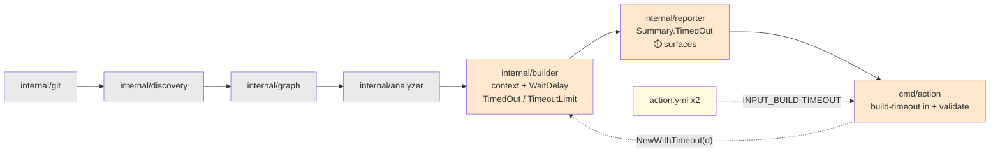
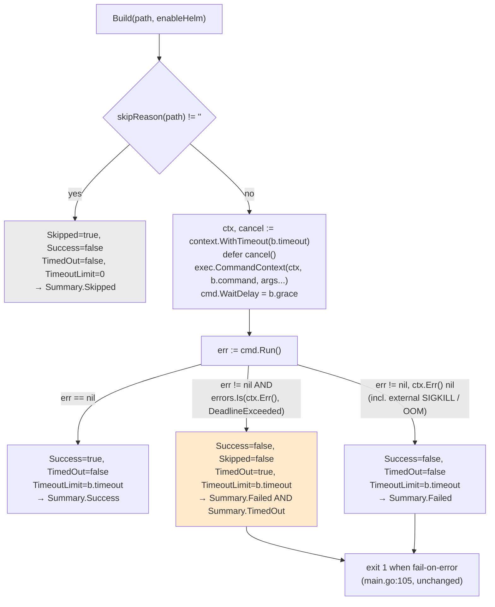

# Plan: Build Timeout Handling

Four phases that turn the hardcoded 2-minute kill timer into a configurable, genuinely bounded,
machine-readable timeout — and fix two live defects found in the timer while planning: a
nil-pointer panic in an unrecovered goroutine, and a "limit" that is not actually a wall-clock
limit.

## Table of Contents

- [Context](#context)
- [Dependencies](#dependencies)
- [Scope](#scope)
- [Design](#design)
- [Acceptance Criteria](#acceptance-criteria)
- [Implementation Phases](#implementation-phases)
- [Test Plan](#test-plan)
- [Implementation Order](#implementation-order)
- [File Reference Summary](#file-reference-summary)
- [Open Questions](#open-questions)

## Context

Every `kustomize build` this tool runs is bounded by a hardcoded 2-minute kill timer
(`builder.go:44`, `:85-89`). When it fires, the result is indistinguishable from a broken
kustomization: `BuildResult` has no timeout field, so the killed process takes the ordinary
failure branch (`builder.go:94-106`) and every surface — console (`reporter.go:76`), step-summary
"Build Errors" (`reporter.go:168-186`), `results` JSON (`reporter.go:121`), exit code
(`main.go:105-108`) — tells the user their manifests are broken. That is a misdiagnosis, and
[`docs/specs/build-timeout-handling.spec.md`](../specs/build-timeout-handling.spec.md)
specifies the fix.

This plan phases that spec. It does not re-derive its requirements; every acceptance criterion
below is the spec's own, carried over by ID so the two stay greppable against each other.

**Baseline measured this session on the working tree of `feat/complete-impact-matching`:**
`go test ./...` reports **31 passed in 8 packages**. That number is the gate for every phase.

### Planning-session findings (recorded so `/implement` does not re-derive them)

Five probes were executed. Every number below is a measurement, not a prediction. All were
observed on darwin/arm64; the repo pins `go 1.25.3` (`go.mod:3`) and the image builds on Alpine
(`Dockerfile:1`).

1. **The nil-pointer panic is real and reproduces immediately.** `time.AfterFunc` is armed at
   `builder.go:85`, *before* `cmd.Run()` starts the process at `:91`. `cmd.Process` is nil until
   `Start` succeeds, and `(*os.Process)(nil).Kill()` panics with
   `runtime error: invalid memory address or nil pointer dereference` — **reproduced this
   session**. The panic happens **inside the `time.AfterFunc` goroutine, which has no `recover`**,
   so it does not fail one build, it crashes the whole action. At the shipped 2-minute limit this
   is unreachable; it becomes reachable the instant any test shortens the timeout. This is why the
   fix and the test seam must land **together** — see the Phase 1 sequencing note, which is the
   single most important ordering constraint in this plan.
2. **The limit is not a wall-clock bound.** `cmd.Stdout`/`cmd.Stderr` are `bytes.Buffer`s
   (`builder.go:80-82`), so `os/exec` creates pipes and `Wait` blocks until they close. Killing
   the direct child does not close a pipe a **grandchild** inherited. Measured against a 300 ms
   deadline with a descendant that outlives the child: **`Run()` returned at 30.0 s** with no
   `WaitDelay`, **5.3 s** with `WaitDelay = 5s`, **0.80 s** with `WaitDelay = 500ms`. This is the
   realistic path, not a corner case: `--enable-helm` makes kustomize exec `helm`
   (`Dockerfile:27-28`) and chart fetching is how a build gets slow.
3. **`context` classification is unambiguous, including for a never-started process.** With
   `exec.CommandContext` + `context.WithTimeout`: at a 1 ms limit `Run()` returned
   `signal: killed`; at a **1 ns** limit the process was never started at all and `Run()` returned
   `context deadline exceeded` — and in **both** cases `errors.Is(ctx.Err(), context.DeadlineExceeded)`
   was `true` and nothing panicked. So F-06's single test `err != nil && errors.Is(ctx.Err(),
   context.DeadlineExceeded)` classifies the degenerate case correctly with no extra branch, and
   AC-14 holds by construction.
4. **The fake-command seam works, but not the way the spec sketched it.** `Build` builds its own
   argv (`builder.go:67-71`), so `-test.run=TestHelperProcess` cannot be prepended and a naive
   `os.Args[0]` re-exec would run the whole suite recursively in every child. Gating in `TestMain`
   on a marker env var instead: **verified this session**, three cases (hang → timed out, fail
   fast → ordinary failure, success → success) passed in **0.66 s total**, positional args
   `[build <path>]` reached the helper intact, and partial stdout written before the kill was
   still captured. See [ADR-008](../decisions/ADR-008-fake-command-test-seam.md).
5. **A `const` 5-second grace is incompatible with AC-11.** Finding 2's numbers mean the F-36(d)
   wall-clock test costs 5.3 s if the grace is a hard constant, against AC-11's "under 2 seconds"
   budget for the whole package. Resolved by holding the grace in an unexported field defaulting
   to 5 s — no input, no env var, no exported API — exactly the treatment F-34 already prescribes
   for the command name. See [ADR-009](../decisions/ADR-009-waitdelay-grace-injection.md); it
   needs a wording amendment to F-10.

Findings 1 and 2 are the two live defects this plan must fix. Neither is currently reachable in
production at the shipped 2-minute default in the way finding 1 is; finding 2 **is** reachable
today, on any `--enable-helm` run whose chart fetch stalls.

## Dependencies

| Dependency | State | Note |
|---|---|---|
| `docs/specs/build-timeout-handling.spec.md` | Committed on this branch | The source of truth; this plan adds no requirements of its own |
| `docs/specs/build-execution.spec.md` | Committed; **will be wrong after this ships** | Baseline for `internal/builder`. F-17/F-18/F-19/F-20/F-23 and NF-04 are superseded; amend per spec §11 |
| `docs/specs/result-reporting.spec.md` | Committed; **will be wrong after this ships** | Counting rules F-02/F-03 and the public output contract F-19/NF-02 are load-bearing and must not move; §3.1, F-22, F-23, §5.1, §6.2 need amending |
| `plans/complete-impact-matching.md` | Planned, not started, **ships first** | Touches `internal/reporter` and `internal/integration/pipeline_test.go`. See [Collisions](#collisions-with-other-plans) |
| `shallow-clone-support` plan | Not yet written, **ships second** | Adds an input to both `action.yml` files and a `getEnv` call in `main.go`. It does **not** widen any reporter signature — ADR-011 chose constructor injection; see Collisions B. See [Collisions](#collisions-with-other-plans) |
| `container-hardening` plan | Not yet written, ships fourth | Dockerfile only. No overlap |
| OQ-1 (whole-run budget) | Deferred in spec §10 | Non-blocking. Interacts with plan 1's build-count increase — see [Open Questions](#open-questions) |
| OQ-2 (`timed-out-count` output) | **Decided no for v1** (F-23) | This plan does not reopen it. Adding an output later is compatible; removing one is not |
| OQ-3 (5 s grace value) | Open, low risk | [ADR-009](../decisions/ADR-009-waitdelay-grace-injection.md) makes it a default rather than a const, so revising it stays cheap |
| `git` and `kustomize` on PATH | Required for E2E only | `internal/integration` skips without them (`pipeline_test.go:142-148`); `CLAUDE.md` forbids letting that pass silently in CI. **The unit-level timeout tests require neither** (AC-11) |
| `gopkg.in/yaml.v3` | Present, the repo's only direct dependency | No phase adds a second one. The whole change is stdlib: `context`, `errors`, `os/exec` (NF-05) |
| Linux re-verification of `WaitDelay` | **Outstanding, non-blocking** | Spec §10 asks the planner to re-run the grandchild timing on Linux. Measured on darwin only. The API exists on both and the F-36(d) test asserts the bound, not the exact number, so this does not gate the start |

Nothing external blocks the start of Phase 1, and Phase 1 is independent of the other three plans.

## Scope

### In Scope

- `internal/builder` — replace the `time.AfterFunc` kill with `context.WithTimeout` +
  `exec.CommandContext`; set `cmd.WaitDelay`; add `TimedOut` and `TimeoutLimit` to `BuildResult`;
  add `NewWithTimeout`; add the unexported `command` and `grace` fields; the timeout `Error`
  message; the WARN log record.
- `internal/builder/builder_test.go` — the `TestMain` fake-command gate and the first tests the
  timeout path has ever had.
- `internal/reporter` — `Summary.TimedOut`; the console timeout branch and its guidance line; the
  metric-table sub-count row; the `### ⏱️ Timed Out` section; the third clause on the Build Errors
  filter.
- `cmd/action/main.go` — read and validate `INPUT_BUILD-TIMEOUT`, fail fast before any work, call
  `NewWithTimeout`, qualify the final failure line.
- `cmd/action/main_test.go` — **new file**; the extracted duration-parse function.
- `action.yml` in **both** repos — the `build-timeout` input, identical name, default and
  description.
- `kustomize-build-check-action/README.md` — the Inputs table (`:69-72`) and the image SHA pin
  (`action.yml:45`).
- `internal/integration/pipeline_test.go` — this repo's E2E layer; one scenario per phase.

### Out of Scope

Inherited verbatim from spec §9, plus three additions from this planning session:

1. A whole-run time budget. The limit stays per build (F-11). OQ-1.
2. Killing the whole process group (`SysProcAttr.Setpgid`). `WaitDelay` delivers the bound this
   spec needs. OQ-4.
3. Retrying a timed-out build. A retry hides an environment problem and doubles worst-case run
   time.
4. Per-path or per-kustomization timeout overrides.
5. Parallel `BuildAll`. Sequential execution stands (`builder.go:149-152`).
6. Changing the default from 2 minutes (NF-08).
7. A new declared action output (F-23, OQ-2).
8. The `kustomize-version` input. Recorded as precedent (B-13); whether it is implemented or
   removed is a separate decision. **This plan does not fix it and does not remove it.**
9. Bounding `Output` size in the `results` output.
10. **Reaping the orphaned `helm` descendant.** `WaitDelay` bounds our wait; the orphan keeps
    running (OQ-4).
11. **Any change to `main.go:105`** (`failOnError && summary.Failed > 0`). Pinned, not touched.
12. **A cross-repo drift check** for the two `action.yml` input blocks (OQ-7). This plan adds a
    parity test that runs when the sibling repo is present and skips when it is not; enforcing it
    in CI is a separate piece of work.

## Design

### Where the change lands in the pipeline



<details><summary>Legend</summary>

- **Orange** — changed by this plan (builder: Phase 1; reporter: Phase 2; `cmd/action`: Phase 3).
- **Pale yellow** — the two `action.yml` files plus the wrapper README and SHA pin, Phase 4.
- **Grey** — untouched. This plan changes nothing upstream of the builder, so the affected set is
  identical before and after; only what happens to each path once it reaches `kustomize` changes.
- The dotted edges are the configuration flow, not the data flow.

</details>

### Outcome decision inside `Build`, after this plan



<details><summary>Legend</summary>

- **Orange** — the only new arm. It is a **sub-classification of failure**, not a fourth state:
  the result still lands in `Summary.Failed` and still drives exit 1.
- **Grey** — the skip branch, byte-for-byte unchanged (`builder.go:56-65`). It is the reason
  `TimeoutLimit` is zero on skipped results (F-05): the skip returns before the limit is relevant.
- The `err != nil, ctx.Err() nil` arm is what keeps an OOM kill honest. Both it and the timeout
  arm produce `signal: killed` in the error text (measured), which is exactly why the text is
  never consulted (NF-06).

</details>

### Data model

`BuildResult` is extended **additively** (F-22, NF-03). The struct has no JSON tags and no
`omitempty` (`builder.go:14-29`, verified), so **Go field names are the wire names** in the
`results` action output.

| Field | Change | Wire effect |
|---|---|---|
| `Path`, `Success`, `Skipped`, `SkipReason`, `Output`, `Error`, `Duration` | unchanged | Seven pre-existing keys, unchanged names and types |
| **`TimedOut bool`** | **new** | New key `"TimedOut"`, `true`/`false` |
| **`TimeoutLimit time.Duration`** | **new** | New key `"TimeoutLimit"`, **integer nanoseconds** (`time.Duration` is an `int64` with no `MarshalJSON`), exactly like the existing `Duration` |

`Summary` gains `TimedOut int`, a **sub-count of `Failed`**, so `Failed >= TimedOut` always and
`Total == Success + Failed + Skipped` is untouched (F-03).

The `builder` struct gains two unexported fields beyond `timeout`:

```go
const defaultWaitGrace = 5 * time.Second

type builder struct {
    timeout time.Duration
    grace   time.Duration // ADR-009: default 5s, injectable only within package builder
    command string        // ADR-008: default "kustomize", injectable only within package builder
}
```

Neither is exported, neither is reachable from an input or an environment variable, and neither
appears in the `Builder` interface (`builder.go:32-35`), which does not change.

### The two seams, and why they are shaped this way

- **The timeout seam** is `NewWithTimeout(d time.Duration) Builder` (F-33). `New()` keeps its
  signature and its 2-minute default, so `main.go:85` and the three existing tests are untouched.
- **The command and grace seams** are unexported struct fields, usable only because
  `builder_test.go` is `package builder` (`builder_test.go:1`). Tests construct
  `&builder{...}` directly; `NewWithTimeout` returns the `Builder` *interface*, so it cannot be
  used to reach them, which is the point.
- The fake command is the **test binary itself**, re-exec'd and gated in `TestMain` on a marker
  env var — **not** the stdlib `-test.run=TestHelperProcess` idiom, which cannot work here because
  `Build` owns its argv. Full rationale, alternatives and the measured verification in
  [ADR-008](../decisions/ADR-008-fake-command-test-seam.md).
- The grace is a default, not a `const`, so the wall-clock test costs ~0.8 s instead of 5.3 s.
  Rationale, the measured numbers and the required F-10 wording amendment in
  [ADR-009](../decisions/ADR-009-waitdelay-grace-injection.md).

**`internal/integration` cannot use either unexported seam** — it is a different package. Its E2E
timeout coverage instead uses `builder.NewWithTimeout(1 * time.Millisecond)` against the **real**
`kustomize`: no real build completes in 1 ms, so the timeout is deterministic, needs no network,
no slow chart and no fixture trickery, and returns in milliseconds. Verified in finding 3.

### Invariants carried through every phase

Checked at the end of every phase, not once at the end of the plan.

| Invariant | How it is checked |
|---|---|
| The 31 existing tests keep passing | `go test ./...` reports 31 passed in 8 packages plus that phase's new tests, none weakened, skipped or deleted |
| Skip semantics unchanged | `TestBuildSkipsMissingDirectory`, `TestBuildSkipsEmptyDirectory`, `TestBuildDoesNotSkipExistingDirectoryWithoutKustomization` (`builder_test.go:11-63`) pass **unmodified**; `skipReason` (`builder.go:127-143`) is not edited in any phase |
| `Total == Success + Failed + Skipped` | `TestGenerateSummaryExcludesSkipped` (`reporter_test.go:23`) passes unmodified; the switch at `reporter.go:46-53` keeps exactly **three** arms, with `TimedOut++` inside `default:` |
| The exit-code rule is untouched | `main.go:105` still reads `failOnError && summary.Failed > 0`, verified by inspection at every phase gate |
| The `results` contract is additive only | Seven pre-existing keys present with unchanged names and types; four declared outputs unchanged in name and count |
| No code path panics on a timeout | `NewWithTimeout(1 * time.Nanosecond)` returns a result (AC-14); no `time.AfterFunc` remains in `internal/builder` |
| One direct dependency | `go.mod` still has exactly one `require` line |
| Integration tests actually ran | Phase sign-off records `internal/integration` as `ok`, never `[no tests to run]` or skipped |

### User-visible output changes, and the version bump

| Phase | What users see that they did not before |
|---|---|
| 1 | Nothing on the console yet, but the `results` JSON gains two keys (`TimedOut`, `TimeoutLimit`) on **every** element. A timed-out build's `Error` text changes from bare `signal: killed` to a message naming the limit. The WARN log line gains the limit and the measured duration. **A `--enable-helm` build that stalls now returns within `limit + 5s` instead of hanging until the descendant exits** — the one user-visible behavioural fix in this phase |
| 2 | A timed-out path prints `⏱️ … TIMED OUT …` plus a guidance line instead of `❌ … Build failed`; it **disappears from the step summary's `### ❌ Build Errors` section** and appears in a new `### ⏱️ Timed Out` section; the metric table gains a sub-count row. Counts are numerically identical to before |
| 3 | `build-timeout` is honoured. A malformed value now **fails the run at exit 1 before any work**, where previously no such input existed. The final failure line may read `❌ Some builds failed (2 of 3 timed out)` |
| 4 | The input becomes settable by consumers of the wrapper action, and appears in its README |

**Version bump: minor.** Conventional commits drive GitVersion (`CLAUDE.md`, `gitversion.yml`).
Phases 1–4 are `feat:` — a new input, two new `results` keys and new report sections are additive
features, not fixes, and not breaking. The two defects fixed in Phase 1 would justify `fix:` on
their own, but they ship inside the same feature commit; note them in the commit body rather than
splitting the type. **No `!` and no `BREAKING CHANGE:` footer anywhere in this plan** — every wire
change is additive (NF-03), and a major bump here would falsely signal that consumers must act.

### Collisions with other plans

Implementation order across the four plans is: **1. `complete-impact-matching` → 2.
`shallow-clone-support` → 3. this plan → 4. `container-hardening`.** This plan is therefore
written to land **last but one**, on top of both preceding plans.

**A. The new action input, shared with plan 2 (`shallow-clone-support`).**
Both plans add exactly one input to **both** `action.yml` files and one `getEnv` call to the block
at `main.go:25-28`: plan 2 adds `on-unresolvable-base` (`INPUT_ON-UNRESOLVABLE-BASE`, spec F-14),
this plan adds `build-timeout` (`INPUT_BUILD-TIMEOUT`, F-17).

- **They compose cleanly; they do not conflict semantically.** Different names, different
  subsystems, no shared state. The only collision is textual: both insert lines into the same
  four-line block and the same `inputs:` blocks. Resolution is "keep both lines", in either order.
- **Plan 2 lands first.** This plan's Phase 3 rebases onto whatever `main.go` looks like then.
- **One ordering rule matters.** Plan 2 restructures the head of `main()` so base-ref resolution
  runs before discovery. This plan's F-18 validation must run **before that**: it is a pure
  string parse with no I/O, and a run that is about to die on a config typo must not first spend
  time on `git`. **`build-timeout` parsing and validation goes at the very top of `main()`,
  immediately after `setupLogging()` and before the first `getEnv` that triggers work.** If plan 2
  has already landed, insert above its `ResolveBase` call.
- **Both plans bump the wrapper's image SHA pin** (`kustomize-build-check-action/action.yml:45`).
  That line will conflict. Whichever lands last wins, and the pin must end up on a SHA that
  contains **both** features. Preferably bump it **once**, after this plan's Phase 4, for the whole
  release.
- **Divergence worth noting:** plan 2 also adds a new *declared output* (`change-detection-mode`,
  its F-21). This plan deliberately adds **none** (F-23). The two decisions are consistent, not
  contradictory: plan 2's datum has no existing carrier, whereas this plan's datum is already
  published inside `results[].TimedOut`. "Reuse before you build" applies here and not there.

**B. `BuildResult` gains two fields; plan 1 re-renders results.**
`BuildResult` has no JSON tags (`builder.go:14-29`, verified), so **the Go field names are the
wire names** of the `results` action output. `TimedOut` and `TimeoutLimit` become permanent public
keys the moment they ship.

- **The change is additive and non-breaking, confirmed.** No existing key is renamed, removed or
  retyped; `omitempty` is absent so the new keys appear on every element including skipped ones;
  the four declared outputs are unchanged in name and count; a consumer reading only the seven
  existing keys is unaffected (F-22, NF-03). AC-6 asserts all seven survive alongside the two new
  ones.
- **Plan 1 does not touch `BuildResult`** — it adds two *new reporter methods* for parse failures
  (`ParseIssue`, `PrintParseIssues`, `AppendParseIssuesToStepSummary`) and a `KustomizeFile`
  extension. So there is no struct-level conflict.
- **The merge risk is `internal/reporter/reporter.go`, touched by all three plans.** Plan 1 adds
  new methods and new console/summary blocks; plan 2 widens `SetGitHubOutputs` and
  `WriteGitHubStepSummary` to carry run info (its F-24, an **interface change** at
  `reporter.go:24-29`); this plan edits the classification switch (`:46-53`), the console switch
  (`:70-90`), the metric table (`:159-166`) and the Build Errors filter (`:171`). These are
  different regions of the same file, so expect textual conflicts, not semantic ones.

  **CORRECTED after plan 2 was written.** This plan was authored while `shallow-clone-support` was
  still in flight and assumed it would *widen the signatures* of the two methods whose bodies this
  plan edits. It does not. [ADR-011](../decisions/ADR-011-run-metadata-into-the-reporter.md) chose
  **constructor injection** (`reporter.New(RunInfo)`) precisely so all four method signatures stay
  byte-identical. So there is no signature to write against, and the earlier instruction to "land
  plan 2 first, then write Phase 2 against the new signatures" is void.

  The real residual contact is different and smaller: plan 2 changes the **`reporter.New()`
  constructor**, which this plan calls but does not modify. Landing order still favours plan 2
  first, purely to avoid rebasing the constructor call sites. Phase 2 adds no parameter of its
  own; the timeout data travels on the results (F-05), which is precisely why `TimeoutLimit` is on
  `BuildResult` rather than held by the reporter.
- **`internal/integration/pipeline_test.go` is touched by plans 1, 2 and 3.** Plan 1 extends the
  `run()` harness (`:113-140`) to point `GITHUB_STEP_SUMMARY` at a temp file and return its
  contents. **Phase 2 of this plan depends on that extension** for AC-4. If plan 1 has landed,
  reuse it. If for any reason it has not, Phase 2 must add the same plumbing itself and plan 1
  then rebases onto it — flagged so the work is not done twice or, worse, twice differently.

**C. Plan 1 increases the number of builds per run; this plan bounds each build.**
Plan 1 makes unparseable kustomizations always-affected and removes the containment guard, both of
which **increase** the count of directories built per run. This plan keeps the limit strictly
**per build** (F-11), so worst-case run wall clock is `n × (limit + 5s)` and plan 1 raises `n`.

- The two interact only through OQ-1 (whole-run budget), which stays **deferred**. Nothing in this
  plan bounds the run, and nothing in plan 1 needs it to.
- Recorded consequence: after both plans, a large repo is measurably more likely to hit its
  *job-level* `timeout-minutes`, at which point **no results and no outputs are published at all**
  — strictly worse than any failure mode either plan introduces. That is the trigger condition for
  reopening OQ-1, and it is now more likely than the spec assumed. See
  [Open Questions](#open-questions).

**D. `container-hardening` (plan 4).** Dockerfile only. No overlap. It should land after this
plan so the image that the wrapper pin is finally bumped to contains everything.

### The `kustomize-version` precedent, and the test that stops a repeat

`kustomize-version` is declared in this repo's `action.yml:20-23`, is **not** declared in the
wrapper's `action.yml` (whole `inputs:` block, `:9-28`), and is **never read** by the binary — the
only `getEnv("INPUT_…")` calls are `main.go:25-28`, verified. The kustomize version is fixed in
the image at `Dockerfile:20`. It is a vestigial input: it looks configurable, it documents a lie,
and nothing catches it.

This plan treats that as a hazard to be tested against, not merely avoided by care:

- `build-timeout` is declared in **both** `action.yml` files in the same phase (AC-7), with an
  identical name, default and description.
- **A wiring test proves the binary actually reads it** (AC-8, AC-15). Phase 3's E2E builds the
  real binary and runs it with `INPUT_BUILD-TIMEOUT` set, asserting an observable difference in
  behaviour between two values. Declaration alone can never satisfy it. This is the specific test
  that would have caught `kustomize-version` on the day it was added.
- Phase 4's parity test asserts the declaration exists in both files with matching default.

`kustomize-version` itself is left exactly as it is (Out of Scope 8). Fixing or removing it is a
public-contract decision that deserves its own spec.

## Acceptance Criteria

IDs are the spec's own (§7), preserved verbatim for traceability. AC-15 to AC-19 are added by this
plan.

**Phase 1 — `internal/builder`**

- [ ] AC-1 (F-01, F-02, F-03): For a build killed on the limit, `Success == false`,
      `Skipped == false`, `TimedOut == true`; `GenerateSummary` over that single result returns
      `Failed == 1`, `TimedOut == 1`, `Success == 0`, `Skipped == 0`, and
      `Success + Failed + Skipped == Total`.
- [ ] AC-10 (F-10, NF-04): A build whose command spawns a descendant that outlives it and holds
      the output pipe returns within `limit + grace + slack`, and is classified `TimedOut == true`.
      (Without `WaitDelay` this returns only when the descendant exits — measured at **30.0 s**
      against a 300 ms deadline this session.)
- [ ] AC-22 (F-10, plan-added): `New()` and `NewWithTimeout(d)` both produce a builder whose
      `grace` equals `defaultWaitGrace`, and `defaultWaitGrace == 5 * time.Second`. Asserted by a
      unit test in `package builder` constructing through the **exported** constructors and reading
      the unexported field. A zero `grace` fails the test.
      *Required because ADR-009 moved the grace out of a `const` into a field: without this,
      nothing fails if a constructor forgets to set it, and a zero `WaitDelay` silently restores
      the unbounded-`Run()` defect in production while every other test stays green.*
- [ ] AC-11 (F-35, F-36): `go test ./internal/builder` passes on a machine with **no** `kustomize`
      on `PATH`, covers cases (a)–(d) of F-36, and adds under 2 seconds of runtime.
- [ ] AC-12 (F-06, NF-06): A fake command that exits non-zero well within the limit yields
      `TimedOut == false`. A fake command that succeeds within the limit yields `Success == true`
      and `TimedOut == false`. Neither classification consults the text of `Error`.
- [ ] AC-13 (F-05): A skipped result (`builder.go:56-65`) has `TimedOut == false` and
      `TimeoutLimit == 0`, and the three existing skip tests (`builder_test.go:11-63`) still pass
      **unmodified**.
- [ ] AC-14 (NF-07): With `NewWithTimeout(1 * time.Nanosecond)` against any command, `Build`
      returns a result and does not panic — including in the timer goroutine, which no longer
      exists.
- [ ] AC-16 (F-12, F-13, new): On a timeout, `Error` names the measured duration, the limit and the
      input `build-timeout`, and is not the bare string `signal: killed`; `Output` still carries
      whatever stdout was captured before the kill (verified achievable — the probe captured
      partial stdout on a killed process).
- [ ] AC-17 (F-09, NF-07, new): `internal/builder` contains **no** `time.AfterFunc` and no
      `cmd.Process.Kill()` call after this phase, asserted by inspection at the phase gate.

**Phase 2 — `internal/reporter`**

- [ ] AC-3 (F-24, F-25): The console block for a timed-out path contains `⏱️`, the string
      `TIMED OUT`, the measured duration, the applied limit and the literal input name
      `build-timeout`; and it does **not** contain the unqualified string `Build failed` for that
      path.
- [ ] AC-4 (F-27, F-29): In the generated step summary, the region between `### ❌ Build Errors`
      and the next `### ` heading does **not** contain the timed-out path, and a `### ⏱️ Timed Out`
      region exists that does contain it. (Direct analogue of
      `TestStepSummaryDoesNotListSkippedAsError`, `reporter_test.go:65-93`.)
- [ ] AC-5 (F-28): The metric table shows `❌ Failed` equal to `summary.Failed` (timeouts
      included) and a separate timed-out row equal to `summary.TimedOut`.
- [ ] AC-6 (F-04, F-22): `json.Marshal` of a timed-out `BuildResult` contains `"TimedOut":true` and
      a `"TimeoutLimit"` integer equal to the limit in nanoseconds, and still contains all seven
      pre-existing keys `Path`, `Success`, `Skipped`, `SkipReason`, `Output`, `Error`, `Duration`
      with unchanged names and types.
- [ ] AC-18 (F-07, F-31, new): `summary.TimedOut` is produced inside `GenerateSummary` and nowhere
      else; the classification switch at `reporter.go:46-53` still has exactly **three** arms, with
      the increment inside `default:`. `TestGenerateSummaryExcludesSkipped` passes unmodified.

**Phase 3 — `cmd/action`**

- [ ] AC-2 (F-08): With `fail-on-error` at its default and a result set whose only non-success is
      a timed-out build, the process exits **1** and prints `❌ Some builds failed`
      (`main.go:105-108`). No configuration exists that makes this run exit 0 other than
      `fail-on-error: false`, whose existing semantics are unchanged.
- [ ] AC-8 (F-17, NF-08): With `INPUT_BUILD-TIMEOUT` unset, builds are bounded at 2 minutes,
      identical to pre-change behaviour. With `INPUT_BUILD-TIMEOUT=5s`, a build that takes longer
      than 5 s is killed and reported with `TimeoutLimit == 5s`.
- [ ] AC-9 (F-18): With `INPUT_BUILD-TIMEOUT` set to `2 minutes`, `0`, `-30s` or `120`, the process
      writes an error naming the offending value and a valid example to stderr and exits **1**, and
      no `kustomize` process is started.
- [ ] AC-15 (B-13, new — **the anti-`kustomize-version` criterion**): The value of
      `INPUT_BUILD-TIMEOUT` demonstrably changes the binary's observable behaviour. Running the
      **built binary** against one fixture with `INPUT_BUILD-TIMEOUT=1ms` yields a timed-out,
      failing run, and with the input unset yields a passing run. A test that only asserts the
      input is *declared* does not satisfy this criterion.
- [ ] AC-19 (F-32, new): On a failing run where at least one failure was a timeout, the final line
      names the timeout count, e.g. `❌ Some builds failed (2 of 3 timed out)`; on a failing run
      with no timeouts it is byte-identical to today's `❌ Some builds failed`.

**Phase 4 — the two `action.yml` files**

- [ ] AC-7 (F-16, F-19): `build-timeout` is declared with the same name, `required: false` and
      default `'2m'` in `/Users/michielvh/code/personal/kustomize-build-check/action.yml` and in
      `/Users/michielvh/code/personal/kustomize-build-check-action/action.yml`.
- [ ] AC-20 (F-20, new): The wrapper README's Inputs table (`kustomize-build-check-action/README.md:69-72`)
      lists `build-timeout` with its default, in the same release.
- [ ] AC-21 (NF-03, new): Both `action.yml` files still declare the four pre-existing outputs
      (`results`, `failed-count`, `success-count`, `skipped-count`) with unchanged names and
      descriptions, and **this plan adds none of its own**.
      *Assert presence and shape, NOT that they are the only outputs.* `shallow-clone-support`
      lands `change-detection-mode` before this plan, so a literal four-output assertion would
      fail here for a reason unrelated to timeouts. Same defect class as
      `complete-impact-matching` AC-C7; see [plan-review.md](../summaries/plan-review.md).

**Cross-cutting (verified at the end of every phase)**

- [ ] AC-E1: `go test ./...` reports 31 passed in 8 packages plus that phase's new tests, with no
      existing test weakened, skipped or deleted.
- [ ] AC-E2: `main.go:105` still reads exactly `failOnError && summary.Failed > 0`.
- [ ] AC-E3: `go.mod` lists exactly one `require` line (NF-05).
- [ ] AC-E4: The `internal/integration` package reports `ok` in the phase's test run — it neither
      skipped for a missing binary nor ran zero tests.
- [ ] AC-E5: The three skip tests and `skipReason` (`builder.go:127-143`) are unmodified.

## Implementation Phases

### Phase 1: internal/builder — context, WaitDelay, classification and the test seam

**Priority: HIGH** — it contains both live defects, and it is the only phase whose sequencing is
non-negotiable.

**Goal**: the kill timer becomes a context deadline with a real wall-clock bound, a timeout is
classified from `ctx.Err()` and carried on the result, and the path has tests for the first time.

> **Sequencing constraint — this phase ships as exactly ONE commit, and must not be split.**
> `NewWithTimeout` is what makes a short timeout reachable, and a short timeout against the
> existing `time.AfterFunc` **panics on nil `cmd.Process` inside a goroutine with no `recover`**,
> taking the whole process down (finding 1, reproduced). So a commit that adds `NewWithTimeout` or
> the test seam *before* the context rewrite leaves `main` in a state where writing a test crashes
> the binary; and a commit that adds the tests before the rewrite is a test suite that panics. The
> only ordering with no such intermediate state is: **rewrite, fields, seam and tests in one
> commit.** Landing the rewrite alone first is also acceptable (it is a strict improvement with no
> new API), but splitting the seam or the tests away from the rewrite is not.

**Tasks**:
- [ ] Replace `time.AfterFunc` (`builder.go:85-89`) with `ctx, cancel := context.WithTimeout(
      context.Background(), b.timeout)`, `defer cancel()`, and `exec.CommandContext(ctx,
      b.command, args...)` (F-09). Delete the timer, the `defer timer.Stop()` and the manual
      `cmd.Process.Kill()`. Verify no `time.AfterFunc` remains in the package (AC-17).
- [ ] Set `cmd.WaitDelay = b.grace` (F-10), with `defaultWaitGrace = 5 * time.Second` per
      [ADR-009](../decisions/ADR-009-waitdelay-grace-injection.md). Add the doc comment explaining
      that this is what makes the limit a bound when a grandchild holds the pipe, citing
      `--enable-helm` → `helm`.
- [ ] Add `TimedOut bool` and `TimeoutLimit time.Duration` to `BuildResult` with doc comments
      stating that `TimedOut` is the **only** supported timeout discriminator and that `Error` text
      must never be parsed (F-04, F-05, NF-06). Populate `TimeoutLimit` on every result the exec
      path produces, success or failure; leave it zero on the skip branch (F-05, AC-13).
- [ ] Classify with `err != nil && errors.Is(ctx.Err(), context.DeadlineExceeded)` (F-06). Nothing
      else. Do not test `ExitCode() == -1`, do not string-match `signal: killed` — both are
      indistinguishable from an OOM kill (B-5, B-6).
- [ ] Compose the timeout `Error`: a message naming the measured duration, the limit and the
      `build-timeout` input, then `\n`, then captured stderr (F-12). Keep `Output` as captured
      stdout on the timeout branch, same as the ordinary failure branch (F-13, AC-16).
- [ ] Keep the timeout at `slog.Warn` and add `path`, the configured limit and the measured
      duration to the record (F-14, NF-09). Ordinary failures stay at `slog.Debug`
      (`builder.go:95-98`).
- [ ] Add `NewWithTimeout(timeout time.Duration) Builder` (F-33). `New()` keeps its signature and
      its 2-minute default; both set `command: "kustomize"` and `grace: defaultWaitGrace`. The
      `Builder` interface (`builder.go:32-35`) does **not** change.
- [ ] Add the unexported `command` and `grace` fields (F-34, ADR-008, ADR-009). No exported API for
      either.
- [ ] Add `TestMain` to `builder_test.go` with the marker-env gate and the `fakeKustomize` helper
      supporting four modes: hang, hang-with-descendant, fail-fast-with-stderr, succeed. Follow
      [ADR-008](../decisions/ADR-008-fake-command-test-seam.md) exactly; the `-test.run` idiom does
      not work here.
- [ ] Write the builder tests (F-36 a–d): timed-out → `TimedOut && !Success && !Skipped` (AC-1);
      fail-fast → `!TimedOut` (AC-12); success → `Success && !TimedOut` (AC-12); descendant holds
      the pipe → returns within `limit + grace + slack` (AC-10). **Note the fake-build path must
      be a non-empty existing directory**, because `Build` calls `skipReason(path)` first
      (`builder.go:56`) and a `t.TempDir()` with no file in it is skipped as
      `"removed in this change (empty directory)"`. Write one file into it.
- [ ] Add `TestNewWithTimeoutNanosecondDoesNotPanic` (AC-14). Measured: at 1 ns the process is
      never started and `Run()` returns `context deadline exceeded`, which `errors.Is` still
      classifies as the deadline — so the assertion is `TimedOut == true` **and** no panic.
- [ ] Add the E2E scenario `TestBuildTimeoutIsClassifiedAsFailure` in
      `internal/integration/pipeline_test.go`: a `runWith(builder.NewWithTimeout(time.Millisecond))`
      harness variant against the real `kustomize`, asserting `TimedOut`, `Failed == 1`,
      `Skipped == 0` and the counting invariant.
- [ ] Re-run the `WaitDelay` grandchild measurement **on Linux** (spec §10 verification note) and
      record the number in the phase sign-off. Non-blocking: the test asserts the bound, not the
      constant.
- [ ] Run `go test ./...`; confirm 31 + new, `internal/integration` `ok`, and time
      `go test ./internal/builder` to confirm it stays under 2 s (AC-11, AC-E1..AC-E5).

**Depends on**: None. Independent of all three other plans.

**Rollback**: exactly one commit — `git revert <phase-1-sha>` restores the `time.AfterFunc` timer,
removes both `BuildResult` fields, `NewWithTimeout`, both unexported fields and every new test
together. Reverting reopens both live defects. Because the two struct fields are part of the
public `results` wire format, reverting **after a release** is a breaking change for any consumer
that started reading them — so revert freely before the release tag, and roll forward after it.

**Risk**: `WaitDelay` is easy to omit and its absence is invisible until an `--enable-helm` build
hangs in production; AC-10 is the only guard, which is why ADR-009 exists to keep that test cheap
enough to survive.

### Phase 2: internal/reporter — the diagnosis surfaces

**Priority: HIGH** — this phase is the point of the spec. Phase 1 makes the timeout knowable;
this one makes it visible.

**Goal**: a timed-out build is never rendered as a rejected kustomization, on any surface, while
its verdict and every published count stay exactly as they are today.

**Tasks**:
- [ ] Add `TimedOut int` to `Summary` with a doc comment stating it is a **sub-count of `Failed`**,
      not a partition (F-07, F-03).
- [ ] In `GenerateSummary` (`reporter.go:45-54`), increment `summary.TimedOut` **inside the
      existing `default:` arm**, alongside `summary.Failed++`. Do **not** add a fourth `case`
      (F-02, F-31, AC-18). Confirm the switch still has three arms and
      `TestGenerateSummaryExcludesSkipped` passes unmodified.
- [ ] Add the console branch in `PrintResults` (`reporter.go:70-90`), ordered **after** `Skipped`
      and `Success`, **before** the generic failure arm (F-24). Content: `⏱️`, the path, the
      measured duration, the applied `TimeoutLimit`, the words `TIMED OUT`, and the fact the
      process was killed and never validated. It must not print `Build failed` (NF-02, AC-3).
- [ ] Add the guidance line under it: this is a time limit, not a kustomize error, raise it with
      the `build-timeout` input, naming the current limit (F-25). This one line is the whole point
      of the spec.
- [ ] Print captured stderr under the timeout line using the same 5-line truncation as the failure
      branch (`reporter.go:79-88`) (F-26).
- [ ] Add the third clause to the Build Errors filter (`reporter.go:171`):
      `!result.Success && !result.Skipped && !result.TimedOut` (F-27). This is the single most
      important line in the phase — it is the only thing standing between a timed-out path and a
      heading that says its build is broken.
- [ ] Add the metric-table row (`reporter.go:159-166`) making the sub-count explicit, e.g.
      `| ⏱️ Timed out (included in Failed) | n |`. The `❌ Failed` row keeps showing the full
      `summary.Failed` (F-28, AC-5).
- [ ] Add the `### ⏱️ Timed Out` section, gated on `summary.TimedOut > 0`, mirroring the
      `### ⏭️ Skipped` block (`reporter.go:188-197`): a fixed explanatory sentence (exceeded the
      limit, killed, never validated, counted as failures, usually build time — for example
      `--enable-helm` fetching charts — rather than a broken kustomization, remedy is
      `build-timeout`), then one entry per timed-out result with path, measured duration and
      applied limit (F-29). Optionally include stderr under the existing 10-line truncation
      (F-30).
- [ ] Confirm `SetGitHubOutputs` needs **no change**: the two new keys ride along inside the
      existing `json.Marshal(results)` at `reporter.go:121`, and the four declared outputs are
      untouched (F-23, AC-21).
- [ ] Reporter unit tests (F-36 e–f): `TestStepSummaryDoesNotListTimedOutAsError` modelled
      directly on `TestStepSummaryDoesNotListSkippedAsError` (`reporter_test.go:65-93`) (AC-4);
      `TestGenerateSummaryCountsTimedOutInsideFailed` (AC-1, AC-18);
      `TestPrintResultsRendersTimeoutGuidance` (AC-3); `TestMetricTableShowsTimeoutSubCount`
      (AC-5); `TestResultsJSONKeepsSevenExistingKeys` (AC-6).
- [ ] Add the E2E scenario `TestTimedOutBuildIsNotListedAsBuildError` in
      `internal/integration/pipeline_test.go`, reusing Phase 1's short-timeout harness and the
      `GITHUB_STEP_SUMMARY` temp-file plumbing. **If plan 1 has landed, that plumbing already
      exists in `run()`** (its Phase 3); reuse it rather than adding a second copy.
- [ ] Run `go test ./...`; confirm the invariant checklist (AC-E1..AC-E5).

**Depends on**: Phase 1 (`BuildResult.TimedOut` / `TimeoutLimit` must exist). Should land **after**
plan 2, to avoid rebasing the `reporter.New()` call sites. Note plan 2 changes the **constructor**,
not the method signatures — the earlier "signature widening" framing was superseded by ADR-011; see
[Collisions](#collisions-with-other-plans) B.

**Rollback**: exactly one commit — `git revert <phase-2-sha>` restores the two-arm console switch,
the two-clause filter, the four-row metric table and removes `Summary.TimedOut`. Phase 1 keeps
compiling on its own: nothing in `internal/builder` refers to the reporter. Reverting restores the
misdiagnosis but not a false pass — the verdict is unchanged either way.

**Risk**: adding `TimedOut` as a fourth `case` instead of an increment inside `default:` would
silently drop timeouts out of `Summary.Failed` and out of the exit code — the exact false pass the
spec exists to prevent. `TestGenerateSummaryExcludesSkipped` catches the arithmetic, and AC-18
catches the shape.

### Phase 3: cmd/action — read, validate and honour `build-timeout`

**Priority: HIGH** — without it the whole change is unreachable from a workflow, and this is the
phase carrying the anti-`kustomize-version` test.

**Goal**: the limit is configurable, a bad value fails the run before anything else happens, and
there is a test that fails if the binary ever stops reading the input.

**Tasks**:
- [ ] Extract a testable parse function in `package main`, e.g.
      `parseBuildTimeout(raw string) (time.Duration, error)`: `time.ParseDuration`, then reject
      `<= 0`. Not inline in `main()` (F-37). Its error message names the offending value and gives
      a valid example, e.g. `Invalid build-timeout "2 minutes": must be a positive Go duration
      such as 2m, 90s or 1h30m` (F-18).
- [ ] Call it at the **very top of `main()`**, right after `setupLogging()` and **before** change
      detection — and, if plan 2 has landed, before its `ResolveBase` call. Read the raw value with
      `getEnv("INPUT_BUILD-TIMEOUT", "2m")` (F-17, precedent B-14: the hyphen is preserved in the
      env-var name). On error: write to stderr, `os.Exit(1)`. **No silent fallback, and `0` is not
      "no timeout"** (F-18, AC-9).
- [ ] Replace `builder.New()` at `main.go:85` with `builder.NewWithTimeout(buildTimeout)`.
- [ ] Qualify the final failure line (`main.go:106`) when `summary.TimedOut > 0`, e.g.
      `❌ Some builds failed (2 of 3 timed out)`; leave it byte-identical when there are no
      timeouts (F-32, AC-19).
- [ ] **Do not touch `main.go:105`.** The exit rule stays `failOnError && summary.Failed > 0`
      (F-08, NF-01, AC-E2).
- [ ] Create `cmd/action/main_test.go` (the package has no test file today) covering
      `parseBuildTimeout`: a valid value, a malformed value, `0`, a negative, a unitless `120`, and
      the empty-string default path (F-37, AC-9).
- [ ] Add the E2E wiring scenario `TestBuildTimeoutInputIsReadByTheBinary` in
      `internal/integration/pipeline_test.go` (AC-15, AC-8, AC-2, AC-9). **Reuse
      [ADR-010](../decisions/ADR-010-e2e-through-the-real-binary.md)'s harness — do not build a
      second one.** `shallow-clone-support` lands `TestMain`-built `actionBin` plus
      `(*repo).runBinary(env)` one plan earlier, and ADR-010 explicitly anticipates this plan
      reusing it. Building a parallel `go build` into `t.TempDir()` would mean two build-and-exec
      mechanisms and two compilations per package run. Drive the scenario through `runBinary`
      against a fixture repo:
      (a) `INPUT_BUILD-TIMEOUT` unset → exit 0, the build passes;
      (b) `INPUT_BUILD-TIMEOUT=1ms` → exit 1, stdout contains `TIMED OUT` and `build-timeout`;
      (c) `INPUT_BUILD-TIMEOUT=2 minutes` → exit 1, stderr names the offending value, and **no
      build output is printed at all**, proving it failed before any build started.
      Case (b) versus (a) is the criterion `kustomize-version` would have failed.
- [ ] Run `go test ./...`; confirm the invariant checklist (AC-E1..AC-E5).

**Depends on**: Phases 1 and 2. Rebase onto plan 2's `main.go` if that has landed.

**Rollback**: exactly one commit — `git revert <phase-3-sha>` removes the input read, the
validation, the `NewWithTimeout` call site and the qualified failure line, returning `main.go` to
`builder.New()` and the 2-minute default. Phases 1 and 2 keep working; the limit simply becomes
unconfigurable again. **Revert this before Phase 4**, or the wrapper will advertise an input the
binary no longer reads — which is precisely `kustomize-version`.

**Risk**: the input existing in `action.yml` but not being read is the `kustomize-version` failure
mode, and it is invisible to every test that does not run the real binary. AC-15 is the only guard.

### Phase 4: both action.yml files, wrapper README and the image pin

**Priority: MEDIUM** — the work is small; the coordination is the risk. It is last because
declaring an input the shipped image does not honour is worse than not declaring it yet.

**Goal**: consumers of the wrapper can set `build-timeout`, and both declarations agree with each
other and with the binary.

**Tasks**:
- [ ] Add `build-timeout` to `/Users/michielvh/code/personal/kustomize-build-check/action.yml`
      `inputs:` (after `enable-helm`, keeping the file's existing ordering and 2-space style):
      `required: false`, `default: '2m'`, description naming that it is **per kustomization, not
      per run** and that it accepts a Go duration such as `2m`, `90s` or `1h30m` (F-16, F-19).
- [ ] Add the **identical** block to
      `/Users/michielvh/code/personal/kustomize-build-check-action/action.yml` `inputs:`
      (`:9-28`) — same name, same default, same description text (F-19, AC-7).
- [ ] Confirm the `outputs:` blocks in both files are untouched: four outputs, unchanged names and
      descriptions (F-23, AC-21).
- [ ] Add `build-timeout` to the wrapper README's Inputs table
      (`kustomize-build-check-action/README.md:69-72`), with default `2m` and Required `No`
      (F-20, AC-20).
- [ ] Add the parity test `TestActionYmlDeclaresBuildTimeout` in `internal/integration`: parse this
      repo's `action.yml` with `gopkg.in/yaml.v3` (already the only dependency) and assert the
      input exists with `required: false` and default `2m`; then, **if**
      `../../../kustomize-build-check-action/action.yml` is present, assert the same there, and
      `t.Skip` with a clear message when it is not — following the existing `requireBinary`
      convention (`pipeline_test.go:142-148`). Also assert the declared default string matches the
      `getEnv` fallback used in `main.go`, so the two cannot drift.
- [ ] After the release builds, bump the wrapper's image pin
      (`kustomize-build-check-action/action.yml:45`) to the new SHA. **Coordinate with plan 2**:
      if both are in the same release, bump once, to a SHA containing both.
- [ ] Run `go test ./...`; confirm the invariant checklist (AC-E1..AC-E5).

**Depends on**: Phase 3. Do not declare the input before the binary reads it.

**Rollback**: **two commits, one per repository** — this is the only phase whose rollback is not a
single commit, because it spans two git repos. `git revert <phase-4-sha>` in this repo removes the
input declaration and the parity test; a separate revert in `kustomize-build-check-action` removes
the input, the README row and the pin bump. Reverting only one of the two leaves exactly the
`kustomize-version` asymmetry (B-13). If a single-commit rollback is required, revert the wrapper
first, since its pin is what consumers actually run.

**Risk**: partial application. Missing the wrapper leaves consumers unable to set an input this
repo advertises; missing this repo leaves the wrapper forwarding an input the binary never sees.
The parity test catches the first case whenever the sibling repo is checked out, and catches
nothing when it is not — which is OQ-7, still open.

## Test Plan

`internal/integration/pipeline_test.go` is this repo's **E2E layer**: it builds real git
repositories, runs the real pipeline and shells out to a real `kustomize` binary. There is no UI
and no HTTP surface, so this is where the E2E rows live. **Phases 1-3 each have at least one. Phase 4 (both `action.yml` files, wrapper README, image pin) has none** — it is declaration and release work, covered by AC-7's parity check and AC-15's wiring test in Phase 3, which is what actually proves the input is read rather than merely declared.

Every test added by this plan carries a traceability comment on its first line, so criteria are
greppable:

```go
// Verifies: Build Timeout Handling, Criterion: "<exact criterion text from this plan>"
```

**How a timeout is tested without a slow kustomize** — the two mechanisms, both verified this
session:

| Layer | Mechanism | Why it is deterministic | Cost |
|---|---|---|---|
| Unit (`internal/builder`, `package builder`) | `&builder{timeout: 300ms, grace: 200ms, command: os.Args[0]}` re-execs the **test binary**, gated in `TestMain` on a marker env var that selects hang / hang-with-descendant / fail-fast / succeed. Positional args `[build <path>]` reach the helper; the gate returns before `m.Run()` so nothing recurses. [ADR-008](../decisions/ADR-008-fake-command-test-seam.md) | The fake command's behaviour is chosen by the test, not by the environment. No `kustomize`, no network, no `sleep` binary | **0.66 s** for three cases, measured |
| E2E (`internal/integration`, different package — cannot reach the unexported fields) | `builder.NewWithTimeout(1 * time.Millisecond)` against the **real** `kustomize` | No real `kustomize build` completes in 1 ms, so the deadline always wins. Verified: at 1 ms `Run()` returned `signal: killed`; at 1 ns it returned `context deadline exceeded` without starting the process, and `errors.Is(ctx.Err(), DeadlineExceeded)` was true in both | milliseconds |

The fixture directory handed to a fake build **must contain at least one file**: `Build` calls
`skipReason(path)` first (`builder.go:56`), and an empty `t.TempDir()` is skipped as
`"removed in this change (empty directory)"` before the command ever runs.

| Criterion | Test Type | Test Location |
|---|---|---|
| AC-1: timed-out result is a failure, counts add up | Unit | `internal/builder/builder_test.go` — `TestTimeoutIsClassifiedAsFailure`; `internal/reporter/reporter_test.go` — `TestGenerateSummaryCountsTimedOutInsideFailed` |
| AC-1 (end to end) | **E2E** | `internal/integration/pipeline_test.go` — `TestBuildTimeoutIsClassifiedAsFailure` |
| AC-2: exit 1 on a timeout-only failure set | **E2E** | `internal/integration/pipeline_test.go` — `TestBuildTimeoutInputIsReadByTheBinary` case (b), asserting the real binary's exit code |
| AC-3: console says TIMED OUT, names the limit and `build-timeout`, never `Build failed` | Unit | `internal/reporter/reporter_test.go` — `TestPrintResultsRendersTimeoutGuidance` (captured stdout) |
| AC-4: absent from `### ❌ Build Errors`, present in `### ⏱️ Timed Out` | Unit + **E2E** | `internal/reporter/reporter_test.go` — `TestStepSummaryDoesNotListTimedOutAsError`; `internal/integration/pipeline_test.go` — `TestTimedOutBuildIsNotListedAsBuildError` |
| AC-5: metric table sub-count row | Unit | `internal/reporter/reporter_test.go` — `TestMetricTableShowsTimeoutSubCount` |
| AC-6: `results` JSON additive, seven old keys intact | Unit | `internal/reporter/reporter_test.go` — `TestResultsJSONKeepsSevenExistingKeys` |
| AC-7: `build-timeout` declared in **both** `action.yml` files | Unit (parity) | `internal/integration/pipeline_test.go` — `TestActionYmlDeclaresBuildTimeout` (skips on the sibling repo when absent) |
| AC-8: unset → 2m; `5s` → killed with `TimeoutLimit == 5s` | Unit + **E2E** | `cmd/action/main_test.go` — `TestParseBuildTimeoutDefault`; `internal/integration/pipeline_test.go` — `TestBuildTimeoutInputIsReadByTheBinary` cases (a) and (b) |
| AC-9: malformed / `0` / negative / unitless → exit 1 before any build | Unit + **E2E** | `cmd/action/main_test.go` — `TestParseBuildTimeoutRejectsInvalid` (table: `2 minutes`, `0`, `-30s`, `120`); `internal/integration/pipeline_test.go` — same E2E, case (c), asserting no build output |
| AC-10: descendant holds the pipe → returns within `limit + grace + slack` | Unit | `internal/builder/builder_test.go` — `TestWaitDelayBoundsWallClockWithDescendant` (`grace: 200ms`, per ADR-009) |
| AC-11: `internal/builder` hermetic and under 2 s | Suite | `go test ./internal/builder` on a PATH with no `kustomize`, timed at the phase gate |
| AC-12: fail-fast and success are not timeouts | Unit | `internal/builder/builder_test.go` — `TestOrdinaryFailureIsNotATimeout`, `TestSuccessWithinLimitIsNotATimeout` |
| AC-13: skipped result has `TimedOut == false`, `TimeoutLimit == 0` | Unit | `internal/builder/builder_test.go` — existing `TestBuildSkipsMissingDirectory` / `TestBuildSkipsEmptyDirectory` (unmodified) plus `TestSkippedResultCarriesNoTimeoutFields` |
| AC-14: `NewWithTimeout(1ns)` does not panic | Unit | `internal/builder/builder_test.go` — `TestNewWithTimeoutNanosecondDoesNotPanic` |
| AC-15: the input demonstrably changes binary behaviour | **E2E** | `internal/integration/pipeline_test.go` — `TestBuildTimeoutInputIsReadByTheBinary`, comparing cases (a) and (b) on the built binary |
| AC-16: `Error` names duration/limit/input; `Output` keeps partial stdout | Unit | `internal/builder/builder_test.go` — `TestTimeoutErrorMessageNamesTheLimit` |
| AC-17: no `time.AfterFunc`, no `cmd.Process.Kill()` remain | Manual gate | `internal/builder/builder.go` inspected at the Phase 1 gate |
| AC-18: `TimedOut` counted inside `default:`, three arms only | Unit | `internal/reporter/reporter_test.go` — existing `TestGenerateSummaryExcludesSkipped` (unmodified) + `TestGenerateSummaryCountsTimedOutInsideFailed` |
| AC-19: final line names the timeout count | Unit + **E2E** | `cmd/action/main_test.go` — `TestFailureLineNamesTimeouts` (extracted formatting helper); `internal/integration/pipeline_test.go` — `TestBuildTimeoutInputIsReadByTheBinary` case (b) stdout |
| AC-20: wrapper README Inputs table row | Manual gate | `kustomize-build-check-action/README.md:69-72` inspected at the Phase 4 gate |
| AC-21: four declared outputs unchanged in both files | Unit (parity) | `internal/integration/pipeline_test.go` — `TestActionYmlDeclaresBuildTimeout`, outputs assertion |
| AC-E1: 31 + new tests pass, none weakened | Suite | `go test ./...` at every phase gate |
| AC-E2: `main.go:105` unchanged | Manual gate | `cmd/action/main.go` inspected at every phase gate |
| AC-E3: one direct dependency | Manual gate | `go.mod` inspected at every phase gate |
| AC-E4: integration package actually ran | Suite | `go test ./...` output shows `internal/integration ok` |
| AC-E5: skip semantics untouched | Suite | The three existing `builder_test.go` tests pass unmodified; `skipReason` unedited |

## Implementation Order

| Phase | Description | Effort | Depends on |
|---|---|---|---|
| 1 | `internal/builder` — context + `WaitDelay` rewrite (fixes both live defects), `TimedOut` / `TimeoutLimit`, `NewWithTimeout`, the `TestMain` fake-command seam, the first timeout tests | **M** (~1 day) | None |
| 2 | `internal/reporter` — `Summary.TimedOut`, console branch + guidance line, metric row, `### ⏱️ Timed Out` section, the `!TimedOut` filter clause | **M** (~1 day) | Phase 1 |
| 3 | `cmd/action` — read + validate `build-timeout`, `NewWithTimeout` call site, qualified failure line, first `main_test.go`, the anti-`kustomize-version` wiring E2E | **S** (~0.5 day) | Phases 1, 2 |
| 4 | Both `action.yml` files, wrapper README, parity test, image SHA pin | **S** (~0.5 day, plus cross-repo coordination) | Phase 3 |

**Recommended order: 1 → 2 → 3 → 4, strictly.** This is the spec's own §11 order, compressed from
seven steps into four commits, and adopted for these reasons:

- **1 first, and indivisible.** It contains the nil-pointer panic fix, and every later phase's
  tests depend on short timeouts being safe. Its steps cannot be reordered among themselves: the
  spec's suggested "add `NewWithTimeout` first, rewrite the timer second" would ship a commit in
  which a short timeout crashes the process inside an unrecovered goroutine. See the Phase 1
  sequencing note.
- **2 before 3** because the console and summary wording is what Phase 3's E2E asserts on the real
  binary's stdout, and because a reporter change is revertible without touching configuration.
- **3 before 4** because declaring an input the shipped binary does not read is exactly the
  `kustomize-version` defect (B-13). The dependency runs strictly binary-first, declaration-last.
- **4 last, and across two repos.** It is the only phase with a cross-repo rollback and the only
  one whose effect on consumers is gated on the wrapper's image pin (B-15).

**Against the other plans:** this plan is third of four. Phase 1 is fully independent and could
start at any time; Phases 2, 3 and 4 should be written against post-plan-2 `internal/reporter`,
`cmd/action/main.go` and `action.yml`. See [Collisions](#collisions-with-other-plans).

## File Reference Summary

| File | Phase(s) | Change |
|---|---|---|
| `internal/builder/builder.go` | 1 | `context.WithTimeout` + `exec.CommandContext` replace `time.AfterFunc` (`:85-89`); `cmd.WaitDelay = b.grace`; `TimedOut` / `TimeoutLimit` on `BuildResult` (`:14-29`); `grace` and `command` on `builder` (`:37-39`); `NewWithTimeout`; `ctx.Err()` classification; timeout `Error` message; WARN record. **`skipReason` (`:127-143`) and `BuildAll` (`:146-155`) untouched** |
| `internal/builder/builder_test.go` | 1 | `TestMain` marker gate + `fakeKustomize` helper (ADR-008); timeout / fail-fast / success / descendant-pipe / 1 ns tests. **The three existing tests (`:11-63`) are not modified** |
| `internal/reporter/reporter.go` | 2 | `Summary.TimedOut` (`:13-21`); increment inside `default:` (`:51-53`); console timeout branch + guidance (`:70-90`); metric row (`:159-166`); `!result.TimedOut` on the Build Errors filter (`:171`); `### ⏱️ Timed Out` section. **`SetGitHubOutputs` (`:100-141`) unchanged** |
| `internal/reporter/reporter_test.go` | 2 | `TestStepSummaryDoesNotListTimedOutAsError` and four more; existing tests unmodified |
| `cmd/action/main.go` | 3 | `parseBuildTimeout`; `getEnv("INPUT_BUILD-TIMEOUT", "2m")` at the top of `main()`; `builder.NewWithTimeout` at `:85`; qualified failure line at `:106`. **`:105` exit rule untouched** |
| `cmd/action/main_test.go` | 3 | **New file.** Parse/validation table, failure-line formatting |
| `internal/integration/pipeline_test.go` | 1, 2, 3, 4 | `runWith` short-timeout harness variant; four E2E scenarios; the `action.yml` parity test |
| `action.yml` (this repo) | 4 | `build-timeout` input. Outputs unchanged. `kustomize-version` left as found |
| `kustomize-build-check-action/action.yml` | 4 | `build-timeout` input (identical); image SHA pin at `:45` |
| `kustomize-build-check-action/README.md` | 4 | Inputs table row (`:69-72`) |
| `internal/analyzer`, `internal/discovery`, `internal/graph`, `internal/git` | — | **Unchanged.** This plan changes nothing upstream of the builder |
| `Dockerfile` | — | **Unchanged.** `container-hardening` owns it |
| `go.mod` | — | **Unchanged.** Stdlib only (NF-05) |
| `decisions/ADR-008`, `ADR-009` | — | Written by this plan; move `proposed` → `accepted` when Phase 1 lands |
| `docs/specs/build-execution.spec.md`, `docs/specs/result-reporting.spec.md` | after Phase 4 | Amend per spec §11, plus the ADR-009 wording change to F-10 |

## Open Questions

1. **F-10's "constant" wording vs AC-11's 2-second budget (owner: repo owner, resolved by this
   plan, needs a spec amendment).** F-10 requires the `WaitDelay` grace to be *"a constant … 5
   seconds … MUST NOT be user-configurable"*; AC-11 requires `go test ./internal/builder` to add
   under 2 seconds. Measured, the F-36(d) wall-clock test costs **5.3 s** with a hard 5-second
   const — a 3× breach of AC-11 for the single most important test in the change.
   [ADR-009](../decisions/ADR-009-waitdelay-grace-injection.md) resolves it: the grace stays 5 s in
   production, held in an **unexported field** defaulting from an unexported constant, with no
   input, no environment variable and no exported API. *Amend F-10's wording after implementation.*
   This is the one place where this plan does not follow a P0 requirement's literal text, and it is
   flagged here for the merge gate rather than settled silently.

2. **OQ-1 (whole-run budget) is now more likely to bite, because plan 1 raises `n` (owner: repo
   owner, non-blocking).** The limit stays per build (F-11), so worst-case run wall clock is
   `n × (limit + 5s)`. `complete-impact-matching` **increases `n`** on purpose — unparseable
   kustomizations become always-affected, and the containment guard goes away — so after both plans
   a large repo is more likely to hit its job-level `timeout-minutes`, where **no results and no
   outputs are published at all**. *Recommendation: still defer. Reporting "never attempted" paths
   is a separate design question and re-opens the false-pass question §3.1 just closed. Reopen OQ-1
   the first time a real run is killed at the job level, and treat parallel `BuildAll` as the
   likelier answer than a budget.*

3. **OQ-7 (no cross-repo drift check) is now a second instance (owner: repo owner, non-blocking).**
   `kustomize-version` is live evidence that manual `action.yml` sync fails. Phase 4's parity test
   catches drift only when the sibling repo happens to be checked out next to this one, and skips
   silently otherwise — so it is a developer-machine guard, not a CI gate. *Recommendation: after
   this plan lands, add a CI step in the wrapper repo that fetches this repo's `action.yml` at the
   pinned SHA and diffs the `inputs:` blocks. Out of scope here; it is its own small spec.*

4. **`WaitDelay` timing is verified on darwin only (owner: implementer, non-blocking).** The
   30.0 s / 5.3 s / 0.80 s measurements are darwin/arm64 on Go 1.26.5; the repo pins `go 1.25.3`
   and the image is Alpine. `exec.CommandContext`, `cmd.WaitDelay` and `os.ErrProcessDone` exist in
   both. Spec §10 explicitly asks the planner to re-run the check on Linux; it is listed as a
   Phase 1 task. The AC-10 test asserts the **bound**, not the number, so a different Linux
   constant does not invalidate the design.

5. **OQ-4 (orphaned `helm` descendants) is unchanged and still open (owner: repo owner,
   non-blocking).** `WaitDelay` bounds *our* wait; it does not reap the orphan. Inside the action's
   container the job bounds it; on a developer machine it leaks a process. Process-group kill
   (`SysProcAttr.Setpgid`) is the fix if it ever bites, and is deliberately out of scope.

6. **Wording of F-24 / F-25 / F-29 is illustrative, not literal (owner: implementer,
   non-blocking).** Per spec §10, the *required content* is normative — the `⏱️` marker, the
   duration, the limit, the words identifying a time limit, and the `build-timeout` remedy — while
   the phrasing is the implementer's. AC-3 and AC-4 assert content, not exact strings, on purpose.
   Note that the marker and the phrase `TIMED OUT` **are** asserted, so those two are effectively
   fixed by the tests.
