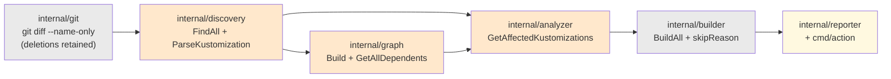
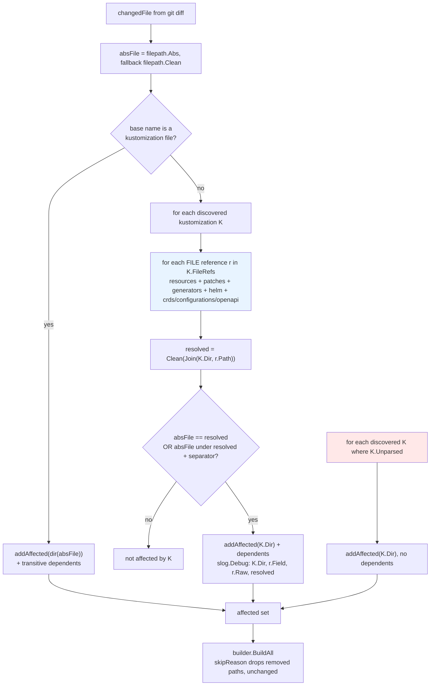

# Plan: Complete & Correct Impact Matching

Four phases that close the four recorded false-pass classes (G1–G4) plus a fifth found while
planning, each phase shippable on its own and each leaving the tool strictly better than it
found it.

## Table of Contents

- [Context](#context)
- [Dependencies](#dependencies)
- [Scope](#scope)
- [Design](#design)
- [Acceptance Criteria](#acceptance-criteria)
- [Implementation Phases](#implementation-phases)
- [Test Plan](#test-plan)
- [Implementation Order](#implementation-order)
- [File Reference Summary](#file-reference-summary)
- [Open Questions](#open-questions)

## Context

`kustomize-build-check` is a CI gate. `CLAUDE.md` states the bar it is held to: **a false pass
is worse than a false fail**, because reporting green on a repo where `kustomize build` would
fail defeats the tool's only purpose. [`docs/specs/complete-impact-matching.spec.md`](../specs/complete-impact-matching.spec.md)
records four ways the tool currently reports green while validating nothing, and specifies the
fix as four requirement groups (A–D) plus cross-cutting invariants (E).

This plan phases those groups, resolves the one blocking open question, and adds the tests that
keep the fix honest. It does not re-derive the spec's requirements; every acceptance criterion
below is the spec's own, carried over by ID so the two stay greppable against each other.

**Baseline measured this session on the working tree of `feat/complete-impact-matching`:**
`go test ./...` reports **31 passed in 8 packages**. That number is the gate for every phase.

### Planning-session findings (recorded so `/implement` does not re-derive them)

Four probes were run against throwaway copies of the repo. Each result below is a measurement,
not a prediction.

1. **Phase 1 in isolation is green.** Deleting the containment guard (`analyzer.go:115-120`)
   and running the full suite: all 31 tests pass, unmodified.
2. **Phase 1 does not reintroduce sibling-prefix matching.** With the guard gone, a
   kustomization at `<root>/base` referencing `../shared` was probed against four changed
   paths: `shared-old/x.yaml` → no match, `sharedx/y.yaml` → no match,
   `shared/nested/deep.yaml` → match, `shared` → match. The separator-terminated prefix test
   at `analyzer.go:128` is sufficient on its own. F-E2 still needs its own explicit test to
   keep this true.
3. **Phase 1 + Phase 2 together break exactly one test, and it is a count assertion.**
   `TestExtractDependencies` (`graph_test.go:130`) reports `expected 3 dependencies, got 5`.
   Every other test in every package passes, including all three deletion/skip guards.
4. **A fifth false pass exists and Phase 1 closes it.** Fixture: `base/` (containing
   `kustomization.yaml` + `deployment.yaml`) and `overlays/dev/` referencing `../../base`; the
   change deletes `base/` outright. On the current code the run reports
   `total=1 success=0 failed=0 skipped=1` and **exits 0**, while `kustomize build overlays/dev`
   genuinely fails. With Phase 1 applied it reports `overlays/dev` → **failed** and `base` →
   **skipped ("removed in this change")**, which is the truthful outcome. This is tracked as
   **G5** and covered by AC-A7.

Finding 4 is also what settles OQ-2 — see [ADR-001](../decisions/ADR-001-graph-reference-classification.md).

## Dependencies

| Dependency | State | Note |
|---|---|---|
| `docs/specs/complete-impact-matching.spec.md` | Committed on this branch | The source of truth; this plan adds no requirements of its own |
| OQ-1 (unparseable outcome) | **Resolved** in spec §10, option (d) | Always affected; `kustomize build` adjudicates; no fourth result class |
| OQ-2 (file-vs-dir classification) | **Resolved by this plan** | [ADR-001](../decisions/ADR-001-graph-reference-classification.md), option (ii) implemented as a deletion. Phase 2 is unblocked. |
| OQ-3 (does F-D8 ship?) | **Resolved by this plan: yes** | Ships as work package 4.3. Rationale in Phase 4. Repo owner may override to defer. |
| OQ-4 (kustomize/helm versions) | **Resolved** | Image pins kustomize `v5.8.1`, helm `v4.2.3` (`Dockerfile:20,28`) — the exact toolchain every Group D shape was verified against. No re-verification. |
| OQ-5 (build volume after G1 closes) | Open, **non-blocking** | Recommendation in [Open Questions](#open-questions); does not gate any phase |
| `git` and `kustomize` on PATH | Required | `internal/integration` skips without them (`pipeline_test.go:142-148`); `CLAUDE.md` forbids letting that pass silently in CI |
| `gopkg.in/yaml.v3` | Present, the repo's only direct dependency | No phase adds a second one (F-E7, NF-06) |

Nothing external blocks the start. Phases 1 and 2 can begin immediately.

## Scope

### In Scope

- `internal/analyzer` — remove the containment guard; match on resolved references only; apply
  the unparseable always-affected rule; provenance in debug logs.
- `internal/graph` — replace the `filepath.Ext` classifier with the discovered-node lookup.
- `internal/discovery` — two-stage tolerant parsing; the extended reference model; every
  reference surface in F-D1..F-D8; retention of unparseable files as flagged entries.
- `internal/reporter` — two additive methods for surfacing parse issues (F-C3, ADR-003).
- `cmd/action/main.go` — wire the parse issues into the report.
- `internal/integration/pipeline_test.go` — extended harness plus at least one end-to-end
  scenario per phase; this is the repo's E2E layer.
- Unit tests in `internal/analyzer`, `internal/graph`, `internal/discovery`, `internal/reporter`.
- `michielvha/kustomize-build-check-action`'s `action.yml` — the image SHA pin only (Phase 5).
  Nothing else in that repo is touched.

### Out of Scope

Inherited verbatim from spec §9, plus two additions from the brief:

1. Remote references — git URLs, OCI artifacts, remote components: not fetched, not resolved,
   not matched (F-D12).
2. Helm chart *contents*. Local values files only.
3. Kustomize plugins, exec generators, KRM functions.
4. Build execution, skip semantics, exit codes and report layout — unchanged, except the single
   additive reporting surface required by F-C3.
5. Change detection. `internal/git` is untouched; deletions stay in the diff (F-E5).
6. Parallel builds, discovery caching, result ordering.
7. Validating that a kustomization is semantically correct — that is `kustomize build`'s job.
8. Reconciling `design.md`.
9. Further kustomize/helm upgrades beyond the v5.8.1 / v4.2.3 pin.
10. `docs/specs/_index.md`.
11. **Container hardening** (alpine → Wolfi base). Parked in `TODO.md` for its own spec after
    this plan lands.
12. **Building the dependency graph from the pre-change tree.** Still out of scope — but note it
    is **no longer** what OQ-6 needs. OQ-6 is closed inside Phase 2 by recording the reverse edge
    even when no node was discovered at the resolved path (see Open Questions). A pre-change-tree
    graph remains a separate, larger feature that nothing here depends on.

## Design

### Pipeline, with the change points marked



<details><summary>Legend</summary>

- **Orange** — changed by this plan (discovery: Phases 3 and 4; graph: Phase 2; analyzer:
  Phases 1, 3 and 4).
- **Pale yellow** — touched only by the additive reporting surface in Phase 3 (F-C3).
- **Grey** — unchanged collaborators. `internal/git` keeps deletions in the diff (F-E5);
  `internal/builder` remains the sole owner of "does this path still exist" (F-E3).

</details>

### The matching decision after all four phases



<details><summary>Legend</summary>

- **Blue** — Phase 1 removes the containment gate that used to sit between E and F
  (`analyzer.go:115-120`); Phase 4 widens `K.FileRefs` from `resources` only to every surface.
- **Red** — Phase 3's always-affected rule for unparseable files (F-C2, ADR-003). It adds the
  directory but not its dependents, deliberately.
- Everything below `K` is unchanged: existence checking stays the builder's job (F-E3).

</details>

### Data model

`discovery.KustomizeFile` is extended **additively** (NF-08). Existing fields keep their
meaning so `graph.Build` (`graph.go:43`) keeps compiling across every phase.

| Field | Phase | Populated from | Consumed by |
|---|---|---|---|
| `Path`, `Dir` | — | unchanged | everything |
| `Resources`, `Bases`, `Components` | — | unchanged raw strings | `graph.extractDependencies` — **directory candidates** |
| `FileRefs []Ref` | 4 (seeded in 3) | `resources` + F-D1..F-D8 | `analyzer` — **file references** |
| `Unparsed bool`, `ParseErr string` | 3 | malformed YAML only | `analyzer` (always-affected), `reporter` (F-C3) |
| `FieldErrs []FieldError` | 3 (used in 4) | a field that failed `node.Decode` | `reporter` (F-C3, F-C6) |

```go
// Ref is one local file reference read out of a kustomization.
type Ref struct {
    Raw   string // exactly as written, e.g. "aliaskey=values.txt"
    Path  string // the path portion after alias stripping, e.g. "values.txt"
    Field string // provenance, e.g. "configMapGenerator[].files" (F-D11)
}
```

A `resources` entry appears in **both** `Resources` and `FileRefs`. That is deliberate and is
exactly what F-B3 requires: graph classification and analyzer matching are two separate
decisions and neither may suppress the other.

Parsing is a two-stage `yaml.Node` decode — see
[ADR-002](../decisions/ADR-002-tolerant-kustomization-parsing.md). Classification of directory
references is the discovered-node lookup the graph already performs — see
[ADR-001](../decisions/ADR-001-graph-reference-classification.md). The unparseable policy's
placement and its reporting surface are in
[ADR-003](../decisions/ADR-003-surfacing-parse-failures.md).

### Invariants carried through every phase

These are checked at the end of every phase, not once at the end of the plan. They appear as
explicit tasks in each phase and as AC-E1..AC-E6 below.

| Invariant | How it is checked |
|---|---|
| The 31 existing tests keep passing | `go test ./...` reports 31 passed in 8 packages, no test weakened, skipped or relaxed (F-E1) |
| Deletions stay in the diff | `TestDeletedResourceStillReferencedFails` (`pipeline_test.go:415`) passes unmodified; `git.go:31-41` still carries no `--diff-filter` (F-E5) |
| No sibling-prefix matching | The new `TestCrossDirectorySiblingPrefixIsNotMatched` passes; `base-old/` never marks `base/` (F-E2) |
| Matching is exact | Every acceptance fixture asserts the affected set by **set equality**, so over-matching fails as loudly as under-matching (F-E4) |
| Removed paths are skipped, never failed | `TestDeletedDirectoryIsSkipped`, `TestConsolidateDuplicatedDirsIntoComponent`, `TestRenamedDirectoryValidatesNewPath` pass unmodified (F-E3, F-C4) |
| One direct dependency | `go.mod` still has exactly one `require` line (F-E7) |
| Integration tests actually ran | Phase sign-off records the `internal/integration` package as `ok`, never `[no tests to run]` or skipped (NF-09) |

### User-visible output changes

Called out per phase so the reporting side is checked too, not only the analyzer's set.

| Phase | What users see that they did not before |
|---|---|
| 1 | More directories listed under "N kustomization(s) need testing", wherever a cross-directory reference exists. Runs that previously printed "No kustomizations affected by changes" and exited 0 can now print failures. **More paths reported as `Skipped`**, because a deleted base now drags its dependent overlay into the build set (G5) while the base itself skips. Counts in `PrintResults` and the step summary shift accordingly. |
| 2 | Directories with dotted names appear as build targets when their overlay is affected, and vice versa. Debug output of `graph.String()` now lists file references under "Dependencies". |
| 3 | A new parse-issue section in the console output and in the GitHub step summary. An unparseable kustomization is now built, so it appears in the results table as a success or a failure instead of vanishing. `failed-count`, `success-count`, `skipped-count` and the `results` JSON keep their exact shape. |
| 4 | Many more directories correctly marked affected. No new output *kinds*; the counts simply get bigger and more truthful. |

## Acceptance Criteria

IDs are the spec's own (§7), preserved verbatim for traceability. The **plan-added** ones are AC-A7, AC-A8, AC-A9, AC-B6, AC-B7, AC-C6, AC-C7, AC-C8, AC-C9, AC-D14 and the AC-E series — every one traces to a spec requirement, and each is marked `(plan-added)` inline. AC-A7 and the AC-E series are
added by this plan.

**Phase 1 — cross-directory matching (Group A, closes G1 and G5)**

- [ ] AC-A1: Given `base/kustomization.yaml` with `resources: [../shared/cm.yaml]` and
      `shared/cm.yaml` as the only changed file, the affected set equals exactly
      `{<root>/base}` ∪ its transitive dependents, and the run does not print
      "No kustomizations affected by changes".
- [ ] AC-A2: In the same fixture with `overlays/dev/kustomization.yaml` listing `../../base`,
      editing `shared/cm.yaml` yields exactly `{<root>/base, <root>/overlays/dev}`, asserted by
      set equality.
- [ ] AC-A3: In the same fixture, a sibling directory `base-old/` with its own
      `kustomization.yaml` does **not** appear in the affected set.
- [ ] AC-A4: Given a resolved reference `<root>/shared`, a change to `<root>/shared-old/x.yaml`
      yields an affected set of length 0. (F-E2, the new explicit regression test.)
- [ ] AC-A5: Given a resolved reference `<root>/shared`, a change to
      `<root>/shared/nested/deep.yaml` marks the referencing kustomization affected.
- [ ] AC-A6: `go test ./...` reports 31 passed in 8 packages with no existing test modified,
      including `TestSiblingDirectoryIsNotMatchedByPrefix`, `TestDeletedResourceStillReferencedFails`,
      `TestBrokenKustomizationStillFails` and `TestDirectoryPresentButKustomizationRemovedFails`.
- [ ] AC-A7: **(G5, found while planning.)** Given `overlays/dev` referencing `../../base` and a
      change that deletes `base/` outright, the run reports `overlays/dev` as **failed** and
      `<root>/base` as **skipped** with a non-empty `SkipReason`; `exit != 0` under
      `fail-on-error`. On the pre-change code the same fixture reports `failed=0, skipped=1`
      and exit 0.
- [ ] AC-A8: Every match logs at `slog.Debug` the kustomization directory, the raw reference
      string and the resolved path (F-A5), assertable from a captured `slog` handler.

**Phase 2 — file-vs-directory classification (Group B, closes G4)**

- [ ] AC-B1: Given `overlays/dev/kustomization.yaml` with `resources: [../../bases/v1.2]` and
      `bases/v1.2/kustomization.yaml` present, `graph.GetAllDependents(<root>/bases/v1.2)`
      contains `<root>/overlays/dev`.
- [ ] AC-B2: The same holds for a reference `../my.app` to a directory named `my.app`.
- [ ] AC-B3: Editing `bases/v1.2/cm.yaml` produces an affected set equal to exactly
      `{<root>/bases/v1.2, <root>/overlays/dev}`.
- [ ] AC-B4: A `resources` entry that is a genuine file (`cm.yaml`) produces **no** graph edge.
      `TestExtractDependencies` is updated from 3 to 5 candidates and is paired with a new
      test asserting the **3 edges** actually produced.
- [ ] AC-B5: A `resources` entry pointing at a path that does not exist produces no node, no
      edge, no panic and no error return — asserted explicitly, per ADR-001.
- [ ] AC-B6: The three deletion/skip guards (`TestDeletedDirectoryIsSkipped`,
      `TestConsolidateDuplicatedDirsIntoComponent`, `TestRenamedDirectoryValidatesNewPath`) pass
      unmodified with Phases 1 and 2 both applied.

**Phase 3 — unparseable kustomization (Group C, closes G3)**

- [ ] AC-C1: A tree containing one malformed `kustomization.yaml` and no other change does not
      produce the combination "exit 0" + "nothing validated" + "All checks passed"; the
      malformed directory appears in the results table.
- [ ] AC-C2: The malformed path and the parse error appear in the console output **and** in the
      GitHub step summary, not only on stderr.
- [ ] AC-C3: A kustomization containing a field this tool does not model (`replacements`,
      `namespace`, `labels`) parses cleanly, produces no diagnostic and is not marked
      `Unparsed` (F-C5).
- [ ] AC-C4: A `patches:` list written as plain strings cannot yield a green run: the field
      contributes no references, a `FieldError` is recorded and reported, the file is retained,
      and the directory reaches `kustomize build`.
- [ ] AC-C5: A directory the change removed is still reported `Skipped` with a non-empty
      `SkipReason` and `Failed == 0` for that path (F-C4, F-E3).
- [ ] AC-C6: An unparseable kustomization still produces a graph **node** at its directory, so a
      kustomization that references it keeps its edge and its dependents still propagate (F-C2a).
- [ ] AC-C8 (F-C1, plan-added): A kustomization file that cannot be **read** — a dangling
      symlink, or one whose mode denies reading — is flagged `Unparsed`, reaches `kustomize build`
      and fails the run. E2E, `internal/integration/pipeline_test.go` —
      `TestUnreadableKustomizationIsBuiltNotDropped`.
      *F-C1 says "read or parsed". The read error happens at `discovery.go:71-74`, before the YAML
      stage, so covering only malformed YAML leaves it silently dropped.*
- [ ] AC-C9 (F-C6/AC-C4, plan-added): A kustomization with an undecodable **field** (e.g.
      `patches:` given as plain strings) is retained, records a `FieldError`, **and its directory
      reaches `kustomize build`** — so a change to a sibling file it would have referenced cannot
      pass silently. E2E, `internal/integration/pipeline_test.go` —
      `TestFieldErrorStillReachesTheBuilder`.
      *Without this, AC-C4's "the directory reaches `kustomize build`" is satisfiable only by
      arranging for the directory to be affected some other way.*
- [ ] AC-A9 (plan-added, Phase 5 release gate): After the last phase merges, the image tagged
      with the merge SHA is confirmed **present in GHCR before** any pin edit; then
      `kustomize-build-check-action/action.yml`'s `image:` pin is bumped to that SHA and one real
      PR run against the bumped wrapper is recorded with its run URL. Rollback is a one-line
      revert of the pin, which restores every consumer immediately.
      *Modelled on `container-hardening` AC-13, which covers the identical cross-repo step.*
- [ ] AC-E7 (F-E6, plan-added): `GetAffectedKustomizations` still returns paths that are
      **absolute**, `filepath.Clean`ed and **de-duplicated**, returns a non-nil empty slice rather
      than `nil` when nothing is affected, and still has no `error` return. Asserted by a unit test
      over a non-trivial input (duplicate routes to one directory, a `..`-containing reference, an
      unparseable entry). *F-E6 is P0 and had no criterion; Phase 3 adds the always-affected rule
      and Phase 4 swaps `Resources`→`FileRefs`, and both touch this return path.*
- [ ] AC-C7: **this phase** adds no key to `SetGitHubOutputs` and changes the shape of none of the
      four existing keys (`failed-count`, `success-count`, `skipped-count`, `results`); the
      `results` JSON schema is unchanged (no fourth result class).
      *Worded as "adds none" rather than "emits exactly four", because `shallow-clone-support`
      lands a fifth key (`change-detection-mode`) immediately after this plan. A literal
      four-key assertion would pass here and then start failing for a reason unrelated to this
      plan. The invariant that matters is additivity, not the count.*

**Phase 4 — complete reference surfaces (Group D, closes G2)**

- [ ] AC-D1: `patches: [{path: patch.yaml, target: {...}}]` — editing `patch.yaml` marks the
      directory affected.
- [ ] AC-D2: A `patches` list mixing a `path:` entry and an inline `patch:` entry parses without
      error; editing the `path:` file marks the directory affected; the inline entry contributes
      no reference.
- [ ] AC-D3: `configMapGenerator[].files` — editing the referenced file marks the directory affected.
- [ ] AC-D4: `configMapGenerator[].files: [aliaskey=real-file.txt]` — editing `real-file.txt`
      marks the directory affected, and a file literally named `aliaskey=real-file.txt` is not
      what is looked for. (The alias trap, F-D4.)
- [ ] AC-D5: `configMapGenerator[].envs` and `secretGenerator[].envs` — editing the properties
      file marks the directory affected.
- [ ] AC-D6: `secretGenerator[].files` — same.
- [ ] AC-D7: `patchesStrategicMerge: [sm.yaml]` — editing `sm.yaml` marks the directory affected.
- [ ] AC-D8: `patchesJson6902: [{path: j6902.json, target: {...}}]` — editing `j6902.json` marks
      the directory affected.
- [ ] AC-D9: `helmCharts[].valuesFile` and `helmCharts[].additionalValuesFiles` — editing a
      values file marks the directory affected.
- [ ] AC-D10: `crds[]`, `configurations[]` and `openapi.path` — editing the referenced file marks
      the directory affected. (P2, ships per OQ-3.)
- [ ] AC-D11: Cross-directory forms compose with Phase 1: `patches: [{path: ../shared/patch.yaml}]`
      marks the directory affected.
- [ ] AC-D12: For every scenario above, the affected set is asserted by **equality**; a sibling
      directory holding an identically named file is not marked (F-E4).
- [ ] AC-D13: No newly parsed **file** reference creates a graph edge; `GetAllDependents` on a
      patch file's directory returns nothing new (F-D10).
- [ ] AC-D14: A reference containing `://` or starting with `git@` is skipped before resolution,
      with a debug line, and matches nothing (F-D12).

**Cross-cutting (Group E, verified at the end of every phase)**

- [ ] AC-E1: `go test ./...` reports 31 passed in 8 packages plus that phase's new tests, with no
      existing test weakened, skipped or deleted (F-E1).
- [ ] AC-E2: `TestDeletedResourceStillReferencedFails` passes unmodified and `git.go` still
      contains no `--diff-filter` (F-E5).
- [ ] AC-E3: `TestCrossDirectorySiblingPrefixIsNotMatched` passes: resolved reference
      `/repo/shared` is never matched by `/repo/shared-old/x.yaml` (F-E2).
- [ ] AC-E4: Every affected-set assertion added by the phase goes through the shared
      `assertAffected(t, got, want)` helper, which compares **sorted slices for equality** and
      fails on any extra element as loudly as on a missing one (F-E4). Mechanically checkable:
      no affected-set assertion in the phase's diff calls `slices.Contains` or a hand-rolled
      containment loop.
      *Previously worded as "uses set equality, not containment", which is a code-review property
      its own Test Plan row could not assert — a hand-rolled containment check would have passed.*
- [ ] AC-E5: `go.mod` lists exactly one `require` line (F-E7).
- [ ] AC-E6: The `internal/integration` package reports `ok` in the phase's test run — it neither
      skipped for a missing binary nor ran zero tests (NF-09).

## Implementation Phases

### Phase 1: internal/analyzer — cross-directory reference matching

**Priority: HIGH** — the smallest change in the plan for the largest class of false pass
removed, and probed green in isolation. It also closes G5, which nothing else in the spec
covers.

**Goal**: a changed file marks every kustomization that references it, wherever in the tree that
kustomization lives, with matching decided solely by the resolved reference path.

**Tasks**:
- [ ] Write the F-E2 regression test **first**, before touching `analyzer.go`:
      `TestCrossDirectorySiblingPrefixIsNotMatched` in `internal/analyzer/analyzer_test.go`,
      covering resolved reference `<root>/shared` against `shared-old/x.yaml`, `sharedx/y.yaml`,
      `shared/nested/deep.yaml` and `shared` (AC-A4, AC-A5, AC-E3). Confirm it fails or passes
      for the right reason on the unchanged code.
- [ ] Delete the containment guard at `analyzer.go:115-120` so the resolved-reference loop at
      `:122-131` is always reached (F-A1). Leave the separator-terminated prefix test at `:128`
      exactly as it is (F-A4).
- [ ] Verify the `strings` import is still required (it is, by `:128`); do not leave an unused import.
- [ ] Update the `fileReferencedByKustomization` doc comment: matching is decided only by the
      resolved reference, and the guard was removed because it was the sole blocker of
      cross-directory references (F-A2).
- [ ] Change `fileReferencedByKustomization` to report **which** reference matched (return the
      raw reference and the resolved path, or accept a callback) so the caller can emit the
      F-A5 debug line with directory, raw reference and resolved path (AC-A8).
- [ ] Add analyzer unit tests for the cross-directory match and the ancestor reference
      (`resources: [..]` matches everything below the resolved ancestor — over-broad but
      truthful, per spec §8).
- [ ] Add E2E scenarios to `internal/integration/pipeline_test.go`:
      `TestCrossDirectoryResourceMarksBaseAffected` (AC-A1, AC-A2, AC-A3, set-equality assertion
      including a `base-old/` sibling) and `TestDeletedBaseFailsDependentOverlay` (AC-A7).
- [ ] Add a set-equality helper to the harness (`assertAffected(t, summary, want ...string)`)
      so F-E4 is enforced by construction for this and all later phases.
- [ ] Run `go test ./...`; confirm 31 + new, `internal/integration` reports `ok` (AC-A6, AC-E1,
      AC-E6). Confirm `go.mod` unchanged (AC-E5).

**Depends on**: None.

**Rollback / risk**: lands as exactly one commit; `git revert <phase-1-sha>` restores the guard
and every test with it. Reverting reopens G1 and G5. Risk is that removing the guard over-matches;
this is bounded by AC-A3/AC-A4 and by the set-equality helper, and was probed clean. Blast radius
is confined to `analyzer.go` plus new tests — no other package is touched.

### Phase 2: internal/graph — correct file-vs-directory classification

**Priority: HIGH** — small, localised, and it is the difference between a dotted base
propagating to its overlays and silently propagating to nothing.

**Goal**: a `resources` entry becomes a graph edge when a discovered kustomization sits at the
resolved path, and never because of how the name looks.

**Tasks**:
- [ ] Apply [ADR-001](../decisions/ADR-001-graph-reference-classification.md): delete the
      `filepath.Ext` pre-filter at `graph.go:100-108`; `extractDependencies` becomes three
      appends over `Resources`, `Bases`, `Components`, preserving that order (F-B1, F-B5).
- [ ] Update the `Node.Dependencies` doc comment (`graph.go:16`): raw references as written; an
      edge exists only where the resolved path is a discovered kustomization. Keep the field
      name (NF-08).
- [ ] Update `TestExtractDependencies` (`graph_test.go:130`) from 3 to 5, with a comment
      pointing at ADR-001 for the rationale (AC-B4).
- [ ] Add `TestExtractDependenciesProducesEdgesOnlyForDiscoveredDirs`: the same fixture yields
      exactly 3 reverse-lookup edges, so the behaviour the old count assertion stood for is now
      asserted directly (AC-B4).
- [ ] Add `TestDottedDirectoryNamesKeepEdges`: `../../bases/v1.2` and `../my.app` (AC-B1, AC-B2).
- [ ] Add `TestMissingReferencePathProducesNoEdge`: a resources entry pointing nowhere — no node,
      no edge, no panic, no error (AC-B5).
- [ ] Add E2E scenario `TestDottedBaseDirectoryPropagatesToOverlay` in
      `internal/integration/pipeline_test.go`: real repo with `bases/v1.2/`, editing
      `bases/v1.2/cm.yaml`, affected set asserted equal to `{bases/v1.2, overlays/dev}` (AC-B3).
- [ ] Re-run the three deletion/skip guards explicitly and record the result (AC-B6).
- [ ] Run `go test ./...`; confirm the invariant checklist (AC-E1..AC-E6).

**Depends on**: None technically. Sequenced after Phase 1 so that the one test change
(`TestExtractDependencies`) lands in a commit whose only subject is the graph, keeping Phase 1's
revert clean.

**Rollback / risk**: one commit; `git revert <phase-2-sha>` restores the `filepath.Ext` filter
and the 3-count assertion together. Reverting reopens G4. Risk is spurious edges from file
entries — impossible by construction (a file path is a node only if a directory of that name
holds a kustomization), and the guard is AC-B4's edge-count test.

### Phase 3: internal/discovery + reporter — an unparseable kustomization can never be green

**Priority: HIGH** — closes G3, and it must land **before** Phase 4. Phase 4 adds eight
structured fields to the parser; on today's code any one of them can drop a whole file, so
shipping Phase 4 first would enlarge the very false pass this phase closes (F-C6, spec §11
"Phase 4 can make G3 worse").

**Goal**: a kustomization this tool cannot parse is built rather than dropped, its node survives
so dependents still propagate, and both whole-file and per-field parse problems reach the user
through the report.

**Tasks**:
- [ ] Implement the two-stage `yaml.Node` decode per
      [ADR-002](../decisions/ADR-002-tolerant-kustomization-parsing.md), initially over the
      three existing fields only. Stage 1 failure (malformed YAML) sets `Unparsed`; stage 2
      failure records a `FieldError` and yields no references from that field.
      **Both are always-affected triggers — see the Phase 3 always-affected task below. A
      `FieldError` means the tool does not know what that field referenced, which is the same
      epistemic position as `Unparsed` and must not be treated as "no references".**
- [ ] Extend `discovery.KustomizeFile` additively: `Unparsed`, `ParseErr`, `FieldErrs`, and the
      `Ref` / `FieldError` types. Keep `Resources`, `Bases`, `Components` exactly as they are so
      `graph.Build` is untouched by this phase (NF-08).
- [ ] Change `ParseKustomization` to return a non-nil `*KustomizeFile` alongside the error for
      the malformed-YAML case, so the directory is recoverable.
- [ ] Change `FindAll` (`discovery.go:51-56`) to append the flagged entry instead of dropping it,
      and **delete** the `fmt.Fprintf(os.Stderr, "Warning: ...")` line (F-C1, F-C2a, NF-05).
      Verify the `fmt`/`os` imports are still needed.
- [ ] **`Unparsed` MUST also be set when the file cannot be READ, not only when the YAML is
      malformed.** `ParseKustomization` fails at `os.ReadFile` (`discovery.go:71-74`) *before* the
      YAML stage, so a dangling symlink or an unreadable file never reaches stage 1. F-C1 says
      "cannot be **read or** parsed"; covering only malformed YAML leaves the read case silently
      dropped — and deleting the stderr warning above turns today's *noisy* false pass into a
      *silent* one. Verified on `main`: `app/kustomization.yaml` as a dangling symlink with a
      sibling file edited reports "No kustomizations affected by changes" and exit 0, while
      `kustomize build app` fails.
- [ ] Apply the always-affected rule in `analyzer.GetAffectedKustomizations` per
      [ADR-003](../decisions/ADR-003-surfacing-parse-failures.md): `kust.Unparsed` **or a
      non-empty `kust.FieldErrs`** adds `kust.Dir` unconditionally, **without** dependent
      propagation. Signature unchanged (F-E6).
      *`FieldErrs` must trigger it too, or AC-C4 is unsatisfiable as written: it asserts the
      directory "reaches `kustomize build`", but a `patches` field given as plain strings yields a
      `FieldError`, contributes no references, and — without this — nothing puts the directory
      back in the set. Verified on `main`: that fixture reports "No kustomizations affected" while
      `kustomize build` rejects it with `cannot unmarshal string into ... types.Patch`.*
- [ ] Add `reporter.ParseIssue`, `PrintParseIssues` and `AppendParseIssuesToStepSummary`
      (additive; existing method signatures and the outputs contract untouched — AC-C7).
- [ ] Wire `cmd/action/main.go`: collect `Unparsed` + `FieldErrs` from the discovered set into
      `[]reporter.ParseIssue`, print them, append them to the step summary. Ensure the
      "No kustomizations affected" early-exit branch (`main.go:63-76`) also reports them.
- [ ] **This plan OWNS the final shape of the shared `run()` helper.** Three plans reshape it
      (`shallow-clone-support` swaps `reporter.New()` for the `RunInfo` constructor at
      `pipeline_test.go:139`; `build-timeout-handling` adds a `runWith(...)` variant). This plan
      lands first, so the signature it settles is the one the other two build on — extend it once,
      here, and record the resulting signature in this task list so neither later plan invents a
      second shape. Extend the E2E harness `run()` (`pipeline_test.go:113-140`) to point
      `GITHUB_STEP_SUMMARY` at a temp file and invoke the reporter, returning its contents
      alongside the summary, so AC-C2 is assertable end to end.
- [ ] Add discovery unit tests: AC-C3 (unknown fields ignored, not `Unparsed`), AC-C4
      (`patches` as plain strings → `FieldError`, file retained), malformed YAML → `Unparsed`
      with `Dir` populated.
- [ ] Add reporter unit tests for both new methods, including the empty-slice case.
- [ ] Add E2E scenarios: `TestMalformedKustomizationIsBuiltNotDropped` (AC-C1, AC-C2),
      `TestUnparseableKustomizationKeepsItsGraphNode` (AC-C6), and re-assert AC-C5 against the
      existing deletion fixtures.
- [ ] Run `go test ./...`; confirm the invariant checklist (AC-E1..AC-E6).

**Depends on**: Phase 1 (the analyzer change lands in the same function region; sequencing avoids
a conflict). Not blocked by Phase 2.

**Rollback / risk**: one commit; `git revert <phase-3-sha>` restores drop-and-warn, removes the
reporter methods and the harness extension together. Reverting reopens G3 **and** removes the
tolerant-parsing scaffolding Phase 4 builds on, so Phase 4 must be reverted first or it will not
compile. Risk: a repo with pre-existing malformed YAML now runs an extra `kustomize build` and
may go red. That is the false-fail side of the asymmetry and is exactly what OQ-1 accepted;
call it out in the release notes.

### Phase 4: internal/discovery + analyzer — complete reference-surface parsing

**Priority: MEDIUM** — the largest phase and the last, because it composes with Phase 1
(AC-D11) and depends on Phase 3's tolerant decode. It closes G2, the broadest false pass by
number of affected repos, but each surface is individually low-risk.

**Goal**: every local file kustomize can read is a matchable reference, resolved and matched by
the same rules as `resources`, with no second matching path and no new whole-file drop mode.

Organised into three work packages so rollback stays granular; each lands as its own commit.

**Tasks — 4.1, the reference model**:
- [ ] Add `FileRefs []Ref` to `KustomizeFile` and seed it from `resources` (every entry, with
      `Field: "resources"`).
- [ ] Switch `analyzer.fileReferencedByKustomization` from `kust.Resources` to `kust.FileRefs`,
      so there is exactly one matching path (F-D9). Confirm Phase 1's tests still pass unchanged.
- [ ] Add the alias splitter: split on the **first** `=`; if the left side is non-empty use the
      right side as the path (F-D4). Log at debug when a split occurs, and record the
      "filename containing `=` and no alias" case as an accepted limitation with its own debug
      line (spec §8).
- [ ] Add the non-local guard: a ref containing `://` or starting with `git@` is skipped before
      resolution, with a debug line (F-D12, AC-D14).
- [ ] Include `r.Field` and `r.Raw` in the F-A5 debug line (F-D11).

**Tasks — 4.2, the P0/P1 surfaces**:
- [ ] `patches[].path`, tolerating an entry with `patch:` and no `path:` and an entry with
      neither (F-D1, F-D2).
- [ ] `configMapGenerator[].files`, `configMapGenerator[].envs`, `secretGenerator[].files`,
      `secretGenerator[].envs`, all through the alias splitter (F-D3, F-D4).
- [ ] `patchesStrategicMerge[]` (F-D5) and `patchesJson6902[].path` (F-D6).
- [ ] `helmCharts[].valuesFile` and `helmCharts[].additionalValuesFiles[]` (F-D7). Field shapes
      are the v5.8.1 ones the spec verified; `chartHome` is **not** per-chart in v5.8.1 and is
      not parsed.
- [ ] Confirm none of these feed `extractDependencies` — file references create no edges (F-D10,
      AC-D13).

**Tasks — 4.3, the P2 surfaces (resolves OQ-3: they ship)**:
- [ ] `crds[]`, `configurations[]`, `openapi.path` (F-D8). They are session-verified, they are
      the same defect class, and once 4.1's decode scaffolding exists each is a few lines —
      deferring them would leave a documented false pass in the shipped product for no saving.

**Tasks — tests and sign-off**:
- [ ] One discovery unit test per field family, including the empty-field and wrong-shape cases
      (`patches: []`, `configMapGenerator: "oops"` → `FieldError`, file retained).
- [ ] A dedicated unit test for the alias trap (AC-D4) — not folded into a shared table test,
      per spec §11's risk note.
- [ ] E2E scenarios AC-D1..AC-D11 in `internal/integration/pipeline_test.go`, each editing only
      the named file and asserting the affected set by equality via the Phase 1 helper, each
      fixture including a sibling directory with an identically named file (AC-D12).
- [ ] E2E `TestPatchFileCreatesNoGraphEdge` (AC-D13).
- [ ] Run `go test ./...`; confirm the invariant checklist (AC-E1..AC-E6). Confirm
      `internal/integration` ran against the real `kustomize` (NF-09).

**Depends on**: Phase 3 (tolerant decode, `Ref`, `FieldErrs`). Composes with Phase 1 for AC-D11.

**Rollback / risk**: three commits, revertible independently, newest first —
`git revert <4.3-sha>` drops the P2 surfaces only; `git revert <4.2-sha>` drops the eight field
families; `git revert <4.1-sha>` returns the analyzer to `kust.Resources` and must be last.
Reverting 4.2 or the whole phase reopens G2. Risks: (a) the alias trap is silent when wrong —
mitigated by its own dedicated test; (b) a mis-parsed field is a *silent* miss, not a loud
failure — mitigated by one scenario per surface, with zero surfaces lacking one; (c) more
directories built per run — see OQ-5.

### Phase 5: release and bump the consumer pin

**Goal**: get the work in front of consumers. Merging any earlier phase publishes a new image, but
the wrapper action pins by digest — until that pin moves, `@main` keeps serving the old image and
**nobody sees any of this work**. This step was needed manually after PR #8 and is easy to forget
because nothing in this repo fails without it.

**Tasks**:
- [ ] Merge the last phase to `main` and let `build-release.yml` run to completion. Do not assume
      it succeeded — read the run.
- [ ] Confirm the image tagged with the merge SHA is **present in GHCR** before touching the pin
      (anonymous token + a `GET` of the manifest; a 200 is the gate).
- [ ] Bump `image:` in `michielvha/kustomize-build-check-action`'s `action.yml` to that SHA.
- [ ] Record one real PR run against the bumped wrapper, with its run URL (AC-A9).

**Depends on**: whichever phase lands last. Each plan bumps the pin after its **own** last phase —
do not defer to the end of the stack (see [Implementation Order](#implementation-order) for why
that would break `container-hardening` AC-13).

**Rollback / risk**: one line. `git revert` of the pin commit restores every consumer immediately,
which makes this the cheapest rollback in the stack — and the reason the pin bump is kept as its
own commit rather than folded into anything else. Risk: bumping the pin to a SHA whose image was
never published, which the GHCR presence check exists to prevent.

## Test Plan

`internal/integration/pipeline_test.go` is this repo's **E2E layer**: it builds real git
repositories, runs the real pipeline and shells out to a real `kustomize` binary. There is no UI
and no HTTP surface, so this is where the E2E rows live. **Phases 1-4 each have at least one. Phase 5 (release + consumer pin bump) deliberately has none** — it is a cross-repo release step verified by AC-A9's recorded run URL, not by a Go test.

Every test added by this plan carries a traceability comment on its first line, so criteria are
greppable:

```go
// Verifies: Complete & Correct Impact Matching, Criterion: "<exact criterion text from this plan>"
```

| Criterion | Test Type | Test Location |
|---|---|---|
| AC-A1: cross-directory `../shared/cm.yaml` marks `base` | **E2E** | `internal/integration/pipeline_test.go` — `TestCrossDirectoryResourceMarksBaseAffected` |
| AC-A2: set equals `{base, overlays/dev}` | **E2E** | `internal/integration/pipeline_test.go` — same test, `assertAffected` |
| AC-A3: `base-old/` absent from the set | **E2E** | `internal/integration/pipeline_test.go` — same test |
| AC-A4: `shared-old/x.yaml` matches nothing | Unit | `internal/analyzer/analyzer_test.go` — `TestCrossDirectorySiblingPrefixIsNotMatched` |
| AC-A5: `shared/nested/deep.yaml` matches | Unit | `internal/analyzer/analyzer_test.go` — same test |
| AC-A6: 31 existing tests still pass | Suite | `go test ./...` (all 8 packages) |
| AC-A7: deleted base fails its overlay, base skipped | **E2E** | `internal/integration/pipeline_test.go` — `TestDeletedBaseFailsDependentOverlay` |
| AC-A8: debug line carries dir, raw ref, resolved path | Unit | `internal/analyzer/analyzer_test.go` — `TestMatchLogsResolvedReference` (captured `slog` handler) |
| AC-B1: `../../bases/v1.2` keeps its edge | Unit | `internal/graph/graph_test.go` — `TestDottedDirectoryNamesKeepEdges` |
| AC-B2: `../my.app` keeps its edge | Unit | `internal/graph/graph_test.go` — same test |
| AC-B3: editing `bases/v1.2/cm.yaml` → `{bases/v1.2, overlays/dev}` | **E2E** | `internal/integration/pipeline_test.go` — `TestDottedBaseDirectoryPropagatesToOverlay` |
| AC-B4: file entries create no edge; 3 edges from 5 candidates | Unit | `internal/graph/graph_test.go` — `TestExtractDependencies` (updated) + `TestExtractDependenciesProducesEdgesOnlyForDiscoveredDirs` |
| AC-B5: non-existent path — no node, no edge, no panic, no error | Unit | `internal/graph/graph_test.go` — `TestMissingReferencePathProducesNoEdge` |
| AC-B6: three deletion/skip guards unmodified | **E2E** | `internal/integration/pipeline_test.go` — existing `TestDeletedDirectoryIsSkipped`, `TestConsolidateDuplicatedDirsIntoComponent`, `TestRenamedDirectoryValidatesNewPath` |
| AC-C1: malformed kustomization cannot be green | **E2E** | `internal/integration/pipeline_test.go` — `TestMalformedKustomizationIsBuiltNotDropped` |
| AC-C2: parse error in console **and** step summary | **E2E** + Unit | `internal/integration/pipeline_test.go` (same test, temp `GITHUB_STEP_SUMMARY`) + `internal/reporter/reporter_test.go` — `TestAppendParseIssuesToStepSummary` |
| AC-C3: unmodelled fields ignored, not `Unparsed` | Unit | `internal/discovery/discovery_test.go` — `TestUnknownFieldsAreIgnored` |
| AC-C4: `patches` as plain strings → field error, file retained | Unit | `internal/discovery/discovery_test.go` — `TestUndecodableFieldDoesNotDropFile` |
| AC-C5: removed directory still `Skipped`, not `Failed` | **E2E** | `internal/integration/pipeline_test.go` — existing `TestDeletedDirectoryIsSkipped` |
| AC-C6: unparseable file still produces a graph node | **E2E** | `internal/integration/pipeline_test.go` — `TestUnparseableKustomizationKeepsItsGraphNode` |
| AC-C7: this phase adds no output key and changes no existing key's shape | Unit | `internal/reporter/reporter_test.go` — existing `SetGitHubOutputs` coverage. Assert the four keys are **present with unchanged shapes**, not that they are the only keys, so `shallow-clone-support`'s fifth key does not later fail this row |
| AC-D1: `patches[].path` | **E2E** | `internal/integration/pipeline_test.go` — `TestPatchesPathMarksAffected` |
| AC-D2: inline `patch:` tolerated, contributes nothing | **E2E** + Unit | `internal/integration/pipeline_test.go` — `TestPatchesInlineIsTolerated`; `internal/discovery/discovery_test.go` |
| AC-D3: `configMapGenerator[].files` | **E2E** | `internal/integration/pipeline_test.go` — `TestConfigMapGeneratorFilesMarksAffected` |
| AC-D4: the `key=path` alias trap | Unit + **E2E** | `internal/discovery/discovery_test.go` — `TestFilesAliasKeyIsStripped`; `internal/integration/pipeline_test.go` — `TestGeneratorAliasFileMarksAffected` |
| AC-D5: `configMapGenerator[].envs`, `secretGenerator[].envs` | **E2E** | `internal/integration/pipeline_test.go` — `TestGeneratorEnvsMarksAffected` |
| AC-D6: `secretGenerator[].files` | **E2E** | `internal/integration/pipeline_test.go` — `TestSecretGeneratorFilesMarksAffected` |
| AC-D7: `patchesStrategicMerge[]` | **E2E** | `internal/integration/pipeline_test.go` — `TestPatchesStrategicMergeMarksAffected` |
| AC-D8: `patchesJson6902[].path` | **E2E** | `internal/integration/pipeline_test.go` — `TestPatchesJson6902MarksAffected` |
| AC-D9: `helmCharts` values files | **E2E** | `internal/integration/pipeline_test.go` — `TestHelmChartValuesFileMarksAffected` |
| AC-D10: `crds`, `configurations`, `openapi.path` | Unit + **E2E** | `internal/discovery/discovery_test.go`; `internal/integration/pipeline_test.go` — `TestCrdsConfigurationsOpenapiMarkAffected` |
| AC-D11: cross-directory `patches: [{path: ../shared/patch.yaml}]` | **E2E** | `internal/integration/pipeline_test.go` — `TestCrossDirectoryPatchMarksAffected` |
| AC-D12: every Phase 4 set asserted by equality, sibling not marked | **E2E** | `internal/integration/pipeline_test.go` — `assertAffected` in every AC-D scenario |
| AC-D13: file references create no graph edges | **E2E** | `internal/integration/pipeline_test.go` — `TestPatchFileCreatesNoGraphEdge` |
| AC-D14: `://` and `git@` refs skipped before resolution | Unit | `internal/discovery/discovery_test.go` — `TestRemoteReferencesAreIgnored` |
| AC-E1: 31 + new tests pass, none weakened | Suite | `go test ./...` at every phase gate |
| AC-E2: deletions stay in the diff | **E2E** | `internal/integration/pipeline_test.go` — existing `TestDeletedResourceStillReferencedFails` |
| AC-E3: sibling prefix never matched | Unit | `internal/analyzer/analyzer_test.go` — `TestCrossDirectorySiblingPrefixIsNotMatched` |
| AC-E4: set equality everywhere | Harness | `internal/integration/pipeline_test.go` — `assertAffected` helper |
| AC-E5: one direct dependency | Manual gate | `go.mod` inspected at every phase gate |
| AC-E6: integration package actually ran | Suite | `go test ./...` output shows `internal/integration ok` |
| AC-E7: analyzer output contract (absolute, cleaned, deduped, non-nil, no error) | Unit | `internal/analyzer/analyzer_test.go` — `TestAffectedSetContract` |
| AC-C8: unreadable kustomization is built, not dropped | **E2E** | `internal/integration/pipeline_test.go` — `TestUnreadableKustomizationIsBuiltNotDropped` |
| AC-C9: field error still reaches the builder | **E2E** | `internal/integration/pipeline_test.go` — `TestFieldErrorStillReachesTheBuilder` |
| AC-B7: deleted bare base fails its dependent overlay | **E2E** | `internal/integration/pipeline_test.go` — `TestDeletedBareBaseFailsDependentOverlay` |
| AC-A9: release published and consumer pin bumped | Manual gate | GHCR manifest returns 200 for the merge SHA; wrapper `action.yml` pin updated; run URL recorded in the PR |

## Implementation Order

| Phase | Description | Effort | Depends on |
|---|---|---|---|
| 1 | Group A — remove the containment guard, match on resolved references, F-E2 regression test first, debug provenance | **S** (~0.5 day) | None |
| 2 | Group B — delete the `filepath.Ext` classifier per ADR-001, update the count assertion, add the edge assertion | **S** (~0.5 day) | None (sequenced after 1 for a clean revert) |
| 3 | Group C — two-stage tolerant decode, retain unparseable files, always-affected rule, reporter surface, harness extension | **M** (~1.5 days) | Phase 1 |
| 4 | Group D — reference model, eight P0/P1 surfaces, three P2 surfaces, alias trap, ~14 E2E scenarios | **L** (~3 days) | Phase 3 (composes with Phase 1) |
| 5 | **Release and bump the consumer pin** — merge, let the release workflow publish, then update the wrapper's image SHA | **S** (~15 min) | Phase 4 (or whichever phase ships last) |

**Phase 5 is not optional, and it is easy to forget.** Every phase above changes Go code, so
merging to `main` triggers `build-release.yml`, GitVersion tags a new version and a new image is
pushed to GHCR tagged with the merge commit SHA. **Until
[`kustomize-build-check-action/action.yml`](https://github.com/michielvha/kustomize-build-check-action/blob/main/action.yml)
has its `image:` pin bumped to that SHA, no consumer sees any of this work** — the wrapper pins by
digest, so `@main` keeps serving the old image. This exact step was needed manually after PR #8.

Verify the new tag exists in GHCR *before* bumping the pin, rather than assuming the workflow
succeeded.

**Bump per plan, not once at the end.** An earlier draft of this paragraph said to bump once after
the last plan and claimed the other three plans assume the same. That was wrong, and the review
caught it:

- `shallow-clone-support` argues the opposite — serialising the bumps keeps each one attributable
  — and its Phase 4 rollback requires the pin bump and the wrapper's input declarations to be **one
  commit**, which a deferred bump makes impossible.
- `build-timeout-handling` bumps after its own Phase 4.
- `container-hardening` AC-13 requires the bumped pin to produce **identical counts and exit code**
  versus the run immediately before it. That assertion only holds if the pin was already current
  when it starts — this plan deliberately changes counts (G5 and the wider matching), so folding
  several plans into one bump guarantees AC-13 fails.

Deferring the bump would also create the stack's only forward dependency: this plan's Phase 5 could
not complete until plan 4 landed. So: **each plan bumps the pin after its own last phase.**

**Ordering confirmed, with one qualification.** The spec's A → B → C → D order is right and is
adopted:

- **A first** is the highest value per line changed — one deletion, probed green against the
  full suite, and it turns out to close G5 as well.
- **B second** is independent of A but tiny, and sequencing it second keeps Phase 1's revert free
  of the one test change (`TestExtractDependencies`) that Phase 2 forces.
- **C before D is not merely preferable, it is required.** Phase 4 adds eight structured fields
  to a parser where any decode error currently drops the whole file (`discovery.go:82-84`,
  kustomization-discovery F-11). Shipping D first would add eight new whole-file-drop modes to
  the exact false pass C exists to close, and would leave that enlarged surface in a shipped
  release. C also delivers the `Ref` / `FieldErrs` scaffolding D plugs into, so the reverse order
  would mean building it twice.
- The only qualification: **B could swap with A** without harm, since neither depends on the
  other. A is kept first because it is the one with the measured evidence behind it and the
  largest user-visible win.

## File Reference Summary

| File | Phase(s) | Change |
|---|---|---|
| `internal/analyzer/analyzer.go` | 1, 3, 4 | Remove the containment guard (`:115-120`); return the matched reference for the F-A5 debug line; always-affected rule for `Unparsed`; switch matching from `Resources` to `FileRefs` |
| `internal/analyzer/analyzer_test.go` | 1, 4 | `TestCrossDirectorySiblingPrefixIsNotMatched`, `TestMatchLogsResolvedReference`, cross-directory and ancestor-reference cases |
| `internal/graph/graph.go` | 2 | `extractDependencies` (`:96-117`) loses the `filepath.Ext` filter; `Node.Dependencies` doc comment |
| `internal/graph/graph_test.go` | 2 | `TestExtractDependencies` updated 3 → 5; `TestExtractDependenciesProducesEdgesOnlyForDiscoveredDirs`, `TestDottedDirectoryNamesKeepEdges`, `TestMissingReferencePathProducesNoEdge` |
| `internal/discovery/discovery.go` | 3, 4 | Two-stage `yaml.Node` decode; `Ref`, `FieldError`, `Unparsed`, `ParseErr`, `FieldErrs`, `FileRefs`; retain unparseable files in `FindAll` (`:51-56`); delete the stderr warning (`:54`); parse F-D1..F-D8; alias splitter; non-local guard |
| `internal/discovery/discovery_test.go` | 3, 4 | Tolerance tests, malformed-YAML test, one test per field family, the dedicated alias-trap test, remote-reference test |
| `internal/reporter/reporter.go` | 3 | Add `ParseIssue`, `PrintParseIssues`, `AppendParseIssuesToStepSummary`; existing signatures and the outputs contract untouched |
| `internal/reporter/reporter_test.go` | 3 | Coverage for both new methods; assert the outputs contract is unchanged |
| `cmd/action/main.go` | 3 | Collect parse issues from the discovered set and report them, including on the early-exit branch (`:63-76`) |
| `internal/integration/pipeline_test.go` | 1, 2, 3, 4 | `assertAffected` set-equality helper; `run()` extended for `GITHUB_STEP_SUMMARY`; ~20 new E2E scenarios |
| `internal/builder/builder.go` | — | **Unchanged.** Existence checking stays the builder's job (F-E3) |
| `internal/git/git.go` | — | **Unchanged.** Deletions stay in the diff (F-E5) |
| `go.mod` | — | **Unchanged.** One direct dependency (F-E7) |
| `decisions/ADR-001..003` | — | Written by this plan; move `proposed` → `accepted` when Phase 2, 4 and 3 respectively land |

## Open Questions

1. **OQ-5 (spec §10, non-blocking, owner: repo owner).** Closing G1 legitimately increases the
   number of directories built in repos with widely shared `../shared/**` files.
   *Recommendation: accept it, add no cap.* Not building them is precisely the false pass being
   removed, and a cap would reintroduce it silently. If run time becomes a problem the correct
   answer is parallel builds (already a v2 idea, `design.md:580`), not a smaller affected set.
   Does not gate any phase.

2. **OQ-6 — RESOLVED AND PROMOTED INTO PHASE 2. It was wrongly classified as non-blocking, and
   the justification for deferring it was factually wrong.**

   The case: a base deleted so completely that its directory contained nothing but
   `kustomization.yaml` propagates nothing to its dependents. **This is a reproducible false
   pass of exactly the G5 shape**, verified on `main`:

   ```
   fixture:       overlays/dev references ../../base; base/ holds ONLY kustomization.yaml
   changed files: base/kustomization.yaml          <- the only one, so Phase 1 has nothing to match
   ground truth:  kustomize build overlays/dev     -> BROKEN
   tool reports:  1 total, 0 failed, 1 skipped     -> "All builds successful", exit 0
   ```

   Phase 1 does **not** close it. Phase 1 widens matching over changed files *under* the deleted
   directory, and here there are none — the only changed path is the kustomization file itself.

   **The stated reason for deferring was wrong.** This plan previously claimed "the complete fix
   is to build the graph from the pre-change tree, which is out of scope", citing
   [ADR-001](../decisions/ADR-001-graph-reference-classification.md) finding 1. That is not so:
   `graph.go:74-84` records the reverse edge **only when a node was discovered at the resolved
   path**, which is precisely the case a deleted base fails. Moving the `reverseLookup` append
   outside the `if exists` guard closes it in about three lines, with the whole suite green:

   ```
   ⏭️  base          - Skipped (removed in this change)
   ❌ overlays/dev  - Build failed
   Summary: 2 total, 0 successful, 1 failed, 1 skipped   -> exit 1
   Go test: 31 passed in 8 packages
   ```

   Over-matching risk is nil: `addAffected` is only ever called with a kustomization directory, so
   the extra reverse-lookup keys (e.g. `<dir>/deployment.yaml`) are unreachable.

   **Shipping a reproducible false pass behind a non-blocking open question is not permitted by
   `CLAUDE.md`** when the fix is three lines and provably green. Fold into Phase 2 (it is a graph
   change and belongs with the other one), with its own acceptance criterion:

   > **AC-B7 (plan-added, closes OQ-6):** A base whose directory contained only
   > `kustomization.yaml`, deleted by the change while a surviving overlay still references it,
   > marks that overlay affected. The overlay is reported **failed** and the removed base
   > **skipped**; the run exits non-zero. E2E, `internal/integration/pipeline_test.go` —
   > `TestDeletedBareBaseFailsDependentOverlay`.

3. **F-D8 / OQ-3 override (owner: repo owner, non-blocking).** This plan resolves OQ-3 by
   shipping `crds`, `configurations` and `openapi.path` in work package 4.3. If the repo owner
   prefers to defer them, dropping 4.3 removes AC-D10 and costs nothing else — but the deferral
   must then be recorded as a known gap, because those three are verified false-pass surfaces.

4. **Release-note wording for Phase 3 (owner: repo owner, non-blocking).** After Phase 3 a repo
   with a pre-existing malformed `kustomization.yaml` will start building that directory and may
   go red on an unrelated PR. That is the accepted false-fail side of OQ-1, but consumers should
   be told before it happens rather than after.
