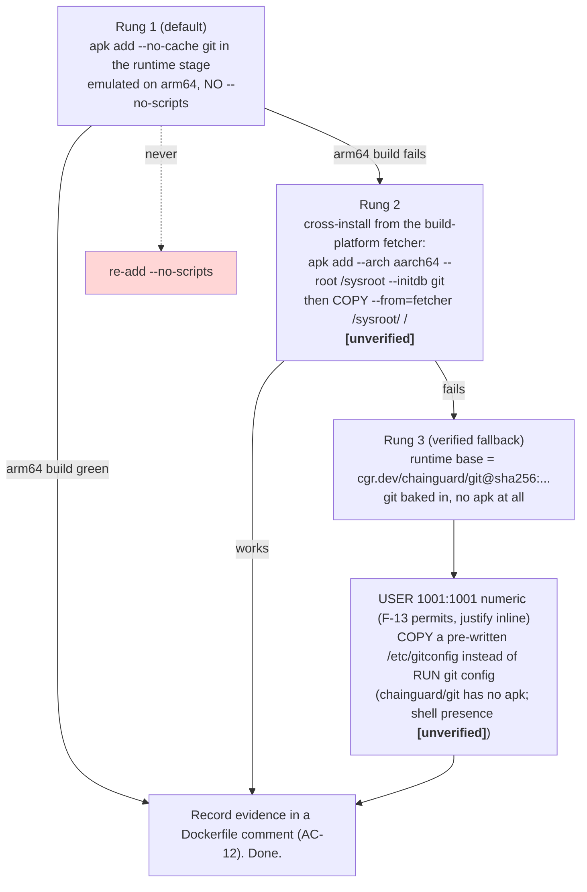
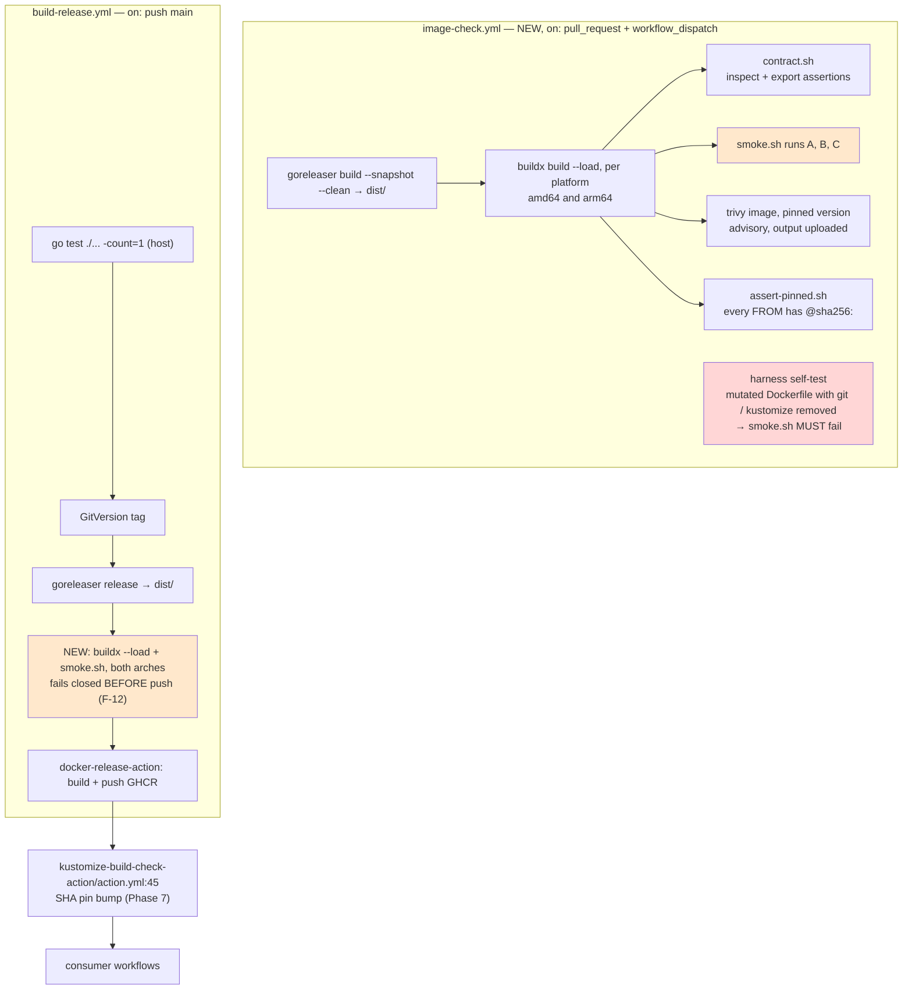

# Plan: Container Hardening (alpine → Wolfi, CVE surface reduction)

Seven phases that build an image-level parity gate **first**, measure the current image through
it, then swap the base, prove parity again on both architectures, wire the gate into the release
path, and finally bump the consumer pin. No Go code is touched at any point.

## Table of Contents

- [Context](#context)
- [Dependencies](#dependencies)
- [Scope](#scope)
- [Design](#design)
- [Acceptance Criteria](#acceptance-criteria)
- [Implementation Phases](#implementation-phases)
- [Test Plan](#test-plan)
- [Implementation Order](#implementation-order)
- [File Reference Summary](#file-reference-summary)
- [Open Questions](#open-questions)

## Context

[`docs/specs/container-hardening.spec.md`](../specs/container-hardening.spec.md) moves the
released image off `alpine:3.23` (`Dockerfile:1`) onto a Wolfi/Chainguard base that still ships
`git`. The decision to target Wolfi rather than full distroless is **closed** — the spec records
the go-git evidence and the verdict (spec §10, "Considered and rejected"), and this plan does not
reopen it. Likewise closed: **helm stays bundled** (OQ-2, repo owner: *"yes bundle helm"*) and the
base is **pinned by digest** (OQ-1, repo owner: *"sha is fine its more secure anyway"*).

### The one risk everything else is sequenced around

`CLAUDE.md` sets the bar: **a false pass is worse than a false fail**. A base-image swap can
produce a false pass in exactly one way — a binary the tool shells out to goes missing or changes
behaviour, the tool degrades, and the check still reports green.

**Nothing in CI can currently catch that.** `go test ./... -count=1` runs on the CI host
(`build-release.yml:47-58`), not inside the image. The integration suite calls the packages
directly (`internal/integration/pipeline_test.go:113-140`) and shells out to whatever `kustomize`
is on the *runner's* PATH (installed at `build-release.yml:46-53`), never to the one baked into
the image. The released artifact has, today, **zero** automated verification of its own contents.

There is a second, related gap found while planning: **this repo has no pull-request CI at all.**
`.github/workflows/` contains exactly one workflow, `build-release.yml`, and it triggers only on
`push: main` and `workflow_dispatch`. So the before/after measurement the spec requires (F-26,
AC-7) has nowhere to run on a PR until this plan creates it.

Therefore Phases 1 and 2 build the image-level smoke test and the scan **against the current
alpine image**, before anything about the base changes. That produces the before-baseline while
the image is known-good, and — via a deliberate self-test (AC-15) — proves the harness fails
closed while a failure is still unambiguous.

### Verified facts carried in from the planning session (do not re-derive)

Every row below was checked live on 2026-08-12. `/implement` should treat them as measurements,
not predictions, and re-verify only the two marked.

| Fact | Consequence for this plan |
|---|---|
| `cgr.dev/chainguard/wolfi-base:latest` is **anonymously pullable**, an OCI index with `linux/amd64` and `linux/arm64` children (index `sha256:30f03343947c7ae3581fda727a6e2aa7b8ce7009b7bfc2ab8d5c9483ace5812f`) | F-03, F-04 satisfied. **Re-resolve the digest at implementation time** — the one shown here is illustrative (spec §10) |
| Historical `wolfi-base` digests still resolve anonymously (HTTP 200) after `latest` moved | F-05 satisfied: an old pin does not rot away. Free tier is sufficient; no entitlement is bought |
| `wolfi-base` ships `apk`, `busybox`, `sh`, `adduser`, `addgroup`, `tar`, `ca-certificates-bundle`, `glibc` | `Dockerfile:15-42` translates almost line for line; F-13/F-14 keep working; F-21 (drop `ca-certificates`) is safe |
| `wolfi-base` ships **no `git`** and **no `wget`** (no busybox applet either) | `git` must be `apk add`-ed (F-07); the two wget downloads must move to a builder stage (F-22) |
| `git 2.55.0-r4` and `wget 1.25.0-r9` exist in the Wolfi apk repo for **both** `x86_64` and `aarch64` | Both arches installable; no arch-specific package gap |
| `cgr.dev/chainguard/git:latest` — both arches, **no `apk`**, `USER 65532` | The verified fallback base if emulated `apk` misbehaves (rung 3 of the ladder below) |
| Wolfi is **glibc**, alpine is **musl**; our binary (`CGO_ENABLED=0`, `.goreleaser.yml:5-9`), kustomize v5.8.1 and helm v4.2.3 are all statically linked (`file`) | NF-05 holds for everything we install by tarball or `COPY`. See the NF-05 correction below |
| Production code spawns exactly two binaries: `git` (`internal/git/git.go:41`) and `kustomize` (`internal/builder/builder.go:78`). `helm` is spawned by kustomize, never by us | The complete inventory of what the swap can break |

**NF-05 needs one correction, recorded here rather than silently assumed.** The spec phrases it as
"safe **only** because every shipped binary is statically linked". That is true of the three
binaries this Dockerfile installs by tarball or `COPY`, and it is what AC-17 asserts. It is *not*
true of `git`, which arrives via `apk` **dynamically linked against the base's own glibc** — and
that is fine, because apk resolves and installs its own dependency closure into the same image.
The invariant this plan enforces is therefore the sharper one: *anything installed by tarball or
`COPY` must be statically linked; anything installed by `apk` is apk's dependency problem and is
proven by running it as UID 1001* (AC-2).

## Dependencies

| Dependency | State | Note |
|---|---|---|
| `docs/specs/container-hardening.spec.md` | Committed on `feat/complete-impact-matching` | Source of truth; this plan adds no requirements of its own beyond the plan-added ACs, which are labelled |
| OQ-1 (base + pin style) | **Resolved** by the repo owner | `cgr.dev/chainguard/wolfi-base`, pinned by digest. Fallback ladder in [ADR-012](../decisions/ADR-012-wolfi-base-and-arm64-package-path.md) |
| OQ-2 (helm) | **Resolved** by the repo owner | Bundled. F-09 and AC-2 stand as written |
| OQ-3 (digest freshness) | **Resolved by this plan** | [ADR-014](../decisions/ADR-014-base-digest-freshness.md): `digestabot` on a weekly schedule. Phase 6 |
| OQ-4 (runner's docker invocation) | **Resolved by this plan, defensively** | Still `[unverified]`. The smoke test sets `-v`, `-w` and `-u` **explicitly** and depends on no image or runner default (Phase 1, AC-4) |
| PR-triggered CI | **Does not exist** | Created by Phase 1 as `.github/workflows/image-check.yml`. Without it there is nowhere to run the before/after scan on a PR |
| `docker buildx` + QEMU (or an arm64 runner) | Required from Phase 1 | `docker/setup-buildx-action` + `docker/setup-qemu-action`. Native `ubuntu-24.04-arm` runners are preferred if this repo qualifies — `[unverified]`, see OQ-6 |
| `goreleaser build --snapshot --clean` | Required from Phase 1 | The image `COPY`s from `dist/` (`Dockerfile:44-47`, F-19); a PR-time build has no release artefacts, so the PR workflow must produce `dist/` itself |
| `michielvha/docker-release-action@main` | Existing, third-party (own) | It builds **and pushes** in one step (`build-release.yml:74-83`). Whether a pre-push hook can be inserted is `[unverified]` — Phase 5 works around it rather than depending on it |
| Trivy (or Grype), pinned version | Required from Phase 2 | Same scanner, same version, same day, both arches, before and after (F-26, AC-7) |
| `kustomize-build-check-action` repo write access | Required by Phase 7 only | `action.yml:45` pin bump (F-28, AC-13) |
| Go source, `go.mod`, `go.sum` | **Untouched** | AC-6 enforces this by diff inspection |

Nothing external blocks the start. Phase 1 can begin immediately and is independent of the
Dockerfile.

## Scope

### In Scope

- `Dockerfile` — full rewrite as two stages: a **build-platform** fetcher and a target-platform
  runtime.
- `.github/workflows/image-check.yml` — **new**. PR-triggered: build both arches, run the
  image-level smoke test, run the scan, lint the digest pin, self-test the harness.
- `.github/workflows/build-release.yml` — insert the pre-push smoke gate (F-12); add
  `tests/e2e/**` to `paths-ignore` so a harness-only change cuts no release.
- `.github/workflows/digestabot.yml` — **new**. Scheduled base-digest bump (F-06, ADR-014).
- `tests/e2e/` — **new**. Fixture generator, smoke runner, container-contract assertions, digest
  pin lint, and a README describing the fixture's plan-neutrality contract.
- `dockerfile.old` — deleted (F-29).
- `TODO.md` — remove the superseded research block at `:8-28`.
- `README.md` — the local-build instructions at `:54-55` become wrong the moment the image needs
  `dist/`; correct them, and document the digest-bump cadence.
- `decisions/ADR-012..014` — base + arm64 package path, tarball integrity, digest freshness.
- `kustomize-build-check-action/action.yml:45` — the consumer pin bump (Phase 7, separate repo).

### Out of Scope

Inherited from spec §9, restated so `/implement` does not have to cross-read:

1. **Any Go code change.** No file under `cmd/` or `internal/`. AC-6 enforces it by diff.
2. Replacing `git` with `go-git`, or a fully distroless image. Rejected with evidence, spec §10.
3. Shallow-clone support — `shallow-clone-support.spec.md`.
4. Build-timeout behaviour — `build-timeout-handling.spec.md`.
5. Impact-matching correctness — `complete-impact-matching.spec.md`.
6. **Changing the kustomize or helm version.** Doing both at once makes an AC-4 parity failure
   ambiguous. `KUSTOMIZE_VERSION=v5.8.1` and `HELM_VERSION=v4.2.3` stay exactly as they are, and
   `KUSTOMIZE_VERSION` stays in sync with `build-release.yml:48` (F-08, F-24).
7. Everything in `build-execution.spec.md` except its F-13 (*"the released image ships kustomize
   v5.8.1 and helm v4.2.3 on `/usr/local/bin`"*) — and only the *how*, never the *what*. Its F-10
   (bare-name `PATH` resolution), F-11 (`--enable-helm` conditional), NF-04 (2-minute kill timer)
   and the whole skip-semantics contract are unaffected and must remain so.
8. Building with `apko`/`melange` instead of a Dockerfile.
9. Cosign-verifying the base in CI (NF-03 makes it optional; the digest pin is not optional).
10. A non-GHCR publishing target.
11. **Making the scan a blocking release gate.** Advisory on this change (F-27); the *recorded
    output* is mandatory.

## Design

### 5.1 What changes, component by component

| Component | Today (`alpine:3.23`) | After | Requirement |
|---|---|---|---|
| Base | `alpine:3.23`, musl, floating tag (`Dockerfile:1`) | `cgr.dev/chainguard/wolfi-base@sha256:…`, glibc, digest-pinned | F-01, F-02 |
| `git` | `apk add --no-scripts git` (`:16`) | `apk add --no-cache git` (`2.55.0-r4`), **no `--no-scripts`** | F-07, F-20 |
| `ca-certificates` | `apk add` + `update-ca-certificates … \|\| true` (`:16-17`) | Already in the base. Step removed, and with it a `\|\| true` that swallowed a real failure | F-21 |
| `wget` | `apk add`, **kept in the final image** (`:16`) | Fetcher stage only; absent from the final image | F-22, NF-01 |
| `kustomize` | Unverified tarball → `/usr/local/bin` (`:21-25`) | Same version, fetched on the **build platform**, SHA256-verified against a pinned constant | F-08, F-22, F-23 |
| `helm` | Unverified tarball (`:29-34`) | Same, same treatment. Stays bundled (OQ-2) | F-09, F-23 |
| Tool binary | `COPY dist/…` → `/usr/local/bin/${IMAGE_NAME}` (`:47`) | Same source, destination `/usr/local/bin/entrypoint` (name-agnostic) | F-16, F-19 |
| Ownership | `chown ${IMAGE_NAME}` on the binary (`:50-51`) | Root-owned `0755`. The runtime user must not be able to rewrite its own binary | NF-02 |
| User | `addgroup`/`adduser` UID 1001 (`:36-38`) | `addgroup -g 1001 app` / `adduser -D -u 1001 -G app app`, `USER 1001:1001` | F-13 |
| git config | `git config --system --add safe.directory '*'` (`:42`) | Unchanged | F-14 |
| `ENV IMAGE_NAME` | Set at `:11` | **Dropped**. Nothing reads it (spec F-15 evidence: the only env reads are `INPUT_*`, `GITHUB_OUTPUT`, `GITHUB_STEP_SUMMARY`, `LOG_LEVEL`) | F-18 |
| `ARG IMAGE_NAME` | `:5` | **Retained** — the `COPY` source path needs it, and `docker-release-action` supplies it as `project` (`build-release.yml:80`) | F-17 |
| `ENTRYPOINT` | `["/bin/sh","-c","/usr/local/bin/${IMAGE_NAME}"]` (`:58`) | `["/usr/local/bin/entrypoint"]` | F-15, F-16 |

### 5.2 The `${IMAGE_NAME}` knot, and how F-16 unties it

The `/bin/sh -c` wrapper exists for exactly one reason: exec-form `ENTRYPOINT` does not expand
variables, and the binary's path contains `${IMAGE_NAME}`. There are three ways out and only one
is legal here:

| Option | Verdict |
|---|---|
| Hardcode `["/usr/local/bin/kustomize-build-check"]` | **Forbidden.** `CLAUDE.md`: "Nothing hardcodes the image name or the consumer repo" |
| Keep the shell | Fails F-15 |
| `COPY` to a **name-agnostic** destination and reference that | **Chosen** (F-16). `ARG IMAGE_NAME` still parameterises the `COPY` *source* (F-17); the destination is a constant the entrypoint can name literally |

`/usr/local/bin/entrypoint` is not a binding — it is a path this Dockerfile invents and this
Dockerfile alone consumes. Nothing in the Go code reads `argv[0]` or the binary filename
(verified: grep of `cmd/` and `internal/`).

### 5.3 The arm64 package path — an explicit position on `--no-scripts` (F-20)

`Dockerfile:14` carries `--no-scripts` with the comment *"avoid trigger errors with QEMU
emulation on ARM64 (Alpine 3.23 issue)"*. Skipping package triggers is itself a correctness risk,
so the plan's position is: **`--no-scripts` is not carried forward, under any outcome.** If the
emulated path misbehaves, the fix is to get off the emulated path, not to disable triggers.

The two-stage design already removes most of the exposure. The fetcher stage is declared
`FROM --platform=$BUILDPLATFORM`, so the wget/tar/sha256sum work runs **natively on amd64** even
when the target is arm64 — it only *downloads and unpacks* arch-specific binaries, it never
executes them. That leaves exactly one emulated operation: `apk add --no-cache git` in the runtime
stage.

Ladder, tried in order, decided by a **real arm64 build** in Phase 4 and recorded in a Dockerfile
comment (AC-12):



<details><summary>Legend and rationale</summary>

- **Rung 1** is the default because it is the smallest edit and Wolfi's apk-tools is a different
  version from Alpine 3.23's; the defect may simply not recur. It must be *built*, not assumed.
- **Rung 2** removes every emulated instruction. `apk --arch/--root/--initdb` is a documented
  apk-tools capability but has **not** been exercised in this session — `[unverified]`.
- **Rung 3** is fully verified (both arches, free tier, `USER 65532`, no `apk`) and needs two
  compensating changes: numeric `USER 1001:1001` (F-13 explicitly permits this with an inline
  justification), and a `COPY`-ed `/etc/gitconfig` containing `[safe]\n\tdirectory = *` in place of
  `RUN git config --system` — which also removes the dependency on the base having a shell.
- **Red** is the one thing the plan forbids: reinstating `--no-scripts`.

</details>

### 5.4 Target Dockerfile shape

Illustrative, not literal — the digests and checksums are resolved during Phase 3.

```dockerfile
# syntax=docker/dockerfile:1
ARG BASE_IMAGE=cgr.dev/chainguard/wolfi-base
ARG BASE_DIGEST=sha256:<resolved at implementation time>

# ---- fetcher: runs natively on the BUILD platform, never executes what it downloads ----
FROM --platform=$BUILDPLATFORM ${BASE_IMAGE}@${BASE_DIGEST} AS fetcher
ARG TARGETARCH
ARG KUSTOMIZE_VERSION=v5.8.1
ARG HELM_VERSION=v4.2.3
ARG KUSTOMIZE_SHA256_AMD64= KUSTOMIZE_SHA256_ARM64=
ARG HELM_SHA256_AMD64=      HELM_SHA256_ARM64=
RUN apk add --no-cache wget
RUN <download, `sha256sum -c` against the pinned constant for $TARGETARCH, extract to /out>

# ---- runtime ----
FROM ${BASE_IMAGE}@${BASE_DIGEST}
ARG IMAGE_NAME
ARG TARGETARCH
ARG TARGETOS
# --no-scripts is deliberately NOT carried forward. Evidence: <arm64 build link>  (AC-12, F-20)
RUN apk add --no-cache git
RUN addgroup -g 1001 app && adduser -D -u 1001 -G app app
RUN git config --system --add safe.directory '*'
COPY --from=fetcher /out/kustomize /out/helm /usr/local/bin/
COPY dist/${IMAGE_NAME}_${TARGETOS}_${TARGETARCH}*/${IMAGE_NAME} /usr/local/bin/entrypoint
RUN chmod 0755 /usr/local/bin/entrypoint /usr/local/bin/kustomize /usr/local/bin/helm
USER 1001:1001
WORKDIR /home/app
ENTRYPOINT ["/usr/local/bin/entrypoint"]
```

Integrity of the two tarballs is by **pinned SHA256 constants**, one per arch per tool, not by a
checksum file fetched over the same channel as the tarball —
[ADR-013](../decisions/ADR-013-tarball-integrity.md).

### 5.5 The smoke test — the only thing standing between a degraded runtime and a green check

`tests/e2e/smoke.sh <image-ref> <platform>` runs the **real entrypoint** of the **built image**
against a generated fixture git repository.

**OQ-4 is resolved defensively.** The exact `docker run` the Actions runner synthesises for a
`runs: using: docker` action is `[unverified]`. Rather than mirror an unverified default, the
smoke test states everything it needs:

```bash
docker run --rm \
  --platform "${PLATFORM}" \
  -u 1001:1001 \
  -v "${FIXTURE}:/github/workspace" \
  -v "${OUTDIR}:/out" \
  -w /github/workspace \
  -e "INPUT_BASE-REF=${BASE_SHA}" \
  -e "INPUT_ENABLE-HELM=false" \
  -e "INPUT_FAIL-ON-ERROR=true" \
  -e "GITHUB_OUTPUT=/out/github_output" \
  -e "GITHUB_STEP_SUMMARY=/out/step_summary.md" \
  "${IMAGE_REF}"
```

`GITHUB_OUTPUT` and `GITHUB_STEP_SUMMARY` are directed at a **separate** writable mount, so the
fixture's git state is never mutated by the run and a second invocation is reproducible.

Three invocations, three different things proven:

| Run | Inputs | Asserts | Catches |
|---|---|---|---|
| **A — parity** | `INPUT_BASE-REF=$BASE_SHA` | exit `0`; stdout contains exactly `Summary: 3 total, 2 successful, 0 failed, 1 skipped`; `/out/github_output` contains `success-count=2`, `failed-count=0`, `skipped-count=1`; `/out/step_summary.md` non-empty | A missing/degraded `kustomize` (every path fails → counts differ); a missing `git` (exit 1 at `main.go:34-37`); a broken skip guard (skipped count moves) |
| **B — the diff is real** | `INPUT_BASE-REF=$HEAD_SHA` (base == head) | exit `0`; stdout contains `Found 0 changed files` and `No kustomizations affected by changes`; **must not** contain the run-A `Summary:` line | A `git` that silently returns a constant, and a run that never consulted git at all |
| **C — helm is really there** | `--entrypoint helm … version` (and `kustomize version`, `git --version`) as UID 1001 | each exits `0`; `kustomize` reports `v5.8.1`, `helm` reports `v4.2.3` | A binary that is present but not executable by UID 1001, or the wrong version (F-10 says *run* them, don't `ls` them) |

The expected numbers in run A are **not** copied from this plan into the script as magic
constants: Phase 1 captures them from the **current alpine image** and commits them as the
baseline (`tests/e2e/expected.env`). Phase 4 asserts the Wolfi image reproduces the same file
byte-for-byte. That is what makes AC-4 a genuine before/after comparison rather than a restatement
of the plan's own guess.

### 5.6 The fixture, and why its counts are plan-neutral

`tests/e2e/make-fixture.sh` builds a throwaway git repo in `$(mktemp -d)`:

```
commit 1 (recorded as BASE_SHA)
  apps/base/kustomization.yaml       resources: [deployment.yaml]
  apps/base/deployment.yaml
  apps/overlay/kustomization.yaml    resources: [../base]
  apps/obsolete/kustomization.yaml   resources: [cm.yaml]      <- referenced by NOTHING
  apps/obsolete/cm.yaml

commit 2 (HEAD)
  M apps/base/deployment.yaml        -> base affected, overlay affected via the graph
  D apps/obsolete/                   -> its kustomization.yaml is in the diff, so the analyzer
                                        adds the dir; the builder then skips it (removed)
```

Expected: `3 total, 2 successful, 0 failed, 1 skipped`, exit 0.

The fixture **must include a deleted directory** — the spec is explicit that the skip path is the
one place where a degraded `git` changes the counts instead of crashing (`internal/git/git.go:31-37`,
`internal/builder/builder.go:52-55`).

**The plan-neutrality contract**, and it is load-bearing for the cross-plan story:

| Constraint on the fixture | Why |
|---|---|
| Uses **only** `resources`, no `patches`/generators/`helmCharts` | `complete-impact-matching` Phase 4 widens the parsed reference surfaces; a fixture that used them would change counts under that plan |
| No cross-directory *file* reference (`../shared/x.yaml`) | `complete-impact-matching` Phase 1 removes the containment guard; such a reference would newly match |
| The deleted directory is referenced by **nothing** | This is the critical one. `complete-impact-matching` closes **G5**, where a deleted base that a surviving overlay still references flips from `failed=0, skipped=1, exit 0` to `failed=1, skipped=1, exit≠0`. An *unreferenced* deleted directory is stable under that change |
| No malformed YAML | `complete-impact-matching` Phase 3 makes an unparseable kustomization build rather than vanish |
| Full clone, explicit `INPUT_BASE-REF` | Insulates the fixture from `shallow-clone-support`'s default-base-ref work |
| Builds complete in milliseconds | Insulates it from `build-timeout-handling` |

Anything that changes `tests/e2e/expected.env` is, by construction, a **behaviour change** and
must be justified in the plan that causes it. `tests/e2e/README.md` states this contract so a
future implementer does not "fix" the fixture by editing the expected numbers.

### 5.7 CI topology



<details><summary>Legend</summary>

- **Orange** — the image-level E2E gate this plan creates. It is the only thing in CI that runs
  the binary inside the image.
- **Red** — the harness self-test (AC-15). It deliberately breaks the image and requires the smoke
  test to notice. Without it, a smoke test that silently passed everything would be indistinguishable
  from a working one.
- `docker-release-action` builds **and** pushes in one step, and whether it exposes a pre-push hook
  is `[unverified]`. Step R4 therefore does its own `buildx --load` build first and hands the
  already-warm layer cache to R5, rather than trying to hook into the action.

</details>

## Acceptance Criteria

AC-1…AC-14 are the spec's own (§7), carried over by ID and tightened into a concrete,
docker- or CI-observable command. AC-15…AC-21 are added by this plan and labelled.

**Container contract**

- [ ] **AC-1:** `docker inspect --format '{{json .Config.Entrypoint}}' <new image>` returns a
      **single-element** array containing neither `/bin/sh` nor `-c`, and
      `{{.Config.User}}` resolves to UID `1001`. (F-13, F-15)
- [ ] **AC-1b (F-16, plan-added):** The single entrypoint element does **not** contain the
      workload name. Asserted mechanically:
      `docker inspect --format '{{index .Config.Entrypoint 0}}'` must not contain the value of
      `vega.yaml`'s `repo.workload_name`, and `grep -c 'ENTRYPOINT.*kustomize-build-check'
      Dockerfile` must return `0`. Run as a required step in `image-check.yml`.
      *F-16 is P0 and had no criterion at all. `ENTRYPOINT ["/usr/local/bin/kustomize-build-check"]`
      satisfies AC-1 while violating F-16 and `CLAUDE.md`'s "nothing hardcodes the image name".*
- [ ] **AC-1c (F-01/F-04/F-19, plan-added):** The built image's base is the digest-pinned Wolfi
      image (`grep -E '^FROM cgr\.dev/chainguard/wolfi-base@sha256:' Dockerfile` returns 1), the
      build succeeds from a registry-anonymous environment (no `docker login` to `cgr.dev`), and a
      `docker export | tar -t` listing contains **no** Go toolchain (`go`, `gofmt`).
      *F-01, F-04 and F-19 are all P0 and were all uncovered: every other AC would pass on an
      alpine image that happened to be digest-pinned.*
- [ ] **AC-2:** With `-u 1001:1001` and `--entrypoint` set to each binary in turn,
      `git --version`, `kustomize version` and `helm version` each exit `0`; `kustomize version`
      output contains `v5.8.1` and `helm version` output contains `v4.2.3`. (F-07…F-10)
- [ ] **AC-3:** `--entrypoint git … config --system --get-all safe.directory` exits `0` and its
      output includes the line `*`. (F-14)
- [ ] **AC-10:** `docker create` + `docker export | tar -t` on the final image lists **no**
      `usr/bin/wget`, no `bin/wget`, and no non-empty `var/cache/apk/` entry. (Deliberately
      shell-free, so it also holds if the fallback base ships no shell.) (F-22, NF-01)
- [ ] **AC-17 (plan-added):** From the same `docker export`, `file` on the extracted
      `usr/local/bin/entrypoint`, `usr/local/bin/kustomize` and `usr/local/bin/helm` reports
      `statically linked` for all three. `git` is exempt and is instead proven by AC-2. (NF-05, as
      corrected in [Context](#context))

**Behaviour parity — the false-pass guard**

- [ ] **AC-4:** `tests/e2e/smoke.sh` runs A, B and C pass on `linux/amd64` **and** `linux/arm64`,
      with `-v`, `-w` and `-u` set explicitly and no reliance on image or runner defaults. (F-11,
      F-25, OQ-4)
- [ ] **AC-16 (plan-added):** The `Summary:` line, the three `*-count` values and the exit code
      produced by the **new** image are byte-identical to those recorded from the **current
      alpine** image in `tests/e2e/expected.env` during Phase 1, on both arches. Any diff fails
      the job. (F-11, AC-4's before/after half)
- [ ] **AC-15 (plan-added):** A `harness-selftest` job builds two mutated images — one with the
      `git` install line removed, one with the `kustomize` `COPY` removed — and **requires
      `smoke.sh` to fail** on each. If either mutant passes, the job fails. (F-12, and the only
      proof the harness is not vacuous)
- [ ] **AC-11:** The **release** workflow fails, with **no push**, when the built image lacks
      `git`, `kustomize` or `helm` — the same `smoke.sh` runs before `docker-release-action`.
      Demonstrated once via the AC-15 mutants. (F-12)
- [ ] **AC-5:** `go test ./... -count=1` passes with **zero** `_test.go` files in this change's
      diff (`git diff --name-only main...HEAD | grep -c '_test\.go$'` returns `0`). (F-11)
- [ ] **AC-6:** `git diff --name-only main...HEAD` contains **no** `.go` path, and
      `git diff --stat main...HEAD -- go.mod go.sum` is empty. (NF-07)

**Base, build and pin**

- [ ] **AC-8:** `tests/e2e/assert-pinned.sh` exits non-zero if any `FROM` line in `Dockerfile`
      lacks `@sha256:<64 hex>`; it runs as a required step in `image-check.yml`. (F-02)
- [ ] **AC-9:** `docker buildx imagetools inspect` (or `docker manifest inspect`) of the pushed
      image lists exactly `linux/amd64` and `linux/arm64`. (F-03, `build-release.yml:82`)
- [ ] **AC-12:** `Dockerfile` carries a comment stating which rung of the §5.3 ladder was used and
      linking the **actual arm64 build run** that settled it. The string `--no-scripts` does not
      appear in `Dockerfile`. (F-20)
- [ ] **AC-14:** Each tarball is verified with `sha256sum -c` against a pinned per-arch constant
      declared as a build `ARG`; removing or corrupting a constant fails the build. Demonstrated
      once by corrupting one constant in a scratch build. (F-23)
- [ ] **AC-21 (plan-added):** `.github/workflows/digestabot.yml` exists, is on a `schedule`, and
      one `workflow_dispatch` run completes with either "no update available" or an opened PR.
      `README.md` documents the cadence and what to do when the bot opens a PR. (F-06, OQ-3)

**Measurement — nothing here may be asserted from memory**

- [ ] **AC-7:** The PR body contains scanner output for the **old** and the **new** image, for
      **both** architectures, produced by the **same scanner at the same pinned version on the
      same day**, showing total findings and the HIGH/CRITICAL breakdown. The new image has
      **strictly fewer** total findings and introduces **no new** HIGH or CRITICAL. The raw JSON
      is attached as a workflow artifact. **No CVE count appears anywhere in this plan, because
      none has been measured.** (F-26, §2)
- [ ] **AC-18 (plan-added):** Compressed image size (`docker save | gzip -c | wc -c`, labelled as
      a proxy for registry-compressed size) is recorded for old and new, both arches, alongside
      the scan. An increase greater than 10% requires a written justification in the same PR body.
      (NF-06)

**Release and rollback**

- [ ] **AC-13:** `kustomize-build-check-action/action.yml:45` is bumped to the new image SHA, and
      **one real PR run** against the wrapper reports the same result — same counts, same exit
      code — as the run immediately before the bump, evidenced by both run URLs. (F-28)
- [ ] **AC-20 (plan-added):** Each phase lands as **exactly one commit** (Phase 3's work packages
      excepted and named), so `git log --oneline` shows a one-to-one phase→commit mapping and
      `git revert <sha>` is a complete rollback of that phase. Verified by inspecting the branch
      log before merge. (Plan-added; rollback is the highest-stakes property here because a bad
      image reaches every downstream repo through the wrapper's SHA pin)
- [ ] **AC-19 (plan-added):** `build-release.yml` lists `tests/e2e/**` under `paths-ignore`, so a
      harness-only change does not cut a release or publish an image. (Found while planning:
      without it, a CI-only PR triggers the release path)

## Implementation Phases

### Phase 1: Image-level verification harness, against the CURRENT alpine image

**Priority: HIGH** — this is the whole plan's safety net, and it is worth building even if the
base swap were abandoned tomorrow. Built first so that any failure is unambiguously the harness's
fault, not the base's.

**Goal**: CI can build the image, run the real binary inside it against a fixture repository, and
fail closed when a runtime binary is missing — all while the image is still `alpine:3.23`.

**Tasks**:
- [ ] `tests/e2e/make-fixture.sh` — generate the §5.6 repo in `$(mktemp -d)`, two commits, print
      `BASE_SHA` and `HEAD_SHA`. `chmod 0777` the fixture and the out dir so UID 1001 can work in
      them regardless of the host user.
- [ ] `tests/e2e/README.md` — write the **plan-neutrality contract** (§5.6 table) in full, with
      the explicit warning that changing `expected.env` means a behaviour change and must be
      justified in the plan that causes it.
- [ ] `tests/e2e/smoke.sh <image-ref> <platform>` — runs A, B and C exactly as §5.5 specifies,
      with `-v`, `-w`, `-u` explicit (OQ-4). Reads expectations from `tests/e2e/expected.env`;
      supports `--capture` to *write* that file instead of asserting it.
- [ ] `tests/e2e/contract.sh <image-ref>` — the `docker inspect` and `docker export | tar -t`
      assertions (AC-1, AC-3, AC-10, AC-17). Against the current image, AC-1 and AC-10 are
      **expected to fail** — record them as known-red with `EXPECT_FAIL` markers so the alpine
      baseline is honest, and Phase 3 flips them to required.
- [ ] `tests/e2e/assert-pinned.sh` (AC-8). Also known-red on alpine; wire it as advisory now,
      required from Phase 3.
- [ ] `.github/workflows/image-check.yml` — `on: pull_request`. **Do NOT add a `paths:` filter.**
      An earlier draft filtered to `Dockerfile`, `tests/e2e/**`, `.github/workflows/image-check.yml`
      and `.goreleaser.yml`, which would mean the gate **never fires on the three behavioural
      plans' PRs** — they touch none of those paths — directly contradicting the stated reason for
      pulling Phases 1-2 forward (to give those plans a pull-request-time gate). The goreleaser +
      buildx cost on every PR is the price of the gate actually existing; if that cost proves too
      high, drop the pull-forward rationale rather than the trigger. Plus
      `workflow_dispatch`. Steps: checkout (`fetch-depth: 0`), setup-go, setup-qemu, setup-buildx,
      `goreleaser build --snapshot --clean`, then per platform `docker buildx build --load
      --platform <p> --build-arg IMAGE_NAME=<from vega.yaml, not hardcoded in the script>`,
      then `contract.sh` + `smoke.sh`.
- [ ] Prefer native `ubuntu-24.04-arm` runners over QEMU for the arm64 leg if this repo qualifies;
      fall back to QEMU. Record which was used. `[unverified]` — see OQ-6.
- [ ] `harness-selftest` job (**AC-15**): `sed` the `git` install line out of a copy of the
      Dockerfile, build, run `smoke.sh`, assert it **fails**; repeat with the `kustomize` install
      removed. A mutant that passes fails the job.
- [ ] Add `tests/e2e/**` to `build-release.yml`'s `paths-ignore` (**AC-19**).
- [ ] Run the workflow on the branch via `workflow_dispatch` and confirm green on both arches
      (with the two known-red contract assertions marked).

**Depends on**: None.

**Rollback**: one commit, `git revert <phase-1-sha>`. It removes `tests/e2e/**`,
`image-check.yml` and one `paths-ignore` line. **Zero runtime blast radius** — no published
artifact changes, because the Dockerfile is untouched.

---

### Phase 2: Capture the before-baseline (parity numbers + CVE scan + size)

**Priority: HIGH** — the spec's success metric is a *measurement*, and a measurement taken after
the swap is not a baseline.

**Goal**: the current `alpine:3.23` image's parity numbers, CVE findings and size are recorded,
on both arches, with the scanner name and version pinned.

**Tasks**:
- [ ] Run `smoke.sh --capture` against the current image on both arches; commit the result as
      `tests/e2e/expected.env`. Confirm both arches produce the **same** numbers before committing
      them — if they differ, stop, that is a pre-existing bug and this plan is not the place to
      fix it.
- [ ] Add the scan step to `image-check.yml`: Trivy at a **pinned version**, `--format json` plus a
      table, per platform, `continue-on-error: true` (advisory, F-27), output uploaded as a
      workflow artifact. Record the exact scanner version string in the artifact.
- [ ] Add the size step: `docker save <ref> | gzip -c | wc -c`, per platform, labelled in the
      output as a proxy for registry-compressed size (**AC-18**).
- [ ] Run it, download the artifacts, and paste the **before** table into the PR body under a
      heading that Phase 4 will complete. Record the date; the after-scan must be the same day
      (AC-7).
- [ ] Record the same numbers in `docs/summaries/container-hardening.md` when `/implement` writes its
      summary, so the measurement outlives the PR's artifact retention.

**Depends on**: Phase 1.

**Rollback**: one commit, `git revert <phase-2-sha>` — removes `expected.env` and the scan/size
steps. Still zero runtime blast radius.

---

### Phase 3: Rewrite the Dockerfile — two stages, Wolfi base, digest-pinned

**Priority: HIGH** — the change itself. Everything before it exists to make this safe; everything
after it exists to prove it and ship it.

**Goal**: a two-stage Dockerfile on a digest-pinned Wolfi base that satisfies F-01…F-24, with no
shell in the entrypoint, no `wget` in the final image, no `--no-scripts`, and checksum-verified
tarballs.

Lands as **three commits** so rollback stays granular (the one exception to AC-20, named here).

**Tasks — 3.1, the fetcher stage**:
- [ ] Resolve `cgr.dev/chainguard/wolfi-base:latest` to a digest **today** and pin it; record the
      resolution date in a comment. Do not reuse the illustrative digest from the spec.
- [ ] `FROM --platform=$BUILDPLATFORM …  AS fetcher` — this is what keeps the download work off
      the emulated path (§5.3).
- [ ] `apk add --no-cache wget` (`1.25.0-r9`, both arches verified) in the **fetcher only**.
- [ ] Fetch the kustomize and helm tarballs for `$TARGETARCH`, verify with `sha256sum -c` against
      pinned per-arch `ARG` constants, extract to `/out` (**AC-14**,
      [ADR-013](../decisions/ADR-013-tarball-integrity.md)). Obtain the four constants from the
      upstream published checksums and record where each came from, in a comment.
- [ ] Keep `KUSTOMIZE_VERSION=v5.8.1` and `HELM_VERSION=v4.2.3` as `ARG`s with the same names and
      defaults (F-24). Confirm `KUSTOMIZE_VERSION` still matches `build-release.yml:48`.

**Tasks — 3.2, the runtime stage**:
- [ ] Same digest-pinned base, target platform. `apk add --no-cache git`, **without**
      `--no-scripts` (F-20).
- [ ] Drop `apk add ca-certificates` and `update-ca-certificates … || true` — the base ships
      `ca-certificates-bundle` and `/etc/ssl/certs/ca-certificates.crt`, and the `|| true` was
      swallowing a real failure (F-21).
- [ ] `addgroup -g 1001 app && adduser -D -u 1001 -G app app`; `USER 1001:1001` (F-13).
- [ ] `git config --system --add safe.directory '*'` as root, **before** the `USER` switch (F-14).
- [ ] `COPY --from=fetcher /out/kustomize /out/helm /usr/local/bin/`.
- [ ] `COPY dist/${IMAGE_NAME}_${TARGETOS}_${TARGETARCH}*/${IMAGE_NAME} /usr/local/bin/entrypoint`
      — keep `ARG IMAGE_NAME` for the source glob (F-17), name-agnostic destination (F-16). Keep
      the glob: goreleaser emits `_linux_amd64_v1` and `_linux_arm64…` variants.
- [ ] `chmod 0755` all three, **root-owned** — drop the `chown` to the runtime user (NF-02).
- [ ] Drop `ENV IMAGE_NAME` (F-18).
- [ ] `ENTRYPOINT ["/usr/local/bin/entrypoint"]`, exec form, one element (F-15).

**Tasks — 3.3, flip the harness assertions to required**:
- [ ] Remove the `EXPECT_FAIL` markers from `contract.sh` (AC-1, AC-10, AC-17) and make
      `assert-pinned.sh` a required step (AC-8).
- [ ] Fix `README.md:54-55` — `docker build -f Dockerfile -t kustomize-build-check:dev .` cannot
      work against the new (or the current) Dockerfile without `dist/`; document
      `goreleaser build --snapshot --clean` first.

**Depends on**: Phases 1 and 2 (the baseline must exist before the thing it baselines changes).

**Rollback**: three commits, revert newest-first — `git revert <3.3-sha>` re-softens the harness;
`git revert <3.2-sha>` returns the runtime stage; `git revert <3.1-sha>` returns to the
single-stage alpine build and must be last. Reverting 3.1 or 3.2 alone leaves a Dockerfile that
does not build, so **revert the whole phase or none of it**. Blast radius: the published image.

---

### Phase 4: Build both architectures for real, settle F-20, re-measure

**Priority: HIGH** — the highest-variance step in the plan. Everything here is a measurement.

**Goal**: the new image builds on both arches, reproduces the Phase 2 baseline exactly, and the
after-scan is recorded next to the before-scan.

**Tasks**:
- [ ] Build `linux/amd64` and `linux/arm64`. If arm64 fails, walk the §5.3 ladder in order.
      **Never** re-add `--no-scripts`.
- [ ] Record the outcome in a Dockerfile comment with a link to the actual arm64 build run
      (**AC-12**). If rung 3 was needed, also record the numeric-`USER` justification (F-13) and
      the `COPY`-ed `/etc/gitconfig` substitution for `RUN git config --system`.
- [ ] Run `smoke.sh` (A, B, C) on both arches and assert **byte-identical** output against
      `tests/e2e/expected.env` (**AC-4**, **AC-16**). A diff here is a hard stop, not something to
      reconcile by editing `expected.env`.
- [ ] Run `contract.sh` on both arches — now required (**AC-1**, **AC-3**, **AC-10**, **AC-17**).
- [ ] Re-run the `harness-selftest` mutants against the **new** Dockerfile (**AC-15**): mutate the
      `apk add git` line and the `COPY --from=fetcher` line; both mutants must fail the smoke test.
- [ ] Corrupt one SHA256 constant in a scratch build and confirm the build fails (**AC-14**).
- [ ] Run the scan and the size measurement, same scanner, same pinned version, **same day** as the
      Phase 2 baseline if possible; if not, re-run the before-scan on the same day so the pair is
      comparable (**AC-7**, **AC-18**).
- [ ] Complete the before/after table in the PR body: total findings, HIGH/CRITICAL breakdown,
      compressed size, per arch. Attach the raw JSON as artifacts.
- [ ] Confirm `go test ./... -count=1` still passes and that the diff touches no `.go` file and no
      `go.mod`/`go.sum` (**AC-5**, **AC-6**).

**Depends on**: Phase 3.

**Rollback**: one commit, `git revert <phase-4-sha>` — it removes only the Dockerfile evidence
comment and any workflow tweak the arm64 outcome forced. If the *image itself* must be rolled
back, that is Phase 3's revert, not this one.

---

### Phase 5: Make the release path fail closed (F-12)

**Priority: HIGH** — a green PR check is not a gate. Without this, a future change can still push
a broken image.

**Goal**: `build-release.yml` cannot push an image that fails the smoke test.

**Tasks**:
- [ ] Insert, between the GoReleaser step (`build-release.yml:67-71`) and the push step
      (`:75-84`): setup-qemu/buildx, `docker buildx build --load` per platform from the **same**
      `dist/` GoReleaser just produced, then `contract.sh` and `smoke.sh` on both. Any failure
      fails the job **before** `docker-release-action` runs (**AC-11**).
- [ ] Do **not** attempt to hook into `docker-release-action`; whether it exposes a pre-push hook
      is `[unverified]`. The local `--load` build warms the buildx cache that the push step then
      reuses, so the cost is roughly one extra build, not two.
- [ ] Add a post-push assertion that the pushed manifest lists exactly `linux/amd64` and
      `linux/arm64` (**AC-9**) — this one can only run after push, and is a loud failure rather
      than a gate.
- [ ] **Flag explicitly**: this phase cannot be fully validated before merge, because
      `build-release.yml` only runs on `push: main` and dispatching it from the branch would tag
      and release. Mitigation: the inserted steps are byte-identical to the ones `image-check.yml`
      already proved on this branch, extracted into a single shared script so the two cannot drift.
      Record this as accepted residual risk in the PR body.

**Depends on**: Phase 4 (there is no point gating the release path on a smoke test that has not
yet been proven against the new image).

**Rollback**: one commit, `git revert <phase-5-sha>` — the release path returns to build-and-push
with no gate. Note the asymmetry: reverting this phase makes releases *less* safe but cannot break
an existing image.

---

### Phase 6: Digest freshness and housekeeping

**Priority: MEDIUM** — but not optional. A digest pin that is never bumped silently re-accumulates
exactly the CVEs this plan exists to remove (spec OQ-1's own warning). The mechanism is
load-bearing precisely *because* the pin never floats.

**Goal**: the base digest has a named owner and an automated nudge, and the stale prior art is gone.

**Tasks**:
- [ ] Add `.github/workflows/digestabot.yml` — Chainguard's `digestabot`, weekly `schedule` plus
      `workflow_dispatch`, opening a PR that bumps `BASE_DIGEST`
      ([ADR-014](../decisions/ADR-014-base-digest-freshness.md)) (**AC-21**).
- [ ] Dispatch it once on the branch and confirm it reports "no update" (the pin is same-day fresh)
      or opens a PR.
- [ ] Document in `README.md`: the pin is deliberate, the bot bumps it weekly, a bump PR is
      merged once `image-check.yml` is green, and an unbumped pin is a security regression.
- [ ] Delete `dockerfile.old` (F-29) — Go 1.25 builder stage, kustomize `v5.3.0`, helm `v3.16.2`,
      amd64-only, root user. After Phase 3 it is not merely stale, it is actively misleading.
- [ ] Remove the superseded research block at `TODO.md:8-28`; leave the first bullet (the
      auto-SHA-bump idea), which Phase 7 turns into an open question.

**Depends on**: Phase 3 (there is no digest to bump before it exists).

**Rollback**: one commit, `git revert <phase-6-sha>` — restores `dockerfile.old` and the TODO
block and removes the bot. Reverting reopens the "pin rots" risk; do not revert this phase without
recording a manual cadence in its place.

---

### Phase 7: Release, then bump the consumer pin

**Priority: HIGH** — until this lands, nothing has actually shipped. A green image build is not a
delivered change.

**Goal**: the new image is published and the wrapper action points at it, with one real PR run
proving the wrapper still reports what it reported before.

**Tasks**:
- [ ] Capture a "before" wrapper run: trigger the wrapper action on a real PR **against the
      currently pinned SHA** (`action.yml:45` — read it at execution time; do **not** rely on the
      value recorded here, since every earlier plan bumps this pin and this plan lands last) and
      record its counts, exit code and run URL.
- [ ] Merge this PR to `main`. GitVersion bumps per `gitversion.yml` (`feat:`/`fix:` etc.), the
      release workflow runs, the Phase 5 gate runs, the image is pushed with the commit SHA and
      the semver.
- [ ] Confirm the pushed manifest is a two-entry manifest list (**AC-9**).
- [ ] Bump `kustomize-build-check-action/action.yml:45` to the new commit SHA (**AC-13**).
- [ ] Re-run the same real PR against the bumped wrapper. Assert **identical** counts and exit
      code; record both run URLs side by side.
- [ ] If they differ: revert the wrapper pin **first** (a one-line revert in the action repo,
      instantly effective for every consumer), then triage. Do not revert the image.

**Depends on**: Phases 3, 4, 5 (the image), Phase 6 (housekeeping, so the release does not carry
`dockerfile.old` forward).

**Rollback**: two-level, and the levels are not equal.
- **Fast path (seconds, use this first):** revert the one-line pin bump in
  `kustomize-build-check-action/action.yml:45` back to
  `5f8b73cd346d12ddaaadba073391bf73864e6073`. Every downstream consumer is restored immediately,
  because they all resolve through that pin. **This is the real rollback for this plan.**
- **Slow path (a full release cycle):** `git revert` Phases 3 and 4 on `main` and let the release
  workflow publish an alpine-based image again. Only needed if the image must be withdrawn rather
  than merely un-consumed.

## Test Plan

This repo has no UI and no HTTP surface. Its **user-facing artifact is the container image**, and
the wrapper action's only interface to it is `docker run`. The E2E layer for this plan is
therefore `tests/e2e/smoke.sh` — a black-box run of the **real entrypoint** in the **built image**
against a fixture git repository, asserting counts and exit code. Every phase from 1 onward has at
least one E2E row.

Every script added by this plan carries a traceability comment on its first line so criteria are
greppable:

```bash
# Verifies: Container Hardening, Criterion: "<exact criterion text from this plan>"
```

| Criterion | Test Type | Test Location |
|---|---|---|
| AC-1: single-element exec-form entrypoint, user 1001 | Container contract | `tests/e2e/contract.sh` — `docker inspect` |
| AC-2: git/kustomize/helm run as UID 1001 at pinned versions | **E2E** | `tests/e2e/smoke.sh` — run C |
| AC-3: `safe.directory` includes `*` | Container contract | `tests/e2e/contract.sh` — `--entrypoint git … config --system --get-all` |
| AC-4: smoke A+B+C pass on amd64 and arm64, `-v`/`-w`/`-u` explicit | **E2E** | `tests/e2e/smoke.sh` via `.github/workflows/image-check.yml` (matrix over platform) |
| AC-5: `go test ./... -count=1` green, no `_test.go` in the diff | Suite + repo lint | `go test ./... -count=1`; `git diff --name-only main...HEAD` in `image-check.yml` |
| AC-6: no `.go` file, `go.mod`/`go.sum` byte-identical | Repo lint | `git diff --stat main...HEAD -- go.mod go.sum` in `image-check.yml` |
| AC-7: before/after scan, both arches, same pinned scanner, same day | Scan (advisory job) + PR gate | Trivy step in `image-check.yml`; artifacts + PR body |
| AC-8: every `FROM` carries `@sha256:` | Repo lint | `tests/e2e/assert-pinned.sh` (required step from Phase 3) |
| AC-9: manifest list is exactly amd64 + arm64 | Registry assertion | `docker buildx imagetools inspect` step in `build-release.yml` (post-push) |
| AC-10: no `wget`, no populated apk cache in the final image | Container contract | `tests/e2e/contract.sh` — `docker export \| tar -t` (shell-free) |
| AC-11: release path fails closed with a missing binary | **E2E** (negative) | `harness-selftest` job in `image-check.yml`; the same `smoke.sh` wired into `build-release.yml` |
| AC-12: `--no-scripts` position recorded, backed by a real arm64 build | Doc + repo lint | Comment in `Dockerfile`; `grep -c -- --no-scripts Dockerfile` returns `0` in `image-check.yml` |
| AC-13: wrapper pin bumped, one real PR reports identically | **E2E** (cross-repo) | `kustomize-build-check-action` — two real PR runs, URLs recorded in the PR body |
| AC-14: tarballs SHA256-verified; a corrupted constant fails the build | Build assertion | Fetcher stage `sha256sum -c`; one deliberate corruption in a scratch build (Phase 4) |
| AC-15: mutated images (no `git`, no `kustomize`) **must** fail the smoke test | **E2E** (negative) | `harness-selftest` job in `image-check.yml` |
| AC-16: new image's `Summary:` line, counts and exit code byte-identical to the alpine baseline | **E2E** | `tests/e2e/smoke.sh` diffed against `tests/e2e/expected.env`, both platforms |
| AC-17: tarball/`COPY`-installed binaries are statically linked | Container contract | `tests/e2e/contract.sh` — `docker export` + `file` |
| AC-18: compressed size recorded before and after; >10% needs justification | Measurement | `docker save \| gzip -c \| wc -c` step in `image-check.yml`; PR body |
| AC-19: `tests/e2e/**` in `paths-ignore` | Repo lint | `grep` assertion on `.github/workflows/build-release.yml` in `image-check.yml` |
| AC-20: one commit per phase | Repo lint | `git log --oneline main...HEAD` reviewed before merge |
| AC-21: digestabot scheduled and dispatched once | CI (workflow run) | `.github/workflows/digestabot.yml`; one `workflow_dispatch` run URL |

**What is deliberately *not* tested here**, so a reviewer does not look for it: the unit and
integration suites (`go test ./...`) are run **unchanged** as a regression guard only. No test file
is added or edited by this plan (AC-5). That is the point — this change must be invisible to them.

## Implementation Order

| Phase | Description | Effort | Depends on |
|---|---|---|---|
| 1 | Image-level smoke harness + contract assertions + PR workflow + harness self-test, against the **current alpine** image | **L** (~2 days) | None |
| 2 | Capture the before-baseline: parity numbers → `expected.env`, CVE scan, compressed size, both arches | **S** (~0.5 day) | 1 |
| 3 | Dockerfile rewrite: build-platform fetcher + digest-pinned Wolfi runtime, checksums, non-root 1001, exec-form entrypoint (3 commits) | **M** (~1 day) | 1, 2 |
| 4 | Real multi-arch build, settle F-20 via the §5.3 ladder, re-run smoke + contract + self-test, after-scan, complete the PR table | **M**, **L** if arm64 misbehaves (~1–2 days) | 3 |
| 5 | Wire the smoke gate into `build-release.yml` before push (F-12) | **S** (~0.5 day) | 4 |
| 6 | digestabot + README cadence; delete `dockerfile.old`; prune `TODO.md:8-28` | **S** (~0.5 day) | 3 |
| 7 | Merge → release → bump `kustomize-build-check-action/action.yml:45` → one real PR run | **S** (~0.5 day) | 3, 4, 5, 6 |

**Why this order and not the spec's.** The spec's suggested order is followed almost exactly; the
only refinements are (a) splitting harness-build from baseline-capture, because the baseline is
worthless if the harness is not yet proven to fail closed, and (b) making the harness self-test
(AC-15) a first-class deliverable of Phase 1 rather than a note. A smoke test that cannot be shown
to fail is indistinguishable from one that always passes, and it would be the *only* thing
standing between a degraded runtime and a green CI check.

### Collisions with other plans

Repo-wide implementation order is: 1) `complete-impact-matching`, 2) `shallow-clone-support`,
3) `build-timeout-handling`, 4) **this plan**. This plan is last because it changes **no Go code
and no behaviour**, making it the safest to land after the behavioural work.

| Surface | Touched by this plan | Touched by the other three | Collision |
|---|---|---|---|
| `internal/**`, `cmd/**`, `go.mod`, `go.sum` | **No** (AC-6) | Yes, all three | **None** |
| `*_test.go` | **No** (AC-5) | Yes, all three | **None** |
| `Dockerfile` | Yes, rewritten | No | **None** |
| `.github/workflows/build-release.yml` | Yes (`paths-ignore`, pre-push gate) | Possibly `KUSTOMIZE_VERSION` at `:49` | **Low.** Different lines; a trivial merge |
| `tests/e2e/**` | Creates it | None today | **See below — this is the interesting one** |
| `docs/specs/_index.md`, `plans/_index.md` | Index rows only | Index rows only | **Low**, textual |

So the file-level collision surface is nearly empty. The interesting interaction is the reverse
one: **the other three plans have no image-level E2E layer, and this plan builds one.**

**Recommendation: pull Phases 1 and 2 forward and land them first, ahead of
`complete-impact-matching`.** The reasons:

1. Phases 1 and 2 touch **no Go code, no Dockerfile and no runtime behaviour**. They add
   `tests/e2e/**` and one new workflow. Their blast radius on the published artifact is exactly
   zero, which makes them the cheapest thing in the whole backlog to land early.
2. This repo currently has **no PR CI at all**. The other three plans are behavioural changes to a
   CI gate held to a "false pass is worse than a false fail" bar, and they would each be reviewed
   with `go test` results only, run post-merge. `image-check.yml` gives all three a
   pull-request-time gate that runs the real binary in the real image.
3. The fixture is **plan-neutral by construction** (§5.6): only `resources`, no cross-directory
   file references, and — critically — a deleted directory that **nothing references**, which is
   what keeps it stable across `complete-impact-matching`'s G5 fix. So the earlier plans inherit
   the harness without inheriting a maintenance tax.
4. The one genuine caveat: if any of the three earlier plans *does* need to change
   `tests/e2e/expected.env`, that is a signal, not a chore. Changing those numbers means the
   observable output of the tool changed, and the plan that changes them must say why. `tests/e2e/README.md`
   states this explicitly so it is not quietly edited into agreement.

Phases 3–7 should stay in position 4 as scheduled. They carry real blast radius (a bad image
reaches every downstream repo through the wrapper's SHA pin) and gain nothing from landing early.

## File Reference Summary

| File | Phase(s) | Change |
|---|---|---|
| `tests/e2e/make-fixture.sh` | 1 | **New.** Generates the §5.6 two-commit fixture repo; prints `BASE_SHA`/`HEAD_SHA` |
| `tests/e2e/smoke.sh` | 1, 2, 4 | **New.** Runs A/B/C against a built image with `-v`/`-w`/`-u` explicit; `--capture` writes `expected.env`, otherwise asserts against it |
| `tests/e2e/contract.sh` | 1, 3, 4 | **New.** `docker inspect` + `docker export \| tar -t` + `file`: AC-1, AC-3, AC-10, AC-17. `EXPECT_FAIL` markers on alpine, removed in Phase 3 |
| `tests/e2e/assert-pinned.sh` | 1, 3 | **New.** Every `FROM` must carry `@sha256:` (AC-8). Advisory in Phase 1, required from Phase 3 |
| `tests/e2e/expected.env` | 2 | **New.** The alpine baseline: `Summary:` line, three counts, exit code. Changing it means a behaviour change |
| `tests/e2e/README.md` | 1 | **New.** The fixture's plan-neutrality contract, verbatim from §5.6 |
| `.github/workflows/image-check.yml` | 1, 2, 3, 4 | **New.** PR + dispatch. goreleaser snapshot → buildx per platform → contract + smoke + scan + size + repo lints + `harness-selftest` |
| `.github/workflows/build-release.yml` | 1, 5 | `paths-ignore` += `tests/e2e/**` (AC-19); pre-push `--load` build + `contract.sh` + `smoke.sh` between `:72` and `:75` (AC-11); post-push manifest assertion (AC-9) |
| `.github/workflows/digestabot.yml` | 6 | **New.** Weekly base-digest bump PRs (AC-21, ADR-014) |
| `Dockerfile` | 3, 4 | **Rewritten.** Two stages; `--platform=$BUILDPLATFORM` fetcher with SHA256-verified tarballs; digest-pinned Wolfi runtime; `apk add git`; UID 1001; `safe.directory`; name-agnostic `/usr/local/bin/entrypoint`; exec-form `ENTRYPOINT`; no `wget`, no `ca-certificates` step, no `ENV IMAGE_NAME`, no `--no-scripts`; AC-12 evidence comment |
| `dockerfile.old` | 6 | **Deleted** (F-29) |
| `TODO.md` | 6 | Remove the superseded research block at `:8-28`; keep the auto-pin-bump bullet |
| `README.md` | 3, 6 | Fix the local-build instructions at `:54-55` (needs `dist/`); document the digest pin and the bump cadence |
| `decisions/ADR-012-wolfi-base-and-arm64-package-path.md` | 3, 4 | **New.** Base choice, digest pin, the three-rung arm64 ladder, and the refusal to carry `--no-scripts` forward |
| `decisions/ADR-013-tarball-integrity.md` | 3 | **New.** Pinned per-arch SHA256 constants vs a same-channel checksum file |
| `decisions/ADR-014-base-digest-freshness.md` | 6 | **New.** digestabot on a weekly schedule; resolves OQ-3 |
| `plans/_index.md` | — | One row for this plan; three rows for ADR-012..014 |
| `summaries/container-hardening.md` | 2, 4 | Written by `/implement`; carries the before/after measurement so it outlives artifact retention |
| `kustomize-build-check-action/action.yml` | 7 | `:45` image pin bumped to the new commit SHA (**separate repo**) |
| `cmd/**`, `internal/**`, `go.mod`, `go.sum`, any `*_test.go` | — | **Unchanged.** AC-5 and AC-6 enforce this by diff inspection |

## Open Questions

1. **OQ-5 (new, blocking Phase 5's confidence, owner: repo owner).** `michielvha/docker-release-action@main`
   builds **and** pushes in a single step (`build-release.yml:74-83`), and whether it exposes a
   pre-push hook is `[unverified]`. Phase 5 works around this by doing its own `buildx --load`
   build first and relying on the buildx cache to make the subsequent push cheap.
   *Recommendation: accept the workaround for this change; if the double build proves slow, add a
   `pre-push-command` input to `docker-release-action` as a separate, small change in that repo.*
   Does not block any phase.

2. **OQ-6 (new, non-blocking, owner: repo owner).** Whether this repo qualifies for GitHub's free
   native `ubuntu-24.04-arm` runners is `[unverified]`. It matters only for arm64 job wall-clock:
   QEMU-emulated arm64 smoke runs are slow but correct.
   *Recommendation: try native arm runners first, fall back to `docker/setup-qemu-action`, and
   record which was used in the workflow so a future reader knows whether the arm64 leg was
   emulated.* Note the interaction with the §5.3 ladder: on a **native** arm runner, rung 1's
   emulated-apk risk disappears entirely for CI — but `docker-release-action` still builds arm64
   under QEMU on the amd64 release runner, so the ladder must be settled against **the release
   path's** build method, not the PR workflow's.

3. **OQ-7 (new, non-blocking, owner: repo owner).** `TODO.md:1` already carries *"Add workflow that
   automatically updates the SHA in the action repository on each new release of the container"*.
   That would automate AC-13's pin bump, which is currently manual and is the slowest, most
   error-prone step in the release flow (`CLAUDE.md`, "Release flow").
   *Recommendation: keep it out of this change — it is a cross-repo automation with its own token
   and permission story — but spec it next, because after this plan the pin bump is the only
   remaining manual step between a green build and a shipped fix.*

4. **OQ-4 inherited, now handled rather than resolved.** The exact `docker run` the Actions runner
   synthesises for a `runs: using: docker` action remains `[unverified]`. This plan does not depend
   on it: the smoke test sets `-v`, `-w` and `-u` explicitly and asserts nothing about defaults
   (§5.5). The residual exposure is that the smoke test could pass while the *runner's* invocation
   fails on something the test does not model — which is precisely what AC-13's real-PR run against
   the bumped wrapper exists to catch. *Recommendation: leave it unverified and rely on AC-13; if
   AC-13 ever fails for an invocation-shape reason, verify it then and encode it in `smoke.sh`.*

5. **CVE numbers are deliberately absent from this document.** No total, no HIGH/CRITICAL count and
   no percentage appears anywhere above, because none has been measured. AC-7 is the only place a
   number may appear, and only after Phases 2 and 4 have produced it from the same scanner at the
   same version on the same day for both architectures. A reviewer should treat any CVE figure
   that appears in this plan without a measurement behind it as a defect in the plan.
