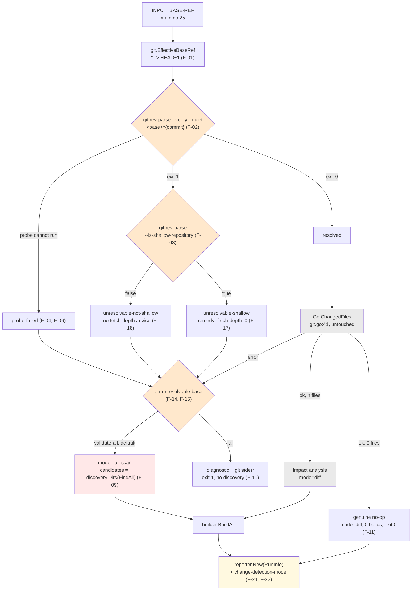

# Plan: Shallow-Clone Support (unresolvable base ref)

Four phases that turn today's `fatal: bad object` crash into a classified, explained and
audited degradation to a full scan — with the diagnostic shipping one release **before** the
exit-code change, so the risky half is never the first half.

## Table of Contents

- [Context](#context)
- [Dependencies](#dependencies)
- [Scope](#scope)
- [Design](#design)
- [Acceptance Criteria](#acceptance-criteria)
- [Implementation Phases](#implementation-phases)
- [Test Plan](#test-plan)
- [Implementation Order](#implementation-order)
- [File Reference Summary](#file-reference-summary)
- [Open Questions](#open-questions)

## Context

Stage 1 of the pipeline diffs a base ref against `HEAD` to decide what to validate
(`git.go:41`). That diff assumes the base commit is present in the local object store. In a
shallow checkout it is not, `git diff` exits 128, `git.go:47-49` wraps the failure and
`main.go:34-37` turns it into `os.Exit(1)`. The run goes red with a raw git error and nothing
was validated.

[`docs/specs/shallow-clone-support.spec.md`](../specs/shallow-clone-support.spec.md)
decides what happens instead: **detect** the unresolvable base, **explain** it naming
`fetch-depth: 0`, **degrade** to validating every discovered kustomization, and **publish**
which mode the run took. This plan phases that decision, adds the two structural decisions the
spec left to the planner ([ADR-010](../decisions/ADR-010-e2e-through-the-real-binary.md),
[ADR-011](../decisions/ADR-011-run-metadata-into-the-reporter.md)), and sequences the work so
the behaviour change lands last and alone.

The plan adds no requirements of its own. Every criterion below is the spec's, carried over by
ID, except the `AC-P*` series which this plan adds and labels as such.

**Two decisions are closed and are not reopened here:**

1. **`validate-all` is the default; `on-unresolvable-base: fail` is the opt-out.** Confirmed by
   the repo owner (spec §10 A-01). The exit 1 → 0 change is accepted, because today's exit 1
   is a crash *before* anything is validated and therefore carries no information about the
   manifests: it fires identically whether the repo is perfect or completely broken.
2. **Fetching or deepening missing history is rejected** (spec §10 OQ-1). No `token` input, no
   credential, no outbound network. `on-unresolvable-base` stays an enum only so a `deepen`
   value remains addable later without a second input.

### Planning-session findings (recorded so `/implement` does not re-derive them)

Measured this session, not predicted.

1. **Baseline is green at 31 tests.** `go test ./...` on the working tree of
   `feat/complete-impact-matching` reports **31 passed in 8 packages**. That number is the gate
   for every phase in this plan, exactly as it is for
   [complete-impact-matching](../plans/complete-impact-matching.md).
2. **Every probe the feature rests on was re-verified independently** against a scratch
   5-commit origin cloned with `--depth 1` over `file://`, git 2.50.1 (Apple Git-155):

   | Command | Full clone | Depth-1 clone |
   |---|---|---|
   | `git rev-parse --verify --quiet '<base-sha>^{commit}'` | exit **0**, prints the sha | exit **1**, no output |
   | `git rev-parse --verify --quiet 'HEAD~1^{commit}'` | exit 0 | exit **1**, no output |
   | `git rev-parse --verify --quiet 'nosuchref^{commit}'` | exit **1**, no output | exit **1**, no output |
   | `git rev-parse --is-shallow-repository` | `false` | `true` |
   | `git diff --name-only <base-sha> HEAD` | exit 0 | exit **128**, `fatal: bad object <sha>` |

   This confirms spec §5.3 in full, including the load-bearing asymmetry: `--verify --quiet`
   cannot distinguish "truncated" from "typo" (both exit 1), which is exactly why F-03's
   second probe exists.
3. **The shallow fixture shape is settled by (2).** An origin with a *base* commit and a
   *change* commit, cloned `--depth 1`, yields a working copy where **both** the explicit base
   sha **and** `HEAD~1` are unresolvable, and whose working tree is the changed state. One
   fixture therefore covers AC-1, AC-2 and AC-11 without a second construction. `--depth 1`
   over a plain path is ignored by git; the clone URL must be `file://<abs-path>`.
4. **The E2E layer cannot currently assert anything this feature is about.** `run()`
   (`pipeline_test.go:113-140`) re-implements the pipeline and returns a `reporter.Summary`;
   `main()` is never called. Exit codes, `INPUT_*` parsing, `$GITHUB_OUTPUT` and the stderr
   diagnostic are all outside it. This is spec F-30, and it is resolved by
   [ADR-010](../decisions/ADR-010-e2e-through-the-real-binary.md).

## Dependencies

| Dependency | State | Note |
|---|---|---|
| `docs/specs/shallow-clone-support.spec.md` | Committed on `feat/complete-impact-matching` | Source of truth; this plan adds no requirements |
| OQ-1 (fetch/deepen missing history) | **Resolved: NO** | Owner decision. Not planned, not designed for. Enum kept so it stays addable. |
| A-01 (`validate-all` is the default) | **Confirmed by the repo owner** | The exit 1 → 0 change is accepted |
| OQ-5 (`::warning::` annotation, F-20) | **Open, non-blocking** | `[unverified]` in the spec and still unverified here — no session-fetched GitHub source. F-20 ships only if confirmed at implementation time; see [Open Questions](#open-questions) |
| F-30 (fallback logic must be testable) | **Resolved by this plan** | [ADR-010](../decisions/ADR-010-e2e-through-the-real-binary.md) — the harness runs the real binary |
| F-24 (mode reaches both sinks) | **Resolved by this plan** | [ADR-011](../decisions/ADR-011-run-metadata-into-the-reporter.md) — constructor injection |
| [complete-impact-matching](../plans/complete-impact-matching.md) | Planned, not started, **lands first** | Touches `internal/discovery`, `internal/reporter`, `cmd/action/main.go` and `pipeline_test.go` — see [Collisions](#collisions-with-other-plans) |
| `git`, `kustomize` **and now `go`** on PATH | Required for `internal/integration` | ADR-010 adds `go`; CLAUDE.md forbids letting these skip silently in CI |
| `gopkg.in/yaml.v3` | Present, the repo's only direct dependency | No phase adds a second (F-28, NF-09, AC-15) |
| Image release + wrapper pin bump | Gates **Phase 4 only** | The wrapper's declarations are inert until `kustomize-build-check-action/action.yml:45` is bumped (result-reporting.spec.md NF-02) |

Nothing external blocks the start. Phase 1 can begin immediately; ideally after
complete-impact-matching Phase 3 has landed, for the reasons below.

### Collisions with other plans

Four plans exist for this repo and the intended landing order is
**1. complete-impact-matching → 2. shallow-clone-support (this plan) → 3. build-timeout-handling
→ 4. container-hardening.** Three concrete collisions follow from that.

#### C-1 — with build-timeout-handling: both add an action **input** to both `action.yml` files and both wire it through `getEnv`

| | This plan | build-timeout-handling |
|---|---|---|
| Input | `on-unresolvable-base` | `build-timeout` |
| Type / default | enum, `validate-all` | Go duration string, `2m` (spec F-16) |
| Read as | `getEnv("INPUT_ON-UNRESOLVABLE-BASE", "validate-all")` | `getEnv("INPUT_BUILD-TIMEOUT", "2m")` (spec F-17) |
| Declared in | both `action.yml` files (F-16) | both `action.yml` files (F-19) |
| New output | `change-detection-mode` | **none** — its F-23 explicitly declares no new output |

**They compose cleanly; the collision is textual, not semantic.** Different names, different
concerns, both additive, both `getEnv` lines in the same four-line block at `main.go:25-28`,
both new keys in the same `inputs:` map in two files. Expect a trivial adjacent-line conflict
in `main.go` and in both `action.yml` files, and **no** conflict on outputs (they add none).

**This plan lands first,** for three reasons:

1. `on-unresolvable-base` changes the `Reporter` constructor
   ([ADR-011](../decisions/ADR-011-run-metadata-into-the-reporter.md)); build-timeout-handling
   adds fields to `builder.BuildResult` and a `### ⏱️ Timed Out` section rendered *through*
   `WriteGitHubStepSummary`. It is far cheaper for that plan to be written against an
   already-changed constructor than for this plan to change a constructor whose method bodies
   have just grown new sections.
2. This plan's `action.yml` change has to be through the release flow (image build → SHA →
   wrapper pin bump) before the wrapper's declarations mean anything. Serialising the two
   inputs through that flow one at a time keeps each bump attributable.
3. build-timeout-handling directly **mitigates this plan's accepted cost**: NF-03 accepts a
   worst case of *n* × 2 minutes for a full scan, and `build-timeout` is what makes that
   limit tunable. Landing it after is landing it where it is most useful.

**Mechanical guidance for whoever lands second:** append the new input at the **end** of the
`inputs:` block in both `action.yml` files rather than inserting mid-block, and append the new
`getEnv` line at the end of the block in `main.go`. That reduces both conflicts to
append-append, which merges cleanly in practice.

#### C-2 — with complete-impact-matching: both touch `internal/reporter`, and both touch `main.go:63-76`

complete-impact-matching Phase 3 adds parse-failure surfacing:
`reporter.ParseIssue`, `PrintParseIssues`, `AppendParseIssuesToStepSummary` — **additive
methods**, with [ADR-003](../decisions/ADR-003-surfacing-parse-failures.md) explicitly
promising that `GenerateSummary`, `PrintResults`, `SetGitHubOutputs` and
`WriteGitHubStepSummary` keep their signatures, and its **AC-C7** asserting that
`SetGitHubOutputs` "emits exactly the same four keys with the same shapes as before the phase".

This plan adds change-detection-mode surfacing, which F-24 sketches as widening those same two
methods. **That is a direct contradiction of ADR-003's stated intent and of AC-C7 as written.**

The merge risk, concretely:

| File / region | complete-impact-matching does | this plan does | Resolution |
|---|---|---|---|
| `internal/reporter/reporter.go` method set | adds 2 methods + `ParseIssue` | **nothing** — ADR-011 chooses constructor injection instead of widening | **Collision removed by design.** Only `New()`'s signature and one metrics-table row are contested. |
| `reporter.New()` | called at `main.go:66`, `:89`, `pipeline_test.go:139` | changes it to `New(RunInfo)` | 3 mechanical call-site edits, one of them in shared test infrastructure |
| `WriteGitHubStepSummary` body | appends a parse-issue section | inserts a mode row + a full-scan block | **Position is fixed by ADR-011:** mode row inside the existing metrics table, full-scan block immediately after it and *before* `### ❌ Build Errors`. The parse-issue section keeps its own position. No contention. |
| `main.go:63-76` (zero-affected early return) | reports parse issues there | must write `change-detection-mode` there (F-21) | Both are additions to the same 14-line branch. Expect a real conflict; both edits are required and neither replaces the other. |
| `internal/integration/pipeline_test.go` harness | extends `run()` with a temp `$GITHUB_STEP_SUMMARY` | adds a **separate** `runBinary` entry point (ADR-010) and `newShallowRepo` | Additive in different regions; `run()` itself is not touched by this plan. **Reuse** the temp-summary plumbing rather than duplicating it. |

**AC-C7 must be re-read, not silently broken.** After this plan's Phase 3 there are **five**
keys in `$GITHUB_OUTPUT`. complete-impact-matching's AC-C7 is satisfied in spirit — the four
existing keys keep their names, shapes and emission order (NF-07) — but a literal reading
("exactly the same four keys") fails if that plan is *reviewed* after this one lands. This is
escalated in [Open Questions](#open-questions).

#### C-3 — complete-impact-matching changes what `discovery.FindAll` returns, and that **is** this plan's full-scan set

F-09 defines the fallback candidate set as `kust.Dir` for every entry from
`discovery.FindAll(rootDir)`, de-duplicated. complete-impact-matching Phase 3 changes
`FindAll` (`discovery.go:51-56`) to **retain unparseable kustomizations as flagged entries**
instead of dropping them with a stderr warning. So after that plan, `FindAll` returns strictly
more entries, and this plan's full-scan set grows to match.

Three consequences, all of which this plan absorbs deliberately:

1. **The superset property (NF-01) is strengthened with respect to `FindAll`'s growth — but it
   is NOT unconditionally true today, and Phase 3 MUST NOT ship until it is.**

   The reasoning that impact analysis "only ever selects *from* the discovered set" is **false**
   for one branch. `analyzer.go:51-58` adds `filepath.Dir(absFile)` for any changed file whose
   basename is a kustomization file, **without consulting the discovered set at all**. Meanwhile
   `discovery.go:44-47` skips *every* dot-prefixed directory. So a kustomization under `.deploy/`
   is validated in `diff` mode and is **invisible** to `full-scan`. Verified:

   ```
   fixture:  .deploy/kustomization.yaml (broken by the change) + app/ (fine)
   diff mode (today):  ❌ .deploy - Build failed   -> 1 failed, exit 1
   full-scan:          candidates = [app]          -> 1 success, 0 failed, exit 0
   ```

   On the same commit pair, `diff` exits 1 and `full-scan` exits 0 on a repo where
   `kustomize build` fails. Since today's shallow run *crashes* (exit 1), Phase 3 would turn a
   red run **green** — a new false pass, in the plan whose whole premise is that degrading is
   safe.

   **Required fix, and it belongs in discovery, not the analyzer.** Narrow
   `discovery.go:44-47` to skip `.git` (and any other genuinely non-manifest directory named
   explicitly) rather than all dot-prefixed directories, so both stages share one universe.
   Do **not** "fix" this by restricting the analyzer's basename branch to the discovered set:
   that would *narrow* `diff` mode and destroy a real detection.

   > **AC-P13 (plan-added, blocks Phase 3):** A kustomization inside a dot-prefixed directory
   > (e.g. `.deploy/`) is discovered by `FindAll` and appears in the `full-scan` candidate set.
   > On a commit pair where that kustomization is broken, `full-scan` and `diff` produce the
   > same non-zero exit. E2E, `internal/integration/pipeline_test.go`.

   Note also that **AC-12 as currently written passes vacuously**: its fixture contains no
   dot-directory kustomization, so it cannot detect this. Its fixture must include one.
2. **It changes an assertion shape, and AC-2 is written for it.** A naive "success-count equals
   the number of discovered kustomizations" would break the moment a fixture contains a
   malformed `kustomization.yaml`, because that directory is now discovered, now built, and
   *fails*. AC-2 is therefore stated as **`total` equals the number of discovered kustomization
   directories and `failed-count == 0`, on a fixture stated to contain only well-formed
   kustomizations**. ADR-003's own consequences section already raises this fixture-hygiene
   requirement; this plan inherits it rather than rediscovering it.
3. **De-duplication becomes load-bearing rather than cosmetic.** `FindAll` can already emit two
   entries for one directory (`isKustomizationFile` matches `kustomization.yaml`,
   `kustomization.yml` and `Kustomization`, `discovery.go:100-105`), and retained unparseable
   entries add another way to reach the same `Dir`. Without de-duplication the same directory
   is built twice and `total` is wrong. **AC-P6** exists for this.

**Second-order, and worth stating because it is the point of both plans:** every reference
surface complete-impact-matching teaches the analyzer moves `diff` mode *closer* to
`full-scan`, which shrinks the cost of this plan's fallback and makes AC-12's superset
assertion tighter. If AC-12 is written before that plan lands, **re-run it after**.

## Scope

### In Scope

- `internal/git` — `EffectiveBaseRef`, `BaseState`, `BaseStatus`, `ResolveBase`; the package's
  first unit test file (closes change-detection.spec.md L-01 for this surface).
  `GetChangedFiles` keeps its exact contract; the only edit is replacing the inline `HEAD~1`
  literal with a call to the extracted helper (F-01).
- `cmd/action/main.go` — preflight before the diff; the `on-unresolvable-base` input and its
  safe-default rule; the diagnostic; the `full-scan` candidate set; the mode through the
  reporter; the console line.
- `internal/discovery` — one additive helper, `Dirs([]KustomizeFile) []string`, de-duplicated
  and order-preserving. Nothing else in the package.
- `internal/reporter` — `Mode`, `RunInfo`, `New(RunInfo)`, the fifth output key and the step
  summary block (ADR-011). No existing method signature changes.
- `action.yml` in **this** repo — `on-unresolvable-base` input, `change-detection-mode` output,
  corrected `base-ref` description.
- `kustomize-build-check-action/action.yml` and its README — the same declarations, plus the
  `full-scan` explanation, gated on the image pin bump.
- `internal/integration/pipeline_test.go` — `newShallowRepo`, `runBinary` (ADR-010), and at
  least one E2E scenario per phase.
- `README.md` in both repos — the `fetch-depth: 0` requirement in prose (F-26).

### Out of Scope

Inherited from spec §9, plus two additions from the cross-plan review:

1. **Fetching or deepening missing history**, in any form. No `token` input, no network egress,
   no credential handling (OQ-1: resolved NO).
2. **Auto-detecting the PR base ref** from `GITHUB_BASE_REF` or the event payload. F-25
   corrects the *descriptions* only; implementing the advertised auto-detection is a change to
   change-detection.spec.md's defaults (spec §10 OQ-2).
3. **Three-dot range semantics** (`A...B`) and any other change to what `git diff` compares.
4. **Narrowing the diff** in any way. change-detection.spec.md §10 R-01 stands: `--diff-filter=d`
   produces a false pass and is disqualified.
5. **Parallelising builds or tuning the per-build timeout** — owned by
   build-timeout-handling, which lands next and is the correct home for NF-03's cost.
6. **Caching or an incremental full scan.** Any narrowing must clear the NF-01 superset bar first.
7. **C-quoted non-ASCII paths** (change-detection.spec.md L-04).
8. **Container hardening** — owned by container-hardening, Dockerfile only.
9. **Impact-analysis reference coverage** — owned by complete-impact-matching.
10. **(added) Changing `GetChangedFiles`' behaviour.** It keeps its argv, its return shapes and
    its unfiltered diff. The extraction in F-01 must be provably behaviour-preserving (AC-9a).
11. **(added) A third `change-detection-mode` value** (`full-scan-shallow` /
    `full-scan-bad-ref`, spec OQ-4). Two values ship; a richer enum is deferred until asked for.

## Design

### Flow, with the change points marked



<details><summary>Legend</summary>

- **Orange** — new control flow. Phase 1 builds the two probes; Phase 2 wires the
  classification and the diagnostic (with `P` hard-wired to `fail`); Phase 3 turns `P` into a
  real branch.
- **Red** — Phase 3's fallback. This is the only node that changes an exit code.
- **Pale yellow** — Phase 3's reporter change (ADR-011).
- **Grey** — unchanged collaborators. `GetChangedFiles` keeps its argv and its unfiltered diff
  (change-detection.spec.md F-05, §10 R-01); impact analysis is not fed a synthetic file list,
  it is simply **skipped** in full-scan mode (F-09).

</details>

### Classification, and why two probes

`git rev-parse --verify --quiet '<ref>^{commit}'` answers *"is this commit here?"* — exit 0
resolved, exit 1 not. It **cannot** answer *why not*: re-verified this session, a truncated
sha in a depth-1 clone and a nonexistent ref name both exit 1 with no output. The second probe,
`git rev-parse --is-shallow-repository`, is what separates them (`true` in a `--depth 1` clone,
`false` in a full clone). Getting this wrong means recommending `fetch-depth: 0` to someone who
typo'd a branch name, which sends them down a dead end — F-18 and AC-5 exist for exactly that.

`git cat-file -e` is **rejected** as the probe (spec §10 R-02): it exits 128 and writes to
stderr even in the expected case, and it does not handle ref *names*.

| State | Trigger | Diagnostic | Mode after Phase 3 |
|---|---|---|---|
| `resolved` | probe 1 exit 0 | none | `diff` — **no behavioural change whatsoever** (F-07) |
| `unresolvable-shallow` | probe 1 exit 1, probe 2 `true` | ref + "shallow clone" + `fetch-depth: 0` YAML + mode taken (F-17) | `full-scan` |
| `unresolvable-not-shallow` | probe 1 exit 1, probe 2 `false` | ref does not exist; **never** `fetch-depth: 0` (F-18) | `full-scan` |
| `probe-failed` | probe cannot run at all: no `git`, not a repo, `exec` error, unborn `HEAD` (F-04, F-06, E-08) | names the probe failure | `full-scan` |

`ResolveBase` returns **no error** — a failure to probe is a classification, not an exception
(spec §6.1). `BaseStatus.Detail` carries git's own stderr verbatim so F-19 is satisfiable
without any caller re-running git.

**Ordering is load-bearing: probe 1 runs first, probe 2 only on its failure.** A `--depth 5`
clone whose base *is* inside the fetched window is `resolved` and takes the ordinary `diff`
path, even though it is a shallow repository (E-04). Shallowness alone must never trigger the
fallback — **AC-P5** is that guard.

### The full-scan candidate set

```go
// internal/discovery — additive, order-preserving, de-duplicated by directory.
func Dirs(files []KustomizeFile) []string
```

`Dir` is already absolute (`discovery.go:91-97`), which is the same shape the analyzer emits
today (`analyzer.go:72-80`), so nothing downstream changes: `builder.BuildAll` receives the
same kind of list it always has. Impact analysis is **skipped**, not fed a synthetic file
list. The dependency graph is still built (F-13) so the pipeline keeps one shape and one
orchestration branch.

De-duplication is required, not cosmetic — see [C-3](#collisions-with-other-plans).

### Run metadata into the reporter

Per [ADR-011](../decisions/ADR-011-run-metadata-into-the-reporter.md), the mode is injected at
construction rather than threaded through the two output methods:

```go
type Mode string
const ( ModeDiff Mode = "diff"; ModeFullScan Mode = "full-scan" )

type RunInfo struct {
    Mode    Mode   // published as change-detection-mode (F-21)
    BaseRef string // the effective ref that was probed
    Reason  string // "" in diff mode; the one-line cause in full-scan
}

func New(info RunInfo) Reporter   // was New()
```

This is what makes F-21's "written on **every** run, including the zero-affected early return"
an invariant instead of a review item: there is no way to obtain a `Reporter` without a mode.
It also removes the whole method-signature collision with complete-impact-matching — see
[C-2](#collisions-with-other-plans). An unset `Mode` resolves to `full-scan` and logs
`slog.Error`, because of the two wrong answers only "claims a normal run when it degraded" is
the invisible failure this feature exists to prevent.

### Invariants carried through every phase

Checked at the end of **every** phase, not once at the end.

| Invariant | How it is checked |
|---|---|
| The 31 existing tests keep passing | `go test ./...` reports 31 passed in 8 packages plus that phase's new tests, with no existing test weakened, skipped or deleted (AC-P9) |
| `TestDeletedResourceStillReferencedFails` does not regress | It passes **unmodified** (`pipeline_test.go:415`), and `git.go` still contains no `--diff-filter` (change-detection.spec.md §10 R-01) |
| The fast path is byte-identical | argv is exactly `["git","diff","--name-only",<base>,"HEAD"]`, asserted against a `git` shim on `PATH`; the returned list is unchanged (AC-9a) |
| Matching is asserted by set equality | Every affected-set assertion uses equality, never containment, so over-matching fails as loudly as under-matching. Reuse complete-impact-matching's `assertAffected` helper if it has landed; otherwise add it |
| The preflight is read-only | After any run the repo is still shallow and `git status --porcelain` is empty (AC-13) |
| One direct dependency | `go.mod` still has exactly one `require` line (AC-15) |
| Integration tests actually ran | Phase sign-off records `internal/integration` as `ok`, never `[no tests to run]` or skipped for a missing `git` / `kustomize` / `go` |

### User-visible output changes, per phase

| Phase | What users see that they did not before | Conventional-commit type → GitVersion bump |
|---|---|---|
| 1 | **Nothing.** Pure addition plus a behaviour-preserving extraction. | `refactor(git):` → no minor bump |
| 2 | A shallow or bad-ref run still exits 1, but stderr now names the effective base ref, says whether the repository is shallow, and prints a copy-pasteable `fetch-depth: 0` block — with git's own `fatal: …` still present verbatim below it. | `fix(action):` → **patch** |
| 3 | The big one. An unresolvable base now **validates every discovered kustomization** and exits 0 if they all pass (was: exit 1, nothing validated). New input `on-unresolvable-base`. New output `change-detection-mode`. A new row in the step summary metrics table, plus a full-scan block naming the ref and the reason. `Found N changed files` is replaced on the degraded path by a line naming how many kustomizations will be validated and why (F-23). | `feat(action):` → **minor** |
| 4 | Wrapper consumers can set the input and read the output; both READMEs document `fetch-depth: 0`; both `base-ref` descriptions stop advertising an auto-detection that does not exist. | `docs:` here; wrapper repo bumps its own pin |

**Version-bump trap, call it out at implementation time.** The exit 1 → 0 change is
behaviour-breaking in the ordinary sense, and the instinct is to write `feat!:` or a
`BREAKING CHANGE:` footer. **Do not.** Conventional commits drive GitVersion (CLAUDE.md
"Release flow"), and either form would produce a **major** bump. The owner decided this is a
**minor** (spec §11: "the release must be a **minor** version bump with the change called
out"). Use a plain `feat(action):` subject and put the exit-code change in the release notes
prose instead.

## Acceptance Criteria

IDs `AC-1`..`AC-15` are the spec's own (§7), preserved for traceability; `AC-9` is split into
`AC-9a` / `AC-9b` because its two halves land in different phases. The `AC-P*` series is added
by this plan.

**Phase 1 — `internal/git` preflight primitives (no user-visible change)**

- [ ] AC-P1: `git.EffectiveBaseRef("")` returns `"HEAD~1"` and `EffectiveBaseRef("abc123")`
      returns `"abc123"`; the literal `HEAD~1` appears **exactly once** in `internal/git`,
      asserted by a grep-style check, so the probed ref and the diffed ref cannot drift (F-01).
- [ ] AC-P2: `ResolveBase` returns, against real scratch repositories: `resolved` for a
      reachable sha in a full clone; `unresolvable-shallow` for an unreachable sha in a
      `--depth 1` clone; `unresolvable-shallow` for `HEAD~1` in a `--depth 1` clone;
      `unresolvable-not-shallow` for `nosuchref` in a full clone; `probe-failed` when `git` is
      absent from `PATH`. In every non-`resolved` case `Detail` is non-empty (F-02..F-06, F-19).
- [ ] AC-9a: The argv passed to `exec.Command` by `GetChangedFiles` is exactly
      `["git","diff","--name-only",<base>,"HEAD"]` — no extra flags, no `--diff-filter` in any
      casing — and the returned path list for an unchanged fixture is identical to the
      pre-change output (change-detection.spec.md F-05, AC-2).
- [ ] AC-15: `go.mod` lists exactly one direct dependency (F-28, NF-09).

**Phase 2 — detect and explain, still fail**

- [ ] AC-P3: The harness can execute the real `cmd/action` binary and assert its exit code,
      stdout, stderr, `$GITHUB_OUTPUT` and `$GITHUB_STEP_SUMMARY`
      ([ADR-010](../decisions/ADR-010-e2e-through-the-real-binary.md)).
- [ ] AC-P4: In a depth-1 clone with an unresolvable base sha, the run exits **1**, performs
      **zero** `kustomize build` invocations, and prints the diagnostic — i.e. exit-code parity
      with today's behaviour, better message. No fallback exists yet.
- [ ] AC-4: stderr contains the effective base ref, wording identifying a shallow clone, and
      the literal string `fetch-depth: 0` (F-17).
- [ ] AC-5: In a **full** clone with `base-ref: nosuchref`, the diagnostic says the ref does not
      exist and does **not** contain `fetch-depth: 0` (F-18, F-03).
- [ ] AC-6: In both AC-4 and AC-5 the output still contains git's own `fatal: …` text verbatim
      (F-19, change-detection.spec.md NF-05).
- [ ] AC-11 (classification half): In a depth-1 clone with `base-ref` **unset**, the ref probed
      is `HEAD~1` and the classification is `unresolvable-shallow`.
- [ ] AC-P5: In a `--depth 5` clone whose base commit **is** inside the fetched window, the
      classification is `resolved`, no diagnostic is emitted, and behaviour is the ordinary
      `diff` path — even though `--is-shallow-repository` reports `true` (E-04). This is the
      over-trigger guard.
- [ ] AC-13: After any run in this phase, `git rev-parse --is-shallow-repository` still reports
      `true` and `git status --porcelain` is empty — the action fetched nothing and mutated
      nothing (F-05, F-29).

**Phase 3 — degrade to `validate-all` (the behaviour change)**

- [ ] AC-1 **(the central one, no false pass):** In a depth-1 clone of a repo whose change
      breaks an overlay, with an unresolvable base sha and default inputs, the run exits **1**,
      `failed-count >= 1`, and the broken overlay appears in `results` with `Success=false`,
      `Skipped=false`. It must **not** exit 0 and must **not** report 0 builds.
- [ ] AC-2 **(no false fail):** Same shallow setup with a change that breaks nothing: the run
      exits **0**, `failed-count` is 0, and `total` equals the number of discovered
      kustomization directories. *The fixture contains only well-formed kustomizations — see
      [C-3](#collisions-with-other-plans).*
- [ ] AC-3: Both runs above emit `change-detection-mode=full-scan` to `$GITHUB_OUTPUT`, and a
      `full-scan` marker naming the reason is present in `$GITHUB_STEP_SUMMARY` (F-21, F-22).
- [ ] AC-7: Same shallow setup with `on-unresolvable-base: fail` exits **1**, performs **zero**
      `kustomize build` invocations, and emits the AC-4 diagnostic (F-10).
- [ ] AC-P12 (F-10/F-21, plan-added): On the `on-unresolvable-base: fail` path `$GITHUB_OUTPUT`
      is **empty** — no `change-detection-mode`, no `failed-count`, no `success-count`, no
      `skipped-count`, no `results` — and `$GITHUB_STEP_SUMMARY` is unwritten. Asserted via
      `runBinary` in `TestOnUnresolvableBaseFailPerformsNoBuilds`.
      *This is the behaviour F-21's new exemption requires, and it matches today's exit-1 path,
      which never reaches `SetGitHubOutputs` (`main.go:34-37`).*
- [ ] AC-8: `on-unresolvable-base: FAIL` (wrong case) and `on-unresolvable-base: banana` both
      behave exactly as `validate-all` and log a warning naming the offending value — neither
      may behave as `fail` (F-15).
- [ ] AC-9b: In a full clone with a resolvable base, `change-detection-mode=diff`, and every
      existing test in `internal/integration/pipeline_test.go` passes unmodified (F-07).
- [ ] AC-10 **(empty diff is not a fallback):** In a full clone where base and head resolve to
      the same tree, the run reports 0 changed files, 0 builds, exit 0 and
      `change-detection-mode=diff` — **not** `full-scan` (F-11). *Write this test before the
      fallback code.*
- [ ] AC-11 (outcome half): In a depth-1 clone with `base-ref` unset, AC-2's outcome holds.
- [ ] AC-12 **(superset property):** For a fixture where the change deletes a resource still
      listed in a surviving `kustomization.yaml`, the set of paths built in `full-scan` mode is
      a **superset** of the set built in `diff` mode on the same commit pair, and the same
      overlay fails in both (NF-01; cf. `TestDeletedResourceStillReferencedFails`).
- [ ] AC-P6: The full-scan candidate set is de-duplicated by directory: a directory holding both
      `kustomization.yaml` and `Kustomization` yields exactly one build target, and `total`
      counts it once.
- [ ] AC-P7: `full-scan` with zero discovered kustomizations emits a **warning** that a full
      scan found nothing to validate, and exits **0** (E-07).
- [ ] AC-P8: `on-unresolvable-base: fail` combined with `fail-on-error: false` still exits **1**
      — `fail` governs the inability to determine what to build, `fail-on-error` governs build
      results (E-09).
- [ ] AC-P11: A base that is **resolvable at preflight** but whose `git diff` fails anyway
      engages the same fallback, with git's stderr attached (F-08, E-05). Exercised by pointing
      `INPUT_BASE-REF` at a ref that resolves but cannot be diffed, or by a `git` shim that
      succeeds on `rev-parse` and fails on `diff`.
- [ ] AC-14 (this repo's half): `on-unresolvable-base` and `change-detection-mode` are declared
      in this repo's `action.yml`, and its `base-ref` description matches the implemented
      default (F-16, F-25).
- [ ] AC-13 (re-assert): still no mutation, still shallow, after a full-scan run.

**Phase 4 — cross-repo contract and documentation**

- [ ] AC-14 (wrapper half): `on-unresolvable-base` and `change-detection-mode` are declared in
      `kustomize-build-check-action/action.yml`, its `base-ref` description matches the
      implemented default, and its image pin (`action.yml:45`) points at a SHA containing
      Phase 3 (F-16, F-25, NF-06).
- [ ] AC-P10: `fetch-depth: 0` and why it is required appear in **prose** in both READMEs — this
      repo's local-run section (`README.md:58-71`) and the wrapper's Inputs table region
      (`kustomize-build-check-action/README.md:65-72`) — and the wrapper README gains a
      `full-scan` section beside its existing "Skipped paths" section (F-26, F-27).

**Every phase**

- [ ] AC-P9: `go test ./...` reports 31 passed in 8 packages plus that phase's new tests, with
      no existing test weakened, skipped or deleted; `internal/integration` reports `ok` rather
      than skipping for a missing `git`, `kustomize` or `go`;
      `TestDeletedResourceStillReferencedFails` passes **unmodified**.

## Implementation Phases

### Phase 1: internal/git — preflight primitives

**Priority: HIGH** — everything else consumes it, and it is the only phase with literally zero
user-visible surface, so it is free to land early and de-risks the two phases that follow.

**Goal**: `internal/git` can answer "is this base ref usable, and if not, why not" as a
classification rather than an error, and the `"" → HEAD~1` default has exactly one
implementation.

**Tasks**:
- [ ] Add `EffectiveBaseRef(baseRef string) string` and **replace** the inline literal at
      `git.go:24-26` with a call to it. This is the F-01 anti-drift guard; a duplicated
      `HEAD~1` literal is an automatic review rejection (spec §11).
- [ ] Add `BaseState` with the four constants, `BaseStatus{Ref, State, Detail}`, and
      `ResolveBase(baseRef string) BaseStatus` on the `Analyzer` interface (spec §6.1). It
      returns no `error`.
- [ ] Probe 1: `git rev-parse --verify --quiet "<effective>^{commit}"`. Exit 0 ⇒ `resolved`;
      exit 1 ⇒ continue. Any other outcome (`exec` error, `git` absent, not a repository) ⇒
      `probe-failed` with the error in `Detail` (F-02, F-04, E-08).
- [ ] Probe 2, **only** on probe 1's exit 1: `git rev-parse --is-shallow-repository`. Trimmed
      output `true` ⇒ `unresolvable-shallow`; `false` ⇒ `unresolvable-not-shallow`; anything
      else ⇒ `probe-failed` (F-03).
- [ ] Both probes are read-only: no `fetch`, no write to `.git`, no working-tree mutation
      (F-05, NF-08). Neither sets `cmd.Dir`, matching `GetChangedFiles` (change-detection F-06).
- [ ] `HEAD` itself unresolvable (unborn branch / empty repo) ⇒ `probe-failed`, so the code has
      no undefined branch (F-06).
- [ ] Create `internal/git/git_test.go` — the package's **first** test file (closes
      change-detection.spec.md L-01 for this surface). Build real scratch repositories in
      `t.TempDir()` with `filepath.EvalSymlinks` applied (macOS `/var` → `/private/var`), one
      full and one cloned `--depth 1` from `file://<abs origin>` — a plain path silently
      ignores `--depth`.
- [ ] Unit tests: AC-P1 (both branches plus the single-literal grep), AC-P2 (all five
      classifications), AC-9a (argv, via a temp `git` shim placed first on `PATH` that records
      its argv to a file, then restores `PATH`).
- [ ] Confirm `GetChangedFiles` is otherwise untouched: same argv, same return shapes, the
      deletion rationale comment at `git.go:31-40` intact.
- [ ] Run `go test ./...`; confirm 31 + new, `internal/integration` `ok`, `go.mod` unchanged
      (AC-P9, AC-15).

**Depends on**: None. Sequence after complete-impact-matching Phase 3 if possible, purely so
the harness work in Phase 2 inherits that plan's `$GITHUB_STEP_SUMMARY` plumbing rather than
racing it.

**Rollback**: one commit; `git revert <phase-1-sha>` removes `ResolveBase`, `EffectiveBaseRef`
and `internal/git/git_test.go` together and restores the inline `HEAD~1`. Nothing depends on it
yet, so the revert is total. Suggested subject: `refactor(git): extract base-ref default and add base-ref preflight`.

**Risk**: the classification is wrong in a way no test catches. Bounded by AC-P2 exercising all
five states against **real** repositories rather than mocks, and by the fact that nothing
consumes the classification until Phase 2.

### Phase 2: cmd/action + harness — detect and explain, still fail

**Priority: HIGH** — this is the phase that makes the feature safe to finish. It changes no
exit code, so it can ship and soak with zero behavioural risk, while putting the classification
into production use and writing the diagnostic Phase 3 reuses verbatim.

**Goal**: a shallow or bad-ref run fails exactly as it does today, but with a message that
names the cause and the one-line remedy — and the E2E layer can finally assert exit codes,
`INPUT_*` parsing and `$GITHUB_OUTPUT`.

**Tasks — 2.1, the harness (ADR-010)**:
- [ ] `TestMain` in `internal/integration` builds `./cmd/action` once into a temp dir; skip the
      package with a message naming `go` if it is absent, using the existing `requireBinary`
      pattern (`pipeline_test.go:142-148`).
- [ ] Add `runResult{ExitCode, Stdout, Stderr, Outputs map[string]string, Summary string}` and
      `(*repo).runBinary(env map[string]string) runResult`: `cmd.Dir` = the fixture repo, all
      `INPUT_*` passed explicitly, `GITHUB_OUTPUT` and `GITHUB_STEP_SUMMARY` pointed at fresh
      temp files, exit code read from `*exec.ExitError`, outputs parsed on the first `=`.
- [ ] Add `newShallowRepo(t)`: build an origin under a temp root (base commit, then change
      commit), `git clone --depth 1 file://<abs origin> <work>`, `EvalSymlinks` **both** paths,
      return a `repo` whose `base` is the origin's base sha. Per finding 3, this single fixture
      makes both the explicit sha and `HEAD~1` unresolvable.
- [ ] Add `newPartialRepo(t, depth)` for AC-P5, or a depth parameter on `newShallowRepo`.
- [ ] **Do not modify `run()` or any of the seven tests that use it.** The 31-test baseline is
      preserved by construction.
- [ ] Self-check the harness against an existing full-clone fixture: exit 0, non-empty stdout,
      four keys in `Outputs` (AC-P3).

**Tasks — 2.2, the preflight branch and the diagnostic**:
- [ ] In `main.go`, call `gitAnalyzer.ResolveBase(baseRef)` **before** `GetChangedFiles`.
- [ ] `resolved` ⇒ call `GetChangedFiles` exactly as today. **No behavioural change whatsoever
      on this path** (F-07).
- [ ] Any other classification ⇒ emit the diagnostic and `os.Exit(1)`. Also route a
      `GetChangedFiles` error through the same diagnostic path (F-08) rather than the raw
      `Error detecting changes: %v` at `main.go:35`.
- [ ] Write the two message bodies once, in one place, so Phase 3 reuses them unchanged:
      - `unresolvable-shallow` (F-17), in this order: (a) the effective base ref that failed,
        (b) that the repository is a shallow clone so that commit is not present locally,
        (c) the remedy as copy-pasteable YAML (`- uses: actions/checkout@v5` / `  with:` /
        `    fetch-depth: 0`, mirroring `examples.d/basic.yml:17-20`), (d) which mode was taken
        and what that means — in this phase, "the run is failing and nothing was validated".
      - `unresolvable-not-shallow` (F-18): the ref does not exist in this repository (typo,
        deleted branch, or a `base-ref` expression that evaluated unexpectedly). **Must not**
        mention `fetch-depth`.
      - `probe-failed`: name the probe failure and `BaseStatus.Detail`.
- [ ] Append `BaseStatus.Detail` — git's own stderr — verbatim **below** the diagnostic, never
      replacing it (F-19, AC-6).
- [ ] **F-20 (`::warning::` annotation) is deferred to a decision at implementation time.** It
      is `[unverified]` in the spec and remains unverified here. Confirm against GitHub's
      current workflow-command documentation; if it cannot be confirmed, **drop it** and ship
      F-17/F-18 only. It backs no acceptance criterion, by design.
- [ ] E2E scenarios: `TestShallowCloneExplainsAndFails` (AC-P4, AC-4, AC-6, AC-13),
      `TestShallowCloneDefaultBaseRefIsClassifiedShallow` (AC-11 classification half),
      `TestBadRefInFullCloneDoesNotRecommendFetchDepth` (AC-5, AC-6),
      `TestPartialDepthCloneWithReachableBaseTakesDiffPath` (AC-P5).
- [ ] Write the AC-10 fixture **now** in its exit-code form (empty diff ⇒ exit 0, 0 builds, no
      diagnostic); Phase 3 extends it with the mode assertion. This is the over-trigger guard
      and the spec's top risk.
- [ ] Run `go test ./...`; confirm the invariant checklist (AC-P9, AC-15).

**Depends on**: Phase 1.

**Rollback**: one commit if 2.1 and 2.2 land together, two if split (revert 2.2 then 2.1).
`git revert <phase-2-sha>` restores the raw `Error detecting changes` path. Reverting 2.1
removes the harness Phase 3 depends on, so revert 2.2 first. Suggested subjects:
`test(integration): run the real action binary in the E2E harness` and
`fix(action): explain an unresolvable base ref instead of surfacing a raw git error`.

**Risk**: the diagnostic recommends the wrong remedy for a typo'd ref. AC-5 is its test, and
F-03's second probe is the only thing that separates the two cases. Secondary risk: a
misclassification routes a resolvable base into the diagnostic path — in this phase that shows
up as a wrong message on a run that was going to fail anyway, which is precisely why this phase
precedes the fallback.

### Phase 3: the fallback — `validate-all`, the new input, and the published mode

**Priority: HIGH** — the phase the spec exists for, and the only one that changes an exit code.
It ships as one release and carries the minor bump.

**Goal**: an unresolvable base validates every discovered kustomization instead of crashing,
the degradation is opt-out-able, and it is impossible for a degraded run to look like a normal
one.

Organised into three work packages, each its own commit, so rollback stays granular.

**Tasks — 3.1, the policy and the fallback set**:
- [ ] Confirm the AC-10 fixture from Phase 2 still passes **before** writing any fallback code,
      then extend it with `change-detection-mode=diff` once 3.2 lands. A successful diff
      returning zero files is a genuine no-op and must **never** engage the fallback (F-11).
- [ ] Read `on-unresolvable-base` via `getEnv("INPUT_ON-UNRESOLVABLE-BASE", "validate-all")`,
      appended at the **end** of the `getEnv` block for the reason in
      [C-1](#collisions-with-other-plans).
- [ ] Parse it: exact `validate-all` or exact `fail`. Unset, empty **or unrecognised** ⇒
      `validate-all`, with a warning naming the offending value. It must never resolve to
      `fail` (F-15, AC-8). This deliberately differs from the exact-`"true"` style at
      `main.go:26-27`: here the safe value is the fallback, so silence cannot cause a false pass.
- [ ] `fail` ⇒ emit the Phase 2 diagnostic and exit 1 **before** discovery (F-10). `fail` beats
      `fail-on-error: false` (E-09, AC-P8) — the two inputs govern different things.
- [ ] `validate-all` ⇒ mode `full-scan`; candidates = `discovery.Dirs(kustomizations)`; impact
      analysis **skipped**, not fed a synthetic file list (F-09).
- [ ] Add `discovery.Dirs([]KustomizeFile) []string` — additive, order-preserving,
      de-duplicated by `Dir` (AC-P6). Place it at the end of `discovery.go` to minimise contact
      with complete-impact-matching's edits to `FindAll` / `ParseKustomization`.
- [ ] Still build the dependency graph in `full-scan` mode; it is simply unused for selection.
      Building it must not be able to fail the run in a way the `diff` path would not (F-13).
- [ ] Zero discovered kustomizations in `full-scan` ⇒ warn that a full scan found nothing to
      validate (usually a wrong `root-dir`) and exit 0, matching today's zero-candidate
      behaviour (E-07, AC-P7).

**Tasks — 3.2, publishing the mode (ADR-011)**:
- [ ] Add `reporter.Mode`, `ModeDiff`, `ModeFullScan`, `RunInfo{Mode, BaseRef, Reason}`, and
      change `New()` to `New(RunInfo)`. **Do not touch the four method signatures** — that is
      the whole point of ADR-011 and of [C-2](#collisions-with-other-plans).
- [ ] `SetGitHubOutputs` appends `change-detection-mode=<mode>` as a **fifth** line, after the
      existing four, whose names, meanings and order are untouched (NF-07).
- [ ] `WriteGitHubStepSummary` adds a mode row to the existing metrics table and, when
      `full-scan`, a short block naming `RunInfo.BaseRef` and `RunInfo.Reason`, placed
      immediately after the metrics table and **before** `### ❌ Build Errors`.
- [ ] Unset `Mode` ⇒ `full-scan` + `slog.Error`, with a unit test asserting it (the loud side).
- [ ] Update **all six** `reporter.New` call sites: `main.go:66` (the zero-affected early
      return — F-21 requires the mode there too), `main.go:89`,
      `internal/integration/pipeline_test.go:139`, and — easy to miss, and **compile-breaking**
      if missed — `internal/reporter/reporter_test.go:24`, `:46`, `:69`. The last three are in
      the reporter's own test package, which will not compile against a changed constructor.
      Both `complete-impact-matching` Phase 3 and `build-timeout-handling` Phase 2 add tests to
      that same file, so expect to rebase them onto the new constructor.
- [ ] Console (F-23): in `full-scan` mode, replace `Found %d changed files` with a line naming
      the count of kustomizations that will be validated and why. `Found 0 changed files` on a
      degraded run would be actively misleading.

**Tasks — 3.3, this repo's public contract**:
- [ ] `action.yml`: declare `on-unresolvable-base` (default `validate-all`, description naming
      both values and what each does) at the **end** of the `inputs:` block, and
      `change-detection-mode` in `outputs:`.
- [ ] `action.yml`: correct the `base-ref` description (`action.yml:11`) — it currently
      advertises `github.event.pull_request.base.sha or main`, which **is not implemented**;
      the binary implements only `"" → HEAD~1` (F-25).

**Tasks — tests and sign-off**:
- [ ] E2E, all through `runBinary` against `newShallowRepo`:
      `TestShallowCloneWithBrokenOverlayFailsForTheRightReason` (AC-1, AC-3),
      `TestShallowCloneCleanChangeValidatesEverything` (AC-2, AC-3, AC-11 outcome half),
      `TestOnUnresolvableBaseFailPerformsNoBuilds` (AC-7, AC-P8),
      `TestUnrecognisedPolicyValueIsSafe` (AC-8, both `FAIL` and `banana`),
      `TestResolvableBaseIsUnchanged` (AC-9b, AC-10),
      `TestFullScanIsASupersetOfDiff` (AC-12 — run the same commit pair twice, once from the
      full origin and once from the depth-1 clone, and assert set containment plus the same
      failing overlay in both),
      `TestFullScanDeduplicatesDirectories` (AC-P6),
      `TestFullScanWithNoKustomizationsWarnsAndPasses` (AC-P7),
      `TestDiffFailureAfterSuccessfulPreflightFallsBack` (AC-P11),
      `TestFullScanDoesNotMutateTheRepository` (AC-13).
- [ ] Unit: `discovery.Dirs` de-duplication and order; `reporter` fifth-key emission, the four
      existing keys unchanged key-for-key, the step-summary block position, and the unset-mode
      default.
- [ ] Run `go test ./...`; confirm the invariant checklist (AC-P9, AC-15), and confirm
      `internal/integration` ran against real `git`, `kustomize` and `go`.

**Depends on**: Phase 2 (the harness and the diagnostic).

**Rollback**: three commits, revertible newest-first — `git revert <3.3-sha>` withdraws the
public declarations only (the binary still honours the env var, harmlessly);
`git revert <3.2-sha>` removes the output and the step-summary row and restores `New()`;
`git revert <3.1-sha>` removes the fallback and returns to Phase 2's fail-with-diagnostic.
**3.1 must be reverted last**, because 3.2's `RunInfo` is populated by 3.1's decision. Reverting
the whole phase leaves the product in Phase 2's state — diagnosed but still failing — which is
a coherent, shippable place to sit. Suggested subject for the release-carrying commit:
`feat(action): validate every kustomization when the base ref cannot be resolved` — **no `!`,
no `BREAKING CHANGE:` footer** (see the version-bump trap above).

**Risk, in the spec's own descending order**:
1. **Over-triggering.** If any successful-but-empty diff routes into `full-scan`, every no-op PR
   on every consumer becomes a full repository build. F-11, AC-10 and AC-P5 are the guards, and
   AC-10 is written before the fallback code exists.
2. **The exit-code change itself.** Mitigated by `on-unresolvable-base: fail`, by the loud
   diagnostic, by `change-detection-mode` being machine-readable, and by the release notes.
3. **Silent degradation** if 3.2 were dropped for expedience. It cannot be: ADR-011 makes the
   mode a constructor argument, so there is no `Reporter` without one.
4. **Wall clock.** A full scan is *n* × the per-build timeout in the worst case (NF-03). Accepted;
   build-timeout-handling lands next and makes that limit tunable.

### Phase 4: cross-repo contract and documentation

**Priority: MEDIUM** — nothing in this phase changes the binary, but until it lands the feature
is invisible to every consumer of the wrapper action, and the `base-ref` descriptions keep
advertising behaviour that does not exist.

**Goal**: the wrapper exposes the same contract, and the documentation stops being the reason
people hit this in the first place.

**Tasks — sequencing (do not reorder)**:
- [ ] Confirm Phase 3 is merged to `main`, GitVersion tagged a **minor**, GoReleaser built, and
      the image is on GHCR (CLAUDE.md "Release flow").
- [ ] Bump `kustomize-build-check-action/action.yml:45` to the new image SHA. **The wrapper's
      declarations are inert before this** (result-reporting.spec.md NF-02).
- [ ] Declare `on-unresolvable-base` and `change-detection-mode` in
      `kustomize-build-check-action/action.yml`, with descriptions identical to this repo's
      (F-16, AC-14).
- [ ] Correct the wrapper's `base-ref` description (`kustomize-build-check-action/action.yml:11`),
      which advertises `auto-detect from PR or HEAD~1` — also not implemented (F-25).

**Tasks — documentation**:
- [ ] This repo's `README.md`: state the `fetch-depth: 0` requirement in prose in the local-run
      section (`README.md:58-71`), and what happens when it is missing (F-26).
- [ ] The wrapper `README.md`: same in the Inputs region (`:65-72`), plus a `full-scan` section
      beside the existing "Skipped paths" section (`:83-93`), which is the established pattern
      for explaining a non-obvious verdict (F-26, F-27, AC-P10).
- [ ] Document E-09 explicitly: `on-unresolvable-base` governs *the inability to determine what
      to build*; `fail-on-error` governs *build results*. `fail` wins.
- [ ] Note in both READMEs that `fetch-depth: 0` is already present in every wrapper example
      (`examples.d/basic.yml:20` even comments it as required) — the gap was always the prose,
      not the examples (F-26).
- [ ] Release-note prose for the exit-code change, aimed at consumers who may be relying on
      today's exit 1.

**Depends on**: Phase 3, **plus a release**. This is the only phase gated on something outside
the repository.

**Rollback**: two commits in two repositories. In the wrapper, `git revert <pin-and-declare-sha>`
restores the previous pin and removes the declarations together — do them as **one** commit so
the pin and the contract can never disagree. In this repo, `git revert <docs-sha>`. Neither
revert touches the binary.

**Risk**: low. The worst case is a wrapper declaring an input the pinned image does not
understand, which is why the pin bump and the declarations are one commit.

## Test Plan

`internal/integration/pipeline_test.go` is this repo's **E2E layer**: it builds real git
repositories and runs the real pipeline against a real `kustomize`. From Phase 2 it also
executes the real `cmd/action` binary
([ADR-010](../decisions/ADR-010-e2e-through-the-real-binary.md)), which is what makes exit
codes, `INPUT_*` parsing and `$GITHUB_OUTPUT` assertable at all. There is no UI and no HTTP
surface, so this is where the E2E rows live — **Phases 2 and 3 carry the E2E coverage. Phase 1 (pure extraction, no user-visible surface) and Phase 4 (wrapper declarations and docs) have none, by design.** The Phase 2-3 rows are driven through a
real `--depth 1` clone where the criterion is about shallowness.**

Every test added by this plan carries a traceability comment on its first line, so criteria are
greppable:

```go
// Verifies: Shallow-Clone Support, Criterion: "<exact criterion text from this plan>"
```

| Criterion | Test Type | Test Location |
|---|---|---|
| AC-P1: `EffectiveBaseRef` both branches; `HEAD~1` literal appears once | Unit | `internal/git/git_test.go` — `TestEffectiveBaseRef`, `TestHeadTildeOneLiteralIsNotDuplicated` |
| AC-P2: five classifications against real repos | Unit | `internal/git/git_test.go` — `TestResolveBaseClassification` (full clone, `--depth 1` sha, `--depth 1` `HEAD~1`, `nosuchref`, empty `PATH`) |
| AC-9a: argv is exactly `git diff --name-only <base> HEAD` | Unit | `internal/git/git_test.go` — `TestGetChangedFilesArgv` (temp `git` shim first on `PATH`) |
| AC-15: one direct dependency | Manual gate | `go.mod` inspected at every phase gate |
| AC-P3: harness can assert exit code, stdout, stderr, outputs, summary | **E2E** | `internal/integration/pipeline_test.go` — `TestRunBinaryHarnessSelfCheck` |
| AC-P4: depth-1 clone exits 1 with the diagnostic, zero builds | **E2E** (`--depth 1`) | `internal/integration/pipeline_test.go` — `TestShallowCloneExplainsAndFails` |
| AC-4: stderr names the ref, "shallow", and `fetch-depth: 0` | **E2E** (`--depth 1`) | same test |
| AC-5: bad ref in a full clone, no `fetch-depth` advice | **E2E** | `internal/integration/pipeline_test.go` — `TestBadRefInFullCloneDoesNotRecommendFetchDepth` |
| AC-6: git's `fatal: …` still present verbatim | **E2E** | both tests above |
| AC-11 (classification half): unset `base-ref` in a depth-1 clone ⇒ `unresolvable-shallow` | **E2E** (`--depth 1`) + Unit | `internal/integration/pipeline_test.go` — `TestShallowCloneDefaultBaseRefIsClassifiedShallow`; `internal/git/git_test.go` — `TestResolveBaseClassification` |
| AC-P5: `--depth 5` with a reachable base ⇒ `diff` path, no diagnostic | **E2E** (`--depth 5`) | `internal/integration/pipeline_test.go` — `TestPartialDepthCloneWithReachableBaseTakesDiffPath` |
| AC-13: nothing fetched, nothing mutated | **E2E** (`--depth 1`) | `internal/integration/pipeline_test.go` — `TestShallowCloneExplainsAndFails` (Phase 2) and `TestFullScanDoesNotMutateTheRepository` (Phase 3) |
| AC-1: broken overlay ⇒ exit 1, `failed-count >= 1`, overlay in `results` | **E2E** (`--depth 1`) | `internal/integration/pipeline_test.go` — `TestShallowCloneWithBrokenOverlayFailsForTheRightReason` |
| AC-2: clean change ⇒ exit 0, `failed-count == 0`, `total` == discovered dirs | **E2E** (`--depth 1`) | `internal/integration/pipeline_test.go` — `TestShallowCloneCleanChangeValidatesEverything` |
| AC-3: `change-detection-mode=full-scan` in outputs **and** summary | **E2E** (`--depth 1`) | both tests above, via `runResult.Outputs` and `runResult.Summary` |
| AC-7: `fail` ⇒ exit 1, zero builds, AC-4 diagnostic | **E2E** (`--depth 1`) | `internal/integration/pipeline_test.go` — `TestOnUnresolvableBaseFailPerformsNoBuilds` |
| AC-8: `FAIL` and `banana` behave as `validate-all` + warning | **E2E** (`--depth 1`) | `internal/integration/pipeline_test.go` — `TestUnrecognisedPolicyValueIsSafe` (table over both values) |
| AC-9b: resolvable base ⇒ `change-detection-mode=diff`, existing tests unmodified | **E2E** + Suite | `internal/integration/pipeline_test.go` — `TestResolvableBaseIsUnchanged`; `go test ./...` |
| AC-10: empty diff ⇒ 0 builds, exit 0, mode `diff`, **not** `full-scan` | **E2E** | `internal/integration/pipeline_test.go` — `TestEmptyDiffIsNotAFallback` (written in Phase 2, extended in Phase 3) |
| AC-11 (outcome half): unset `base-ref`, depth-1 ⇒ AC-2's outcome | **E2E** (`--depth 1`) | `internal/integration/pipeline_test.go` — `TestShallowCloneCleanChangeValidatesEverything` |
| AC-12: full-scan set ⊇ diff set, same overlay fails in both | **E2E** (`--depth 1` + full clone of the same origin) | `internal/integration/pipeline_test.go` — `TestFullScanIsASupersetOfDiff` |
| AC-P6: candidate set de-duplicated by directory | Unit + **E2E** | `internal/discovery/discovery_test.go` — `TestDirsDeduplicates`; `internal/integration/pipeline_test.go` — `TestFullScanDeduplicatesDirectories` |
| AC-P7: full-scan, zero discovered ⇒ warning + exit 0 | **E2E** (`--depth 1`) | `internal/integration/pipeline_test.go` — `TestFullScanWithNoKustomizationsWarnsAndPasses` |
| AC-P8: `fail` beats `fail-on-error: false` | **E2E** (`--depth 1`) | `internal/integration/pipeline_test.go` — `TestOnUnresolvableBaseFailPerformsNoBuilds` |
| AC-P11: diff fails after a successful preflight ⇒ same fallback | **E2E** | `internal/integration/pipeline_test.go` — `TestDiffFailureAfterSuccessfulPreflightFallsBack` (`git` shim: `rev-parse` succeeds, `diff` fails) |
| AC-14 (this repo): input + output declared, `base-ref` description corrected | Unit | `internal/integration/pipeline_test.go` — `TestActionYmlDeclaresTheContract` (parse `action.yml` with `yaml.v3`, assert keys and that the description does not claim auto-detection) |
| AC-14 (wrapper): same, plus the image pin | Manual gate | `kustomize-build-check-action/action.yml` reviewed at the Phase 4 gate; the wrapper repo has no Go test suite |
| AC-P10: `fetch-depth: 0` in both READMEs; wrapper `full-scan` section | Manual gate | `README.md` (both repos) reviewed at the Phase 4 gate |
| AC-P9: 31 + new pass, none weakened, `internal/integration` `ok`, `TestDeletedResourceStillReferencedFails` unmodified | Suite | `go test ./...` at every phase gate |

**Reused fixtures.** AC-12's superset assertion runs the *same* origin twice — once as a full
clone (diff mode) and once as its `--depth 1` clone (full-scan mode) — and the fixture is the
deleted-but-still-referenced shape that `TestDeletedResourceStillReferencedFails`
(`pipeline_test.go:415-434`) already guards. That test itself is **not modified**; the new one
sits beside it.

## Implementation Order

| Phase | Description | Effort | Depends on |
|---|---|---|---|
| 1 | `internal/git` — `EffectiveBaseRef`, `ResolveBase`, the package's first unit tests | **M** (~1 day) | None |
| 2 | Harness runs the real binary (ADR-010); preflight wired in; diagnostics; **still exits 1** | **M** (~1.5 days) | Phase 1 |
| 3 | The fallback: `on-unresolvable-base`, `validate-all`, `change-detection-mode` (ADR-011), console, this repo's `action.yml` | **L** (~2.5 days) | Phase 2 |
| 4 | Wrapper `action.yml` + pin bump, both READMEs, release notes | **S** (~0.5 day) | Phase 3 **and a release** |

**Recommended order: 1 → 2 → 3 → 4. Ship "detect and explain, still fail" before "degrade to
validate-all".** The spec's suggested order is compatible; this plan makes the split between
its steps 2 and 3 an explicit **release boundary** rather than an internal sequencing detail.

The reasoning, since the question was posed directly:

- **Phase 2 changes no exit code.** Every scenario that exits 1 today still exits 1, and every
  scenario that exits 0 today still exits 0. It is a pure diagnostic improvement, so it can
  ship, soak, and be adopted with essentially zero behavioural risk. If it is wrong, the cost
  is a confusing message on a run that was already failing.
- **It puts the classification into production before anything depends on it being right.**
  This is the decisive argument. A misclassification in Phase 2 shows up as the wrong message
  on an already-red run. The *same bug* shipped together with the fallback could route a
  **resolvable** base into `full-scan`, turning every no-op PR on every consumer into a full
  repository build — the spec's number-one risk. Separating the phases converts that from a
  correctness incident into a cosmetic one.
- **The diagnostic is written once.** Phase 3 reuses Phase 2's message bodies verbatim, adding
  only the "which mode was taken" clause. Writing them under the simpler control flow first
  means the F-17/F-18 distinction — the thing AC-5 guards — gets its own review.
- **The harness upgrade lands with the low-risk phase.** ADR-010 is the largest piece of new
  test infrastructure in the plan. Landing it in Phase 2, where the assertions it enables are
  about *messages*, means Phase 3's behaviour change arrives on top of a harness that has
  already been exercised.
- **Phase 2 alone may resolve most of the real-world pain.** The genuine fix for a shallow
  checkout is `fetch-depth: 0` in the consumer's workflow. A user who is told that, in one
  line, on the run that failed, fixes it permanently. The fallback exists for the users who
  will not see that message in time — which is a real and larger group, but a different one.
- **Cost of the split:** users hitting shallow clones stay hard-failing for one extra release.
  Accepted — they are hard-failing *today*, and Phase 2 makes that failure actionable.

**The one qualification.** Phase 1 has no user-visible surface, so it is defensible to fold it
into Phase 2 as the first commit of a two-commit phase. It is kept separate because it is the
only phase that touches `git.go`, and `git.go` carries change-detection.spec.md's most
load-bearing invariants (the unfiltered diff, the deletion rationale at `git.go:31-40`). A
commit whose entire subject is `internal/git` gets those invariants reviewed on their own, and
gives a clean revert boundary if the argv assertion (AC-9a) ever fails.

**Not negotiable:** Phase 3 must not land before Phase 2, and neither may land before
Phase 1's `EffectiveBaseRef` extraction — a probed ref that can drift from the diffed ref makes
the entire feature lie (F-01).

## File Reference Summary

| File | Phase(s) | Change |
|---|---|---|
| `internal/git/git.go` | 1 | Add `EffectiveBaseRef`, `BaseState`, `BaseStatus`, `ResolveBase`; replace the inline `HEAD~1` at `:24-26` with the helper. `GetChangedFiles`' argv, return shapes and the deletion rationale at `:31-40` are **untouched** |
| `internal/git/git_test.go` | 1 | **New file** — the package's first tests: `TestEffectiveBaseRef`, `TestResolveBaseClassification`, `TestGetChangedFilesArgv`, `TestHeadTildeOneLiteralIsNotDuplicated` |
| `internal/integration/pipeline_test.go` | 2, 3 | `TestMain` builds `./cmd/action`; `runResult` + `runBinary`; `newShallowRepo` / partial-depth helper; ~14 new E2E scenarios. **`run()` and the seven existing tests are not modified** |
| `cmd/action/main.go` | 2, 3 | Preflight before the diff; the two diagnostic bodies; `INPUT_ON-UNRESOLVABLE-BASE` and its safe-default rule; the `full-scan` candidate set; `reporter.New(RunInfo)` at both call sites incl. the early return (`:63-76`); the F-23 console line |
| `internal/discovery/discovery.go` | 3 | **One additive function**, `Dirs([]KustomizeFile) []string`, placed at the end of the file to minimise contact with complete-impact-matching's edits |
| `internal/discovery/discovery_test.go` | 3 | `TestDirsDeduplicates` (order-preserving, de-duplicated) |
| `internal/reporter/reporter.go` | 3 | `Mode`, `RunInfo`, `New(RunInfo)`; fifth output key; metrics-table row + full-scan block. **No existing method signature changes** (ADR-011) |
| `internal/reporter/reporter_test.go` | 3 | Fifth key emitted, four existing keys unchanged key-for-key, block position, unset-mode default |
| `action.yml` (this repo) | 3 | `on-unresolvable-base` input, `change-detection-mode` output, corrected `base-ref` description (`:11`) |
| `README.md` (this repo) | 4 | `fetch-depth: 0` in prose (`:58-71`) |
| `kustomize-build-check-action/action.yml` | 4 | Same input and output declarations, corrected `base-ref` description (`:11`), image pin bump (`:45`) — **one commit** |
| `kustomize-build-check-action/README.md` | 4 | `fetch-depth: 0` in prose (`:65-72`); a `full-scan` section beside "Skipped paths" (`:83-93`); the E-09 precedence note |
| `internal/analyzer/analyzer.go` | — | **Unchanged.** Impact analysis is skipped in full-scan mode, never fed a synthetic file list |
| `internal/builder/builder.go` | — | **Unchanged.** Existence checking and skip classification stay the builder's job |
| `internal/graph/graph.go` | — | **Unchanged.** The graph is still built in full-scan mode, just unused for selection (F-13) |
| `go.mod` | — | **Unchanged.** One direct dependency (F-28, AC-15) |
| `decisions/ADR-010`, `ADR-011` | — | Written by this plan; move `proposed` → `accepted` when Phase 2 and Phase 3 land respectively |

## Open Questions

1. **OQ-5 — is `::warning::` still the correct annotation mechanism? (spec F-20, owner:
   implementer at Phase 2.)** Still **[unverified]**. The spec marked it unverified and no
   GitHub source was fetched in this session either, so this plan does not upgrade it to fact.
   *Recommendation: attempt to confirm against GitHub's current workflow-command documentation
   at implementation time; if it cannot be confirmed, **drop the annotation** and ship F-17 and
   F-18 only.* It deliberately backs no acceptance criterion, so dropping it costs nothing that
   is being asserted. Non-blocking.

2. **The `fail` path writes no action outputs — is that acceptable? (New, raised by this plan.
   Owner: repo owner.)** F-10 requires `on-unresolvable-base: fail` to exit **before**
   discovery, and F-21 requires `change-detection-mode` on **every** run. These cannot both be
   satisfied literally: on the `fail` path neither mode value is true, since the run neither
   diffed nor scanned. *This plan's position: write nothing, matching today's exit-1 path, and
   test that explicitly.* The alternatives are a third enum value (`aborted`), which contradicts
   the two-value contract in §6.3, or emitting a mode the run did not take, which is worse than
   silence. Non-blocking; affects only consumers using `continue-on-error` and then reading the
   output. **Escalated for a decision before Phase 3 is reviewed.**

3. **complete-impact-matching's AC-C7 needs re-reading after this plan lands. (New, cross-plan.
   Owner: repo owner / reviewer.)** That criterion says `SetGitHubOutputs` "emits exactly the
   same four keys with the same shapes as before the phase". After this plan's Phase 3 there are
   **five**. **RESOLVED — no longer escalated.** AC-C7 was amended on 2026-08-12 to assert
   additivity ("this phase adds no key ... not that they are the only keys"), so the literal
   four-key reading no longer exists. The identical defect was then found and fixed in
   `build-timeout-handling` AC-21. See
   [plan-review.md](../summaries/plan-review.md). No action remains here.

4. **OQ-2 — should the binary implement the auto-detected PR base it already advertises? (spec
   §10, owner: repo owner.)** Both `action.yml` files promise auto-detection the binary does not
   implement; F-25 fixes only the wording. Note the interaction the spec flags: implementing it
   would make the shallow failure **more** common, because the PR base sha is exactly the commit
   a depth-1 checkout lacks. *Recommendation: keep it out of scope, and if it is ever done, do
   it after this plan, never before.* Non-blocking.

5. **OQ-3 — should `full-scan` with zero discovered kustomizations fail? (spec §10, owner: repo
   owner.)** E-07 and AC-P7 specify warn-and-exit-0, matching today. The argument for failing is
   that a full scan finding nothing is nearly always a misconfigured `root-dir`. *Recommendation:
   leave it at exit 0 until the misconfiguration is actually observed; the warning is the
   evidence-gathering step.* Non-blocking.

6. **OQ-4 — should `change-detection-mode` distinguish *why* it degraded? (spec §10, owner: repo
   owner.)** Two values ship. If consumers need to branch on shallow-vs-bad-ref, either a second
   output or richer values (`full-scan-shallow` / `full-scan-bad-ref`) would be needed.
   `RunInfo.Reason` already carries the distinction into the step summary, so the information is
   not lost — only the machine-readable form is deferred. *Recommendation: defer until asked
   for.* Non-blocking.

7. **Repository taxonomy is currently split-brain, and this plan's ADRs were renumbered.
   (New, raised during planning. Owner: repo owner. Blocking nothing in the code, blocking every
   cross-link in `plans/` and `decisions/`.)** While this plan was being written, three planning
   runs executed concurrently and the tree ended up in two states at once:

   | Artefact | Location now |
   |---|---|
   | `complete-impact-matching.md`, `_index.md` | `docs/plans/` (moved out of `plans/`, shown as deleted in `git status`) |
   | ADR-001..003 | `docs/decisions/` (moved out of `decisions/`) |
   | `shallow-clone-support.md`, `build-timeout-handling.md`, `container-hardening.md` | `plans/` |
   | ADR-004..006, ADR-008..011 | `decisions/` |

   So the *older* artefacts live under `docs/` and the *newer* ones under the repository root,
   with no `plans/_index.md` remaining. This plan's own ADRs were additionally **renumbered from
   004/005 to 010/011**, because container-hardening claimed 004–006 and build-timeout-handling
   claimed 008–009 for unrelated decisions while this plan was in flight. The content is
   unchanged; only the numbers and the file names moved. Links in this plan point at where each
   file **actually is right now**.

   **RESOLVED on 2026-08-12 — do NOT act on the recommendation this item used to carry.** The
   repo owner settled it: **all SDD artifacts live under `docs/`**. `plans/` and `decisions/`
   were moved to `docs/plans/` and `docs/decisions/`, every relative link was rewritten for the
   new depth and verified to resolve, and `CLAUDE.md`'s reviewer write scope plus
   `build-release.yml`'s `paths-ignore` follow the move.

   The superseded recommendation said to move the `docs/` copies **back** to root. Acting on it
   now would break the constitution's stated write scope and the release trigger. The ADR
   numbering gap (004–007) is cosmetic and deliberate; no ADR references a missing sibling.

8. **Release-note wording for the exit-code change. (Owner: repo owner, blocking Phase 4's
   release notes only.)** A consumer whose workflow currently goes red on every shallow-clone
   run will start going green if all their kustomizations build. That is the intended and more
   thorough behaviour, but it must be announced before it happens rather than after, together
   with `on-unresolvable-base: fail` as the way to keep the old hard stop.
