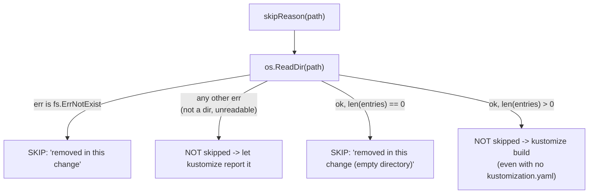
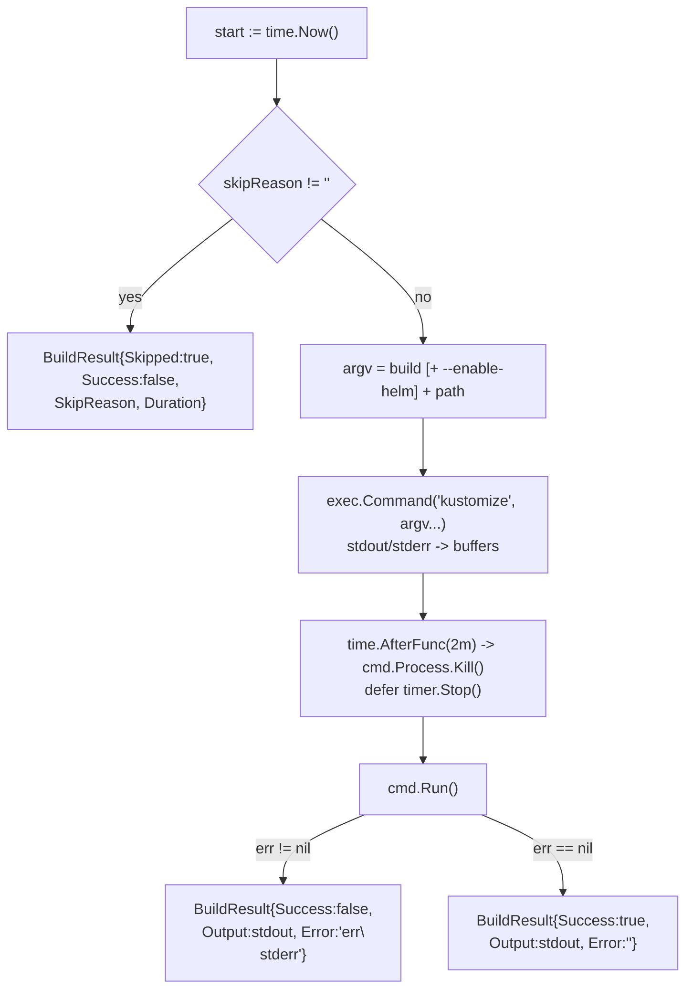

## SPECIFICATION: Build Execution & Skip Semantics (affected paths → success / failure / skipped)
**Version:** 1.0
**Status:** Draft
**Date:** 2026-08-12
**Type:** feature (retro-spec of shipped behaviour)
**Slug:** build-execution

**Unit under spec:** `internal/builder` (`builder.go`)
**Input contract:** `internal/analyzer` (`GetAffectedKustomizations`) — see
[impact-analysis.spec.md](./impact-analysis.spec.md)
**Upstream:** `internal/git` (`GetChangedFiles`) — see
[change-detection.spec.md](./change-detection.spec.md)
**Downstream:** `internal/reporter` (`GenerateSummary`, GitHub outputs), `cmd/action` (exit code)
**Runtime dependencies:** `kustomize` and (for `--enable-helm`) `helm` on `PATH`

> This is a **retro-spec**. It documents behaviour that is already shipped and already
> covered by tests. The code is the source of truth; every behavioural claim below carries a
> `file:line` citation. Nothing here proposes a change. Things the code does *not* do are
> recorded as known limitations (§9) or observations (§10), never as unmet requirements.
> `design.md` is the original architecture sketch and is **not** authoritative where it
> diverges from the code (see §9).

---

### 1. Overview

Build execution is stage 5 of the `kustomize-build-check` pipeline
(`git diff → discovery → dependency graph → impact analysis → build → report`, CLAUDE.md).
It takes the list of affected kustomize directories produced by impact analysis and, for
each one in turn, either runs `kustomize build [--enable-helm] <path>` as a child process
and records the outcome, or **skips** the path because the change under test removed it
(`internal/builder/builder.go:48-119`, `:145-155`). Every input path produces exactly one
`BuildResult`, classified as exactly one of *success*, *failure* or *skipped*
(`internal/reporter/reporter.go:45-54`).

The skip guard is the load-bearing part. Deletions are deliberately kept in the git diff
(`internal/git/git.go:31-35`), so a directory that a pull request legitimately deleted or
renamed still arrives here as a build candidate; handing it to `kustomize` produces a bogus
red check on a correct PR (`builder.go:52-55`). The guard exists to convert that into a
skip. Because this repo's correctness bar is asymmetric — **a false pass is worse than a
false fail** (CLAUDE.md) — the guard is deliberately *narrow*: it keys on "the change
removed this path", never on "this path has no kustomization file"
(`builder.go:121-126`). Over-filtering here is the single easiest way to make the whole
tool silently report green on broken manifests.

This repo is a `go-cli-tool` (`vega.yaml`) with one direct dependency (`gopkg.in/yaml.v3`,
`go.mod`); `internal/builder` imports stdlib only (`builder.go:3-12`).

### 2. Goals & Success Metrics

| Goal | Metric (as evidenced today) |
|---|---|
| Validate every surviving affected directory with a real `kustomize build` | `TestModifiedDirectoryStillBuilds` asserts the edited base *and* its dependent overlay both build (`pipeline_test.go:329-356`) |
| Never report a directory the change removed as a build failure | `TestConsolidateDuplicatedDirsIntoComponent` asserts `summary.Failed == 0` for the reported production scenario (`pipeline_test.go:218-220`); `TestDeletedDirectoryIsSkipped` (`:266-292`); `TestRenamedDirectoryValidatesNewPath` (`:295-325`) |
| Never let the skip guard hide a real breakage | `TestBrokenKustomizationStillFails` asserts `Skipped == 0` and `Failed > 0` (`pipeline_test.go:360-378`); `TestDirectoryPresentButKustomizationRemovedFails` asserts the same for a directory that lost only its kustomization file (`:386-407`) |
| Keep skipped paths out of both the success and the failure counts | `Total == Success + Failed + Skipped` asserted in `pipeline_test.go:257-261`; enforced by the mutually exclusive switch at `reporter.go:45-54` |
| Skipped paths never fail the workflow | Exit code reads `summary.Failed` only (`cmd/action/main.go:105-108`); reported production scenario now yields `7 total, 4 successful, 0 failed, 3 skipped, exit 0` (reproduced end-to-end, brief Step 5C) |
| A build that hangs cannot hang the CI job forever | Per-build 2-minute kill timer (`builder.go:44`, `:85-89`) — *no automated test, see §10* |

### 3. Functional Requirements

All requirements describe **shipped** behaviour.

| ID | Priority | Requirement | Evidence |
|---|---|---|---|
| F-01 | P0 | `BuildAll(paths, enableHelm)` returns exactly one `BuildResult` per input path, in input order, and never drops or reorders paths. | `builder.go:146-155` (pre-sized slice `:147`, ordered append `:149-152`) |
| F-02 | P0 | Execution is **sequential**: paths are built one at a time in a plain `for` loop. There is no worker pool, no concurrency limit and no parallel option in the shipped signature. | `builder.go:149-152`; interface `builder.go:32-35` |
| F-03 | P0 | Execution does **not** stop early. A failure at path *i* does not prevent paths *i+1…n* from being built. | No `break`/`return` in the loop, `builder.go:149-152` |
| F-04 | P0 | Before any process is started, `Build` consults `skipReason(path)`. A non-empty reason short-circuits into a skipped result and `kustomize` is never invoked for that path. | `builder.go:56-65` |
| F-05 | P0 | **Skip condition A — path absent.** If `os.ReadDir(path)` returns an error matching `fs.ErrNotExist`, the reason is `"removed in this change"`. | `builder.go:128-131`; `TestBuildSkipsMissingDirectory` (`builder_test.go:11-28`); `TestDeletedDirectoryIsSkipped` (`pipeline_test.go:266-292`) |
| F-06 | P0 | **Skip condition B — path present but empty.** If the directory reads successfully and contains zero entries, the reason is `"removed in this change (empty directory)"`. Rationale in code: git cannot represent an empty directory, so a fresh checkout would not have this path at all; it only survives in reused workspaces where moving the last file out leaves the directory behind. | `builder.go:135-140`; `TestBuildSkipsEmptyDirectory` (`builder_test.go:33-47`) |
| F-07 | P0 | **Non-skip — everything else.** Any other `os.ReadDir` error (not a directory, unreadable, permission denied) returns `""`, i.e. the path is handed to `kustomize` so kustomize reports the problem. | `builder.go:132-134` |
| F-08 | P0 | **Non-skip — the guard never inspects for a kustomization file.** A directory that still holds content but has lost its `kustomization.yaml` is a genuine error and is handed to `kustomize`, which fails it. Directory existence, not kustomization presence, is the key. | `builder.go:121-126`, `:135-142`; `TestBuildDoesNotSkipExistingDirectoryWithoutKustomization` (`builder_test.go:52-63`); `TestDirectoryPresentButKustomizationRemovedFails` (`pipeline_test.go:386-407`) |
| F-09 | P0 | A skipped result sets `Skipped=true`, `Success=false`, a non-empty `SkipReason`, and leaves `Output` and `Error` empty. | `builder.go:58-64`; asserted field-by-field in `builder_test.go:16-27` |
| F-10 | P0 | The command invoked is the bare name `kustomize`, resolved through `PATH`, with argv `["build", (optional) "--enable-helm", <path>]` in that order. | `builder.go:67-71`, `:78` |
| F-11 | P0 | `--enable-helm` is appended **only** when the `enableHelm` argument is true; it is never passed unconditionally. | `builder.go:68-70` |
| F-12 | P0 | `enableHelm` is derived in `cmd/action` from `INPUT_ENABLE-HELM`, defaulting to `"true"`, and is true only on the exact string `"true"`. | `cmd/action/main.go:26`; input declared with default `'true'` at `action.yml:15-18` |
| F-13 | P0 | The released image ships `kustomize v5.3.0` and `helm v3.16.2` on `/usr/local/bin`; helm is installed specifically because `--enable-helm` needs it. | `Dockerfile:20`, `:23-25`, `:27-28`, `:32` |
| F-14 | P0 | stdout and stderr are captured into **separate** in-memory buffers, never streamed to the parent's stdio. | `builder.go:80-82` |
| F-15 | P0 | On exit 0: `Success=true`, `Skipped=false`, `Output` = captured stdout (the rendered manifests), `Error=""`. | `builder.go:112-118` |
| F-16 | P0 | On any `cmd.Run()` error: `Success=false`, `Skipped=false`, `Output` = whatever stdout was captured, `Error` = the Go error rendered by `%v`, then a newline, then the full captured stderr. | `builder.go:94-106`, format string `:103` |
| F-17 | P0 | Each `Build` call arms its **own** 2-minute timer. The timeout is therefore **per build, not global across `BuildAll`**; worst-case wall clock for *n* paths is *n* × 2 minutes. | `builder.go:44`, `:85-89` (timer created inside `Build`), loop `:149-152` |
| F-18 | P0 | On timeout the timer logs at WARN and calls `cmd.Process.Kill()`; the kill error is deliberately ignored because the process may already have exited. | `builder.go:85-88` |
| F-19 | P0 | The timer is stopped via `defer` as soon as `Build` returns, so a completed build does not leave a pending kill. | `builder.go:89` |
| F-20 | P0 | A killed process surfaces through the ordinary failure path (F-16): `Success=false`, `Skipped=false`, with the signal reflected in `Error`. There is **no dedicated timeout field or flag** on `BuildResult`. | `builder.go:91-106`; `BuildResult` has no timeout field, `builder.go:14-29`. See §10 O-1 for the distinguishability gap. |
| F-21 | P1 | `Duration` is measured from the top of `Build` (before the skip check) to immediately after `cmd.Run()` returns, so it includes the `os.ReadDir` guard and process spawn, not just kustomize's own runtime. | `builder.go:50`, `:92` |
| F-22 | P1 | Skipped results also carry a `Duration`, measuring only the skip check. | `builder.go:63` |
| F-23 | P1 | The timeout is a private field on the unexported `builder` struct, fixed at 2 minutes by `New()`. There is no setter, no option and no action input that changes it. | `builder.go:37-46`; inputs read at `cmd/action/main.go:25-28` |
| F-24 | P0 | Downstream classification is mutually exclusive and checks `Skipped` **first**: skipped → `Skipped++`, else success → `Success++`, else → `Failed++`. Hence `Total == Success + Failed + Skipped`. | `reporter.go:45-54`, invariant documented `reporter.go:15-17`, asserted `pipeline_test.go:257-261` |
| F-25 | P0 | Skipped never influences the exit code. `cmd/action` exits 1 only when `failOnError && summary.Failed > 0`; otherwise exit 0, printing the skipped count when non-zero. | `cmd/action/main.go:102-115` |
| F-26 | P1 | Skipped paths are surfaced distinctly to the user: a `⏭️` console line with the reason, a dedicated "Skipped" section in the step summary, and a `skipped-count` action output. | `reporter.go:71-72`, `:188-197`, `:130`; output declared `action.yml:45` |
| F-27 | P1 | The failure section of the step summary filters on `!Success && !Skipped`, so a skipped path can never be rendered as a build error. | `reporter.go:171` |
| F-28 | P2 | Build progress is traceable at DEBUG: start (with path, `enable_helm`, argv), success, failure, and skip each emit a `slog.Debug`; only the timeout kill is WARN. | `builder.go:57`, `:73-76`, `:86`, `:95-98`, `:108-110`; level from `LOG_LEVEL` at `cmd/action/main.go:126-154` |

### 4. Non-Functional Requirements

| ID | Category | Requirement (as shipped) | Evidence |
|---|---|---|---|
| NF-01 | Correctness | The skip guard must remain the narrowest predicate that fixes the reported bug. Any widening (e.g. skipping on "no kustomization file found") converts a real failure into a silent pass and violates the CLAUDE.md correctness bar. | `builder.go:121-126`; guarded by `pipeline_test.go:386-407` and `builder_test.go:52-63` |
| NF-02 | Correctness | A skipped result must never be readable as a success. `Success` is explicitly documented as "true only for a build that ran and exited 0", and consumers must check `Skipped` before treating `!Success` as an error. | `builder.go:17-23`; asserted `builder_test.go:19-21`, `:43-45`, `pipeline_test.go:243-247`, `:289-291` |
| NF-03 | Robustness | No path in `Build` returns an unpopulated result: every exit constructs a `BuildResult` with `Path` set. `BuildAll` propagates whatever `Build` returned without post-processing. | `builder.go:58-64`, `:99-105`, `:112-118`, `:150-151` |
| NF-04 | Availability | A hung `kustomize` (e.g. a chart fetch stalling on the network under `--enable-helm`) cannot block the CI job indefinitely; it is killed after 2 minutes per path. | `builder.go:44`, `:85-88` |
| NF-05 | Dependencies | `internal/builder` uses stdlib only (`bytes`, `errors`, `fmt`, `io/fs`, `log/slog`, `os`, `os/exec`, `time`). This satisfies the "reuse before you build" rule in CLAUDE.md. | `builder.go:3-12` |
| NF-06 | Resource use | Rendered manifests are held fully in memory per build (`bytes.Buffer` → `Output` string) and are additionally marshalled into the `results` JSON action output. Output size is unbounded by the code. | `builder.go:80-82`, `:116`; `reporter.go:121`, `:131` |
| NF-07 | Portability | `kustomize` is resolved via `PATH`, not an absolute path, so the tool works both inside the released image and on a developer machine / integration test host. | `builder.go:78`; tests skip when the binary is absent, `pipeline_test.go:142-148` |
| NF-08 | Security | The image runs the binary as non-root UID 1001 and git is configured to trust any directory; the builder itself passes the path through to `kustomize` without shell interpolation (`exec.Command`, no shell). | `Dockerfile:36-42`, `:54`; `builder.go:78` |

### 5. Data Model & Flows

**`BuildResult`** (`builder.go:14-29`) — the single record produced per input path:

| Field | Type | Meaning (verbatim intent from the code comments) |
|---|---|---|
| `Path` | `string` | The path that was considered. Absolute, as produced by impact analysis. |
| `Success` | `bool` | "true only for a build that ran and exited 0. A skipped result is neither a success nor a failure, so check `Skipped` before treating `!Success` as a build error." (`builder.go:17-19`) |
| `Skipped` | `bool` | "marks a path that was never handed to kustomize because the change removed it. Skipped results are excluded from both the success and the failure counts." (`builder.go:21-23`) |
| `SkipReason` | `string` | Non-empty exactly when `Skipped`; one of the two strings in F-05/F-06. |
| `Output` | `string` | Captured stdout. Rendered manifests on success; partial output on failure; empty when skipped. |
| `Error` | `string` | `"<go error>\n<stderr>"` on failure; empty on success and on skip. |
| `Duration` | `time.Duration` | Wall clock inside `Build` (F-21, F-22). |

**Ownership.** `internal/builder` owns the three-way classification *at the record level*
(`Skipped` / `Success`). `internal/reporter` owns the *aggregate* counts and the invariant
`Total = Success + Failed + Skipped` (`reporter.go:12-21`, `:45-54`). `cmd/action` owns the
exit code and consumes only `summary.Failed` (`main.go:105`).

**Skip decision (`skipReason`, `builder.go:127-143`):**



**Per-path execution flow (`Build`, `builder.go:48-119`):**



### 6. API / Interface Contracts

```go
// internal/builder/builder.go:31-35
type Builder interface {
    Build(path string, enableHelm bool) BuildResult
    BuildAll(paths []string, enableHelm bool) []BuildResult
}

func New() Builder // builder.go:41-46 — fixed 2-minute per-build timeout
```

- **`Build(path, enableHelm) BuildResult`** — never returns an error value; all outcomes are
  encoded in the returned struct (`builder.go:48-119`). Never panics on a missing path: the
  guard runs before any process work (`builder.go:56`).
- **`BuildAll(paths, enableHelm) []BuildResult`** — `len(result) == len(paths)`, order
  preserved (`builder.go:146-154`). A `nil`/empty slice yields an empty, non-nil slice
  (`builder.go:147`); `cmd/action` short-circuits before this when nothing is affected
  (`main.go:63-76`).
- **`skipReason(path string) string`** (unexported, `builder.go:127-143`) — pure predicate,
  no side effects beyond one `os.ReadDir`. Empty string means "build it".

**Child process contract:**

| Aspect | Value | Evidence |
|---|---|---|
| Executable | `kustomize`, resolved via `PATH` | `builder.go:78` |
| Argv | `build [--enable-helm] <path>` | `builder.go:67-71` |
| Working directory | inherited (not set) | `builder.go:78` (no `cmd.Dir`) |
| Environment | inherited (not set) | `builder.go:78-82` (no `cmd.Env`) |
| stdin | not connected | `builder.go:80-82` |
| stdout / stderr | separate `bytes.Buffer`s | `builder.go:80-82` |
| Success signal | `cmd.Run()` returning `nil` (exit 0) | `builder.go:91`, `:112-118` |
| Timeout | 2 min per invocation, enforced by `SIGKILL` via `Process.Kill()` | `builder.go:44`, `:85-88` |

**Action-surface contract (consumed by the wrapper action):**

| Surface | Value | Evidence |
|---|---|---|
| Input `enable-helm` | default `'true'`; read as `INPUT_ENABLE-HELM`, compared to `"true"` | `action.yml:15-18`; `main.go:26` |
| Output `skipped-count` | `summary.Skipped` | `reporter.go:130`; `action.yml:45` |
| Output `results` | JSON array of `BuildResult`, including `Output`, `Skipped` and `SkipReason` | `reporter.go:121`, `:131`; `action.yml:36` |
| Exit code | 1 iff `fail-on-error` and `Failed > 0`; skips never contribute | `main.go:102-115` |

### 7. Acceptance Criteria

Each criterion is satisfied by shipped code and named tests.

- [ ] **AC-1 — The reported production scenario passes.** Three byte-identical overlay
  directories consolidated into one shared component: `summary.Failed == 0`, every surviving
  overlay (`dev`, `int`, `acc`) has `Success == true`, and every removed
  `.../s3-synchronisation` path that reached the build step has `Skipped == true` and
  `Success == false`. **Test:** `TestConsolidateDuplicatedDirsIntoComponent`
  (`internal/integration/pipeline_test.go:197-262`). Before the guard this scenario failed CI
  with `must build at directory: not a valid directory: evalsymlink failure ... no such file
  or directory`; after it, `7 total, 4 successful, 0 failed, 3 skipped, exit 0`.
- [ ] **AC-2 — A deleted directory is skipped, not failed.** Deleting `overlays/obsolete`
  yields `Failed == 0`, a result for that path with `Skipped == true` and a non-empty
  `SkipReason`, and `Success == 0`. **Test:** `TestDeletedDirectoryIsSkipped`
  (`pipeline_test.go:266-292`).
- [ ] **AC-3 — A rename validates the new path and never fails the old one.** After
  `overlays/staging → overlays/preprod`: `Failed == 0`, the destination has `Success == true`,
  and the old path is either absent from the results or `Skipped == true` — never a failure.
  **Test:** `TestRenamedDirectoryValidatesNewPath` (`pipeline_test.go:295-325`).
- [ ] **AC-4 — The guard does not hide a broken kustomization.** A kustomization pointing at a
  non-existent resource yields `Failed > 0` **and** `Skipped == 0`. **Test:**
  `TestBrokenKustomizationStillFails` (`pipeline_test.go:360-378`).
- [ ] **AC-5 — A surviving directory that lost its kustomization file still fails.** Removing
  `base/kustomization.yaml` while `base/` keeps a changed sibling file yields `Skipped == 0`
  and `Failed > 0`. This is the precise boundary of the guard. **Test:**
  `TestDirectoryPresentButKustomizationRemovedFails` (`pipeline_test.go:386-407`).
- [ ] **AC-6 — Unit-level guard, absent path.** `Build` on a path that does not exist returns
  `Skipped == true`, `Success == false`, non-empty `SkipReason`, and `Error == ""`. **Test:**
  `TestBuildSkipsMissingDirectory` (`internal/builder/builder_test.go:11-28`).
- [ ] **AC-7 — Unit-level guard, empty directory.** `Build` on an existing but empty directory
  returns `Skipped == true` and `Success == false`. **Test:** `TestBuildSkipsEmptyDirectory`
  (`builder_test.go:33-47`).
- [ ] **AC-8 — Unit-level anti-over-filtering guard.** `Build` on an existing directory that
  contains `deployment.yaml` but no kustomization file returns `Skipped == false`. **Test:**
  `TestBuildDoesNotSkipExistingDirectoryWithoutKustomization` (`builder_test.go:52-63`).
- [ ] **AC-9 — Counts partition the results.** For any run,
  `Success + Failed + Skipped == Total`, with `Skipped` checked before `Success`. **Test:**
  asserted in `TestConsolidateDuplicatedDirsIntoComponent` (`pipeline_test.go:257-261`);
  implemented at `reporter.go:45-54`.
- [ ] **AC-10 — Nothing removed means nothing skipped.** An ordinary edit yields
  `Skipped == 0` and `Failed == 0`, with both the edited base and its dependent overlay
  reported `Success == true`. **Test:** `TestModifiedDirectoryStillBuilds`
  (`pipeline_test.go:329-356`).
- [ ] **AC-11 — Skips never fail the workflow.** With `Failed == 0` and `Skipped > 0`,
  `cmd/action` prints `All builds successful (N skipped)` and exits 0. **Evidence:**
  `cmd/action/main.go:102-115` (no automated test at the `main` level — see §10 O-4).
- [ ] **AC-12 — The deletion that *should* fail still fails.** Deleting a file that a
  surviving kustomization still references produces `Failed > 0`, the deleted file itself is
  not a build target, and the consuming directory is not skipped. This is the false-pass
  guard for the whole pipeline. **Test:** `TestDeletedResourceStillReferencedFails`
  (`pipeline_test.go:415-434`).

### 8. Edge Cases & Error Handling

| Scenario | Behaviour today | Evidence |
|---|---|---|
| Path deleted by the change | Skipped, reason `"removed in this change"` | `builder.go:130-131` |
| Path renamed away; old path still in the diff | Old path skipped (or never proposed, if git rename detection consumed it); new path built | `builder.go:130-131`; `pipeline_test.go:295-325`, note at `:318-324` |
| `git mv` left an empty directory in a reused workspace | Skipped, reason `"removed in this change (empty directory)"`. An existence-only check would hand it to kustomize and fail. | `builder.go:135-140`; `builder_test.go:30-47` |
| Directory exists, kustomization file deleted, siblings remain | **Not skipped.** Built and fails. | `builder.go:121-126`; `pipeline_test.go:386-407` |
| Directory exists, kustomization present but broken | **Not skipped.** Built and fails. | `pipeline_test.go:360-378` |
| Path is a regular file, not a directory | `os.ReadDir` errors with something other than `ErrNotExist` → not skipped → handed to kustomize, which reports the problem | `builder.go:132-134` |
| Directory unreadable (permissions) | Same as above: not skipped, kustomize reports it | `builder.go:132-134` |
| `kustomize` not on `PATH` | `cmd.Run()` returns a start error → ordinary failure result with the error text in `Error` | `builder.go:91`, `:99-105` |
| `--enable-helm` requested but `helm` missing | Not special-cased; kustomize's own error is captured from stderr into `Error` | `builder.go:103`; helm shipped in the image at `Dockerfile:27-34` |
| Build exceeds 2 minutes | Process killed; WARN logged; result is an ordinary failure (F-20) | `builder.go:85-88`, `:94-106` |
| Build completes before the timer fires | `defer timer.Stop()` cancels the pending kill | `builder.go:89` |
| `kustomize` writes to stderr but exits 0 | `Success == true`; stderr is discarded, since `Error` is only populated on the failure branch | `builder.go:112-118` |
| Build fails after emitting partial stdout | `Output` retains the partial stdout alongside `Error` | `builder.go:99-105` |
| Empty `paths` slice | Returns an empty slice; no processes started. `cmd/action` short-circuits earlier and exits 0. | `builder.go:147-154`; `main.go:63-76` |
| Duplicate paths in the input | Each occurrence is built independently and produces its own result; deduplication is the analyzer's job — see [impact-analysis.spec.md](./impact-analysis.spec.md) | `builder.go:149-152` |

### 9. Out of Scope

This spec covers `internal/builder` only. Explicitly **not** covered here:

- **Which paths are built.** Change detection and impact analysis decide that; see
  [change-detection.spec.md](./change-detection.spec.md) and
  [impact-analysis.spec.md](./impact-analysis.spec.md). In particular, the decision to keep
  deletions in the diff (`internal/git/git.go:31-35`) belongs to change detection — it is the
  reason this guard is needed, not part of this unit.
- **Rendering and reporting.** Console output, GitHub step summary and action outputs live in
  `internal/reporter`; only the skipped/failed/success contract between the two packages is
  specified here (F-24 to F-27).
- **Parallel execution.** `design.md:266-276` sketches
  `BuildAll(paths, enableHelm, parallel bool)` and an "optional worker pool". Neither shipped:
  the real signature has no `parallel` parameter (`builder.go:34`) and the loop is serial
  (`builder.go:149-152`). Sequential execution is documented here as current behaviour; **no
  concurrency requirement is asserted and none is proposed.**
- **Configurable timeout.** Not shipped (F-23). The `kustomize-version` input declared at
  `action.yml:20-23` is likewise not read by `cmd/action` (`main.go:25-28`); the image pins
  kustomize at `Dockerfile:20`. Recorded as a known limitation, not a defect to fix in this
  spec.
- **`--load-restrictor` and other kustomize flags.** Only `--enable-helm` is ever passed
  (`builder.go:67-71`); `design.md:586` lists load-restrictor support as a future idea.
- **Constitution-pinned concerns.** Per `vega.yaml` and CLAUDE.md this repo has no GitOps,
  secret-manager, registry or cluster bindings; nothing here references them.

### 10. Open Questions

| ID | Observation | Owner | Status |
|---|---|---|---|
| O-1 | **A timeout kill is not distinguishable from an ordinary build failure in `BuildResult`.** The killed process takes the same failure branch (`builder.go:94-106`) with no dedicated field or flag (`builder.go:14-29`). The only traces are the WARN log line (`builder.go:86`) and whatever `%v` renders for the signal in `Error` (`builder.go:103`), which an externally-killed process (e.g. OOM) could also produce. Recorded as an observation of shipped behaviour; **no behaviour is asserted about telling the two apart.** | maintainer | Open, no change proposed |
| O-2 | **The timeout path has no automated test.** No test in the repo exercises the 2-minute timer (`grep timeout` matches only `builder.go:38,41,44,84,85,86`), so F-17/F-18/F-19/NF-04 are code-evidenced but not test-evidenced. | maintainer | Open |
| O-3 | **Skip behaviour for a symlink whose target is missing is untested.** `os.ReadDir` follows symlinks, so a dangling symlink would plausibly surface as `fs.ErrNotExist` and be skipped (`builder.go:128-131`) — but no test covers it and the code does not special-case symlinks. Flagged rather than asserted. | maintainer | Open |
| O-4 | **AC-11 is evidenced at the `cmd/action` source level only** (`main.go:102-115`). The integration tests reproduce the pipeline (`pipeline_test.go:113-140`) but call the packages directly and do not assert a process exit code. | maintainer | Open |
| O-5 | **Unbounded `Output` in the `results` action output.** Rendered manifests for every successful build are marshalled into `GITHUB_OUTPUT` (`reporter.go:121`, `:131`). No size limit exists in the code, whereas the step summary *does* truncate errors (`reporter.go:176-179`). Recorded as an asymmetry, not a defect. | maintainer | Open |

**Assumptions** (mode = autonomous):

- Assumed the timeout is documented exactly as implemented, i.e. **per-build** rather than
  global, because the timer is created inside `Build` (`builder.go:85`) which `BuildAll` calls
  once per path (`builder.go:150`). [Risk: low — directly readable from the code]
- Assumed the killed-process outcome must **not** be asserted as a distinct behaviour, since
  the code provides no distinguishing field; recorded as O-1 instead, per the brief's
  instruction. [Risk: low]
- Assumed sequential execution is documented as current behaviour with **no** concurrency
  requirement and no proposal to parallelise, per the brief and `builder.go:149-152`.
  [Risk: low]
- Assumed `design.md`'s `parallel bool` parameter and worker-pool note are stale design
  sketch, not shipped contract, because the interface at `builder.go:32-35` has no such
  parameter. Recorded in §9 rather than as a gap. [Risk: low]
- Assumed the two `SkipReason` strings are part of the observable contract (they reach users
  via the console line at `reporter.go:72` and the step summary at `reporter.go:193`), so they
  are quoted verbatim in F-05/F-06. [Risk: low]
- Assumed the tool-version facts (`kustomize v5.3.0`, `helm v3.16.2`) are true **of this
  repo's image** as pinned in `Dockerfile:20,28`. No claim is made about what is current or
  latest upstream. [Risk: low]

### 11. Planner Handoff Notes

This is a retro-spec; there is nothing to implement. These notes are for a future planner
touching `internal/builder`.

**Dependencies to resolve first**
- Read [impact-analysis.spec.md](./impact-analysis.spec.md) before touching the input
  contract: the analyzer deliberately defers "does this path still exist?" to this stage, so
  the two specs are coupled at exactly one point — the skip guard.
- Read [change-detection.spec.md](./change-detection.spec.md) and the comment at
  `internal/git/git.go:31-35` before any change that narrows what reaches the builder.

**Risk areas, in descending order**
1. **`skipReason` (`builder.go:127-143`) is the highest-risk function in the repository.**
   Every widening of it trades a false fail for a possible false pass, which CLAUDE.md ranks
   as strictly worse. `TestDirectoryPresentButKustomizationRemovedFails` and
   `TestBuildDoesNotSkipExistingDirectoryWithoutKustomization` are the only things standing
   between this guard and a silently-green CI check; they must never be weakened or deleted.
2. **The `Skipped` / `Success` / `Failed` partition** (`reporter.go:45-54`) — `Skipped` must
   stay the first branch. Any consumer that reads `!Success` as "failed" reintroduces the bug
   at the reporting layer (`builder.go:17-19` says so explicitly).
3. **The `Error` string format** (`builder.go:103`) is parsed by nobody in-repo but is
   published verbatim in the `results` JSON and the step summary; treat it as a public
   surface.
4. **Sequential execution** — the integration tests shell out to real `git` and `kustomize`
   (`pipeline_test.go:1-8`, `:142-148`); any parallelisation work must keep result ordering
   (F-01) and per-path timeout isolation (F-17), and must not let the tests silently skip in
   CI (CLAUDE.md).

**Suggested order for any future work in this package**
1. Close O-2 (a timeout test) before touching the timer, since F-17/F-18/F-19 are currently
   unguarded.
2. Only then consider anything that changes process lifecycle.
3. Treat O-1, O-3 and O-5 as spec-first items: they need a spec amendment before code.

**Estimated complexity, if the observations in §10 were ever addressed**

| Item | Size |
|---|---|
| O-2, timeout regression test | S |
| O-3, symlink case test | S |
| O-1, distinguishable timeout outcome (new field + reporter + JSON output surface) | M |
| O-5, bounding `Output` in the `results` output | M |
| Configurable timeout (input → `New` option → action.yml → wrapper action) | M |
| Parallel `BuildAll` while preserving F-01/F-03/F-17 | L |
