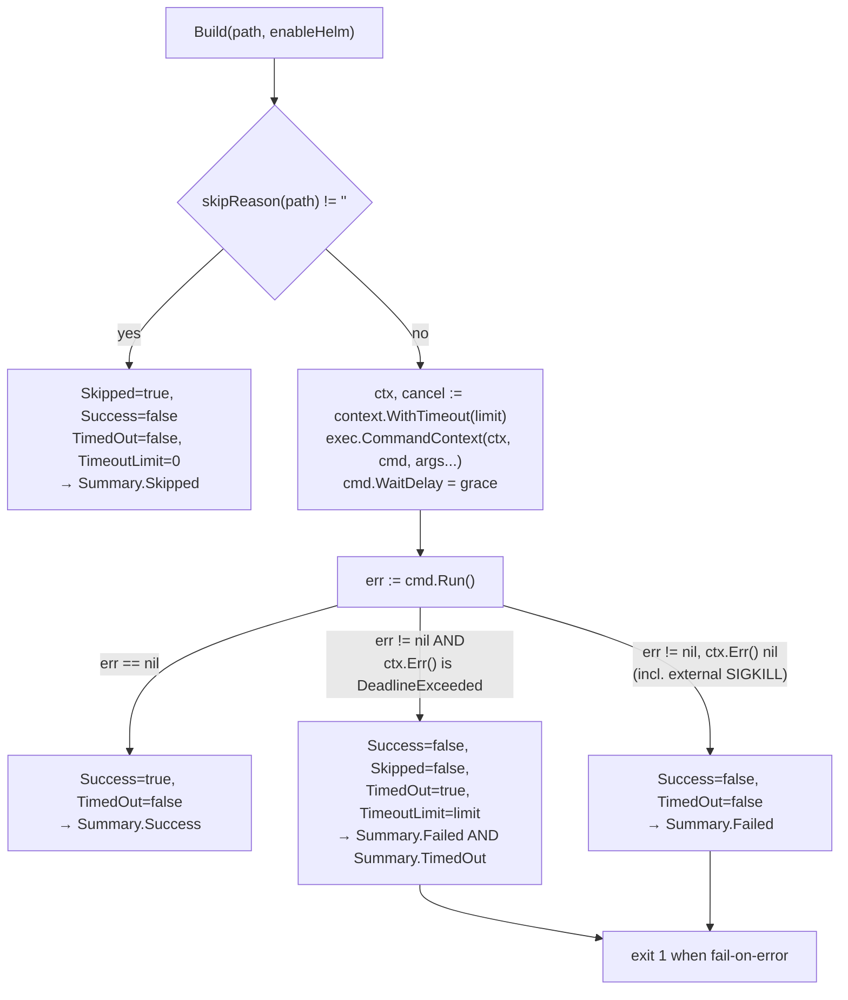
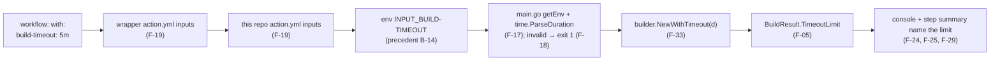

## SPECIFICATION: Build Timeout Handling (a killed build must be diagnosable, and the limit must be configurable)
**Version:** 1.0
**Status:** Shipped
**Date:** 2026-08-12
**Type:** feature
**Slug:** build-timeout-handling

**Unit under spec:** `internal/builder` (`builder.go`), with required changes in `internal/reporter`
(`reporter.go`), `cmd/action/main.go`, and the `inputs:` block of **both** `action.yml` files
**Supersedes:** observations **O-1** and **O-2** in
[build-execution.spec.md](./build-execution.spec.md) §10, and the current-behaviour statements
F-17, F-18, F-19, F-20, F-23 and NF-04 in that spec (see §11, "Specs to amend after implementation")
**Depends on:** [result-reporting.spec.md](./result-reporting.spec.md) for the counting rules
(F-02, F-03) and the **public output contract** (F-19, NF-02)

> **This spec proposes a change.** Unlike `build-execution.spec.md` and `result-reporting.spec.md`,
> which are retro-specs, §3 onward describes behaviour that does **not** exist yet. §2.1 is the
> current-behaviour baseline and is the only part of this document that describes shipped code;
> every claim in it carries a `file:line` citation. Requirements are stated in the imperative
> (MUST / MUST NOT) and are clearly separated from that baseline.

---

### 1. Overview

Every `kustomize build` this tool runs is bounded by a hardcoded 2-minute kill timer
(`internal/builder/builder.go:44`, `:85-89`). When that timer fires, the resulting `BuildResult`
is **indistinguishable from an ordinary build failure**: `BuildResult` has no timeout field
(`builder.go:14-29`), so the killed process falls through the same failure branch as a rejected
kustomization (`builder.go:94-106`), and the console line (`reporter.go:76`), the step-summary
"Build Errors" section (`reporter.go:168-186`), the `results` JSON (`reporter.go:121`) and the
exit code (`main.go:105-108`) all render it as "this kustomization is broken". The only trace
that a time limit was involved is a single `slog.Warn` line on stderr (`builder.go:86`) that CI
logs bury.

That is a **misdiagnosis**, and misdiagnosis is the defect this spec fixes. Per CLAUDE.md's
correctness bar, a timed-out build has *not* been validated, so it can never be allowed to pass
or to let the run exit 0 — but a timeout is usually an environment or performance problem (a
`--enable-helm` chart fetch stalling on the network, a cold cache, a slow runner) rather than a
broken manifest, and telling the user "your kustomization is broken" sends them to debug the
wrong thing. This spec keeps the verdict red and makes the reason obvious.

It also makes the limit an input (`build-timeout`), because the current 2 minutes is unarguable
from outside the binary (`builder.go:37-46`; inputs read at `main.go:25-28`), and it adds the
first automated coverage of the timeout path, which has none today (`builder_test.go`, entire
file: three tests, all about the skip guard).

This repo is a `go-cli-tool` (`vega.yaml`) with exactly one direct dependency
(`gopkg.in/yaml.v3`, `go.mod:5`). **No new dependency is proposed.** The whole change is stdlib:
`context`, `errors` and `os/exec`, which `internal/builder` already imports two of
(`builder.go:3-12`).

---

### 2. Goals & Success Metrics

- **G-1: A timed-out build can never be read as a pass.** → Metric: a timed-out result has
  `Success == false`, is counted in `Summary.Failed` (`reporter.go:45-54`), and with
  `fail-on-error` at its default the process exits 1 (`main.go:105-108`). No new input and no new
  outcome state can suppress that. (AC-1, AC-2)
- **G-2: A timed-out build is never presented as a rejected kustomization.** → Metric: the
  console line, the step summary and the `results` JSON each name the time limit explicitly, and
  a timed-out result does **not** appear in the step summary's `### ❌ Build Errors` section.
  (AC-3, AC-4, AC-5)
- **G-3: The outcome is machine-readable, not string-matched.** → Metric: consumers can
  distinguish a timeout by reading the boolean `TimedOut` field in the `results` JSON, without
  parsing the free-text `Error` string. (AC-6)
- **G-4: The limit is configurable and the configuration is honest.** → Metric: a `build-timeout`
  input exists, is declared in **both** `action.yml` files, is actually read by the binary, and a
  malformed value fails the run before any build starts rather than being silently ignored.
  (AC-7, AC-8, AC-9)
- **G-5: The per-build limit is a real wall-clock bound.** → Metric: a build whose child process
  leaves a descendant holding the output pipe returns within `limit + grace`, not when the
  descendant exits. (AC-10) — this is currently **not** true; see §2.1 B-8.
- **G-6: The path is tested without a real slow kustomize.** → Metric: `go test ./internal/builder`
  covers the timeout classification and the wall-clock bound in under 2 seconds, with no
  dependency on `kustomize` being installed. (AC-11)

#### 2.1 Current-behaviour baseline (shipped code, cited; nothing here is a requirement)

| ID | Current behaviour | Evidence |
|---|---|---|
| B-1 | The timeout is a private field on the unexported `builder` struct, set to `2 * time.Minute` by `New()`. There is no setter, no option, no input. | `builder.go:37-46`; inputs read at `main.go:25-28` |
| B-2 | The timer is created **inside** `Build`, so the limit is **per build, not per run**. `BuildAll` calls `Build` once per path in a serial loop, so worst-case wall clock for *n* paths is *n* × 2 minutes. | `builder.go:85` inside `Build` (`:49-119`); loop `builder.go:149-152` |
| B-3 | Enforcement is a hand-rolled `time.AfterFunc` that logs at WARN and calls `cmd.Process.Kill()`, ignoring the error "because the process might have already exited". `defer timer.Stop()` cancels it on a normal return. | `builder.go:85-89` |
| B-4 | A killed process takes the **ordinary failure branch**: `Success=false`, `Skipped=false`, `Output` = captured stdout, `Error` = `fmt.Sprintf("%v\n%s", err, stderr)`. `BuildResult` has no timeout field. | `builder.go:91`, `:94-106`, format `:103`; struct `builder.go:14-29` |
| B-5 | What the caller can actually observe after the kill, **verified this session** by executing the same `time.AfterFunc` + `cmd.Process.Kill()` pattern: `cmd.Run()` returns an `*exec.ExitError` whose `%v` rendering is exactly `signal: killed`, with `ExitCode() == -1` and `Exited() == false`. | Verified experimentally (Go 1.26.5 darwin/arm64; repo pins `go 1.25.3`, `go.mod:3`). Consistent with `builder.go:103` |
| B-6 | `signal: killed` is **not** a unique marker of *this* timer. Any external SIGKILL — the runner's OOM killer, a cancelled job, an operator — produces the identical string. So even a consumer willing to string-match `Error` cannot reliably tell "we killed it on our own time limit" from "something else killed it". | B-5 plus the absence of any other signal in `builder.go:94-106` |
| B-7 | **Kill/exit race, benign direction:** if the timer fires *after* `cmd.Run()` has reaped the process but *before* `defer timer.Stop()` runs, `cmd.Process.Kill()` returns `os.ErrProcessDone` and kills nothing. **Verified this session**: `Kill()` on a reaped process returns `os: process already finished` / `errors.Is(err, os.ErrProcessDone) == true`; Go's `os.Process` records that the process was waited for, so there is no PID-recycling hazard. The ignored error at `builder.go:87` is therefore correct as written. | Verified experimentally; `builder.go:87` |
| B-8 | **The 2-minute limit is not actually a wall-clock bound.** `cmd.Stdout`/`cmd.Stderr` are `bytes.Buffer`s, not `*os.File`s (`builder.go:80-82`), so `os/exec` creates pipes and goroutines, and `cmd.Run()`'s `Wait` blocks until those pipes are closed. Killing only the direct child does not close a pipe that a **grandchild** inherited. **Verified this session**: a child that spawns a background grandchild and is killed at t=300 ms caused `Run()` to return at **t≈10 s**, when the grandchild exited. This matters here specifically because `--enable-helm` makes kustomize execute the `helm` binary as a subprocess — the image installs helm for exactly that reason (`Dockerfile:27-28`) — and chart fetching is the realistic way a build gets slow. | Verified experimentally; `builder.go:80-82`, `:85-91`; `Dockerfile:27-34` |
| B-9 | **Kill-before-start race, latent:** the timer is armed at `builder.go:85`, *before* `cmd.Run()` (which calls `Start`) at `:91`. If it ever fired in that window, `cmd.Process` would still be nil. **Verified this session**: `cmd.Process` is nil before `Start`, and `(*os.Process)(nil).Kill()` **panics** with a nil-pointer dereference. At a 2-minute limit this is unreachable in practice; it becomes reachable the moment the timeout is made small (as testing requires). | Verified experimentally; `builder.go:85-91` |
| B-10 | **No test exercises the timeout path.** `builder_test.go` contains three tests, all about the skip guard (`:11-28`, `:33-47`, `:52-63`). Nothing constructs a builder with a short timeout, and `New()` offers no way to. | `builder_test.go` (whole file); `builder.go:41-46` |
| B-11 | Downstream, a killed build is counted by the `default:` arm as `Failed++` (`reporter.go:51-53`), rendered as `❌ <path> - Build failed` (`reporter.go:76`) with `signal: killed` as the first error line (`reporter.go:77-88`), listed in `### ❌ Build Errors` (`reporter.go:168-186`, filter `:171`), and drives `os.Exit(1)` (`main.go:105-108`). | as cited |
| B-12 | `Skipped` already established the pattern of a third outcome, and forced the `!result.Success && !result.Skipped` guard so a non-failure is not rendered as a build error. | `builder.go:21-25`; `reporter.go:47-48`, `:71-72`, `:171` |
| B-13 | **Precedent for a declared-but-unimplemented input (a trap to avoid):** `kustomize-version` is declared in this repo's `action.yml:20-23`, is **not** declared in the wrapper's `action.yml` (whole `inputs:` block, `kustomize-build-check-action/action.yml:9-28`), and is **never read** by the binary (the only `getEnv("INPUT_...")` calls are `main.go:25-28`). The kustomize version is fixed in the image at `Dockerfile:20`. A new input must not repeat this: it has to be wired through **both** `action.yml` files **and** `main.go`. | as cited |
| B-14 | Inputs reach the binary as `INPUT_<NAME>` environment variables with the hyphen preserved (`INPUT_BASE-REF`, `INPUT_ENABLE-HELM`, `INPUT_FAIL-ON-ERROR`, `INPUT_ROOT-DIR`). This is repo precedent from working production behaviour, not an external claim. | `main.go:25-28` vs `action.yml:9-33` |
| B-15 | The wrapper action pins this repo's image by SHA, so an input added here is invisible to consumers until that pin is bumped. | `kustomize-build-check-action/action.yml:45` |

---

### 3. Functional Requirements

Priority scale: P0 = launch blocker, P1 = important, P2 = nice-to-have.
Everything below is **required future behaviour**.

#### 3.1 Decision 1 — a timeout is a failure carrying a machine-readable cause, not a fourth outcome

**Reasoning (required by the brief, recorded here rather than in a comment).** Two candidate
models were considered.

*Model A, a fourth mutually exclusive state* (`TimedOut` alongside `Skipped`/`Success`/`Failed`).
`Skipped` earns its place as a third state because a skipped path has **nothing left to
validate** — the change removed it, so excluding it from `Failed` and from the exit code
(`main.go:102-108`) is correct. A timeout is the **opposite** situation: there *is* something to
validate and we failed to validate it. Making it a fourth arm of the `switch` at
`reporter.go:46-53` would remove it from `Summary.Failed`, which is the *only* build-derived
input to the exit code (`main.go:105`), so a repo where every affected build times out would
exit 0 with nothing validated. That is a false pass, which CLAUDE.md ranks as strictly worse than
a false fail. Model A is **rejected**.

*Model B, a failure with a distinguishing cause.* The result stays `Success=false, Skipped=false`,
is counted in `Failed`, and exits 1 — the verdict is unchanged from today — while a boolean field
on `BuildResult` carries *why*, and every human-facing surface renders that why. The cost is one
extra field and one extra branch in three render sites, and it needs the same kind of filter guard
that `Skipped` already forced (B-12). Model B is **chosen**.

| ID | Priority | Requirement | Notes |
|---|---|---|---|
| F-01 | P0 | A build killed for exceeding its time limit MUST have `Success == false`. It MUST NOT be reported, counted or serialised as a success under any configuration. | The build was never validated; CLAUDE.md's asymmetric bar. Reverses nothing today (B-4), but pins it. |
| F-02 | P0 | A timed-out build MUST have `Skipped == false` and MUST be counted in `Summary.Failed`. `TimedOut` MUST NOT become a fourth arm of the classification `switch` at `reporter.go:46-53`. | Preserves the `Skipped`-first ordering (result-reporting F-02) and the exit-code rule unchanged. |
| F-03 | P0 | The invariant `Total == Success + Failed + Skipped` MUST continue to hold exactly as today (result-reporting F-03, asserted `reporter_test.go:35-38`). Any new timeout counter is a **sub-count of `Failed`**, not a new partition. | So `Failed >= TimedOut` always. |
| F-04 | P0 | `BuildResult` MUST gain `TimedOut bool`, true **iff** this build was killed by this tool for exceeding its configured limit. | The machine-readable cause. Wire-format impact in F-22. |
| F-05 | P0 | `BuildResult` MUST gain `TimeoutLimit time.Duration`, carrying the limit that applied to this build. It MUST be populated on every result produced by the exec path (timed out or not) and left zero on skipped results (`builder.go:56-65`). | The reporter is stateless (`reporter.go:31`) and has no access to configuration, so the limit must travel on the result for the user-facing message (F-16, F-19) to be able to name it. |
| F-06 | P0 | `TimedOut` MUST be `true` only when the build both failed and hit *this tool's* deadline. Concretely: `err != nil && errors.Is(ctx.Err(), context.DeadlineExceeded)`. A build that exited 0 (`err == nil`) MUST stay a success even if the deadline elapsed in the meantime, and a process killed by something else (OOM killer, job cancellation) MUST remain an ordinary failure with `TimedOut == false`. | Fixes B-6: the discriminator is an in-process fact, not the ambiguous `signal: killed` string. |
| F-07 | P0 | `Summary` MUST gain a `TimedOut int` counter, incremented for every result with `TimedOut == true`, in addition to (not instead of) that result's `Failed++`. | Needed to gate the new report sections (F-18, F-19) without a second pass over the results. |
| F-08 | P0 | The exit-code rule MUST remain exactly `failOnError && summary.Failed > 0` (`main.go:105`). No timeout-specific gate, no `fail-on-timeout` input, no "tolerate timeouts" escape hatch. | Any such switch converts an unvalidated path into a green check — the false pass the constitution forbids. Users who want longer builds raise `build-timeout` (§3.3); they do not get to ignore the outcome. |

#### 3.2 Decision 6 — enforcement moves to `context` + `exec.CommandContext`

**Reasoning.** Verified against the code and by execution (B-3 through B-9): the hand-rolled
`time.AfterFunc` kill gives the caller **no** distinguishable signal (only `signal: killed`,
which an external kill also produces, B-5/B-6), carries a latent nil-`Process` panic at short
timeouts (B-9), and does not actually bound wall clock when a descendant holds the output pipe
(B-8). `exec.CommandContext` with `context.WithTimeout` is the stdlib replacement: it kills only
after `Start`, and it makes `ctx.Err() == context.DeadlineExceeded` available as an unambiguous
signal — **verified this session**: with a 200 ms deadline against a 5 s child, `Run()` returned
`signal: killed` and `errors.Is(ctx.Err(), context.DeadlineExceeded)` was `true`. It requires no
new dependency.

| ID | Priority | Requirement | Notes |
|---|---|---|---|
| F-09 | P0 | The `time.AfterFunc` kill timer (`builder.go:85-89`) MUST be replaced by a per-`Build` `context.WithTimeout` and `exec.CommandContext`. The context MUST be cancelled via `defer` before `Build` returns. | Removes B-9 entirely (`CommandContext` only kills a started process) and B-7 (no manual `Kill`). |
| F-10 | P0 | `cmd.WaitDelay` MUST be set to a non-zero grace period so that `Run()` cannot block past `limit + grace` when a grandchild inherits the output pipe. The grace MUST default to **5 seconds**, taken from an unexported package constant in `internal/builder`, and every exported constructor (`New`, `NewWithTimeout`) MUST set it. It MUST NOT be exposed as an action input, an environment variable, an exported field, an exported constructor parameter, or any other API reachable from outside `package builder`. The only permitted override is a struct literal inside `package builder`'s own tests, so F-36(d) can assert the mechanism without paying the production grace — the identical seam F-34 prescribes for the command name. | Closes B-8, which is the difference between a documented bound and a real one. **Verified this session**: the same grandchild scenario returned at ≈10 s with no `WaitDelay` and at ≈800 ms with `WaitDelay = 500 ms`. |
| F-11 | P0 | The limit MUST remain **per build**, armed inside `Build`, exactly as today (B-2). Worst-case run wall clock is therefore `n × (limit + grace)`. A whole-run budget is explicitly out of scope (§9, OQ-1). | Stated so the planner does not "fix" it silently. |
| F-12 | P0 | On timeout, `Error` MUST be a message that names the limit and the outcome, followed by any captured stderr — for example `timed out after 2m0.13s (limit 2m, set with the build-timeout input); process killed before it finished` + `\n` + stderr. It MUST NOT be left as the bare `signal: killed` of B-5. | `Error` stays free text on the wire (result-reporting §6.2). The **machine-readable** discriminator is `TimedOut` (F-04), never this string; nothing may parse it. |
| F-13 | P0 | `Output` MUST still carry whatever stdout was captured before the kill, as on any other failure (`builder.go:99-105`). | Partial render output is a diagnostic ("it stalled after emitting N manifests"). |
| F-14 | P1 | The timeout MUST still log at WARN (`builder.go:86`), and the record MUST include `path`, the configured limit and the measured duration. Ordinary build failures MUST stay at DEBUG (`builder.go:95-98`). | Preserves the one existing trace while the structured surfaces do the real work. |
| F-15 | P2 | `Duration` on a timed-out result is measured as today (`builder.go:50`, `:92`) and will read slightly above the limit because it includes process teardown and up to `WaitDelay`. This is acceptable and MUST NOT be rounded or clamped to the limit. | An honest number is more diagnostic than a tidy one. |

#### 3.3 Decision 2 & 3 — diagnosis quality, and the `build-timeout` input

**Decision 3 is yes, the limit becomes an input.** Reasoning: the realistic timeout cause is a
slow `--enable-helm` chart fetch (`Dockerfile:27-34`), which is a property of the *consuming
repo*, not of this tool; 2 minutes is a guess that the consumer cannot argue with today (B-1);
and without an input, the F-16/F-19 message "raise the limit" would have no verb. It is also the
cheapest possible input — one string, one parse.

| ID | Priority | Requirement | Notes |
|---|---|---|---|
| F-16 | P0 | A new action input `build-timeout` MUST be added: type string, default `'2m'`, `required: false`, description naming that it is per build and accepting a Go duration. The default MUST preserve today's behaviour exactly (B-1). | Go duration string (`2m`, `90s`, `1h30m`) rather than a bare integer, so the unit is never ambiguous in a workflow file. Note `time.ParseDuration` **rejects** a unitless `120`; F-17 covers that. |
| F-17 | P0 | The value MUST be read in `cmd/action` as `getEnv("INPUT_BUILD-TIMEOUT", "2m")` alongside the existing inputs (`main.go:25-28`, precedent B-14) and parsed with `time.ParseDuration`. | stdlib; no new dependency. |
| F-18 | P0 | **Validation.** If the value fails to parse, or parses to `<= 0`, `cmd/action` MUST print an actionable error to stderr and `os.Exit(1)` **before any build starts** — ideally before change detection. It MUST NOT silently fall back to the default, and `0` MUST NOT be interpreted as "no timeout". Message MUST name the offending value and give a valid example, e.g. `Invalid build-timeout "2 minutes": must be a positive Go duration such as 2m, 90s or 1h30m`. | Silent fallback hides misconfiguration; an unbounded build could hold a runner until the job-level limit kills it, at which point no results are published at all. Exit 1 for a tool-level configuration error matches the existing precedent (`main.go:36`, `:46`, `:54`; result-reporting F-33). |
| F-19 | P0 | `build-timeout` MUST be declared with an **identical name, default and description** in **both** `action.yml` files: this repo's (`action.yml:9-33`) and the wrapper's (`kustomize-build-check-action/action.yml:9-28`). An input declared in only one of them, or declared but not read by the binary, is the `kustomize-version` defect (B-13) and MUST NOT be repeated. | The wrapper only exposes it to consumers once its image SHA pin is bumped (B-15). |
| F-20 | P1 | The input MUST be documented in the wrapper repo's Inputs table (`kustomize-build-check-action/README.md:67-73`) in the same release. | This repo's README has no inputs table (checked); no change required there. |
| F-21 | P0 | No upper bound is imposed on `build-timeout`. A very large value is a legitimate choice; the workflow's own `jobs.<id>.timeout-minutes` is the backstop. | The default job time limit for hosted runners is deliberately not quoted here: it is a vendor-controlled number and is not verified from a session source. `[unverified — verify before relying]`, and nothing in this spec depends on it. |

#### 3.4 Reporting surfaces (the actual fix for the misdiagnosis)

| ID | Priority | Requirement | Notes |
|---|---|---|---|
| F-22 | P0 | Adding `TimedOut` and `TimeoutLimit` to `BuildResult` is an **additive, non-breaking change to the public `results` output**: the struct has no JSON tags and no `omitempty`, so Go field names are the wire names and new fields simply appear as new keys (result-reporting §6.2, Planner note "additive struct changes are additive contract changes"). No existing key is renamed, removed or retyped. Consumers that read only the existing keys are unaffected. | Stated explicitly per the brief. `TimeoutLimit` serialises as **integer nanoseconds**, like `Duration` (result-reporting §6.2). |
| F-23 | P0 | **No new declared action output in this version.** `failed-count`, `success-count`, `skipped-count` and `results` stay exactly as declared in both `action.yml` files (this repo `action.yml:35-46`; wrapper `:30-41`). A consumer that needs the count derives it from `results[].TimedOut`. | "Reuse before you build" (CLAUDE.md): the datum is already published by F-22. Reversibility is asymmetric — **adding** an output later is backwards compatible, **removing** one is breaking (result-reporting F-19, NF-02) — so not declaring `timed-out-count` now keeps the cheap option open, while declaring it now is permanent. Revisit under OQ-2. |
| F-24 | P0 | **Console.** `PrintResults` MUST render a timed-out result on its own branch, ordered after `Skipped` and `Success` and before the generic failure arm (`reporter.go:70-90`). The line MUST make the cause unmistakable and MUST NOT read "Build failed". Required content: a distinct marker (`⏱️`), the path, the measured duration, the limit that applied, and the fact the process was killed. Example: `⏱️  <path> - Build TIMED OUT after 120.31s (limit 2m) - killed, never validated`. | Ordering among the three is safe by F-01/F-02 but is pinned so nobody reintroduces B-11. |
| F-25 | P0 | The console block for a timed-out result MUST additionally print one guidance line stating that this is a time limit rather than a kustomize rejection, and naming `build-timeout` as the way to change it. Example: `   This is a time limit, not a kustomize error. Raise it with the 'build-timeout' input (currently 2m).` | This single line is the whole point of the spec: it is what stops the user debugging their manifests. |
| F-26 | P1 | Any captured stderr in `Error` MUST still be printed under the timeout line using the same 5-line truncation as the failure branch (`reporter.go:79-88`). | Where it stalled is diagnostic. |
| F-27 | P0 | **Step summary.** A timed-out result MUST NOT appear in the `### ❌ Build Errors` section. Its membership filter MUST become `!result.Success && !result.Skipped && !result.TimedOut` (today `reporter.go:171`), the exact analogue of the guard `Skipped` already forced (B-12). | Dumping `signal: killed` into a fenced block titled "Build Errors" is the misdiagnosis in its most-read location. |
| F-28 | P0 | The step-summary metric table (`reporter.go:159-166`) MUST gain a row for timed-out builds that makes the sub-count relationship explicit, e.g. `| ⏱️ Timed out (included in Failed) | <n> |`. The `❌ Failed` row MUST continue to show the full `summary.Failed`, unchanged. | Prevents a reader from concluding the numbers do not add up (F-03). |
| F-29 | P0 | A `### ⏱️ Timed Out` section MUST be emitted **only when `summary.TimedOut > 0`**, mirroring the existing conditional sections (`reporter.go:168`, `:188`, `:199`). It MUST contain: a fixed explanatory sentence stating these builds exceeded the limit, were killed, were never validated, are counted as failures, and that the cause is usually build time (for example `--enable-helm` fetching charts) rather than a broken kustomization, plus the remedy (`build-timeout`); and one entry per timed-out result giving the path, measured duration and the applied limit. | Same shape as the `### ⏭️ Skipped` section (`reporter.go:188-197`). |
| F-30 | P1 | Captured stderr for a timed-out result MAY be included in that section using the existing 10-line truncation rule (`reporter.go:175-181`). | Consistency with F-24 of result-reporting. |
| F-31 | P0 | `GenerateSummary` MUST remain pure and remain the single source of the classification, recomputed by each surface (result-reporting F-07). The new counter MUST be produced there, not by ad-hoc loops in the render functions. | One rule, four call sites. |
| F-32 | P1 | The final line printed by `main` on a failing run (`❌ Some builds failed`, `main.go:106`) SHOULD note when some or all of those failures were timeouts, e.g. `❌ Some builds failed (2 of 3 timed out)`. | Last line of the job log is often the only line read. |

#### 3.5 Decision 5 — testability

| ID | Priority | Requirement | Notes |
|---|---|---|---|
| F-33 | P0 | The timeout duration MUST become injectable. `New()` MUST keep its current signature and default (2 minutes) so `main.go:85` and the three existing tests are unaffected, and a second constructor `NewWithTimeout(timeout time.Duration) Builder` MUST be added for `cmd/action` to pass the configured value. The `Builder` interface (`builder.go:32-35`) MUST NOT change. | Smallest seam that serves both production configuration and tests. An options-struct/variadic-option design is deliberately not required — one scalar does not justify the machinery. |
| F-34 | P0 | The command name MUST become injectable **within the package** — an unexported field defaulting to `"kustomize"` (`builder.go:78`) is sufficient, since `builder_test.go` is in `package builder` (`builder_test.go:1`) and can construct the struct literal directly. No exported API for this. | Lets a test point `Build` at a deliberately hanging fake process. Keeps the public surface at exactly one new constructor. |
| F-35 | P0 | The timeout tests MUST NOT depend on a real slow `kustomize` build, MUST NOT depend on `kustomize` being installed at all, and MUST complete in well under a second each. The preferred seam is the stdlib `os/exec` test idiom: re-exec the test binary itself (`os.Args[0]` plus a marker env var and a `TestHelperProcess`-style helper) as the fake command, so the test is hermetic. Using a system `sleep`/`sh` is an acceptable fallback but MUST skip cleanly when the binary is absent, following the existing integration-test convention (`internal/integration/pipeline_test.go:142-148`). | Removes B-10. |
| F-36 | P0 | Coverage MUST include, at minimum: (a) a fake command that outlives a short timeout produces `TimedOut == true`, `Success == false`, `Skipped == false`; (b) a fake command that fails fast produces `TimedOut == false` (the timeout flag must not be set on an ordinary failure); (c) a fake command that succeeds within the limit produces `Success == true`, `TimedOut == false`; (d) the `WaitDelay` bound of F-10, i.e. a fake command that leaves a descendant holding the pipe still returns within `limit + grace + slack`; (e) reporter-level: a timed-out result is absent from the `### ❌ Build Errors` region and present in the `### ⏱️ Timed Out` region, mirroring `TestStepSummaryDoesNotListSkippedAsError` (`reporter_test.go:65-93`); (f) counting: `Failed` includes the timed-out result and `Total == Success + Failed + Skipped` still holds. | (d) is the only guard on the difference between a documented bound and a real one. |
| F-37 | P1 | A test MUST cover `build-timeout` parsing/validation (F-18): a valid value, a malformed value, `0` and a negative value. If the parse helper lives in `package main` it MUST be an extracted, testable function rather than inline code in `main()`. | `cmd/action/main.go` has no test file today. |

---

### 4. Non-Functional Requirements

| ID | Category | Requirement |
|---|---|---|
| NF-01 | Correctness bias | The timeout outcome MUST sit on the failing side of every verdict. Any future change that removes a timed-out build from `Summary.Failed`, or that gates the exit code on anything other than `Failed > 0` (`main.go:105`), is a verdict-level change and MUST be re-specified first (CLAUDE.md, "Specs are the source of truth"). |
| NF-02 | Diagnosis | The user-facing rendering MUST never state or imply that a timed-out kustomization is invalid. "Build failed" without qualification on a timed-out path is a spec violation, not a cosmetic issue. |
| NF-03 | Compatibility | All wire changes MUST be additive: new `BuildResult` fields only (F-22), no renames, no retypes, no removals, no new declared action output in this version (F-23). Both `action.yml` files MUST change together for the new input (F-19, result-reporting NF-02). |
| NF-04 | Availability | After this change the per-build limit MUST be a genuine wall-clock bound of `limit + WaitDelay`, including when the child spawns descendants (F-10). This replaces `build-execution.spec.md` NF-04, which asserted a bound that B-8 shows does not hold in the `--enable-helm` case. |
| NF-05 | Dependencies | Implementation MUST stay stdlib-only in `internal/builder` (`context`, `errors`, `os/exec` added to the existing set at `builder.go:3-12`). The repo's one-direct-dependency rule (CLAUDE.md; `go.mod:5`) MUST be preserved. |
| NF-06 | Determinism | Timeout classification MUST derive from `ctx.Err()`, never from string-matching `Error` or an exit code (`ExitCode() == -1`, B-5), both of which are ambiguous with external kills. |
| NF-07 | Robustness | No code path may panic on a timeout, including at very short limits. B-9 (nil `cmd.Process`) MUST be eliminated by construction, not merely made unlikely. |
| NF-08 | Backwards compatibility of defaults | A consumer who upgrades and sets nothing MUST get the same 2-minute limit, the same counts and the same exit codes as before. The only observable differences are the wording of the affected report lines and the two new `results` keys. |
| NF-09 | Observability | The WARN log line MUST be retained (F-14) so the existing stderr trace does not regress for anyone already grepping for it. |

---

### 5. Data Model & Flows

#### 5.1 `BuildResult` after this spec

| Field | Type | Change | Meaning |
|---|---|---|---|
| `Path` | `string` | unchanged | as today (`builder.go:16`) |
| `Success` | `bool` | unchanged | true only for a build that ran and exited 0 (`builder.go:17-20`). **False for every timeout** (F-01) |
| `Skipped` | `bool` | unchanged | path never handed to kustomize (`builder.go:21-25`). **False for every timeout** (F-02) |
| `SkipReason` | `string` | unchanged | as today |
| `Output` | `string` | unchanged | partial stdout retained on timeout (F-13) |
| `Error` | `string` | content change on timeouts only | timeout message + stderr (F-12); free text, never parsed (NF-06) |
| `Duration` | `time.Duration` | unchanged | slightly exceeds the limit on a timeout (F-15) |
| **`TimedOut`** | `bool` | **new** | true iff this tool killed the build on its own deadline (F-04, F-06) |
| **`TimeoutLimit`** | `time.Duration` | **new** | the limit that applied; zero on skipped results (F-05) |

`Summary` (`reporter.go:13-21`) gains **`TimedOut int`**, a sub-count of `Failed` (F-03, F-07).
The published counts `failed-count` / `success-count` / `skipped-count` are numerically unchanged
by this spec.

#### 5.2 Outcome decision, after this spec



#### 5.3 Where each outcome is rendered

| Surface | Success | Skipped | Timed out | Other failure |
|---|---|---|---|---|
| Console line | `✅` (`reporter.go:74`) | `⏭️` (`:72`) | **`⏱️` + guidance line (F-24, F-25)** | `❌` (`:76`) |
| Summary metric table | `✅ Passed` | `⏭️ Skipped` | **counted in `❌ Failed` + own sub-row (F-28)** | `❌ Failed` |
| Summary section | `### ✅ Successful Builds` | `### ⏭️ Skipped` | **`### ⏱️ Timed Out` (F-29); excluded from Build Errors (F-27)** | `### ❌ Build Errors` |
| `results` JSON | unchanged + 2 new keys | unchanged + 2 new keys | **`"TimedOut":true`, `"TimeoutLimit":<ns>`** | unchanged + 2 new keys |
| `failed-count` | — | — | **included** (F-02) | included |
| Exit code | 0 | 0 | **1 under `fail-on-error`** (F-08) | 1 |

#### 5.4 Configuration flow



---

### 6. API / Interface Contracts

#### 6.1 Go, `internal/builder`

```go
// unchanged (builder.go:32-35) — no consumer needs to change
type Builder interface {
    Build(path string, enableHelm bool) BuildResult
    BuildAll(paths []string, enableHelm bool) []BuildResult
}

func New() Builder                                  // unchanged; 2m default (F-33, NF-08)
func NewWithTimeout(timeout time.Duration) Builder  // new (F-33)
```

- `NewWithTimeout` is only meaningfully called with a validated, positive duration; validation is
  the caller's job (F-18). Its behaviour with a non-positive duration is unspecified and MUST NOT
  be relied on — `cmd/action` never reaches it with one.
- The unexported command name field (F-34) is not part of any exported contract.

#### 6.2 Go, `internal/reporter`

`Summary` gains `TimedOut int` (F-07). The `Reporter` interface (`reporter.go:24-29`) is
unchanged.

#### 6.3 Action input (new, both repos, F-19)

| Name | Type | Required | Default | Description |
|---|---|---|---|---|
| `build-timeout` | string (Go duration) | no | `2m` | Maximum time a single `kustomize build` may take before it is killed. Accepts a Go duration such as `2m`, `90s` or `1h30m`. Applies per kustomization, not to the whole run. |

Accepted: any value `time.ParseDuration` accepts that is `> 0`.
Rejected (exit 1 before any build, F-18): unparseable values including unitless integers such as
`120`; `0`; negatives.

#### 6.4 Action outputs

Unchanged in name, count and meaning (F-23). The only wire change is two additional keys inside
each element of the existing `results` JSON (F-22).

---

### 7. Acceptance Criteria

- [ ] **AC-1 (F-01, F-02, F-03):** For a build killed on the limit, `Success == false`,
      `Skipped == false`, `TimedOut == true`; `GenerateSummary` over that single result returns
      `Failed == 1`, `TimedOut == 1`, `Success == 0`, `Skipped == 0`, and
      `Success + Failed + Skipped == Total`.
- [ ] **AC-2 (F-08):** With `fail-on-error` at its default and a result set whose only
      non-success is a timed-out build, the process exits **1** and prints `❌ Some builds failed`
      (`main.go:105-108`). No configuration exists that makes this run exit 0 other than
      `fail-on-error: false`, whose existing semantics are unchanged.
- [ ] **AC-3 (F-24, F-25):** The console block for a timed-out path contains `⏱️`, the string
      `TIMED OUT`, the measured duration, the applied limit, and the literal input name
      `build-timeout`; and it does **not** contain the unqualified string `Build failed` for that
      path.
- [ ] **AC-4 (F-27, F-29):** In the generated step summary, the region between
      `### ❌ Build Errors` and the next `### ` heading does **not** contain the timed-out path,
      and a `### ⏱️ Timed Out` region exists that does contain it. (Direct analogue of
      `TestStepSummaryDoesNotListSkippedAsError`, `reporter_test.go:65-93`.)
- [ ] **AC-5 (F-28):** The metric table shows `❌ Failed` equal to `summary.Failed` (timeouts
      included) and a separate timed-out row equal to `summary.TimedOut`.
- [ ] **AC-6 (F-04, F-22):** `json.Marshal` of a timed-out `BuildResult` contains
      `"TimedOut":true` and a `"TimeoutLimit"` integer equal to the limit in nanoseconds, and
      still contains all seven pre-existing keys `Path`, `Success`, `Skipped`, `SkipReason`,
      `Output`, `Error`, `Duration` with unchanged names and types.
- [ ] **AC-7 (F-16, F-19):** `build-timeout` is declared with the same name, `required: false`
      and default `'2m'` in `/Users/michielvh/code/personal/kustomize-build-check/action.yml` and
      in `/Users/michielvh/code/personal/kustomize-build-check-action/action.yml`.
- [ ] **AC-8 (F-17, NF-08):** With `INPUT_BUILD-TIMEOUT` unset, builds are bounded at 2 minutes,
      identical to pre-change behaviour. With `INPUT_BUILD-TIMEOUT=5s`, a build that takes longer
      than 5s is killed and reported with `TimeoutLimit == 5s`.
- [ ] **AC-9 (F-18):** With `INPUT_BUILD-TIMEOUT` set to `2 minutes`, `0`, `-30s` or `120`, the
      process writes an error naming the offending value and a valid example to stderr and exits
      **1**, and no `kustomize` process is started.
- [ ] **AC-10 (F-10, NF-04):** A build whose command spawns a descendant that outlives it and
      holds the output pipe returns within `limit + 5s + slack`, and is classified
      `TimedOut == true`. (Without `WaitDelay` this case returns only when the descendant exits —
      measured at ≈10s against a 300ms deadline this session.)
- [ ] **AC-11 (F-35, F-36):** `go test ./internal/builder` passes on a machine with **no**
      `kustomize` on `PATH`, covers cases (a)–(d) of F-36, and adds under 2 seconds of runtime.
- [ ] **AC-12 (F-06, NF-06):** A fake command that exits non-zero well within the limit yields
      `TimedOut == false`. A fake command that succeeds within the limit yields `Success == true`
      and `TimedOut == false`. Neither classification consults the text of `Error`.
- [ ] **AC-13 (F-05):** A skipped result (`builder.go:56-65`) has `TimedOut == false` and
      `TimeoutLimit == 0`, and the three existing skip tests (`builder_test.go:11-63`) still pass
      unmodified.
- [ ] **AC-14 (NF-07):** With `NewWithTimeout(1 * time.Nanosecond)` against any command, `Build`
      returns a result and does not panic.

---

### 8. Edge Cases & Error Handling

| Scenario | Required behaviour | Reference |
|---|---|---|
| Build exceeds the limit | Killed; `TimedOut=true`, `Success=false`, counted in `Failed`, exit 1 under `fail-on-error`; rendered on the `⏱️` surfaces | F-01, F-02, F-08, F-24, F-29 |
| Build finishes just before the deadline with exit 0 | Success. `err == nil` short-circuits the timeout test | F-06 |
| Build fails on its own just before the deadline | Ordinary failure, `TimedOut=false`, rendered in `### ❌ Build Errors` | F-06, F-27 |
| Process killed by the runner's OOM killer, or the job is cancelled | `Error` will contain `signal: killed` (B-5) but `ctx.Err()` is nil → ordinary failure, `TimedOut=false`. Deliberately not claimed as a timeout | F-06, NF-06 |
| `--enable-helm`, kustomize killed while `helm` is still fetching a chart | The direct child dies at the limit; `WaitDelay` bounds the pipe wait; `Run()` returns within `limit + 5s`. The orphaned `helm` process is not killed by this tool (OQ-4) | F-10, B-8 |
| Timeout fires before the process starts (very short limit) | Impossible to panic: `CommandContext` kills only a started process | F-09, NF-07, AC-14 |
| Timer would fire after the process is reaped | Not applicable after F-09: the context is cancelled by `defer`. (Today it is benign, B-7) | F-09 |
| Skipped path | Never reaches the exec path, so `TimedOut=false`, `TimeoutLimit=0`; existing skip semantics untouched | F-05, AC-13 |
| `build-timeout` malformed / `0` / negative | Exit 1 before any build, with an actionable message; no silent fallback | F-18, AC-9 |
| `build-timeout` set very large | Accepted; the workflow's own job timeout is the backstop | F-21 |
| `build-timeout` declared in only one `action.yml` | Spec violation. Consumers of the wrapper cannot set it (B-13, B-15) | F-19, AC-7 |
| Every affected path times out | `Failed == Total`, `Success == 0`, exit 1. There is no configuration in this spec that makes this green | F-08, NF-01 |
| `n` paths each near the limit | Run wall clock approaches `n × (limit + grace)`; the tool does not bound the run. Job-level `timeout-minutes` is the only backstop | F-11, OQ-1 |
| Consumer reads the old `results` keys only | Unaffected; the change is purely additive | F-22, NF-03 |
| Consumer string-matches `Error` for `signal: killed` | Was never a supported contract and becomes wrong (F-12 replaces the text). The supported discriminator is `TimedOut` | F-12, NF-06 |
| `WaitDelay` expires with I/O still in flight | `Run()` returns; captured `Output`/`Error` may be truncated. Classification is unaffected because it reads `ctx.Err()`, not the error text (observed this session: the `*exec.ExitError` for the kill still won over the `WaitDelay` error) | F-10, NF-06 |

---

### 9. Out of Scope

- **A whole-run time budget.** The limit stays per build (F-11). A run-level budget forces a
  decision about how to report paths that were never attempted — they are unvalidated, so they
  could not be silently dropped, and inventing a "not attempted" outcome re-opens exactly the
  false-pass question §3.1 just closed. Deferred to OQ-1.
- **Killing the whole process group.** Setting `SysProcAttr.Setpgid` and signalling `-pid` would
  also reap an orphaned `helm`, but it is platform-specific and materially larger than this
  change. `WaitDelay` (F-10) delivers the wall-clock bound this spec needs without it. OQ-4.
- **Retrying a timed-out build.** Explicitly not proposed. A retry hides an environment problem
  and can double the worst-case run time.
- **Per-path or per-kustomization timeout overrides.** One global default is the whole
  requirement; per-path configuration has no demonstrated demand.
- **Parallel `BuildAll`.** Unchanged from `build-execution.spec.md` §9; sequential execution
  stands (`builder.go:149-152`).
- **Changing the default from 2 minutes.** Preserved for backwards compatibility (NF-08).
- **A new declared action output.** Deliberately deferred (F-23, OQ-2).
- **The `kustomize-version` input.** Recorded factually as precedent (B-13); whether it is
  implemented or removed is a separate decision.
- **Bounding `Output` size in the `results` output** (`build-execution.spec.md` O-5) — unrelated
  and untouched.
- Per this repo's constitution there are no GitOps, secret-manager, registry, cluster or team
  concerns to specify (CLAUDE.md; `vega.yaml`).

---

### 10. Open Questions

| ID | Question | Owner | Status |
|---|---|---|---|
| OQ-1 | **Should a whole-run budget exist?** A repo with hundreds of affected directories can exhaust a job's time limit without any single build timing out (F-11: worst case `n × (limit + grace)`). When the job is killed at the workflow level, *no* results and *no* outputs are published at all — a strictly worse failure mode than any covered here. Deferred because reporting "never attempted" paths is a separate design question (§9). Revisit if a real run hits it. | maintainer | Deferred, not blocking |
| OQ-2 | **Should `timed-out-count` become a declared action output?** F-23 says no for this version because `results[].TimedOut` already carries the datum and adding an output later stays backwards compatible while removing one does not. If a consumer workflow turns up that wants to branch on timeouts without parsing `results`, this is the cheap follow-up. | maintainer | Decided no for v1, revisitable |
| OQ-3 | **Is a 5-second `WaitDelay` grace the right value?** (F-10). Chosen as "long enough for a healthy process to flush its pipes, negligible against a 2-minute limit". Not empirically tuned. It is an internal constant, so changing it later breaks nothing. | maintainer | Open, low risk |
| OQ-4 | **Orphaned descendants.** After F-10, a `helm` subprocess that outlives the killed `kustomize` keeps running until the container exits. Inside the action's container that is bounded by the job, but on a developer machine it leaks a process. Process-group kill is the fix if this ever bites (§9). | maintainer | Open |
| OQ-5 | **Exit code 1 is now shared by one more cause** — an invalid `build-timeout` (F-18) joins git/discovery/graph errors and build failures (`result-reporting.spec.md` O-3, `main.go:36,46,54,107`). Consistent with existing precedent, but the exit code still cannot distinguish "the tool was misconfigured" from "your manifests are broken". | maintainer | Open, accepted |
| OQ-6 | **Should the default limit apply to `--enable-helm` runs differently?** Chart fetching is the realistic slow path (`Dockerfile:27-34`), so the "right" default arguably differs with and without helm. Rejected as over-engineering for v1: one input, one default, users adjust. | maintainer | Decided no |
| OQ-7 | **No cross-repo drift check** enforces that the two `action.yml` input blocks stay in sync (AC-7); `kustomize-version` (B-13) is live evidence that manual sync fails. Same gap as `result-reporting.spec.md` OQ-4, now with a second instance. | maintainer | Open |

**Assumptions** (mode = autonomous — every self-resolved decision is listed here for audit at the
merge gate):

- **Assumed a timeout is a *failure with a cause*, not a fourth outcome state** (F-02), because
  the exit code reads only `summary.Failed` (`main.go:105`) and a fourth state would exclude
  unvalidated paths from it, producing a false pass. Rationale in §3.1. [Risk: low — follows
  directly from the constitution's stated asymmetry; the alternative was explicitly considered]
- **Assumed the limit becomes an input named `build-timeout`, string, default `'2m'`** (F-16),
  rather than an integer of seconds or minutes. A Go duration string makes the unit explicit in
  the workflow file and matches `time.ParseDuration` with zero conversion code. Consequence: a
  bare `120` is invalid and rejected loudly (F-18, AC-9). [Risk: medium — the name and shape of
  a public input are permanent once shipped; renaming later is breaking]
- **Assumed invalid values fail fast (exit 1) rather than falling back to the default** (F-18),
  because a silent fallback hides misconfiguration and there is existing precedent for exit 1 on
  tool-level errors (`main.go:36,46,54`). [Risk: low — a workflow with a typo goes red instead of
  quietly running with a different limit; that is the intended direction]
- **Assumed `0` does not mean "disable the timeout"** (F-18). An unbounded build can hold a runner
  until the job is killed, at which point no results are published at all. [Risk: low]
- **Assumed no `fail-on-timeout` escape hatch** (F-08). Any such switch converts an unvalidated
  path into a green check. [Risk: low — directly from the correctness bar]
- **Assumed no new declared action output in v1** (F-23), on the reuse ladder plus the
  reversibility asymmetry (adding later is compatible, removing is not). [Risk: medium —
  a consumer wanting the count must parse `results`; recorded as OQ-2]
- **Assumed the `WaitDelay` grace is 5 seconds and is a non-configurable internal constant**
  (F-10). [Risk: low — internal, changeable at will; OQ-3]
- **Assumed `NewWithTimeout(d)` is the seam rather than variadic functional options** (F-33), and
  that command-name injection stays unexported because `builder_test.go` is in `package builder`
  (`builder_test.go:1`). [Risk: low — smallest public surface, and `New()` keeps working]
- **Assumed the console/summary wording in F-24, F-25 and F-29 is illustrative, not literal.**
  The *required content* (marker, duration, limit, the words identifying a time limit, the
  `build-timeout` remedy) is normative; the exact phrasing is the implementer's. [Risk: low]
- **Assumed the timeout section is gated on `summary.TimedOut > 0`** (F-29), mirroring the three
  existing conditional sections (`reporter.go:168`, `:188`, `:199`). [Risk: low]

**Verification notes for fast-moving or external facts:**

- Every Go runtime behaviour asserted in §2.1 (B-5, B-7, B-8, B-9) and in F-06/F-10 was
  **executed and observed during this session**, not recalled: the `signal: killed` /
  `ExitCode() == -1` rendering, `os.ErrProcessDone` on a post-reap kill, the nil-`cmd.Process`
  panic before `Start`, `errors.Is(ctx.Err(), context.DeadlineExceeded)` after a
  `CommandContext` deadline, and the grandchild-pipe blocking with and without `WaitDelay`
  (≈10s vs ≈800ms). Observed on Go 1.26.5 darwin/arm64; the repo pins `go 1.25.3` (`go.mod:3`)
  and the image builds on Alpine (`Dockerfile:1`). The APIs used (`exec.CommandContext`,
  `cmd.WaitDelay`, `os.ErrProcessDone`) exist in both, but the planner should re-run the
  `WaitDelay` check on Linux before relying on the exact timing.
- The GitHub-hosted-runner default job time limit is **not** quoted anywhere in this spec; it is
  a vendor-controlled number not verified from a session source. `[unverified — verify before
  relying]`. Nothing in this spec depends on its value (F-21).
- The `INPUT_<NAME>` env-var convention (F-17) is grounded in this repo's own working code
  (`main.go:25-28` against `action.yml:9-33`), not in recalled platform documentation.
- That `--enable-helm` causes kustomize to execute the `helm` binary as a subprocess is grounded
  in this repo's `Dockerfile:27-28` ("Install helm (needed for --enable-helm flag)"), which is
  why the timeout/pipe interaction of B-8 is load-bearing here.

---

### 11. Planner Handoff Notes

**Dependencies to resolve first**

1. Read [build-execution.spec.md](./build-execution.spec.md) §3 (F-17 to F-20, F-23) and
   [result-reporting.spec.md](./result-reporting.spec.md) §3.1 and §3.3 before touching anything.
   The counting invariant (`Total == Success + Failed + Skipped`) and the `Skipped`-first switch
   order are the two things this change must not disturb.
2. `internal/builder` changes land before `internal/reporter`, which lands before
   `cmd/action/main.go`, which lands before the two `action.yml` files.

**Suggested implementation order**

| Step | Work | Why here |
|---|---|---|
| 1 | Add `TimedOut` / `TimeoutLimit` to `BuildResult`; add `NewWithTimeout` and the unexported command-name field (F-04, F-05, F-33, F-34) | Pure additions; nothing observable changes yet |
| 2 | Replace `time.AfterFunc` with `context.WithTimeout` + `exec.CommandContext` + `WaitDelay`; classify via `ctx.Err()` (F-06, F-09, F-10, F-12) | The behavioural core |
| 3 | Write the builder tests **before** touching the reporter (F-35, F-36 a–d) | Closes B-10; steps 1–2 are unguarded until this exists |
| 4 | `Summary.TimedOut`, console branch, metric row, `### ⏱️ Timed Out` section, and the `!TimedOut` filter on Build Errors (F-07, F-24 to F-31) | The diagnosis fix |
| 5 | Reporter tests (F-36 e–f), modelled on `TestStepSummaryDoesNotListSkippedAsError` (`reporter_test.go:65-93`) | |
| 6 | `main.go`: read + validate `build-timeout`, call `NewWithTimeout`, extract the parse into a testable function, update the final failure line (F-17, F-18, F-32, F-37) | |
| 7 | Both `action.yml` files + wrapper README (F-19, F-20) — **one commit, both repos, then bump the wrapper's image SHA pin** (`kustomize-build-check-action/action.yml:45`) | B-13 is what happens when this step is skipped |

**Risk areas to flag, descending**

1. **`main.go:105` (`failOnError && summary.Failed > 0`) must not be touched.** Every temptation
   in this change ("timeouts aren't really failures") leads to a false pass (NF-01, F-08).
2. **The `reporter.go:46-53` switch must keep exactly three arms.** `TimedOut` is incremented
   *inside* the `default:` arm, not as a fourth `case`. Getting this wrong silently breaks the
   invariant asserted by `TestGenerateSummaryExcludesSkipped` (`reporter_test.go:35-38`) — which
   is a good thing, the test will catch it.
3. **`reporter.go:171` gains a third clause.** It is the only filter standing between a timed-out
   path and a "Build Errors" heading (F-27).
4. **`WaitDelay` is easy to omit** and its absence is invisible until a `--enable-helm` build
   hangs in production (B-8). F-36(d) is the only guard.
5. **Two `action.yml` files plus `getEnv`.** Miss one and you have shipped `kustomize-version`
   again (B-13).
6. **`BuildResult` field names are the `results` wire names** (result-reporting §6.2). `TimedOut`
   and `TimeoutLimit` are permanent public keys the moment they ship; name them once, correctly.

**Specs to amend after implementation** (these describe the pre-change baseline and will be
wrong once this ships):

| Spec | Items |
|---|---|
| `build-execution.spec.md` | F-17/F-18/F-19 (timer mechanics → context), F-20 ("no dedicated timeout field" → `TimedOut`), F-23 ("not configurable" → `build-timeout`), NF-04 (bound now real, per NF-04 here), §10 O-1 and O-2 (**closed** by this spec), §8 row "Build exceeds 2 minutes" |
| `result-reporting.spec.md` | §3.1 (`Summary.TimedOut`), F-23 (Build Errors filter gains `!TimedOut`), F-22 (metric table row), §5.1 and §6.2 (two new `results` keys), §3.4 (new section) |

**Estimated complexity**

| Group | Size |
|---|---|
| §3.1 outcome model (F-01…F-08) | S — two struct fields and one counter |
| §3.2 context/WaitDelay rewrite (F-09…F-15) | M — small diff, process-lifecycle consequences |
| §3.3 input plumbing (F-16…F-21) | M — spans two repos and a SHA pin bump |
| §3.4 reporting surfaces (F-22…F-32) | M — three render sites and one filter |
| §3.5 tests (F-33…F-37) | M — the helper-process seam is the only novel piece |
| **Total** | **M**, with the two-repo coordination in §3.3 as the schedule risk |
