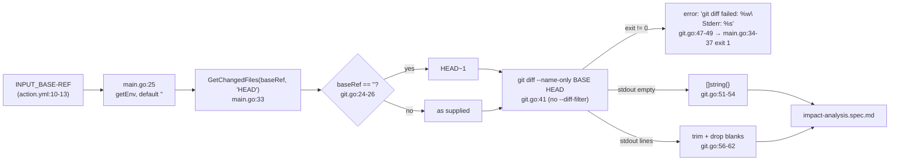

## SPECIFICATION: Change Detection (base-ref → changed file list)
**Version:** 1.0
**Status:** Draft
**Date:** 2026-08-12
**Type:** feature (retro-spec of shipped behaviour)
**Slug:** change-detection

**Unit under spec:** `internal/git` (`git.go`)
**Entry point:** `cmd/action/main.go` (`INPUT_BASE-REF`)
**Downstream consumer:** `internal/analyzer` — specified separately in
[impact-analysis.spec.md](./impact-analysis.spec.md)
**Executable invariant:** `internal/integration/pipeline_test.go`

> This is a **retro-spec**. It documents behaviour that is already shipped. The code is the
> source of truth; every behavioural claim below carries a `file:line` citation, and every
> claim about git's own behaviour was verified empirically in this session (git 2.50.1,
> Apple Git-155) rather than asserted from memory. Nothing here proposes a change. Things
> the code does *not* do are recorded as known limitations (§9) or observations (§10),
> never as unmet requirements.

**Scope boundary.** This spec ends at "returns `[]string` of repo-root-relative paths".
Deciding *which kustomizations* those paths affect belongs to
[impact-analysis.spec.md](./impact-analysis.spec.md); dropping paths that no longer exist on
disk belongs to the build stage (`internal/builder/builder.go:121-143`).

---

### 1. Overview

Change detection is stage 1 of the `kustomize-build-check` pipeline
(`git diff → discovery → dependency graph → impact analysis → build → report`, CLAUDE.md;
design.md:88-141, design.md:301-313). It answers exactly one question: *which files differ
between the base reference and the head reference?* Every later stage consumes that list, so
its recall determines the recall of the whole tool.

The implementation is one function, `GetChangedFiles(baseRef, headRef string) ([]string, error)`
(`git.go:23`), behind a one-method `Analyzer` interface constructed by `New()`
(`git.go:10-20`). It shells out to the `git` binary (`git.go:41`) — this repo is a
`go-cli-tool` with a single direct dependency, `gopkg.in/yaml.v3` (`vega.yaml`, CLAUDE.md
"Reuse before you build"), and `internal/git` imports stdlib only (`git.go:3-8`).

The stage is governed by the asymmetric correctness bar in CLAUDE.md: **a false pass is worse
than a false fail.** That single rule is why the diff is deliberately *unfiltered* — see F-05
and §10 R-01.

### 2. Goals & Success Metrics

| Goal | Metric (as evidenced today) |
|---|---|
| Never drop a change that could break a `kustomize build` | Deletions are not filtered (`git.go:31-37`, `git.go:41`); `TestDeletedResourceStillReferencedFails` asserts `summary.Failed > 0` for a deleted-but-still-referenced resource (`pipeline_test.go:409-434`) |
| Produce paths the consumer can resolve without extra context | Output is repo-root-relative regardless of process cwd (verified this session; documented at `analyzer.go:41-43`), and the analyzer normalizes with `filepath.Abs` (`analyzer.go:44`) |
| Fail loudly, never silently, when git itself fails | Non-zero exit returns a wrapped error carrying git's stderr verbatim (`git.go:47-49`); `main` prints it and exits 1 (`main.go:34-37`) |
| Stay usable outside CI | Empty `base-ref` degrades to `HEAD~1`, empty head to `HEAD` (`git.go:24-29`), which is the documented local-run recipe (README.md:60-71) |
| Add no dependency for a one-command job | `internal/git` imports `bytes`, `fmt`, `os/exec`, `strings` only (`git.go:3-8`) |

### 3. Functional Requirements

All requirements describe behaviour **as implemented today**.

| ID | Priority | Requirement | Evidence |
|---|---|---|---|
| F-01 | P0 | Expose `GetChangedFiles(baseRef, headRef string) ([]string, error)` behind the `Analyzer` interface, constructed by `New()`. The type is stateless (`type analyzer struct{}`). | `git.go:10-20`, `git.go:23`; design.md:145-152 |
| F-02 | P0 | If `baseRef` is the empty string, substitute the literal `HEAD~1`. | `git.go:24-26` |
| F-03 | P0 | If `headRef` is the empty string, substitute the literal `HEAD`. | `git.go:27-29` |
| F-04 | P0 | `baseRef` arrives from the `INPUT_BASE-REF` environment variable, defaulting to `""` when unset **or set to the empty string**; `headRef` is passed as the literal `"HEAD"` by the entry point. | `main.go:25`, `main.go:33`, `main.go:118-123`; input declared at `action.yml:10-13` |
| F-05 | P0 | Invoke exactly `git diff --name-only <baseRef> <headRef>`. **No** `--diff-filter`, `-M`, `--relative`, `-z`, `--` separator, or pathspec is passed. The absence of `--diff-filter=d` is load-bearing, not an omission — see §10 R-01. | `git.go:41`; rationale at `git.go:31-37` |
| F-06 | P0 | Run the command in the process's own working directory (`cmd.Dir` is never set), so the caller's cwd selects the repository. | `git.go:41-49` (no `cmd.Dir` assignment) |
| F-07 | P0 | Capture stdout and stderr into separate buffers. | `git.go:43-46` |
| F-08 | P0 | On non-zero exit, return `nil` and an error formatted as `git diff failed: %w\nStderr: %s`, wrapping the `exec` error (so `errors.Is`/`errors.As` still work) and appending git's stderr verbatim. | `git.go:47-49` |
| F-09 | P0 | On empty stdout (`""`), return a non-nil empty slice `[]string{}` and a nil error. A diff with no changes is a success, not an error. | `git.go:51-54`; verified this session: a no-op range writes 0 bytes to stdout |
| F-10 | P0 | Otherwise, `strings.TrimSpace` the whole output, split on `"\n"`, skip empty lines, and `strings.TrimSpace` each retained line before appending. | `git.go:56-62` |
| F-11 | P0 | Return the resulting `[]string` in git's own emission order, with no sorting, de-duplication, filtering, or existence check applied by this package. | `git.go:56-64` |
| F-12 | P1 | Emit no logging and touch no filesystem beyond what `git` itself does; the only observable side effect is the subprocess. | `git.go:23-65` (no `slog`, no `os` file calls) |
| F-13 | P1 | The count of returned paths is surfaced to the user as `Found %d changed files`. | `main.go:38` |

### 4. Non-Functional Requirements

| ID | Category | Requirement | Evidence |
|---|---|---|---|
| NF-01 | Correctness | A false pass is worse than a false fail: this stage must never narrow the change set. Over-reporting is tolerated (extra builds cost time), under-reporting is not (it hides breakage). | CLAUDE.md "Correctness bar"; `git.go:31-37` |
| NF-02 | Correctness | A false fail is not free either: paths a change legitimately removed must still reach the pipeline and be reported as *skipped*, never as failures. This stage keeps them in; the build stage classifies them. | CLAUDE.md; `git.go:35-37` → `builder.go:52-65`, `builder.go:127-143`; `action.yml:46` |
| NF-03 | Dependencies | No third-party Go dependency for change detection; shell out to the `git` binary already required at runtime. | `git.go:3-8`; `go.mod`; `Dockerfile:16` installs `git` |
| NF-04 | Portability | Runs as a non-root user against a workspace owned by another UID; the container marks every directory safe for git. | `Dockerfile:36-42` |
| NF-05 | Observability | Errors from git are never summarized or swallowed; stderr is propagated verbatim so the operator sees git's own diagnostic (e.g. `fatal: bad object <sha>`). | `git.go:48`; `main.go:35` |
| NF-06 | Performance | One `git` subprocess per run, output held in memory as a single buffer. | `git.go:41-51` |

### 5. Data Model & Flows

**Input**

| Field | Type | Source | Default |
|---|---|---|---|
| `baseRef` | `string` | `INPUT_BASE-REF` env var (`main.go:25`) | `""` → `HEAD~1` (`git.go:24-26`) |
| `headRef` | `string` | literal, passed by `main` (`main.go:33`) | `""` → `HEAD` (`git.go:27-29`) |

**Output**: `[]string` of **repo-root-relative** paths (e.g. `manifests/overlays/app/dev/kustomization.yaml`),
plus `error`.

The relativity is a property of `git diff --name-only`, not of this code: verified this
session that running the same command from a subdirectory emits the identical, repo-root-relative
paths. The code records the same fact at `analyzer.go:41-43`, and the consumer immediately
re-normalizes each path with `filepath.Abs` (`analyzer.go:44-48`) because discovery stores
absolute directories (`impact-analysis.spec.md` F-02).

**Consequent invariant (cwd):** because git emits root-relative paths and the analyzer resolves
them against the *process* working directory, the process must run with its cwd at the repository
root for the two to agree. The integration harness makes this explicit with `t.Chdir(r.dir)`
before calling `GetChangedFiles` (`pipeline_test.go:118-121`). See §10 O-04 for how this is
satisfied in the container.



### 6. API / Interface Contracts

```go
// internal/git/git.go:10-13
type Analyzer interface {
    GetChangedFiles(baseRef, headRef string) ([]string, error)
}

// internal/git/git.go:17-20
func New() Analyzer
```

| Aspect | Contract | Evidence |
|---|---|---|
| Subprocess | `git diff --name-only <base> <head>`, argv exactly 4 elements after `git` | `git.go:41` |
| Success, changes found | `([]string{"path/a", ...}, nil)`, non-empty, root-relative, git order | `git.go:56-64` |
| Success, no changes | `([]string{}, nil)` — non-nil, length 0 | `git.go:51-54` |
| Success, whitespace-only stdout | `(nil, nil)` — nil slice, length 0 (see §8 E-04) | `git.go:51-62` |
| Failure | `(nil, error)` where `error.Error()` starts `git diff failed: ` and ends with `\nStderr: <git stderr>` | `git.go:47-49` |
| Error wrapping | The `exec` error is wrapped with `%w`, so `errors.Is(err, exec.ErrNotFound)` and `*exec.ExitError` extraction remain available to callers | `git.go:48` |
| Caller handling | `main` prints `Error detecting changes: %v` to stderr and `os.Exit(1)`; there is no retry, no fallback ref, no degraded mode | `main.go:34-37` |

**Range semantics.** `git diff A B` is a **two-dot** comparison of the two tips, not the
three-dot merge-base form `A...B` (`git.go:41`). See §10 O-02 for the consequence.

### 7. Acceptance Criteria

These restate the guarantees the shipped code already satisfies; each maps to existing
executable coverage or to a check performed in this session.

- [ ] **AC-1 (false-pass guard, the central one):** For a repo where the change deletes
      `base/deployment.yaml` while `base/kustomization.yaml` still lists it under `resources`,
      `GetChangedFiles` includes `base/deployment.yaml` in its result, and the pipeline exits
      with `summary.Failed > 0`. Covered by `TestDeletedResourceStillReferencedFails`
      (`pipeline_test.go:409-434`).
- [ ] **AC-2 (no filter):** The argv passed to `exec.Command` is exactly
      `["git","diff","--name-only",baseRef,headRef]` — no `--diff-filter` in any casing
      (`git.go:41`).
- [ ] **AC-3 (base default):** `GetChangedFiles("", "HEAD")` invokes git with `HEAD~1` as the
      base (`git.go:24-26`).
- [ ] **AC-4 (head default):** `GetChangedFiles("abc123", "")` invokes git with `HEAD` as the
      head (`git.go:27-29`).
- [ ] **AC-5 (empty diff):** When base and head resolve to the same tree, the return value is
      a non-nil slice of length 0 and a nil error — not an error, not `nil` (`git.go:51-54`).
- [ ] **AC-6 (error propagation):** With an unresolvable base ref, git exits 128 and the
      returned error string contains both `git diff failed: ` and git's own stderr text
      (verified this session: `fatal: bad object <sha>` on a `--depth 1` clone; `fatal:
      ambiguous argument 'nosuchref'` for an unknown revision) (`git.go:47-49`).
- [ ] **AC-7 (root-relative paths):** Invoking from a subdirectory of the repository yields
      the same repo-root-relative paths as invoking from the root (verified this session;
      relied upon at `analyzer.go:41-48`).
- [ ] **AC-8 (removed paths survive to the build stage):** A change that deletes a whole
      kustomize directory still yields that directory's paths from this stage, so the build
      stage can classify it `Skipped` rather than the check reporting it missing. Covered by
      `TestDeletedDirectoryIsSkipped` (`pipeline_test.go:264-292`) and
      `TestConsolidateDuplicatedDirsIntoComponent` (`pipeline_test.go:192-262`), whose
      `skipped == 0` assertion (`pipeline_test.go:249-252`) fails loudly if removed paths ever
      stop reaching the build step.

### 8. Edge Cases & Error Handling

| ID | Scenario | Behaviour today | Evidence |
|---|---|---|---|
| E-01 | Deletion of a file still referenced by a surviving kustomization | Path is returned; consumer marks the referencing kustomization affected; build fails. **This is the reason the diff is unfiltered.** | `git.go:31-37`; `pipeline_test.go:409-434` |
| E-02 | Deletion of an entire kustomize directory | Old paths are returned; the directory is classified `Skipped` at the build stage, not failed | `git.go:35-37` → `builder.go:127-143`; `pipeline_test.go:264-292` |
| E-03 | Rename of a directory or file | git's **default** rename detection reports only the *new* path; the old path never appears, so the new location is validated and the old one is simply absent | `git.go:39-40`; `pipeline_test.go:294-325`; see §10 A-01 for the `diff.renames=false` caveat |
| E-04 | git writes only whitespace to stdout | `output != ""` so the empty-output branch is skipped; `TrimSpace` + split + blank-skip leaves `files` as a nil slice, returned with a nil error. Callers see `len == 0` either way, so it is indistinguishable in practice from E-05 | `git.go:51-62` |
| E-05 | No changes between base and head | `[]string{}, nil`; `main` prints `Found 0 changed files`, impact analysis returns none, the run reports 0 builds and exits 0 | `git.go:51-54`; `main.go:38`, `main.go:63-76` |
| E-06 | Base ref unreachable in a shallow clone | git exits 128 with `fatal: bad object <sha>`; the wrapped error reaches `main`, which prints it and exits 1. There is no fallback to `HEAD~1` once a non-empty ref was supplied. Verified this session against a `--depth 1` clone | `git.go:47-49`; `main.go:34-37` |
| E-07 | Unknown revision name (typo, deleted branch) | Same path as E-06; git exits 128 with `fatal: ambiguous argument '<ref>'` (verified this session) | `git.go:47-49` |
| E-08 | `git` binary missing from PATH | `cmd.Run()` returns an `exec.ErrNotFound`-wrapping error, reported through the same `git diff failed:` message. Not reachable in the shipped image, which installs git | `git.go:47-49`; `Dockerfile:16` |
| E-09 | Not a git repository, or ownership mismatch | git's own fatal message is propagated verbatim. The image pre-empts the `dubious ownership` case with `git config --system --add safe.directory '*'` | `git.go:48`; `Dockerfile:40-42` |
| E-10 | Path containing non-ASCII or special characters | git's default `core.quotePath` C-quotes such paths, e.g. `"a/b/na\303\257ve spac\303\251.yaml"` including the literal double quotes. This code does **not** unquote them (no `-z`, no unquoting step), so the consumer receives a path that will not match any real file. Verified this session with `core.quotePath` unset. Recorded as a known limitation, see §9 L-04 | `git.go:41`, `git.go:56-62` |

### 9. Out of Scope

This spec covers only the production of the changed-file list. Explicitly **not** in scope:

1. **Deciding which kustomizations a changed path affects** — owned by
   [impact-analysis.spec.md](./impact-analysis.spec.md) (`internal/analyzer`).
2. **Dropping paths that no longer exist on disk** — owned by the build stage
   (`builder.go:121-143`). This layer deliberately does not check existence; doing so here
   would reintroduce the false pass described in §10 R-01.
3. **Resolving `github.event.pull_request.base.sha` into a concrete ref** — no code in this
   repository does this; `main` passes `INPUT_BASE-REF` through unchanged (`main.go:25`,
   `main.go:33`). See §10 O-01.
4. **Ensuring the base ref is fetched** (clone depth, `git fetch` of the base branch) — the
   caller's responsibility; this stage only reports the resulting git failure (E-06).
5. Discovery, graph construction, build execution, and reporting — separate pipeline stages
   (CLAUDE.md; design.md:143-300).

**Known limitations (observed, not defects to fix in this spec):**

| ID | Limitation | Evidence |
|---|---|---|
| L-01 | `internal/git` has **no unit test file**; `git.go` is the only file in the package. Its behaviour is exercised solely through `internal/integration/pipeline_test.go`, which skips itself when `git` or `kustomize` is absent (`pipeline_test.go:142-148`). design.md:419-423 still lists "Unit tests" for Phase 2 as unchecked. CI installs kustomize so the integration tests do run (`build-release.yml:44-58`; CLAUDE.md "What NOT to do") | `ls internal/git`; design.md:422 |
| L-02 | Once a non-empty `baseRef` is supplied, there is no fallback: an unreachable ref aborts the whole run rather than degrading to `HEAD~1` | `git.go:24-26`, `main.go:34-37` |
| L-03 | The `headRef == ""` default (F-03) is unreachable from the shipped entry point, which always passes the literal `"HEAD"` (`main.go:33`); it is exercised only by direct library use | `git.go:27-29` vs `main.go:33` |
| L-04 | C-quoted paths (E-10) are passed through with their quotes and octal escapes intact, so a change to a non-ASCII path is silently unattributable downstream. This is the one place where the current implementation can under-report, i.e. the one residual false-pass surface | `git.go:56-62`; verified this session |

### 10. Open Questions

**Rejected alternative (recorded because it is the single most important decision in this file):**

| ID | Alternative | Why rejected |
|---|---|---|
| R-01 | Filter deletions out of the diff with `--diff-filter=d` (lowercase excludes deletions, keeping all other statuses) | It converts a real breakage into a **green check**. Verified empirically this session: delete a resource file that a surviving kustomization still references — `kustomize build` fails, but the filtered diff is *empty*, so zero candidates are produced and the run passes. The deleted path is the *only* signal that marks the consuming kustomization as affected. The code says exactly this at `git.go:31-37`, and `TestDeletedResourceStillReferencedFails` (`pipeline_test.go:409-434`) is its executable statement. Under CLAUDE.md's bar ("a false pass is worse than a false fail") this is disqualifying. The problem it was meant to solve — bogus failures for directories the change removed — is solved instead at the build stage, where directory existence can be checked directly (`builder.go:127-143`), and those paths are reported as *skipped* (`action.yml:46`) |

**Observations (behaviour worth knowing; not defects, not proposals):**

| ID | Observation | Evidence |
|---|---|---|
| O-01 | `action.yml:11` describes the `base-ref` default as "github.event.pull_request.base.sha or main", but this binary implements only `"" → HEAD~1`. Any PR-base resolution must therefore happen in the consumer wrapper repo (`michielvha/kustomize-build-check-action`, `vega.yaml`). **[unverified — not readable from this repo; verify in the action repo before relying]** | `action.yml:11` vs `main.go:25` + `git.go:24-26` |
| O-02 | Two-dot range semantics (`git diff A B`) compare the two tips, not the merge base. When the base branch has advanced since the branch point, files changed *on the base branch only* also appear in the list. That over-reports, which errs to the safe side of NF-01, at the cost of extra builds | `git.go:41` |
| O-03 | Results are neither sorted nor de-duplicated by this package; ordering and uniqueness are whatever `git diff --name-only` emits. Downstream de-duplication happens in the analyzer's `affected` map (`analyzer.go:36`, `analyzer.go:71-75`) | `git.go:56-64` |
| O-04 | The cwd invariant (§5) requires the process to start at the repository root. The tests establish this explicitly (`pipeline_test.go:119`). In the container, `Dockerfile:55` sets `WORKDIR /home/${IMAGE_NAME}`, so the working directory at runtime is whatever the Actions runtime supplies for a Docker container action rather than the image's `WORKDIR`. **[unverified — GitHub's container-action working-directory behaviour was not verified from a source in this session; confirm against GitHub's current docs before relying]** | `Dockerfile:55`; `analyzer.go:41-48` |
| O-05 | Shallow clones are the most likely real-world cause of E-06. No workflow or doc in *this* repo configures clone depth for consumers — `build-release.yml:32-36` uses `fetch-depth: 0`, but for GitVersion in this repo's own release pipeline, unrelated to change detection, and README.md documents no fetch-depth guidance. The claim that `actions/checkout` defaults to depth 1 is **[unverified — verify before relying]**; what *is* verified this session is the mechanism: in a `--depth 1` clone, an older base sha yields `fatal: bad object <sha>`, exit 128 | `build-release.yml:35`; README.md; empirical check this session |

**Assumptions** (mode = autonomous; the developer audits these at the merge gate):

- **A-01 — Rename handling is emergent, not implemented.** Documented as a property of git's
  *default* rename detection rather than a feature of this code, because `git.go:41` passes no
  `-M` flag and the comment at `git.go:39-40` describes the default behaviour. Verified this
  session (git 2.50.1, `diff.renames` unset): `git diff --name-only` emits only the new path
  for a renamed file. Consequence recorded: **if a consuming repo sets `diff.renames=false`,
  the old path reappears as a deletion**, which is safe only because the build stage skips
  paths that no longer exist (`builder.go:127-143`). Also verified: when several byte-identical
  directories are consolidated, git pairs exactly *one* of them as the rename source (`R100`)
  and reports the rest as plain deletions — the asymmetry `pipeline_test.go:230-252` is written
  to tolerate. [Risk: medium]
- **A-02 — Shallow-clone fragility recorded as an edge case (E-06), not a precondition.** The
  in-repo evidence supports the *mechanism* (verified empirically) but not a statement about
  what consumers' checkouts do, so the consumer-facing half is flagged `[unverified]` in O-05
  rather than asserted. [Risk: medium]
- **A-03 — Scope boundary.** This spec stops at "returns `[]string` of repo-relative paths";
  attribution belongs to `impact-analysis.spec.md` and existence-filtering to the build stage.
  Taken from the brief's resolved unknowns. [Risk: low]

### 11. Planner Handoff Notes

This spec documents shipped code; there is nothing to implement. It exists so that any future
change to `internal/git` has to argue against a written invariant.

**Dependencies / ordering (if this file is ever used to plan work):**

1. `impact-analysis.spec.md` already owns the consumer contract. Any change to the return
   shape (sorting, de-duplication, absolute paths) is a change to *that* spec's F-02 input
   assumption and must be planned jointly.
2. The build-stage skip guard (`builder.go:121-143`) is the counterweight that makes the
   unfiltered diff safe. The two must never be changed in the same PR without the integration
   tests being run for real (they self-skip without `kustomize` on PATH, `pipeline_test.go:142-148`).

**Risk areas, in descending order:**

- **Any proposal to narrow the diff** (`--diff-filter`, existence checks, pathspecs, extension
  filters) is a direct false-pass risk. R-01 is the standing rebuttal; re-litigating it requires
  showing the narrowing cannot hide a real breakage (CLAUDE.md).
- **L-04 (C-quoted paths)** is the only known under-reporting surface in the current code. If it
  is ever addressed, the fix is at this layer (`-z` plus a NUL split, or `core.quotePath=false`),
  not downstream.
- **L-01 (no unit tests for this package)** means every one of the invariants above is currently
  guarded only by integration tests that skip when their binaries are missing.

**Estimated complexity, if the observations above were ever turned into work:**

| Item | Size |
|---|---|
| Unit tests for `internal/git` covering F-02..F-11 against a scratch repo (L-01) | M |
| NUL-delimited output to fix C-quoted paths (L-04) | S |
| Documenting the consumer-side fetch-depth requirement in README (O-05) | S |
| Any change to range semantics, two-dot → three-dot (O-02) | M, with a false-pass review |
