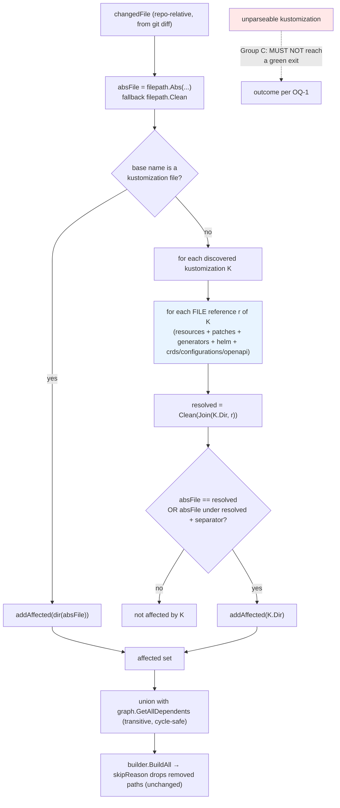

## SPECIFICATION: Complete & Correct Impact Matching

**Version:** 1.0
**Status:** Draft
**Date:** 2026-08-12
**Type:** feature (correctness feature: closes four false-pass classes and adds the missing reference surfaces)
**Slug:** complete-impact-matching

**Units under spec:** `internal/analyzer` (`analyzer.go`), `internal/discovery` (`discovery.go`), `internal/graph` (`graph.go`)
**Unchanged collaborators:** `internal/git`, `internal/builder`, `internal/reporter`, `cmd/action`
**Supersedes (specific edge cases only):**
[impact-analysis.spec.md](./impact-analysis.spec.md) §8 (the `../shared/cm.yaml` row) and §9 item 4;
[kustomization-discovery.spec.md](./kustomization-discovery.spec.md) F-05, F-09, F-11, F-16 and its §9 gaps.
Everything else in those retro-specs remains the current-behaviour baseline and stays in force.
**Unchanged by this spec:** [build-execution.spec.md](./build-execution.spec.md) F-04..F-09 (skip semantics),
[change-detection.spec.md](./change-detection.spec.md) (deletions stay in the diff).

> **This is a forward spec, not a retro-spec.** Claims about *current* behaviour carry a
> `file:line` citation and live in the "Baseline" column or in §5. Claims about *required*
> behaviour are written as requirements in §3 and are **not** implemented today. The two are
> never mixed in the same sentence.

---

### 1. Overview

`kustomize-build-check` is a CI gate: it decides which kustomize directories a change could
have broken and runs `kustomize build` on exactly those. Four recorded defects let a change
slip through with **nothing validated and exit 0** — the failure mode `CLAUDE.md` names as
the worst possible for this tool ("a false pass is worse than a false fail"). All four are
recorded in [`docs/specs/_index.md`](./_index.md) under "Known gaps recorded by these specs".

This spec covers **all four at once**, plus the reference surfaces the parser never learned to
read, so that the delivered product is *complete and correct impact matching* rather than a
partial fix. The scope decision is the developer's, recorded verbatim in §10:

> "can we not just do everything at once and deliver a working product instead of this half baked
> stuff we had right now ? Its bigger but I dont mind the product properly working is more
> important just do it in steps ?"

"In steps" is honoured by structure, not by scope: §3 groups the requirements into **four
independently shippable, independently testable phases** (A→D), ordered by risk reduction per
unit of work. Each phase closes a named false-pass class on its own and leaves the tool in a
strictly better state than before it. `/plan` phases from these groups.

This repo is a `go-cli-tool` in Go (`vega.yaml`) with exactly one direct dependency,
`gopkg.in/yaml.v3` (`go.mod:5`). Nothing in this spec requires a second one (NF-06).

**G5 was found while planning this spec, and it is a regression.** Before the skip guard shipped
(`builder.go`, PR #8), deleting a base made the run go **red** — for the wrong reason, a bogus
build failure on the removed path, but the breakage was at least surfaced. Now the removed path is
correctly skipped and nothing else is marked affected, so the run goes **green** while
`kustomize build` on the surviving overlay genuinely fails. Session-verified on `main`:

```
ground truth:  kustomize build overlays/dev   -> BROKEN
tool reports:  1 total, 0 successful, 0 failed, 1 skipped
               "All builds successful"        -> exit 0
```

That fix was still correct in isolation; it simply exposed that impact analysis was relying on a
bogus failure to catch this case. Group A closes it for the right reason, because once the
containment guard is gone the deleted `base/deployment.yaml` matches `overlays/dev`'s `../../base`
reference directly. This raises the priority of Phase A rather than changing its content.

**The false-pass classes being closed**

| ID | Class | Where it lives today | Phase |
|----|-------|----------------------|-------|
| G1 | A cross-directory resource reference (`../shared/cm.yaml`) never marks its kustomization affected | `analyzer.go:115-120` containment guard returns `false` before the `resources` loop at `:122-131` | A |
| G5 | Deleting a base outright leaves every overlay that consumes it unvalidated, and the run exits **0** | Same containment guard. The deleted `base/…` paths never match `overlays/dev`'s `../../base` reference, so only `base` itself is affected — and it is correctly *skipped*, leaving nothing to fail | A |
| G4 | A directory reference whose name contains a dot loses its graph edge | `graph.go:100-108` uses `filepath.Ext(resource) != ""` to tell files from directories | B |
| G3 | An unparseable kustomization is warned to stderr and silently dropped | `discovery.go:51-56`; the run can still exit 0 | C |
| G2 | `patches`, `configMapGenerator`, `secretGenerator` (and more) are never parsed | `discovery.go:76-80` parses only `resources`, `bases`, `components` | D |

### 2. Goals & Success Metrics

| Goal | Metric |
|------|--------|
| Eliminate G1: a file referenced across a directory boundary is validated | A repo where `base/kustomization.yaml` lists `../shared/cm.yaml`, with `shared/cm.yaml` edited, produces a non-empty affected set containing `base`; today it produces "No kustomizations affected by changes" and exit 0 (**session-verified on `main`**, see §5 "Reproduction") |
| Eliminate G2: every local file kustomize can read is a matchable reference | For each surface in F-D1..F-D8 there is one integration scenario where editing only that file marks the owning directory affected. Zero surfaces with no scenario. |
| Eliminate G3: an unreadable kustomization can never produce a green check | With one malformed `kustomization.yaml` in the tree, the run's outcome is never "all checks passed / exit 0 / nothing validated". Exact outcome is OQ-1. |
| Eliminate G4: dotted directory names keep their edges | `overlay → ../bases/v1.2` and `overlay → ../my.app` both yield a reverse-lookup edge, so editing the base marks the overlay affected |
| Do not trade a false pass for a false fail | The affected set for a given change is **exactly** the expected set in every acceptance fixture — asserted by equality, not by containment (F-E4). `base-old/` never marks `base/` (F-E2). |
| Do not regress what already works | `go test ./...` reports **31 passed in 8 packages** before and after every phase (measured this session on `main`), with F-E1's named guards called out explicitly |
| Stay a one-dependency repo | `go.mod` still lists exactly one `require` line (NF-06) |

### 3. Functional Requirements

Priority: **P0** = launch blocker for its phase. **P1** = important. **P2** = nice-to-have.
Each group is a phase: independently shippable, independently testable, and closing at least
one named false-pass class on its own.

#### Group A — Phase 1: cross-directory reference matching (closes G1)

*Closes:* a kustomization that references a file outside its own directory is never validated.
*Size:* the smallest change in this spec for the largest class of false pass removed.

| ID | Priority | Requirement | Baseline being changed |
|----|----------|-------------|------------------------|
| F-A1 | P0 | `fileReferencedByKustomization` MUST NOT require the changed file to live under the kustomization's own directory. The containment pre-check MUST be removed, so the resolved-reference loop is always reached. | The guard at `analyzer.go:118` returns `false` whenever `changedFile` does not start with `kustDir + separator`, short-circuiting the loop at `analyzer.go:122-131`. |
| F-A2 | P0 | Matching MUST be decided **solely** by comparing the changed absolute path against each **resolved** reference path, where resolution is `filepath.Clean(filepath.Join(kustDir, ref))`. A match is: exact string equality, **or** the changed path being under the resolved path, tested with a trailing `os.PathSeparator`. | Already the shape of `analyzer.go:125-130`; this requirement makes it the *only* criterion. |
| F-A3 | P0 | `../`-escaping references MUST match. Given `kustDir=/repo/base` and reference `../shared/cm.yaml`, the changed path `/repo/shared/cm.yaml` MUST mark `/repo/base` affected. | Not matched today (`analyzer.go:118`); recorded as an edge case in [impact-analysis.spec.md](./impact-analysis.spec.md) §8. |
| F-A4 | P0 | Resolved-path prefix matching MUST remain separator-terminated in **both** directions, so a resolved reference `/repo/shared` never matches `/repo/shared-old/x.yaml`, and a kustomization at `/repo/base` is never matched by `/repo/base-old/x.yaml`. | `analyzer.go:128` already appends the separator; F-A4 makes it a guarded invariant now that the outer guard is gone. |
| F-A5 | P1 | Every match MUST log at `slog.Debug` the kustomization directory, the raw reference string, and the resolved path, so an unexpected match is diagnosable from `LOG_LEVEL=DEBUG` alone. | `analyzer.go:63-65` logs the file and the kustomization but not the reference that caused the match. |

**Session-verified evidence for Phase 1** (recorded so `/plan` does not re-derive it): deleting
the containment guard and running the real binary matched `base` **and** propagated
`overlays/dev` as a transitive dependent, while the sibling `base-old` was **not** dragged in,
and the full existing suite (31 tests) still passed. The conclusion to carry forward is that
the guard is **redundant and harmful**: the resolved-reference matching in F-A2 is already
precise enough to keep `base-old` out, and the guard was the only thing blocking cross-directory
references.

#### Group B — Phase 2: correct file-vs-directory classification (closes G4)

*Closes:* a base directory whose name contains a dot silently loses every overlay edge, so
changing the base validates nothing downstream.

| ID | Priority | Requirement | Baseline being changed |
|----|----------|-------------|------------------------|
| F-B1 | P0 | Graph edge extraction MUST NOT use the presence of a filename extension to decide whether a `resources` entry is a directory. `../bases/v1.2` (`filepath.Ext` → `".2"`) and `../my.app` (→ `".app"`) MUST be classified as directories when they are directories. | `graph.go:100-108`; documented as a heuristic in [kustomization-discovery.spec.md](./kustomization-discovery.spec.md) F-16. |
| F-B2 | P0 | Classification MUST be based on what the path **is**, not on what it looks like. The mechanism is OQ-2 (filesystem stat vs. "is a discovered kustomization directory" lookup); whichever is chosen MUST be stated in the plan and MUST be deterministic for a path that does not exist. | New. |
| F-B3 | P0 | A reference that resolves to a path which is **not** a discovered kustomization directory MUST still be usable as a **file** reference for analyzer matching (Group A), even if it produces no graph edge. Classification for the graph and matching for the analyzer are two separate decisions and one MUST NOT suppress the other. | Today the two are coupled through the extension heuristic: an entry with an extension is dropped from the graph (`graph.go:102`) and only `resources` reach the analyzer (`analyzer.go:123`). |
| F-B4 | P0 | A path that does not exist on disk (e.g. a base the change deleted) MUST NOT cause a panic, an error return, or the loss of an edge that the pre-change tree had. Behaviour for the non-existent case MUST be explicitly specified in the plan (see OQ-2) and covered by a test. | `graph.go:96-117` never touches the filesystem, so it cannot fail on a missing path today; adding a stat introduces this case. |
| F-B5 | P1 | Edge extraction MUST remain deterministic in ordering (`resources` → `bases` → `components`), preserving [kustomization-discovery.spec.md](./kustomization-discovery.spec.md) F-15 and NF-06. | `graph.go:96-117`. |

#### Group C — Phase 3: an unparseable kustomization can never be green (closes G3)

*Closes:* a kustomization file that cannot be parsed is dropped from the graph, so nothing that
depends on it is validated and the run can still exit 0 — while `kustomize build` on that same
directory would fail.

| ID | Priority | Requirement | Baseline being changed |
|----|----------|-------------|------------------------|
| F-C1 | P0 | A kustomization file that cannot be read or parsed MUST NOT be able to produce a green check. Silently excluding it from `allKustomizations` while the process exits 0 is forbidden. | `discovery.go:51-56` prints `Warning: failed to parse …` to stderr and `return nil`s, continuing the walk; the file is absent from the graph and the exit code is unaffected ([kustomization-discovery.spec.md](./kustomization-discovery.spec.md) F-05, F-07). |
| F-C2 | P0 | **Decided (OQ-1, option (d), see §10).** A kustomization this tool cannot parse MUST be treated as **always affected**: its directory is added to the build set unconditionally, regardless of whether the diff touched it, and `kustomize build` adjudicates the outcome. If kustomize builds it, the run is green; if kustomize fails, the run fails with kustomize's own error. There is no parse-only failure and no new result class. | New. Supersedes the "warn to stderr and drop" behaviour at `discovery.go:51-56`. |
| F-C2a | P0 | An unparseable kustomization MUST still produce a graph **node** at its directory, so that kustomizations which reference it (and which parse fine) keep their edges to it and their dependents still propagate. Only its **outgoing** references are unknown, which is precisely why F-C2 marks it affected unconditionally. | New. Today the file is absent from `allKustomizations`, so no node exists at all (`discovery.go:51-56`). |
| F-C3 | P0 | The unparseable path and the parse error MUST be surfaced through the normal **human-facing** reporting channels — the console output and the GitHub step summary — not only as a bare stderr `Warning:` line that CI logs bury. The **action outputs** carry the unparseable *directory* implicitly, because F-C2 places it in the build set and therefore in `results`; **no new output key and no new `BuildResult` field is added for the parse error**, per OQ-1's resolution that the public output contract is unchanged. A consumer needing the parse text reads the step summary or the console log. | `discovery.go:54` writes to stderr directly, bypassing `internal/reporter` entirely. Amended 2026-08-12: the original wording said "action outputs", which contradicted OQ-1's resolution and AC-C7. |
| F-C4 | P0 | The chosen outcome MUST NOT reclassify a directory the change legitimately **removed** as a failure. [build-execution.spec.md](./build-execution.spec.md) F-05/F-06 skip semantics are unchanged: a removed path is *skipped*, never *failed*. | `builder.go:127-143`. |
| F-C5 | P1 | Parse tolerance and parse failure MUST be distinguished. Unknown *fields* MUST continue to be ignored without error (non-strict unmarshalling), so that a kustomize feature this tool does not model never fails a build. Only genuinely malformed YAML, or a malformed value in a field this tool **does** parse, counts as a parse failure. | `discovery.go:82` is already non-strict ([kustomization-discovery.spec.md](./kustomization-discovery.spec.md) F-09); F-C5 keeps it that way as Group D adds fields. |
| F-C6 | P0 | Group D MUST NOT enlarge the parse-failure surface. A shape this tool cannot decode in a **newly parsed** field (F-D1..F-D8) MUST degrade to "no references learned from this field", recorded and reported, and MUST NOT drop the whole kustomization. | Today a type mismatch in any parsed field fails the entire file ([kustomization-discovery.spec.md](./kustomization-discovery.spec.md) F-11) — e.g. `resources:\n  - path: a.yaml` → the file vanishes from the graph. |

#### Group D — Phase 4: complete reference-surface parsing (closes G2)

*Closes:* a file referenced only through `patches`, a generator, or a Helm values file never
marks anything affected. This is the largest phase.

All field shapes below were **verified this session by building real kustomizations with
`kustomize v5.8.1`**, which is now also the version the image ships
(`KUSTOMIZE_VERSION=v5.8.1`, `Dockerfile:20`, bumped as part of resolving OQ-4). Verified and
shipped versions are therefore identical; see NF-07.

| ID | Priority | Requirement | Session-verified shape |
|----|----------|-------------|------------------------|
| F-D1 | P0 | `patches[].path` MUST be parsed as a file reference. Entries are **objects**, with an optional `target:`. | `- path: patch.yaml` + `target: {kind, name}` built successfully. A plain **string** entry is rejected by kustomize itself: `Error: invalid Kustomization: json: cannot unmarshal string into Go struct field Kustomization.patches of type types.Patch`. |
| F-D2 | P0 | A `patches` entry with an inline `patch:` and **no** `path:` MUST be tolerated and MUST contribute no file reference. It MUST NOT be a parse failure. | The inline form (`patch: |-` + `target:`) built successfully alongside a `path:` entry in the same list. |
| F-D3 | P0 | `configMapGenerator[].files[]`, `configMapGenerator[].envs[]`, `secretGenerator[].files[]` and `secretGenerator[].envs[]` MUST be parsed as file references, resolved relative to the kustomization directory. | `configMapGenerator` with `files:` + `envs:` and `secretGenerator` with `envs:` all built and materialised the referenced file contents into the output. |
| F-D4 | P0 | **The `key=path` alias form MUST be handled.** A `files:` entry may be written `aliaskey=real-file.txt`; the `key=` prefix MUST be stripped before path resolution. A parser that resolves the literal string looks for a file that does not exist and therefore matches nothing — a silent false pass. | Verified: `- aliaskey=real-file.txt` produced a ConfigMap key `aliaskey` whose value was the content of `real-file.txt`. |
| F-D5 | P0 | Legacy `patchesStrategicMerge[]` (a plain list of paths) MUST be parsed as file references. It is deprecated but still accepted. | Built successfully with `# Warning: 'patchesStrategicMerge' is deprecated. Please use 'patches' instead.` and the patch applied. |
| F-D6 | P1 | Legacy `patchesJson6902[].path` MUST be parsed as a file reference. Also deprecated, also still accepted. | Built successfully with the deprecation warning; the JSON6902 patch applied from `j6902.json`. |
| F-D7 | P1 | `helmCharts[].valuesFile` and `helmCharts[].additionalValuesFiles[]` MUST be parsed as file references. **helmCharts is a genuine fifth reference surface**, not a documentation artefact. | Verified twice: a missing `valuesFile` failed the build with `evalsymlink failure on '…/missing-values.yaml'`, and editing the values file changed the rendered output (`r: "7"` → `r: "9"` via `additionalValuesFiles`). Note `chartHome` is **not** a per-chart field in v5.8.1 — it lives under `helmGlobals` — which is itself evidence for OQ-4. |
| F-D8 | P2 | `crds[]`, `configurations[]` and `openapi.path` SHOULD be parsed as file references. | All three verified as local file references: `crds: [missing-crd.yaml]` → `Error: loading CRDs [missing-crd.yaml]: evalsymlink failure …`; `openapi: {path: missing-openapi.json}` → `evalsymlink failure …`; `configurations: [nameref.yaml]` built successfully. |
| F-D9 | P0 | Every newly parsed reference MUST flow into analyzer matching under the **same** rules as `resources` (F-A2): resolve against the kustomization directory, then match by equality or separator-terminated prefix. There MUST NOT be a second, divergent matching path. | Today only `kust.Resources` is consulted (`analyzer.go:123`). |
| F-D10 | P1 | Newly parsed **file** references MUST NOT create graph edges by themselves. A patch or a values file is a leaf input, not a base; edges remain the business of directory references (Group B). | Preserves [kustomization-discovery.spec.md](./kustomization-discovery.spec.md) F-15/F-18 semantics. |
| F-D11 | P1 | Each reference SHOULD carry its **provenance** (the field it came from) so a debug log can say *why* a directory was marked affected. | New; supports F-A5. |
| F-D12 | P2 | A reference that is not a local relative path — a remote git URL, an OCI/registry reference, an absolute URL — MUST be ignored for matching, exactly as today, and MUST NOT be resolved against the kustomization directory. | `graph.go:80-84` already drops unresolvable dependencies with a debug line; §9 item 5 of [impact-analysis.spec.md](./impact-analysis.spec.md). |

#### Group E — Cross-cutting invariants (apply to every phase)

These are not a phase. **Every** phase MUST satisfy all of them, and each is stated so it can
be asserted by a test.

| ID | Priority | Requirement |
|----|----------|-------------|
| F-E1 | P0 | The existing suite MUST keep passing: **31 tests across 8 packages** (measured this session on `main` via `go test ./...`). Three are called out because they are the guards this change could plausibly break: `TestDeletedResourceStillReferencedFails` (`pipeline_test.go:415`) — deletions must stay in the diff and must still fail; `TestBrokenKustomizationStillFails` (`pipeline_test.go:360`) and `TestDirectoryPresentButKustomizationRemovedFails` (`pipeline_test.go:386`) — the two over-filtering guards in the build stage. None may be weakened, skipped, or have its assertions relaxed to accommodate a change. |
| F-E2 | P0 | Removing the containment guard (F-A1) MUST NOT reintroduce sibling-prefix matching. A change under `base-old/` MUST NEVER mark `base/` affected. This needs its **own explicit regression test** at the analyzer level, in addition to the existing `TestSiblingDirectoryIsNotMatchedByPrefix` (`analyzer_test.go:49`), covering the cross-directory case: resolved reference `/repo/shared` MUST NOT be matched by `/repo/shared-old/x.yaml`. |
| F-E3 | P0 | Skipped / removed-path semantics are unchanged. A path the change removed is still **skipped**, never **failed** ([build-execution.spec.md](./build-execution.spec.md) F-05, F-06; `builder.go:127-143`), and skipped never influences the exit code (`cmd/action/main.go:102-115`). Existence checking stays the builder's job, not the analyzer's. |
| F-E4 | P0 | Matching MUST stay precise. For every acceptance fixture the affected set MUST be asserted by **set equality** against the expected set, not by containment, so that over-matching fails the test as loudly as under-matching. The number of directories built MUST be bounded by **real reference chains**, never by directory proximity: a directory that neither references a changed file nor transitively depends on one that does MUST NOT appear. |
| F-E5 | P0 | Deletions remain in the diff. `git diff --name-only` MUST stay free of `--diff-filter` (`git.go:31-41`); no phase may filter deleted paths out of the analyzer's input as an optimisation. |
| F-E6 | P0 | The analyzer's contract is unchanged in shape: `GetAffectedKustomizations` returns absolute, `filepath.Clean`ed, deduplicated directories in unspecified order, never `nil`, with no error return (`analyzer.go:29-81`). Any new failure mode belongs in discovery (Group C), not here. |
| F-E7 | P0 | No new direct dependency. The repo has exactly one (`gopkg.in/yaml.v3`, `go.mod:4`). Every requirement here is satisfiable with that plus the stdlib; adding a second requires amending this spec with a justification per `CLAUDE.md` "Reuse before you build". |
| F-E8 | P1 | Each phase MUST land with its own tests and leave the tool shippable. Phase N MUST NOT depend on Phase N+1 for correctness of what it claims to fix. |

### 4. Non-Functional Requirements

| ID | Category | Requirement |
|----|----------|-------------|
| NF-01 | Correctness bias | The asymmetric bar in `CLAUDE.md` governs every ambiguity: a false pass is worse than a false fail, so where a reference *might* be real, match it. But over-broad matching is not free either — F-E4 makes over-matching a test failure, so "match everything" is not an acceptable resolution. |
| NF-02 | Purity / testability | The analyzer MUST remain filesystem-free (`analyzer.go` imports stdlib + two internal packages only, `analyzer.go:3-10`), so unit tests need no fixtures on disk. If Group B's classification needs a stat (OQ-2), it belongs in discovery or graph construction, **not** in the analyzer's matching path. |
| NF-03 | Performance | Matching stays O(C × K × R) string comparisons (C = changed files, K = kustomizations, R = references each). Group D increases R by a constant factor. Any filesystem call added by Group B MUST be at most one per reference per run, not one per changed file per reference. |
| NF-04 | Portability | All path handling through `path/filepath` and `filepath.Separator`; never a hardcoded `/`. |
| NF-05 | Observability | Diagnostics go through `log/slog` (`Debug`) and, for anything a user must act on, through `internal/reporter` — not `fmt.Fprintf(os.Stderr, …)` (cf. F-C3 and `discovery.go:54`). |
| NF-06 | Dependencies | One direct dependency, `gopkg.in/yaml.v3`. `yaml.Node` / a two-stage decode is the intended stdlib-plus-existing-dependency route to F-C6's tolerant per-field parsing; no schema library, no kustomize API import. |
| NF-07 | Version targeting | **Resolved (OQ-4).** The image now pins kustomize `v5.8.1` and helm `v4.2.3` (`Dockerfile:20,28`), which is exactly the toolchain every Group D shape was verified against. The verification gap is closed: there is no longer a shipped-vs-verified drift to reconcile, and the `chartHome` / `helmGlobals` move (F-D7) is settled on the v5.8.1 side. |
| NF-08 | Go conventions | Interface-first with unexported structs and `New()` constructors, matching the other stages (`analyzer.go:12-26`, `graph.go:26-40`, `discovery.go:22-33`). Additive changes to `discovery.KustomizeFile` MUST keep existing fields readable by existing consumers or update all of them in the same phase. |
| NF-09 | CI honesty | `internal/integration` skips when `git` or `kustomize` is missing (`pipeline_test.go:142-148`). `CLAUDE.md` forbids letting these silently skip in CI; every phase MUST confirm the integration tests actually ran. |

### 5. Data Model & Flows

**Reproduction of G1 (session-verified on `main`)**

```
base/kustomization.yaml   →  resources: [../shared/cm.yaml]
shared/cm.yaml            →  edited
result                    →  "No kustomizations affected by changes", exit 0
expected                  →  base affected (and overlays/dev, transitively)
```

**Current model** (`discovery.go:13-20`) — three fields, all of them raw strings as written:

| Field | Populated from | Consumed by |
|-------|----------------|-------------|
| `Resources` | `resources` (`discovery.go:77`) | graph edges after the extension heuristic (`graph.go:100-108`); analyzer direct matching (`analyzer.go:123`) |
| `Bases` | `bases` (`discovery.go:78`) | graph edges only (`graph.go:111`) |
| `Components` | `components` (`discovery.go:79`) | graph edges only (`graph.go:114`) |

Nothing else in the YAML is read (`discovery.go:76-80`); everything else is silently ignored
(`discovery.go:82`, non-strict unmarshal).

**Required model.** `KustomizeFile` MUST distinguish two kinds of reference, because they are
consumed differently:

| Kind | Meaning | Consumed by | Populated from |
|------|---------|-------------|----------------|
| **Directory references** | "this kustomization builds on that one" | graph edges (`reverseLookup`), driving transitive propagation | `resources` entries that are directories (F-B1/F-B2), all `bases`, all `components` |
| **File references** | "this kustomization reads that file" | analyzer matching (F-A2, F-D9) | `resources` file entries + every surface in F-D1..F-D8 |

A reference SHOULD carry its provenance field name (F-D11). Existing field names on
`KustomizeFile` may be retained for compatibility, extended, or replaced — that is an
implementation decision for `/plan`, constrained only by NF-08 and by the requirement that both
kinds are derivable.

**Decision flow (required)**



The **removed** node is the old `absFile` ∈ `K.Dir + separator` gate that used to sit between E
and F (`analyzer.go:115-120`).

**Ownership boundary (unchanged)**

| Concern | Owner |
|---------|-------|
| Which paths changed, including deletions | `internal/git` (`git.go:31-41`) |
| Which kustomizations exist and what they reference | `internal/discovery` — **extended by Groups C and D** |
| Who depends on whom, transitively | `internal/graph` — **corrected by Group B** |
| Which directories must be validated | `internal/analyzer` — **corrected by Group A, extended by F-D9** |
| Whether a candidate still exists on disk | `internal/builder` (`builder.go:121-143`) — **unchanged** |
| Counts, report, exit code | `internal/reporter`, `cmd/action` — **touched only by F-C3** |

### 6. API / Interface Contracts

**`analyzer.ImpactAnalyzer` — signature unchanged (`analyzer.go:12-19`)**

```go
GetAffectedKustomizations(changedFiles []string, g graph.Graph, allKustomizations []discovery.KustomizeFile) []string
```

| Aspect | Contract after this spec |
|--------|--------------------------|
| Input | Unchanged: repo-root-relative (or absolute) paths, deletions included. |
| Output | Unchanged: absolute, cleaned, deduplicated, unspecified order, never `nil` (F-E6). |
| Errors | None. Still no error return (F-E6). |
| Behaviour change | A changed file now matches a kustomization **anywhere in the tree** that references it (Group A), through **any** reference surface (Group D). |

**`discovery.Discoverer` (`discovery.go:22-26`)**

| Aspect | Contract after this spec |
|--------|--------------------------|
| `ParseKustomization` | Reads every surface in F-D1..F-D8, tolerantly (F-C6): an undecodable value in one field yields no references from that field, not a dropped file. |
| `FindAll` | On a parse failure it MUST still return an entry for the file, flagged as unparsed and carrying the parse error, with no references learned (F-C2, F-C2a). It MUST NOT remain "warn to stderr, drop, exit 0". Whether the flag is a field on `KustomizeFile` or a separate return value is an implementation choice; the contract is that the caller receives the directory, marks it affected unconditionally, and reports the parse error through `internal/reporter` (F-C3). |
| `KustomizeFile` | Extended additively per §5. Existing consumers are `graph.Build` (`graph.go:43`) and `analyzer.GetAffectedKustomizations` (`analyzer.go:61`) — both in-repo, both updated in the same phase. |

**`graph.Graph` (`graph.go:26-32`)** — interface unchanged. Only `extractDependencies`
(`graph.go:96-117`) changes, per Group B. `GetAllDependents` semantics, including cycle safety
(`graph.go:138`, `:157-167`), are unchanged.

**Error / outcome states**

| State | Today | Required |
|-------|-------|----------|
| Unreadable / malformed kustomization | `Warning:` on stderr, file dropped, exit unaffected (`discovery.go:51-56`) | Cannot end in a green check (F-C1); exact outcome per OQ-1; surfaced through the reporter (F-C3) |
| Undecodable value in a newly parsed field | n/a (field not parsed) | No references from that field; file retained; recorded and reported (F-C6) |
| Unknown field in the YAML | Ignored (`discovery.go:82`) | Ignored — unchanged (F-C5) |
| Reference that resolves nowhere | Debug line, no edge (`graph.go:80-84`) | Unchanged (F-D12) |
| Path removed by the change | Skipped, not failed (`builder.go:127-143`) | Unchanged (F-E3, F-C4) |

### 7. Acceptance Criteria

Grouped by phase. Every criterion is a scenario with a stated expected set, so it is
independently testable and maps to one entry in the planner's Test Plan.

**Phase A — cross-directory matching**

- [ ] **AC-A1** Given `base/kustomization.yaml` with `resources: [../shared/cm.yaml]`, and `shared/cm.yaml` is the only changed file, the affected set equals exactly `{<root>/base}` ∪ its transitive dependents. Run exit is not "No kustomizations affected by changes". *(This is the G1 reproduction, session-verified as failing on `main`.)*
- [ ] **AC-A2** In the same fixture with `overlays/dev/kustomization.yaml` listing `../../base`, editing `shared/cm.yaml` yields exactly `{<root>/base, <root>/overlays/dev}` — asserted by set equality (F-E4).
- [ ] **AC-A3** In the same fixture, a sibling directory `base-old/` containing its own `kustomization.yaml` does **not** appear in the affected set.
- [ ] **AC-A4** Given a resolved reference `<root>/shared` (a directory), a change to `<root>/shared-old/x.yaml` yields an affected set of length 0. *(F-E2, the new regression test.)*
- [ ] **AC-A5** Given a resolved reference `<root>/shared` (a directory), a change to `<root>/shared/nested/deep.yaml` marks the referencing kustomization affected.
- [ ] **AC-A6** `go test ./...` reports 31 passed in 8 packages with no test modified, including `TestSiblingDirectoryIsNotMatchedByPrefix`, `TestDeletedResourceStillReferencedFails`, `TestBrokenKustomizationStillFails`, `TestDirectoryPresentButKustomizationRemovedFails`.

**Phase B — dotted directory names**

- [ ] **AC-B1** Given `overlays/dev/kustomization.yaml` with `resources: [../../bases/v1.2]` and `bases/v1.2/kustomization.yaml` present, `graph.GetAllDependents(<root>/bases/v1.2)` contains `<root>/overlays/dev`. *(Session-verified that kustomize itself builds this fixture: `kustomize build overlay` on `resources: [../bases/v1.2]` rendered the ConfigMap.)*
- [ ] **AC-B2** Same for a reference `../my.app` to a directory named `my.app`.
- [ ] **AC-B3** Editing `bases/v1.2/cm.yaml` produces an affected set containing both `<root>/bases/v1.2` and `<root>/overlays/dev`.
- [ ] **AC-B4** A `resources` entry that is a genuine **file** (`cm.yaml`) still produces **no** graph edge, and the pre-existing `TestExtractDependencies` (`graph_test.go:130`) expectation of 3 deps from 3 resources + 1 base + 1 component still holds or is updated with a documented rationale in the plan.
- [ ] **AC-B5** A `resources` entry pointing at a path that does not exist neither panics nor errors, and the outcome matches whatever OQ-2 decided, asserted explicitly.

**Phase C — unparseable kustomization**

- [ ] **AC-C1** A tree containing one malformed `kustomization.yaml` (invalid YAML) and no other change does **not** produce the combination "exit 0" + "nothing validated" + "All checks passed".
- [ ] **AC-C2** The malformed path and the parse error appear in the console output **and** in the GitHub step summary, not only on stderr.
- [ ] **AC-C3** A kustomization containing a field this tool does not model (e.g. `replacements`, `namespace`, `labels`) parses cleanly and produces no diagnostic. *(F-C5.)*
- [ ] **AC-C4** A `patches:` list written as plain strings — which kustomize itself rejects with `invalid Kustomization: json: cannot unmarshal string into Go struct field Kustomization.patches` (session-verified) — is treated per F-C6/OQ-1 and cannot yield a green run.
- [ ] **AC-C5** A directory the change **removed** is still reported `Skipped` with a non-empty `SkipReason`, `Failed == 0`. *(F-C4, F-E3; guards `TestDeletedDirectoryIsSkipped` (`pipeline_test.go:266`).)*

**Phase D — complete reference surfaces**

One scenario per surface. In each, the named file is the **only** change, and the expected
affected set is exactly the owning directory plus its transitive dependents.

- [ ] **AC-D1** `patches: [{path: patch.yaml, target: {...}}]` → editing `patch.yaml` marks the directory affected.
- [ ] **AC-D2** A `patches` list mixing a `path:` entry and an inline `patch:` entry parses without error; editing the `path:` file marks the directory affected; the inline entry contributes nothing.
- [ ] **AC-D3** `configMapGenerator[].files` → editing the referenced file marks the directory affected.
- [ ] **AC-D4** `configMapGenerator[].files: [aliaskey=real-file.txt]` → editing `real-file.txt` marks the directory affected. A file literally named `aliaskey=real-file.txt` is **not** what is looked for. *(F-D4, the alias trap.)*
- [ ] **AC-D5** `configMapGenerator[].envs` and `secretGenerator[].envs` → editing the properties file marks the directory affected.
- [ ] **AC-D6** `secretGenerator[].files` → same.
- [ ] **AC-D7** `patchesStrategicMerge: [sm.yaml]` → editing `sm.yaml` marks the directory affected.
- [ ] **AC-D8** `patchesJson6902: [{path: j6902.json, target: {...}}]` → editing `j6902.json` marks the directory affected.
- [ ] **AC-D9** `helmCharts[].valuesFile` and `helmCharts[].additionalValuesFiles` → editing a values file marks the directory affected. *(Session-verified that the values file changes the rendered output, so this is a real dependency.)*
- [ ] **AC-D10** `crds[]`, `configurations[]`, `openapi.path` → editing the referenced file marks the directory affected. *(P2; may be deferred with the deferral recorded.)*
- [ ] **AC-D11** Cross-directory forms of the above work: `patches: [{path: ../shared/patch.yaml}]` marks the directory affected, proving Groups A and D compose.
- [ ] **AC-D12** For every scenario above, the affected set is asserted by **equality**: a sibling directory holding an identically named file is not marked. *(F-E4.)*
- [ ] **AC-D13** None of the newly parsed **file** references creates a graph edge; `graph.GetAllDependents` on a patch file's directory returns nothing new. *(F-D10.)*

### 8. Edge Cases & Error Handling

| Scenario | Required behaviour |
|----------|--------------------|
| Reference resolves to an ancestor of the kustomization, e.g. `resources: [..]` or `[../..]` | Matches everything under the resolved ancestor. This is over-broad but **truthful** — the kustomization really does read that subtree — so it is allowed, and MUST be logged at debug with the resolved path (F-A5) so the blast radius is explainable. Not a bug to be "fixed" by re-adding a containment guard. |
| Reference escapes the repository root, e.g. `../../outside/x.yaml` | Resolves normally; the changed-file set never contains paths outside the repo, so it simply matches nothing. No error. |
| Resolved reference equals the kustomization's own directory | Every file in that directory matches. Acceptable (over-approximation), but MUST NOT be the default path for ordinary references. |
| Same file referenced by several kustomizations, or by several fields of one kustomization | All owning directories marked; the affected set is a set, so no duplicates (`analyzer.go:36`, `:72-76`). |
| `files:` entry with `=` in the *filename* rather than as an alias separator | Ambiguous. Split on the **first** `=` per kustomize's own behaviour; a filename containing `=` and no alias is a known mis-resolution. Record it in the plan as an accepted limitation with a debug line, not as a silent miss. |
| `patches` entry with neither `path` nor `patch` | Tolerated, no reference, no parse failure (F-D2, F-C6). |
| Newly parsed field present but empty (`patches: []`) | No references; not a parse failure. |
| Newly parsed field with an unexpected shape (e.g. `configMapGenerator: "oops"`) | No references from that field, file retained, recorded and reported (F-C6). Never a whole-file drop. |
| Dotted path that is a **file** with a real extension (`cm.yaml`) | File reference, no graph edge (F-B4, AC-B4). |
| Dotted path that does not exist at all | Per OQ-2; MUST be deterministic and tested (F-B4, AC-B5). |
| Kustomization file deleted by the change | Unchanged: its directory is added unconditionally (`analyzer.go:51-58`) and the builder skips it (`builder.go:127-143`). |
| Symlinked root (macOS `/var` → `/private/var`) | Unchanged precondition: CWD and discovery root must resolve identically; the integration harness calls `filepath.EvalSymlinks` (`pipeline_test.go:41-47`). |
| Remote base (git URL), OCI reference | Ignored for matching, no edge (F-D12). |
| Dependency cycle | Unchanged: `GetAllDependents` is cycle-safe via its `visited` set (`graph.go:138`, `:157-167`). |
| `filepath.Abs` failure | Unchanged: fall back to `filepath.Clean` and continue (`analyzer.go:44-48`). |

### 9. Out of Scope

1. **Remote references.** Git-URL bases, OCI artifacts and remote components are not fetched, not resolved, and not matched (F-D12). Listed as a v2 idea in `design.md:582`.
2. **Helm chart *contents*.** F-D7 covers local **values files** only. Changes inside a vendored chart directory, or in a remote chart, are out of scope.
3. **Kustomize plugins / exec generators / KRM functions.** Their inputs are not modelled.
4. **Build execution, skip semantics, exit codes, report layout.** Unchanged (`builder.go`, `reporter.go`, `cmd/action/main.go`), except the single reporting addition required by F-C3.
5. **Change detection.** `internal/git` is untouched; deletions stay in the diff (F-E5).
6. **Parallel builds, discovery caching, result ordering.** v2 ideas (`design.md:580-581`); order remains unspecified (F-E6).
7. **Validating that a kustomization is semantically correct.** That is `kustomize build`'s job; this spec only decides *which* directories get built.
8. **Reconciling `design.md`.** It already claims `helmCharts` is parsed (`design.md:185`) while the code parses only three fields (`discovery.go:76-80`). F-D7 makes the claim true; correcting the rest of `design.md` is a separate docs change.
9. **Further kustomize/helm upgrades.** The pin was moved to v5.8.1 / v4.2.3 as part of resolving OQ-4; keeping it current thereafter is out of scope.
10. **`docs/specs/_index.md`.** Reconciled centrally, not by this spec.

### 10. Open Questions

These MUST be answered at the plan gate. Each is a decision the spec deliberately refuses to
make silently.

**OQ-1 — RESOLVED. Outcome for an unparseable kustomization.** *(Phase C is unblocked.)*

**Decision: option (d), "validate what you cannot understand".** An unparseable kustomization is
treated as **always affected** — its directory goes into the build set unconditionally and
`kustomize build` decides the outcome. A hard fail on parse alone was explicitly rejected by the
repo owner.

Rationale, and why (d) beats the options originally tabulated:

- **`kustomize build` is the ground truth; this tool's YAML parser is not.** The parser exists only
  to *guess what to validate*. When it cannot, the honest move is to hand the directory to the
  authority that actually decides whether the repo is broken. A directory kustomize can build is
  green even if `yaml.v3` choked on it, so a parser stricter than kustomize can never fail a repo.
- **It closes G3 rather than narrowing it, unlike (b).** Under (b) a pre-existing unparseable base
  still hides its dependents. Under (d) the node still exists (F-C2a) so dependents propagate, and
  the file itself is always built.
- **It costs far less than (c).** No fourth result class, no new action output, no change to the
  public output contract, no new user-facing concept to document. It reuses success / failure /
  skipped exactly as they are.
- **It is not a hard fail**, so it does not have (a)'s blast radius: a long-broken *unreferenced*
  kustomization only turns the run red if kustomize itself cannot build it — in which case the
  repo genuinely is broken and the error is kustomize's own, not a synthetic one.
- **In practice the two usually coincide.** As recorded in §5, a `patches` entry written as a plain
  string is rejected by kustomize itself; the file this tool's parser drops is exactly the file
  `kustomize build` would have failed on. (d) converts that silence into a real, well-messaged
  failure.

Cost, stated honestly: one extra `kustomize build` per unparseable file. Rare, bounded, and
strictly the false-fail side of the constitution's asymmetry, which is the correct side to err on.

Residual risk to carry into the plan: `yaml.v3` (non-strict, F-C5) and kustomize's typed unmarshal
can diverge in *both* directions. (d) makes that divergence harmless by never letting this tool's
parser be the thing that fails a run.

<details><summary>Original options, retained for the record</summary>

| Option | Behaviour | Pro | Con |
|--------|-----------|-----|-----|
| **(a) Fail hard** | Any unparseable kustomization anywhere in the tree fails the run | Strongest guarantee; simplest to reason about | Breaking. A repo with one long-broken, unreferenced kustomization goes red on the next unrelated PR. Punishes changes that had nothing to do with it. |
| **(b) Fail only when the file is in the changed set** | Unparseable **and** touched by this change → fail; unparseable and untouched → warn | Proportionate: you broke it, you own it. Non-breaking for pre-existing rot. | A pre-existing unparseable base still silently hides its dependents — G3 is narrowed, not closed. |
| **(c) Distinct "unvalidatable" outcome** | A fourth result class alongside success/failure/skipped, surfaced in the report and in an action output, with the red/green decision configurable | Closes G3 by making it **visible**; lets consumers opt into strictness on their own schedule | Most work: touches `BuildResult`, `reporter`, `action.yml` outputs, and the exit-code logic. New user-facing concept to document. |

*Original recommendation was (b) or (c); the resolution above supersedes it with (d), which was
not in this table.*

</details>

**OQ-2 — Group B: what replaces the `filepath.Ext` heuristic, and what happens to paths that do not exist?** *(Blocks Phase B only.)*
Options: (i) filesystem stat — accurate for what is on disk, but adds I/O to graph construction
and must define the missing-path case; (ii) "is there a discovered kustomization at the resolved
path?" — needs no I/O beyond the walk already done and is exactly the question the edge means, but
misses a directory reference to a directory whose kustomization file the change deleted; (iii) both,
with the discovered-kustomization lookup first and a stat as fallback. The missing-path case
matters most for **deleted bases**, which must keep reaching the builder to be reported as skipped
(F-B4, F-E3, AC-B5). **Owner: repo owner.**

**OQ-3 — Group D: how far does the surface list go?** F-D1..F-D7 are P0/P1 and
session-verified. F-D8 (`crds`, `configurations`, `openapi.path`) is P2 and also session-verified.
Confirm whether F-D8 ships with Phase 4 or is deferred with the deferral recorded as a known gap.
Note that `helmCharts` is **no longer** an unverified question: it was probed this session with
`kustomize v5.8.1` and a local chart, and a values file demonstrably changes the rendered output,
so it is a genuine reference surface. `design.md:185` claims helmCharts is parsed; the code does
not parse it (`discovery.go:76-80`) — the doc is aspirational, the gap is real. **Owner: repo owner.**

**OQ-4 — RESOLVED. Which kustomize version do the field shapes come from?**
Resolved by **bumping the pin** rather than by re-verifying against the old one. The image now
ships kustomize **v5.8.1** (latest release, 2026-02-09) and helm **v4.2.3** (latest, 2026-07-09),
replacing v5.3.0 and v3.16.2. That is the exact toolchain every Group D shape was verified against,
so the shipped-vs-verified gap that made this question medium-risk no longer exists.

Verified before bumping, not assumed: both release tarballs resolve (HTTP 200); the helm 4 archive
keeps the `linux-<arch>/helm` layout the Dockerfile's `mv` depends on; and
`kustomize build --enable-helm` renders correctly under kustomize v5.8.1 + helm v4.2.3, which is
the combination the image will ship. The helm **major** bump (3 → 4) is the notable part; it is
exercised only through kustomize's `--enable-helm`, and that path was tested end-to-end.
The CI test step pin was moved in lockstep (`.github/workflows/build-release.yml`).

**OQ-5 — Does closing G1 change the build volume enough to matter?** F-E4 bounds matching by real
references, but a repo with widely shared `../shared/**` files will legitimately build more
directories than before. Confirm this is acceptable, or decide whether a per-run cap / warning is
wanted. Note that *not* building them is precisely the false pass being removed, so the answer
should not be a cap that reintroduces it. **Owner: repo owner. Non-blocking.**

**Assumptions** (mode = `assisted`; recorded for audit at the merge gate)

- Assumed the developer's "do everything at once … just do it in steps" means **one spec, four
  phases**, not four specs. The brief states this explicitly; recorded here so the phase structure
  is auditable. [Risk: low]
- Assumed `helmCharts` belongs in scope. The brief flagged it as possibly a fifth surface; it was
  verified this session and promoted to requirement F-D7. [Risk: low]
- Assumed `crds` / `configurations` / `openapi.path` belong in scope at P2. They were not in the
  brief; they were found while verifying Group D and are the same class of defect. Left P2 and
  gated on OQ-3 rather than added silently. [Risk: low]
- Assumed the extended reference model in §5 is specified by **behaviour** (two kinds of reference)
  rather than by concrete struct fields, leaving the shape to `/plan` under NF-08. [Risk: low]
- Assumed "the existing 31 tests" means `go test ./...` on `main`, which reported **31 passed in 8
  packages** this session (26 top-level `func Test*` plus table-driven subtests). [Risk: low]
- Assumed F-C6 (tolerant per-field parsing) is required rather than optional, because Group D
  otherwise **enlarges** the G3 false-pass surface it is shipped alongside. [Risk: medium — it adds
  work to Phase 4 that the brief did not name.]

### 11. Planner Handoff Notes

**Phase order (risk reduction per unit of work)**

| Phase | Group | Closes | Size | Rationale for position |
|-------|-------|--------|------|------------------------|
| 1 | A | G1 | **S** | Removing one guard eliminates an entire false-pass class. Session-verified to work with the full suite still green. Highest value per line changed; ship first. |
| 2 | B | G4 | **S/M** | Localised to `extractDependencies`. Blocked only by OQ-2, which is a small decision. |
| 3 | C | G3 | **M** | Blocked by OQ-1 (a real behaviour-change decision). Sequenced **before** Phase 4 on purpose: Group D adds parsed fields, and F-C6 needs the parse-failure policy settled first so new fields cannot create new silent drops. |
| 4 | D | G2 | **L** | The largest surface: 8 field families, the alias trap, the version question (OQ-4). Ship last, and it composes with Phase 1 (AC-D11). |

**Dependencies to resolve first**

- **OQ-1 RESOLVED** — Phase 3 is unblocked. Unparseable ⇒ always affected, `kustomize build`
  adjudicates. No hard failure, no new result class (F-C2, F-C2a).
- **OQ-2 before Phase 2** — the only remaining blocker.
- **OQ-4 RESOLVED** — the pin was bumped to the verified toolchain (kustomize `v5.8.1`,
  helm `v4.2.3`), so shipped and verified versions match. Nothing to re-confirm.
- Phases 1, 3 and 4 have no external blockers and can start immediately.

**Risk areas**

- **Phase 1 removes a guard that is load-bearing twice over.** [impact-analysis.spec.md](./impact-analysis.spec.md) §11 flags `analyzer.go:118` as preventing the `base-old`/`base` false match *and* as the reason `../` references are not matched. Session evidence says the resolved-path matching alone keeps `base-old` out — but F-E2's explicit regression test is the thing that keeps it true. Write that test **first**.
- **Phase 4 can make G3 worse.** Adding parsed fields adds parse-failure modes; today a type mismatch in a parsed field drops the entire file ([kustomization-discovery.spec.md](./kustomization-discovery.spec.md) F-11). F-C6 is the mitigation and is not optional.
- **The alias trap (F-D4) is silent when wrong.** A parser that misses `key=` finds no file, matches nothing, and reports green. It needs its own test (AC-D4), not a shared one.
- **Over-matching is a real regression, not a safe default.** F-E4 requires set-equality assertions; containment assertions will hide it.
- **Integration tests skip without `git` and `kustomize` on PATH** (`pipeline_test.go:142-148`). `CLAUDE.md` forbids letting them silently skip. Confirm they ran for every phase.
- **`design.md` will drift further.** After Phase 4 it becomes accidentally correct about `helmCharts` (`design.md:185`) and still wrong elsewhere. Out of scope here (§9 item 8), worth a follow-up.

**Complexity per group**

| Group | Size | Notes |
|-------|------|-------|
| A — cross-directory matching | **S** | One guard removed, one debug line added, ~3 new tests. |
| B — file/dir classification | **S/M** | One function, plus the missing-path decision and its test. |
| C — unparseable policy | **M** | Spans discovery → main → reporter; size depends on OQ-1's answer (option (c) is the largest). |
| D — reference surfaces | **L** | New parse model, 8 field families, alias handling, tolerant decoding, ~13 acceptance scenarios. |
| E — cross-cutting invariants | **S** | Mostly assertions layered onto the above; F-E2 is its own test. |

**Suggested test-plan seeds**

- Unit (`internal/analyzer`): AC-A3, AC-A4, AC-A5 — no fixtures on disk, per NF-02.
- Unit (`internal/graph`): AC-B1, AC-B2, AC-B4, AC-B5.
- Unit (`internal/discovery`): AC-C3, AC-C4, and one parse test per F-D field family.
- Integration (`internal/integration`): AC-A1, AC-A2, AC-B3, AC-C1, AC-C2, AC-C5, AC-D1..AC-D13 — these need a real git repo and a real `kustomize`, which is where the false pass actually shows up.
