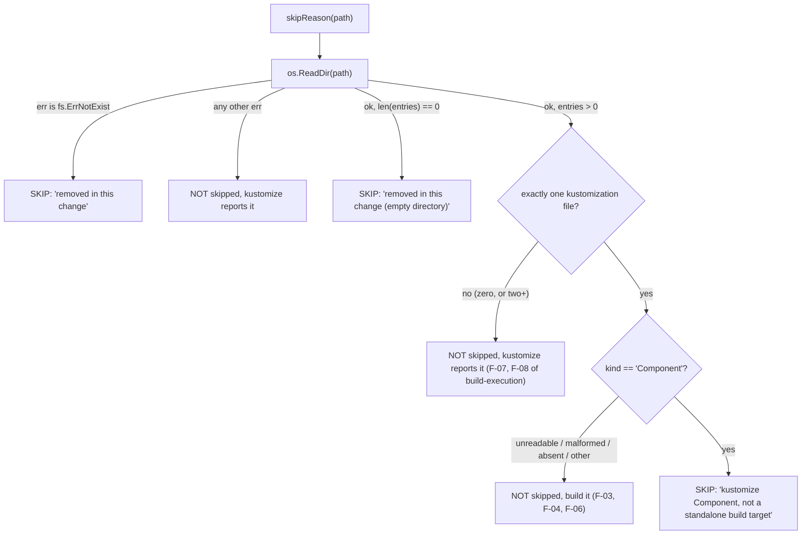
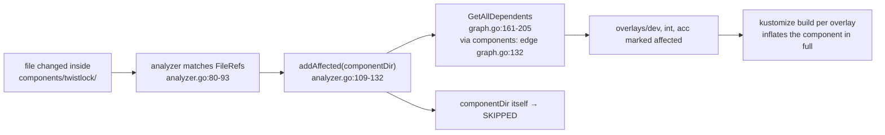

## SPECIFICATION: Component Skip Semantics (a `kind: Component` is not a standalone build target)
**Version:** 1.0
**Status:** Draft
**Date:** 2026-09-10
**Type:** fix
**Slug:** component-skip-semantics

**Unit under spec:** `internal/builder` (`skipReason`), with a supporting field in
`internal/discovery`, wording changes in `internal/reporter`, and the `skipped-count`
description in **both** `action.yml` files
**Depends on:** [build-execution.spec.md](./build-execution.spec.md) for the skip guard this
extends (F-04 to F-09, NF-01, NF-05), [kustomization-discovery.spec.md](./kustomization-discovery.spec.md)
for parsing, [impact-analysis.spec.md](./impact-analysis.spec.md) for how a component's
consumers are marked affected, [result-reporting.spec.md](./result-reporting.spec.md) for the
counting rules and the public output contract
**Amends after implementation:** `build-execution.spec.md` F-05/F-06 (the skip-reason
enumeration), `build-execution.spec.md` NF-05 if the kind lookup lands inside `internal/builder`
(§10 O-2), `result-reporting.spec.md` F-25 (the fixed step-summary sentence) and its
`skipped-count` row (`result-reporting.spec.md:269`)
**Motivating defect:** live run on `org0031-landing-zone/argocd-k8s-resources` PR #196

> **This spec proposes a change.** §2.1 is the current-behaviour baseline and is the only part
> that describes shipped code; every claim in it carries a `file:line` citation. §3 onward is
> stated in the imperative (MUST / MUST NOT) and does **not** exist yet. Behaviour reproduced
> locally this session is labelled "verified this session" with the exact command output.

---

### 1. Overview

Discovery finds **every** kustomization file in the tree, keying only on the filename
(`discovery.go:104`, `:343-347`), and the builder hands **every** affected directory to
`kustomize build` (`builder.go:213-222`, `:108-138`). Nothing anywhere in the pipeline decodes
the `kind` field: `KustomizeFile` has no such field (`discovery.go:34-59`) and stage 2 of the
parser decodes `resources`, `bases` and `components` only (`discovery.go:175-177`).

A kustomize **Component** (`apiVersion: kustomize.config.k8s.io/v1alpha1`, `kind: Component`) is
therefore treated as a build target like any other directory. It is not one. A Component is
designed to be composed into a parent that lists it under `components:`; it carries no resource
set of its own, and its patches resolve against the resources of whatever parent includes it.
It cannot be listed under `resources:`, and a Kustomization cannot be listed under `components:`.
[Source: <https://kubectl.docs.kubernetes.io/guides/config_management/components/>, and KEP-1802,
<https://github.com/kubernetes/enhancements/blob/master/keps/sig-cli/1802-kustomize-components/README.md>.
Components have existed since kustomize v3.7.0, same sources.]

The consequence is a **false fail**, and it is not hypothetical. On PR #196 the seven consuming
overlays all built green while the component directory alone failed with:

```
Error: no resource matches strategic merge patch "DaemonSet.v1.apps/twistlock-defender-ds.twistlock":
no matches for Id DaemonSet.v1.apps/twistlock-defender-ds.twistlock; failed to find unique target for patch
```

reported as `Summary: 8 total, 7 successful, 1 failed, 0 skipped`, turning the whole check red on
a correct change. The workaround applied there was to abandon the component and inline the patch
into all seven overlays, so **the bug forced exactly the duplication the tool's own flagship test
scenario exists to bless** (`pipeline_test.go:195-216`). That is the worst shape a false fail can
take: it did not merely get ignored, it changed the manifests.

Reproduced this session at `main` (`bb36cfd`), one component with a strategic-merge patch consumed
by three overlays, `kustomize v5.7.1` locally (the image pins `v5.8.1`, `Dockerfile:13`):

```
❌ /tmp/kbc-repro2/components/twistlock - Build failed (0.01s)
   Error: no resource matches strategic merge patch "DaemonSet.v1.apps/twistlock-defender-ds.twistlock": ...
✅ .../overlays/acc  ✅ .../overlays/dev  ✅ .../overlays/int
Summary: 4 total, 3 successful, 1 failed, 0 skipped   → exit 1
```

The fix is to classify a Component as **skipped**, with a reason distinct from the removal
reasons, and to rely on the transitive validation that already works: `components:` entries are
already graph edges (`graph.go:132`, `:90`), so a change inside a component already marks every
consuming kustomization affected (`analyzer.go:109-132`) and those consumers are what actually
exercise the component's patches.

This repo is a `go-cli-tool` (`vega.yaml`) with one direct dependency (`gopkg.in/yaml.v3`,
`go.mod`). **No new dependency is proposed.** The `kind` field is one more decode through the
parser that already runs (`discovery.go:164-181`).

#### 1.1 Why this narrowing is allowed at all

CLAUDE.md ranks a **false pass as strictly worse than a false fail**, and
`build-execution.spec.md` NF-01 requires the skip guard to stay "the narrowest predicate that
fixes the reported bug". Skipping a whole class of discovered directories is a widening of the
guard, so it must carry its own proof.

The proof is that for a component **with at least one discovered parent**, the skip removes no
validation: every parent inflates the component in full, so a broken component still fails the
run through its parents. Verified this session on the draft branch by deleting the patch file the
component references:

```
❌ .../overlays/dev  ❌ .../overlays/int  ❌ .../overlays/acc
   Error: accumulating components: accumulateDirectory: "recursed accumulation of path
   '.../components/twistlock': ... failed to get the patch file from path(ds-patch.yaml) ..."
⏭️  .../components/twistlock - Skipped (kustomize Component, ...)
Summary: 4 total, 0 successful, 3 failed, 1 skipped   → exit 1
```

For a component with **no** discovered parent, the skip does remove validation. That case is
addressed head-on as an owner-approved exception in §3.2 (Decision 2), not glossed over.

---

### 2. Goals & Success Metrics

| ID | Goal | Metric |
|---|---|---|
| G-1 | A Component never fails the check on its own | The PR #196 shape (component with a strategic-merge patch, N consuming overlays) yields `Failed == 0` and exit 0, with the component result carrying `Skipped == true`. **AC-1** |
| G-2 | The skip is legible as "not a build target", never as "deleted" | The component's `SkipReason` is not either removal string (`builder.go:198`, `:207`), and the step-summary Skipped section no longer asserts that every skipped path is gone (`reporter.go:250`). **AC-4**, **AC-8** |
| G-3 | Every component with a discovered parent stays validated, transitively | Breaking a component turns the run red through its consumers: `Failed == 3`, exit 1, component `Skipped == true`. **AC-3** |
| G-4 | The skip is classification-based, not shape-based | A resource-only component skips too, for the same reason (**AC-2**); a directory with no `kind` builds (**AC-6**); a directory kustomize itself rejects is never skipped (**AC-7**) |
| G-5 | The counting invariant survives a second skip reason | `Total == Success + Failed + Skipped` still holds and is still asserted (`reporter.go:73-85`, `pipeline_test.go:260-264`). **AC-9** |
| G-6 | The only test the change breaks is understood and resolved deliberately | `TestConsolidateDuplicatedDirsIntoComponent` `:256-258` is amended or superseded per §10 O-1, with the decision recorded. **AC-10** |

#### 2.1 Current-behaviour baseline (shipped code, cited; nothing here is a requirement)

| # | Fact | Evidence |
|---|---|---|
| B-1 | Discovery treats any file named `kustomization.yaml` / `kustomization.yml` / `Kustomization` as a kustomization, with no `kind` check. | `discovery.go:104`, `:343-347` |
| B-2 | `KustomizeFile` records `Path`, `Dir`, `Resources`, `Bases`, `Components`, parse flags and `FileRefs`. There is **no** `Kind` field, and `kind` is never decoded. | `discovery.go:34-59`, `:175-177` |
| B-3 | Unknown fields are ignored by design, which is why `kind` has cost nothing until now. | `discovery.go:172-174` |
| B-4 | `components:` entries become graph dependencies exactly like `resources:` and `bases:`. | `graph.go:128-134`, specifically `:132` |
| B-5 | The reverse edge component → parent is recorded whether or not a node exists at the resolved path. | `graph.go:77-90` |
| B-6 | A changed kustomization file marks its own directory affected, and `addAffected` pulls in every transitive dependent. | `analyzer.go:70-77`, `:109-132`; recursion at `graph.go:161-205` |
| B-7 | A changed file **inside** a component directory matches that component's `FileRefs` and therefore also marks the component's consumers affected. | `analyzer.go:80-93`, `:160-181` |
| B-8 | Component directories are deliberately absent from `FileRefs`: directory-shaped fields become edges, not file matches. | `discovery.go:184-188` |
| B-9 | `skipReason` keys on exactly two conditions, both about removal: `fs.ErrNotExist` → `"removed in this change"`, empty directory → `"removed in this change (empty directory)"`. Everything else returns `""`. | `builder.go:194-209` |
| B-10 | `BuildResult.Skipped` is documented as "a path that was never handed to kustomize **because the change removed it**". | `builder.go:22-26` |
| B-11 | The reporter counts `Skipped` first, so `Total == Success + Failed + Skipped`. | `reporter.go:73-85`, `:12-25` |
| B-12 | The step-summary Skipped section states, as a fixed sentence, `These paths no longer exist in the working tree and were not built.` | `reporter.go:248-257`, sentence at `:250` |
| B-13 | The `skipped-count` output is described as `Number of paths skipped because they no longer exist (deleted or renamed by the change)`. | `action.yml:55-56`; wrapper `action.yml:40-41` per `result-reporting.spec.md:269` |
| B-14 | Exit code reads `summary.Failed` only; skips never fail the workflow. | `main.go:176-189` |
| B-15 | In full-scan mode every discovered kustomization is built, so a component is a build target there too. | `main.go:118-123` |
| B-16 | A resource-only component **builds green standalone today**. `TestConsolidateDuplicatedDirsIntoComponent` creates exactly such a component (`kind: Component` + `resources:`) and it is currently counted as a success. | `pipeline_test.go:208-211`; test passes at `main`, verified this session |
| B-17 | `TestConsolidateDuplicatedDirsIntoComponent` asserts `summary.Skipped` equals the number of removed directories it found, which holds only while removal is the sole skip reason. | `pipeline_test.go:236-258`, assertion at `:256-258` |

---

### 3. Functional Requirements

#### 3.1 Decision 1 (the skip rule): a Component is not a build target

| ID | Priority | Requirement |
|---|---|---|
| F-01 | P0 | The build stage MUST NOT invoke `kustomize build` on a directory whose kustomization file declares `kind: Component`. It MUST instead produce a `BuildResult` with `Skipped == true`, `Success == false`, empty `Output` and empty `Error`, exactly as the removal skips do (`builder.go:97-106`). |
| F-02 | P0 | The classification MUST key on the `kind` field alone, compared as the exact string `Component`. `apiVersion` MUST NOT be consulted: a component with the wrong apiVersion is broken either way, and adding a second key widens the predicate without adding safety. |
| F-03 | P0 | **An absent `kind` means `Kustomization`** and MUST be built, per kustomize's own default. An empty or whitespace-only `kind` is treated as absent. |
| F-04 | P0 | Any `kind` other than `Component` (including a value this tool has never heard of) MUST be built. The predicate is an allow-nothing-else list of one. |
| F-05 | P0 | The removal conditions MUST be evaluated **before** the Component condition, so a deleted component directory keeps the `"removed in this change"` reason (`builder.go:197-198`). A path that does not exist has no `kind` to read. |
| F-06 | P0 | If the kind cannot be determined (directory unreadable, kustomization file unreadable, YAML malformed, `kind` present but not a string), the directory MUST be built, not skipped. Failing open to `kustomize` matches `builder.go:199-201` and gives the user kustomize's own diagnostic. |
| F-07 | P0 | A directory containing **more than one** kustomization file MUST NOT be skipped, whatever kinds those files declare. kustomize rejects such a directory outright (`Error: Found multiple kustomization files under: <dir>`, verified this session with kustomize v5.7.1); skipping it converts a hard kustomize error into a green check. This is a **false pass present in the current draft implementation**, see §11. |

#### 3.2 Decision 2 (owner-approved exception): an orphan Component is never built, and that is accepted

| ID | Priority | Requirement |
|---|---|---|
| F-08 | P0 | A Component that **no discovered kustomization includes** is skipped like any other Component and is therefore **never validated by this tool**. This is a deliberate, owner-approved exception to the false-pass bar in CLAUDE.md. It MUST NOT be silently reversed by a later change without amending this spec. |

**Residual exposure, stated plainly.** This is a real narrowing of the validated set, and it is a
*regression of a catch the tool has today*. Verified this session, an orphan component whose
`resources:` names a missing file:

- at `main`: `Summary: 1 total, 0 successful, 1 failed, 0 skipped`, **exit 1** (the breakage is caught)
- with the skip in place: `Summary: 1 total, 0 successful, 0 failed, 1 skipped`, **exit 0** (the breakage is not caught)

Three concrete cases fall into this hole:

1. A component added in a PR before any parent references it. It is unvalidated until the wiring
   lands, and the PR that wires it up is the one that goes red.
2. A component whose only parents live outside `root-dir` (`action.yml:30-33`), or that is
   referenced by a remote base this tool never sees.
3. A **typo**: an ordinary overlay that declares `kind: Component` by mistake. ArgoCD or a human
   running `kustomize build` on it fails; this tool now says nothing.

The exposure is bounded by the fact that a component is by construction useless until something
includes it, and the moment something does, that consumer is validated and inflates the component
in full (§1.1). The owner has weighed this and accepted it. Emitting a warning for orphan
components is explicitly **out of scope** (§9), recorded so a future spec can pick it up rather
than rediscovering the trade-off.

#### 3.3 Decision 3 (consistency): a resource-only Component skips too

| ID | Priority | Requirement |
|---|---|---|
| F-09 | P0 | A Component that carries only `resources:` and no patches, which builds green standalone today (B-16), MUST also be skipped. The classification is by `kind`, never by whether this particular component happens to survive a standalone build. |

Rationale: keying on "does it have patches" would make the report's reason a lie half the time,
would make the skip set depend on the component's contents rather than its declared nature, and
would leave the exact PR #196 defect one patch away from returning. Consistency of reason is worth
more than the incidental validation a resource-only component gets today, which is in any case
fully covered by every parent that includes it.

#### 3.4 Decision 4 (reporting): the reason must not read as "deleted"

| ID | Priority | Requirement |
|---|---|---|
| F-10 | P0 | The skip reason MUST be distinct from both removal strings (`builder.go:198`, `:207`) and MUST name the Component nature. The specified string is:<br>`kustomize Component, not a standalone build target`<br>It is a **public surface**: it reaches users through the console line (`reporter.go:103`), the step-summary bullets (`reporter.go:253`) and the `results` JSON (`reporter.go:160`, `:171`). |
| F-11 | P0 | The reason string MUST NOT assert that validation happened elsewhere unless the tool knows that it did. A component with no discovered parent (F-08) is not validated anywhere, so a reason of the form "validated through the kustomizations that include it" would be false in exactly the case that matters. This is a **defect in the current draft**, see §11. |
| F-12 | P1 | The step-summary Skipped section MUST stop claiming that every skipped path is gone. `These paths no longer exist in the working tree and were not built.` (`reporter.go:250`) MUST become a sentence true of both reasons, e.g. `These paths were not built. The reason is given per path.` Per-path reasons are already rendered (`reporter.go:253`), so no information is lost. **This amends `result-reporting.spec.md` F-25, which pins that sentence.** |
| F-13 | P1 | The `skipped-count` output description MUST stop naming removal as the only cause, in **both** `action.yml` files (`action.yml:55-56`; wrapper `action.yml:40-41`). The output name and semantics do not change, so this is not a breaking change to the public output contract (`result-reporting.spec.md` F-19). |
| F-14 | P2 | If the implementation lands where the dependency graph is reachable (§10 O-2), the reason MAY be enriched with the number of including kustomizations, e.g. `kustomize Component, not a standalone build target (validated through 7 including kustomization(s))`. It MUST NOT claim a count it did not compute, and MUST degrade to the F-10 string when the count is unknown or zero. |

#### 3.5 Decision 5: transitive validation is the mechanism, and it must be tested, not assumed

| ID | Priority | Requirement |
|---|---|---|
| F-15 | P0 | Components MUST remain full participants in discovery and in the dependency graph. Dropping them from discovery, or filtering them out in the analyzer, MUST NOT be used to implement this fix: it would delete the `components:` edges (`graph.go:132`) that carry the validation, and it would remove the path from the report entirely instead of showing it as skipped. |
| F-16 | P0 | A change to a component's kustomization file, or to any file it references, MUST continue to mark every transitively including kustomization as affected (B-6, B-7). This is existing behaviour and is now **load-bearing**, so it MUST be covered by a test that fails if the edge is lost. |
| F-17 | P0 | The skip MUST apply identically in full-scan mode (`main.go:118-123`), because it is a property of the directory and not of how the run chose its scope. |
| F-18 | P1 | Nested components (a Component listed under another Component's `components:`) MUST resolve the same way: every level is skipped, and validation happens at the first non-Component ancestor, which `GetAllDependents` already reaches recursively (`graph.go:161-205`). |

#### 3.6 Tests required by this spec

| ID | Priority | Requirement |
|---|---|---|
| F-19 | P0 | Integration test, the PR #196 shape: a component carrying a strategic-merge patch plus N consuming overlays. Asserts `Failed == 0`, exit 0 equivalent, component `Skipped == true`, every overlay `Success == true`. Suggested name `TestPatchComponentIsSkippedNotFailed`. |
| F-20 | P0 | Integration test, the anti-false-pass guard: break the component (delete the file its patch points at), assert `Failed > 0` on the **consumers** and that the run is red. Suggested name `TestBrokenComponentFailsThroughItsParents`. Without this test the whole justification in §1.1 is unguarded. |
| F-21 | P0 | Integration test, transitive marking: edit **only** a file inside the component directory, assert all consumers appear in the results and build. Suggested name `TestComponentFileEditValidatesConsumers`. |
| F-22 | P0 | Unit tests on the skip predicate: resource-only component skips (F-09); absent `kind` builds (F-03); `kind: Kustomization` builds (F-04); malformed YAML builds (F-06); two kustomization files in one directory builds (F-07); a **deleted** component directory reports the removal reason, not the component reason (F-05). |
| F-23 | P1 | A test asserting the component skip reason is not equal to either removal string (F-10), so the two can never be collapsed by a later refactor. |
| F-24 | P0 | `TestConsolidateDuplicatedDirsIntoComponent` MUST be left passing, by whichever route §10 O-1 resolves to. It MUST NOT be deleted: it is the flagship regression test for the original skip guard (`build-execution.spec.md` §2, AC-1). |

---

### 4. Non-Functional Requirements

| ID | Category | Requirement |
|---|---|---|
| NF-01 | Correctness | The Component condition MUST be the last arm of the skip predicate and MUST fail open (F-06). Every unknown resolves to "hand it to kustomize", which is the same posture as `builder.go:199-201`. |
| NF-02 | Correctness | The set of directories skipped as Components MUST be a function of the declared `kind` only. No heuristic on directory name (`components/`), on path depth, or on the presence of patches. |
| NF-03 | Correctness | Exactly one `kind` decoder MUST exist in the codebase. Two parsers of the same field drift, and a divergence between them means the graph and the skip decision disagree about what a directory is. See §10 O-2: the current draft introduces a second, stricter decoder (`discovery.KindAt`) alongside the two-stage parser at `discovery.go:164-181`. |
| NF-04 | Dependencies | No new module. `kind` is a string decode through `gopkg.in/yaml.v3`, already the only direct dependency (`go.mod`). |
| NF-05 | Layering | `internal/builder` currently imports **stdlib only** (`builder.go:3-13`), asserted as NF-05 in `build-execution.spec.md`. If the chosen design imports `internal/discovery` into `internal/builder`, that NF MUST be amended in the same change, with the reason recorded, rather than quietly violated. |
| NF-06 | Performance | The kind lookup MUST NOT add a second full directory walk. It is either carried on the already-parsed `KustomizeFile` or is one `ReadDir` + one `ReadFile` on a directory the builder is about to touch anyway. |
| NF-07 | Observability | The skip MUST emit the existing `slog.Debug("Skipping build", ...)` line with the new reason (`builder.go:98`), so a surprising skip is diagnosable from `LOG_LEVEL=debug` alone. |
| NF-08 | Compatibility | No action input is added or renamed. No action output is added, removed or renamed. The only public-surface changes are two description strings and one step-summary sentence (F-12, F-13). |

---

### 5. Data Model & Flows

#### 5.1 The new field

`discovery.KustomizeFile` gains one field (`discovery.go:34-59`):

| Field | Type | Meaning |
|---|---|---|
| `Kind` | `string` | The `kind` field as written, empty when absent. Empty means `Kustomization` (F-03). |

It is populated in stage 2 of the existing parse (`discovery.go:175-177`), so an undecodable
`kind` records a `FieldError` like any other field and makes the directory always-affected
(`analyzer.go:46-55`), which is the safe direction.

#### 5.2 Skip decision, after this spec



Ordering is normative (F-05): removal beats Component.

#### 5.3 Where a Component actually gets validated



#### 5.4 Outcome table for the PR #196 shape

| Directory | Today (`main`) | After this spec |
|---|---|---|
| `components/twistlock` (patch) | Failed | Skipped, reason per F-10 |
| `overlays/{dev,int,acc}` | Success | Success (unchanged) |
| Run | `4 total, 3 successful, 1 failed, 0 skipped`, exit 1 | `4 total, 3 successful, 0 failed, 1 skipped`, exit 0 |

Both rows verified this session against the `main` binary and the draft binary respectively.

---

### 6. API / Interface Contracts

**Go, `internal/discovery`:**

```go
type KustomizeFile struct {
    // ...
    Kind string // kind as written; empty means Kustomization (F-03)
}
```

Any exported helper for "is this a Component" MUST compare against a single exported constant
rather than a bare literal, so the string exists once.

**Go, `internal/builder`:** the `Builder` interface (`builder.go:46-49`) does **not** change.
`skipReason` gains one arm (F-01, F-05). Whether it gains a parameter, or the kind is supplied by
the caller, is the open design choice in §10 O-2; either way `Build` and `BuildAll` keep their
signatures.

**Skip reason strings (public surface):**

| Reason | When |
|---|---|
| `removed in this change` | path absent (`builder.go:197-198`, unchanged) |
| `removed in this change (empty directory)` | path empty (`builder.go:202-207`, unchanged) |
| `kustomize Component, not a standalone build target` | **new**, F-10 |

**Action surfaces:**

| Surface | Change |
|---|---|
| Inputs | none |
| Output names | none |
| `skipped-count` semantics | unchanged (count of skipped paths); description text updated in both repos (F-13) |
| `results` JSON | unchanged shape; a new value may appear in `SkipReason` |
| Exit code | unchanged (`main.go:176-189`); a Component can no longer contribute to `Failed` |

---

### 7. Acceptance Criteria

- [ ] **AC-1 (the reported defect).** A repo with `components/twistlock` (`kind: Component`, one
  `patches[].path` strategic-merge patch) included by three overlays, all four directories
  affected: the run reports `Failed == 0`, the component result has `Skipped == true` and
  `Success == false`, each overlay has `Success == true`, and the process exits 0. **Test:** F-19.
  **Baseline it must invert:** `4 total, 3 successful, 1 failed, 0 skipped`, exit 1 (verified this
  session at `main`).
- [ ] **AC-2 (resource-only component).** A component with only `resources:` and no patches, which
  builds standalone today (B-16), is reported `Skipped == true` with the same reason as AC-1, not
  `Success == true`. **Test:** F-22.
- [ ] **AC-3 (the skip hides nothing, for a parented component).** Deleting the file a component's
  patch points at yields `Failed == 3` (one per consuming overlay), exit 1, and the component
  itself `Skipped == true`. **Test:** F-20.
- [ ] **AC-4 (distinct reason).** The component result's `SkipReason` is not equal to
  `"removed in this change"` and not equal to `"removed in this change (empty directory)"`, and
  contains the word `Component`. **Test:** F-23.
- [ ] **AC-5 (removal wins).** A component directory **deleted** by the change is reported with
  `SkipReason == "removed in this change"`, not the Component reason. **Test:** F-22.
- [ ] **AC-6 (absent kind still builds).** A directory whose kustomization declares no `kind` and
  references a missing resource yields `Skipped == false` and `Failed > 0`. **Test:** F-22.
- [ ] **AC-7 (kustomize's own errors are not swallowed).** A directory containing both
  `kustomization.yaml` and `Kustomization`, one of which declares `kind: Component`, yields
  `Skipped == false` and `Failed > 0` with kustomize's `Found multiple kustomization files under:`
  error. **Test:** F-22. **This currently fails on the draft branch** (verified this session:
  `1 total, 0 successful, 0 failed, 1 skipped`, exit 0).
- [ ] **AC-8 (report wording).** With one component skipped and no removals, the step summary's
  Skipped section does not contain the string `no longer exist`, and does contain the component's
  path with its reason. **Test:** extend `TestStepSummaryDoesNotListSkippedAsError`
  (`reporter_test.go:64-93`), which asserts the heading only.
- [ ] **AC-9 (counting invariant).** For every test in this spec,
  `Success + Failed + Skipped == Total` (`reporter.go:73-85`), and a skipped component appears in
  neither `success-count` nor `failed-count` (`reporter.go:167-169`).
- [ ] **AC-10 (the known-breaking test).** `TestConsolidateDuplicatedDirsIntoComponent` passes.
  Its current assertion fails on the draft with exactly `pipeline_test.go:257: expected 3 skipped,
  got 4` (verified this session), because the fixture's own component (`pipeline_test.go:208-211`)
  becomes the fourth skip. Resolution per §10 O-1, and the chosen route is recorded in the plan.
- [ ] **AC-11 (no dependency drift).** `go.mod` still lists exactly one direct dependency.
- [ ] **AC-12 (full-scan parity).** In a run degraded to full scan (`main.go:118-123`), a component
  is reported `Skipped`, and a broken component with a parent still fails the run through that
  parent.

---

### 8. Edge Cases & Error Handling

| Scenario | Required behaviour | Reference |
|---|---|---|
| Component with patches, one or more parents | Skipped; parents validate it | F-01, AC-1 |
| Component with only `resources:` | Skipped, same reason | F-09, AC-2 |
| Component with no parent anywhere in `root-dir` | Skipped, never validated. **Accepted exposure** | F-08, §3.2 |
| Component deleted by the change | `"removed in this change"` (removal is evaluated first) | F-05, AC-5 |
| Component directory left empty by a `git mv` | `"removed in this change (empty directory)"` | F-05; `builder.go:202-207` |
| Component included by another Component | Every level skipped; the first non-Component ancestor validates the chain | F-18 |
| `kind:` absent | Built | F-03, AC-6 |
| `kind: Kustomization`, or any other value | Built | F-04 |
| `kind:` present but not a scalar string | `FieldError` recorded, directory always-affected, and built | F-06; `discovery.go:307-324`, `analyzer.go:46-55` |
| Kustomization file unreadable, or malformed YAML | Built; kustomize gives the diagnostic | F-06; `discovery.go:154-170` |
| Directory holds two kustomization files | Built; kustomize reports `Found multiple kustomization files under:` | F-07, AC-7 |
| Directory holds content but no kustomization file | Built and fails, unchanged | `build-execution.spec.md` F-08; `builder_test.go:55` |
| Component referenced by a parent outside `root-dir` | Treated as an orphan (nothing discovered includes it): skipped, unvalidated | F-08 |
| Component whose kustomization is a symlink to a missing file | Read fails, so the kind is unknown: built, kustomize reports it | F-06 |
| Full-scan mode | Identical classification | F-17, AC-12 |

---

### 9. Out of Scope

- **Warning on orphan components.** Detecting that a Component has zero including kustomizations
  and surfacing it (a report line, a new output, a non-fatal notice) is deliberately **not**
  required here. The owner has accepted the exposure (F-08). Recorded so a future spec can take it
  up with the trade-off already written down rather than rediscovering it.
- **Composing a synthetic parent to validate an orphan Component.** Building a throwaway
  Kustomization that lists the component under `components:` would restore standalone validation,
  but it validates a manifest set nobody ships and would report failures against a directory the
  user never asked to build. Rejected, not deferred.
- **Any change to what is *discovered* or to the graph.** Components stay in both (F-15).
  `internal/discovery` and `internal/graph` behaviour is specified in
  [kustomization-discovery.spec.md](./kustomization-discovery.spec.md).
- **`apiVersion` validation of any kind** (F-02).
- **Other kustomize kinds.** No behaviour is specified for anything except `Component` (F-04).
- **The counting model itself.** Whether `Skipped` splits by reason is the open question in §10
  O-1 and is decided in the plan, not here.
- **Constitution-pinned concerns.** Per `vega.yaml` and CLAUDE.md this repo has no GitOps,
  secret-manager, cluster or team bindings; nothing here touches them.

---

### 10. Open Questions

| ID | Question | Owner | Status |
|---|---|---|---|
| O-1 | **Does `summary.Skipped` stay one counter, or split by reason?** See the options below. | maintainer, at plan time | **Open, must be decided before implementation** |
| O-2 | **Where does the kind come from at skip time?** See the options below. | maintainer, at plan time | Open |

**O-1, the two options.**

The trigger is concrete: `TestConsolidateDuplicatedDirsIntoComponent` asserts
`summary.Skipped == <number of removed directories it found>` (`pipeline_test.go:236-258`,
assertion at `:256-258`). That assertion was correct only while removal was the sole skip reason.
The test's own fixture creates a `kind: Component` (`pipeline_test.go:208-211`), so it becomes the
fourth skip and the assertion fails with `expected 3 skipped, got 4` (verified this session on the
draft branch). Note that `build-execution.spec.md` cites this same test twice in its §2 goals
table (rows 2 and 4) and as AC-1, so touching it has spec consequences either way.

*Option A, amend the assertion.* Count only the removed directories that are skipped **for a
removal reason**, i.e. assert on `SkipReason`, or assert `summary.Skipped == removed + 1` with a
comment naming the component. Argument for: the counter stays a single number, so
`skipped-count`, the step-summary table row (`reporter.go:205`) and the `Total = Success + Failed
+ Skipped` invariant (`reporter.go:73-85`) are untouched; the public output contract in
`result-reporting.spec.md` F-14/F-19 needs no change; the change is one test file. Argument
against: the aggregate `Skipped` becomes a number that mixes two very different meanings, so any
consumer that reads `skipped-count` as "how much did this PR delete" is now silently wrong, and
every future skip reason repeats this same test edit.

*Option B, split the counter.* Keep `Summary.Skipped` as the total and add a per-reason
breakdown (for example `SkippedRemoved` and `SkippedComponent`, or a `map[string]int` keyed by
reason), with the existing test asserting on the removal sub-count. Argument for: the assertion
becomes true by construction rather than by arithmetic, the report can say "3 removed, 1
component" instead of "4 skipped", and the model stops conflating two causes. Precedent exists in
this repo: `Summary.TimedOut` is exactly this pattern, a sub-count that exists "only so the report
can say *why*" (`reporter.go:20-23`). Argument against: it is a wider change (`Summary`, the
step-summary table, possibly a new output name, which is a public-surface addition under
`result-reporting.spec.md` F-19) for a report that already prints the reason per path
(`reporter.go:103`, `:253`), and every new skip reason then needs a new field.

Neither option is chosen here. The plan phase decides and records the reasoning; whichever route
is taken, F-24 (the test keeps passing and is not deleted) is binding.

**O-2, the two options.**

*Option A, look it up from the path at skip time* (what the draft does): the builder reads the
directory and decodes `kind` itself. For: `skipReason` stays a pure predicate over a path, and
`BuildAll`'s signature is untouched. Against: it imports `internal/discovery` into
`internal/builder`, which breaks the stdlib-only NF-05 in `build-execution.spec.md` (`builder.go:3-13`),
and it creates a **second** `kind` decoder alongside the two-stage parser at `discovery.go:164-181`,
which NF-03 forbids. It also re-reads a file discovery already parsed.

*Option B, carry the kind through the pipeline*: `KustomizeFile.Kind` is populated at discovery
(§5.1) and reaches the build stage as data, either through the
analyzer's output or through a lookup that `cmd/action` passes down. For: one decoder, no new
import into `internal/builder`, and the graph and the skip decision cannot disagree. Against: the
build stage currently takes `[]string` (`builder.go:46-49`), so this widens an interface that
`build-execution.spec.md` F-01/F-02 specifies, and it means the classification is computed from
the pre-build tree rather than the state on disk at build time.

**Assumptions** (mode = autonomous, per the developer's explicit override of `vega.yaml`'s
`spec_mode: assisted`):

- Assumed the skip reason string specified in F-10 is `kustomize Component, not a standalone build
  target` rather than the draft's `kustomize Component, validated through the kustomizations that
  include it`, because the draft's wording is verifiably false for an orphan component (F-08,
  verified this session: the orphan is skipped with that reason while nothing validates it).
  The brief fixed the *requirement* (a distinct reason), not the *text*. [Risk: low, and it is a
  string the plan may refine as long as F-10 and F-11 hold]
- Assumed F-07 (never skip a directory holding two kustomization files) is in scope, because the
  draft's behaviour there is a genuine false pass found while writing this spec, and the false-pass
  bar in CLAUDE.md makes it a blocker rather than a nice-to-have. It was not named in the brief.
  [Risk: low, additive and strictly safer]
- Assumed `apiVersion` is not consulted (F-02). kustomize's documented component declaration
  carries both fields, but keying on both would mean a component with a stale apiVersion is built
  standalone and fails, which is the defect this spec closes. [Risk: low]
- Assumed the classification applies in full-scan mode too (F-17), since the predicate lives at the
  build stage which both modes share (`main.go:118-123`, `:153-156`). [Risk: low]
- Assumed this spec keeps the repo's 11-section structure rather than the 4-section fix template,
  because every other spec in `docs/specs/` uses it and because a fix with an unresolved design
  question needs §10 and §11 to hand off. The framing is problem-first as the brief asked.
  [Risk: low]
- Assumed the kustomize behaviours quoted here are those of the versions used in evidence:
  `v5.7.1` locally for the reproductions, `v5.8.1` as pinned in the image (`Dockerfile:13`). The
  component semantics cited in §1 come from the kustomize documentation and KEP-1802 links given
  there, not from model memory. No claim is made that these versions stay current. [Risk: low]
- Assumed the PR #196 figures (`8 total, 7 successful, 1 failed, 0 skipped`, and the inlining
  workaround) are as reported in the brief; they were not re-fetched from that repository, but the
  identical failure and error string were reproduced locally this session. [Risk: low]

---

### 11. Planner Handoff Notes

**A draft implementation already exists. Start from it, not from zero.**

Local branch `fix/skip-component-kustomizations` in this repo (not pushed, not spec-backed,
2 files, +90/-8) already does most of the mechanical work:

- `internal/discovery/discovery.go`: adds `Kind` to `KustomizeFile`, decodes it in stage 2 via a
  new `decodeString`, adds `const ComponentKind = "Component"`, `(*KustomizeFile).IsComponent()`
  and a path-based `discovery.KindAt(dir)`.
- `internal/builder/builder.go`: extends `skipReason` with a Component arm and updates the
  `BuildResult.Skipped` doc comment.

Reviewed against this spec, it needs these corrections:

| Draft behaviour | Against | Note |
|---|---|---|
| Skip reason `kustomize Component, validated through the kustomizations that include it` | F-11 | False for an orphan component, which is skipped and validated nowhere |
| `KindAt` returns the kind of the **first** kustomization file found, so a directory with two of them can be skipped | F-07, **AC-7** | Verified this session: `1 total, 0 successful, 0 failed, 1 skipped`, exit 0, where kustomize itself errors `Found multiple kustomization files under:`. This is a false pass |
| `internal/builder` now imports `internal/discovery` | NF-05, `build-execution.spec.md` NF-05 | Either amend that NF in the same change, or take O-2 Option B |
| `KindAt` is a second `kind` decoder next to `discovery.go:164-181` | NF-03 | Same decision as above |
| Step-summary sentence and `skipped-count` descriptions untouched | F-12, F-13 | `reporter.go:250`, `action.yml:55-56`, wrapper `action.yml:40-41` |
| No new tests | F-19 to F-23 | The draft adds none |
| `TestConsolidateDuplicatedDirsIntoComponent` fails | **AC-10**, O-1 | `pipeline_test.go:257: expected 3 skipped, got 4`. This is precisely the open question, not an incidental breakage |

Verified this session in a throwaway worktree: the draft breaks **exactly one** test.
`TestHelmValuesFileMarksItsDirectory` also fails, but it fails identically on `main` in this
environment (local kustomize `v5.7.1` and a locally installed helm, rather than the pinned image),
so it is unrelated to this change.

**Dependencies to resolve first**

1. Decide **O-1** before writing any test, because it determines whether the fix touches
   `internal/reporter` and the public output surface at all.
2. Decide **O-2** before writing any code, because it determines which package owns the lookup and
   whether `build-execution.spec.md` NF-05 needs amending.
3. Read `build-execution.spec.md` §11 first: `skipReason` is called out there as "the highest-risk
   function in the repository", and this spec widens it.

**Suggested implementation order**

1. `discovery`: `Kind` field + decode + constant (small, no behaviour change on its own).
2. Tests first for the guard boundaries (F-22, F-07 in particular), so the widening is fenced
   before it exists.
3. The `skipReason` arm (F-01 to F-06), per the O-2 decision.
4. Integration tests F-19, F-20, F-21.
5. Reporting and documentation wording (F-12, F-13), plus the wrapper repo's `action.yml`.
6. Resolve `TestConsolidateDuplicatedDirsIntoComponent` per O-1 (F-24).
7. Amend the specs listed in the header block, including the stale `skipReason` citations in
   `build-execution.spec.md` (it still cites `builder.go:127-143`; the function now lives at
   `builder.go:188-210` after the timeout work).

**Risk areas, in descending order**

1. **The orphan hole (F-08).** It is the one place this change trades a caught breakage for a
   green check, and it is accepted rather than mitigated. Anyone reading the report must be able
   to find that decision, which is why F-11 forbids a reason string that papers over it.
2. **Over-broad skipping.** F-07 is the concrete instance already present in the draft. Any
   "cannot determine the kind" path that resolves to *skip* instead of *build* is the same class
   of bug (F-06).
3. **Losing the `components:` edge.** If a later change filters components out of discovery or the
   graph as a "simplification", the transitive validation this spec depends on disappears and the
   orphan hole silently swallows every component. F-15, F-16 and the F-20 test exist to prevent it.
4. **Two `kind` decoders drifting** (NF-03, O-2).

**Estimated complexity**

| Item | Size |
|---|---|
| `discovery.Kind` field + decode (§5.1) | S |
| `skipReason` Component arm, O-2 Option A | S |
| `skipReason` Component arm, O-2 Option B (plumbing the kind to the build stage) | M |
| Guard tests F-22, F-23 | S |
| Integration tests F-19, F-20, F-21 | M |
| Reporting + both `action.yml` descriptions (F-12, F-13) | S |
| O-1 Option A (amend the assertion) | S |
| O-1 Option B (split counter, report, possible new output, spec amendments) | M |
| Spec amendments listed in the header block | S |
