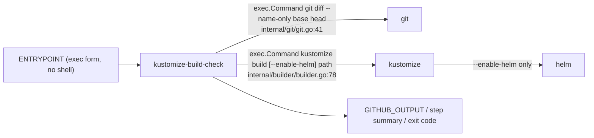
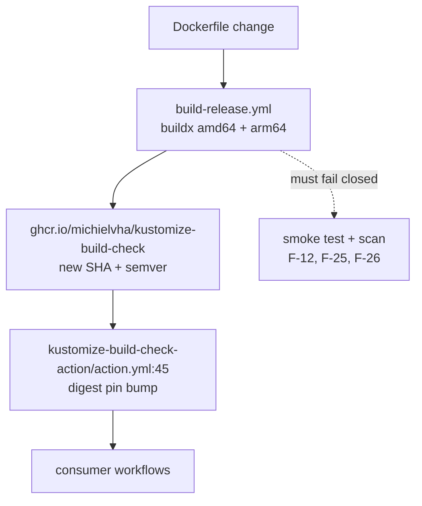

## SPECIFICATION: Container Hardening (alpine → Wolfi base, CVE surface reduction)
**Version:** 1.0
**Status:** Shipped (justification corrected, see §0)
**Date:** 2026-08-12
**Type:** feature
**Slug:** container-hardening

**Unit under spec:** `Dockerfile` (the released image), and the parts of the release flow that
carry it: `.goreleaser.yml`, `.github/workflows/build-release.yml`, `action.yml` here and in
`michielvha/kustomize-build-check-action`
**Not under spec:** any Go source file. This change compiles no new code and adds no module.
**Behaviour contract inherited from:** [build-execution.spec.md](./build-execution.spec.md),
[change-detection.spec.md](./change-detection.spec.md)
**Adjacent, do not duplicate:** `shallow-clone-support.spec.md` (authored concurrently)
**Supersedes the parked research block in:** `TODO.md:8-28`

> **Correctness framing.** This is a packaging change with a security goal, delivered under a
> correctness bar where **a false pass is worse than a false fail** (`CLAUDE.md`). A base-image
> swap can produce a false pass in exactly one way: a runtime binary the tool shells out to goes
> missing or changes behaviour, the tool degrades, and the check still reports green. `go test`
> cannot catch that, because the tests run on the CI host, not in the image
> (`.github/workflows/build-release.yml:47-58`). Behaviour parity is therefore a hard requirement
> of this spec and is enforced by an **image-level** smoke test, not by the unit suite alone.

---

### 0. Correction, after measuring (2026-08-14)

**This spec was justified by CVE reduction, and that justification does not survive
measurement. It is corrected here rather than quietly restated.**

Scanning both images with Trivy:

| | total | in OS packages | our binary | helm | kustomize |
|---|---|---|---|---|---|
| alpine (predecessor) | 75 | **0** | 10 | 10 | 55 |
| Wolfi, same versions | 73 | **0** | 8 | 10 | 55 |
| Wolfi + Go 1.26.6 + helm 4.2.4 | **65** | **0** | **0** | 10 | 55 |

**Neither image has any OS-package findings.** The CVE surface this spec set out to
reduce does not exist in either base, so swapping the base cannot reduce it. Every
finding is in the vendored dependencies of the Go binaries the image carries.

Two consequences:

1. **The base swap is still worth doing, but not for this reason.** What it
   genuinely delivers is a shell-free entrypoint, a digest-pinned base, no
   emulated-`apk` workaround, and no hardcoded workload name. Those are real. The
   goal in §2 is corrected accordingly, and the CVE metric is demoted from the
   justification to an observation.
2. **The reachable CVE surface was elsewhere, and is now taken.** All ten of our
   own binary's findings were Go stdlib issues fixed in 1.26.6; building with it
   takes them to zero. That is the largest measured improvement in this work and it
   has nothing to do with the base image.

`kustomize` contributes 55 of the remaining 65 from its own vendored dependencies.
It is already on the latest release, so that portion is **not reachable from this
repository** — it moves when upstream updates, or not at all. It is accepted and
recorded rather than ignored: `tests/e2e/scan-baseline.env` asserts it so a
regression is visible, and CI gates on the part we control, our own binary.

An earlier CI comparison appeared to show the swap making things *worse* (56 → 82).
That comparison was invalid: it scanned `:latest`, which resolves to a different
image than the one actually released. Fixed to compare against a recorded baseline.

---

### 1. Overview

The released image is built `FROM alpine:3.23` (`Dockerfile:1`) and layers on `git`,
`ca-certificates` and `wget` from `apk` (`Dockerfile:15-17`), plus pinned `kustomize v5.8.1`
(`Dockerfile:20-25`) and `helm v4.2.3` (`Dockerfile:28-34`). This spec moves the base to a
**Wolfi/Chainguard** image that still ships `git`, in order to reduce the CVE surface of the
published artifact `ghcr.io/michielvha/kustomize-build-check` (`vega.yaml:17-20`).

The developer's decision, verbatim:

> "the goal is to reduce CVE i dont strictly need distroless so if wolfi is the solution I am
> fine with that"

So the target is explicitly **not** a fully distroless image. Full distroless would require
replacing the single `git` invocation at `internal/git/git.go:41` with `go-git`, taking this repo
from 3 modules to 51 and the binary from 4.1 MB to 9.4 MB, and changing observable behaviour
(§9, §10 "Considered and rejected"). This repo's constitution says *reuse before you build* and
records exactly one direct dependency, `gopkg.in/yaml.v3` (`CLAUDE.md`, `go.mod`). Wolfi buys
most of the CVE reduction for **zero** new Go dependencies and **zero** behaviour change, which
is why it wins.

Two secondary hardening steps ride along because they are free once the Dockerfile is being
rewritten and neither depends on the base: removing the `/bin/sh -c` wrapper from `ENTRYPOINT`
(`Dockerfile:58`), which exists only to expand `${IMAGE_NAME}`; and pinning the base image by
digest, matching how the consumer action already pins this tool
(`kustomize-build-check-action/action.yml:45`).

### 2. Goals & Success Metrics

| Goal | Metric |
|---|---|
| ~~Reduce the CVE surface of the released image~~ **Corrected, see §0: there is no OS-package CVE surface to reduce.** Reduce the *attack* surface: no shell in the process tree, no floating base tag, no hardcoded bindings | A **measured** before/after scan (Trivy or Grype, same scanner, same version, same day, both architectures) is attached to the PR; the new image reports **strictly fewer** total findings and **no new** HIGH or CRITICAL finding than `alpine:3.23`-based `:latest`. No numeric target is asserted here because none has been measured (§10) |
| Change nothing the tool validates, skips, counts or reports | `go test ./... -count=1` passes unchanged (no test file is edited by this change), **and** the image-level smoke test (AC-4) produces byte-identical stdout counts and the same exit code as the current image on the same fixture repo |
| Keep both published architectures working | `docker buildx` produces a manifest list with `linux/amd64` **and** `linux/arm64` (`build-release.yml:82`), and the smoke test runs on both |
| Remove the shell from the process tree | The image's `ENTRYPOINT` is exec-form with no `/bin/sh -c`; `docker inspect` shows a single-element entrypoint |
| Make the base reproducible | `FROM` references a `sha256:` digest, not a floating tag |
| Add no Go dependency | `go.mod` `require` block is unchanged; `go list -m all \| wc -l` is unchanged |

### 3. Functional Requirements

Priority scale: P0 = launch blocker, P1 = important, P2 = nice-to-have.

#### 3.1 Base image

| ID | Priority | Requirement | Notes / evidence |
|---|---|---|---|
| F-01 | P0 | The runtime base MUST be a Wolfi-derived Chainguard image, replacing `alpine:3.23`. | `Dockerfile:1`; developer decision quoted in §1 |
| F-02 | P0 | The base MUST be referenced by **digest** (`FROM <ref>@sha256:...`), not by a floating tag. A human-readable tag MAY be kept alongside the digest for readability. | Mirrors `kustomize-build-check-action/action.yml:45`, which pins this tool by SHA |
| F-03 | P0 | The base MUST publish both `linux/amd64` and `linux/arm64`. | Verified 2026-08-12: `cgr.dev/chainguard/wolfi-base:latest` is an OCI image index with `linux/amd64` and `linux/arm64` children (anonymous `GET /v2/chainguard/wolfi-base/manifests/latest`, index digest `sha256:30f03343947c7ae3581fda727a6e2aa7b8ce7009b7bfc2ab8d5c9483ace5812f`, amd64 `sha256:0a430fca…`, arm64 `sha256:4ddccd47…`) |
| F-04 | P0 | The base MUST be pullable **without** a paid Chainguard entitlement, or the plan MUST switch to a fallback (§10 OQ-1). | Verified 2026-08-12: `cgr.dev` issued an anonymous pull token for `chainguard/wolfi-base` and served both the tag list and the manifest. Chainguard documents this tier: "Every image in this guide is a Free container: publicly available, with no authentication required. Production Containers, which add version-specific tags and patch SLAs, require authenticating to the registry." (<https://edu.chainguard.dev/chainguard/containers/quickstart.md>) |
| F-05 | P0 | The digest pin MUST resolve for the lifetime of a release. Free-tier images publish only `latest` / `latest-dev`, so the pin is a digest of whatever `latest` pointed at on build day. | Chainguard: "Chainguard publishes two tags for Free Containers — latest and latest-dev — and both point at the most recent build of the image." (quickstart, above). Verified 2026-08-12 that two *historical* `wolfi-base` digests (`sha256:000db31b…`, `sha256:006eeb2a…`, recovered from the repo's cosign `.sig` tag names) still resolve anonymously with HTTP 200, i.e. old digests are retained, not garbage-collected on tag move |
| F-06 | P1 | Base digest freshness MUST have an owner: either a scheduled digest bump (Chainguard publishes `digestabot`, "a free GitHub action we created to make it easier for public users to keep their Chainguard Containers fresh", <https://edu.chainguard.dev/chainguard/containers/staying-secure/updating-images/digestabot.md>) or a documented manual cadence in `README.md`. A pinned digest that is never bumped re-accumulates the CVEs this spec exists to remove. | New requirement |

#### 3.2 Runtime contents, behaviour parity

| ID | Priority | Requirement | Notes / evidence |
|---|---|---|---|
| F-07 | P0 | `git` MUST be present on `PATH` and executable by the runtime user. It is a hard runtime dependency: `internal/git/git.go:41` runs `exec.Command("git", "diff", "--name-only", baseRef, headRef)` and a start failure aborts the run with exit 1 (`cmd/action/main.go:34-37`). | `git` is not in `wolfi-base` (verified 2026-08-12 by listing every layer of the amd64 manifest: no `usr/bin/git`), but **is** in the Wolfi apk repository at `2.55.0-r4` for **both** `x86_64` and `aarch64` (`https://packages.wolfi.dev/os/{x86_64,aarch64}/APKINDEX.tar.gz`, fetched 2026-08-12) |
| F-08 | P0 | `kustomize` MUST be present on `PATH` at the version currently shipped (`v5.8.1`) and MUST remain resolvable by **bare name** through `PATH`, not by absolute path. | `internal/builder/builder.go:78`; version at `Dockerfile:20`; contract restated at `build-execution.spec.md` F-10, F-13, NF-07. `KUSTOMIZE_VERSION` MUST stay in sync with `build-release.yml:48` |
| F-09 | P0 | `helm` MUST be present on `PATH` at the version currently shipped (`v4.2.3`), unless OQ-2 resolves otherwise. It is invoked by `kustomize` under `--enable-helm`, never by this tool. | `Dockerfile:28-34`; `build-execution.spec.md` F-13 and the `--enable-helm` edge-case row |
| F-10 | P0 | All three binaries MUST be executable **as the non-root runtime user**, verified by running them, not by `ls`. | `Dockerfile:50-51` sets this today only for the tool binary |
| F-11 | P0 | The image MUST NOT alter what is validated, what is skipped, the success/failure/skipped counts, the stdout report, the `GITHUB_OUTPUT` values, the step summary, or the exit code. | Whole-pipeline contract: `build-execution.spec.md`, `result-reporting.spec.md`, `internal/reporter/reporter.go:45-54`, `cmd/action/main.go:105-108` |
| F-12 | P1 | A missing runtime binary MUST NOT be able to reach a release. The build MUST fail before push if `git`, `kustomize` or `helm` is absent or non-executable in the built image. | Today nothing checks this; `go test` runs on the host (`build-release.yml:47-58`) |

#### 3.3 User, git config, entrypoint

| ID | Priority | Requirement | Notes / evidence |
|---|---|---|---|
| F-13 | P0 | The container MUST run as a **non-root** user with **UID 1001**, preserved from `Dockerfile:36-38` ("to match GitHub Actions runner"). If the chosen base cannot create that account, `USER 1001:1001` numerically is acceptable and MUST be justified inline. | `wolfi-base` ships `/usr/bin/adduser` and `/usr/bin/addgroup` (verified 2026-08-12 in the layer listing), so `addgroup -g 1001` / `adduser -D -u 1001 -G` translate directly |
| F-14 | P0 | `git config --system --add safe.directory '*'` MUST still be in effect at runtime, applied as root at build time before the `USER` switch. Its absence makes `git diff` fail on the runner-owned workspace, which aborts the run at `main.go:34-37`. | `Dockerfile:40-42` |
| F-15 | P0 | `ENTRYPOINT` MUST be exec-form and MUST NOT invoke a shell. The current `["/bin/sh", "-c", "/usr/local/bin/${IMAGE_NAME}"]` exists **only** to expand `${IMAGE_NAME}`. | `Dockerfile:58`. No Go code reads `argv[0]` or `IMAGE_NAME` (grep of `cmd/`, `internal/`: the only env reads are `INPUT_*` via `main.go:119`, `GITHUB_OUTPUT` and `GITHUB_STEP_SUMMARY` at `reporter.go:104`, `:145`) |
| F-16 | P0 | Removing the shell MUST NOT hardcode the image name, which is a binding owned by `vega.yaml` ("Nothing hardcodes the image name or the consumer repo", `CLAUDE.md`). The binary MUST therefore be installed at a **name-agnostic** path (e.g. `/usr/local/bin/entrypoint`) so the exec-form `ENTRYPOINT` contains no binding. | Behaviour-neutral: nothing reads the binary's filename (see F-15 evidence) |
| F-17 | P1 | `ARG IMAGE_NAME` MUST be retained for the `COPY` source path, which depends on GoReleaser's dist layout (`dist/${IMAGE_NAME}_${TARGETOS}_${TARGETARCH}*/${IMAGE_NAME}`), and is supplied by `docker-release-action`'s `project` parameter. | `Dockerfile:5`, `:44-47`; `build-release.yml:80` |
| F-18 | P2 | `ENV IMAGE_NAME` MAY be dropped from the runtime image once the entrypoint no longer expands it, unless a consumer is shown to read it. | `Dockerfile:11` |

#### 3.4 Build mechanics

| ID | Priority | Requirement | Notes / evidence |
|---|---|---|---|
| F-19 | P0 | The image MUST continue to `COPY` a **pre-built** binary from GoReleaser's dist directory. No Go toolchain, no compilation in-image. | `Dockerfile:44-47`; `.goreleaser.yml:4-24`. This is what makes a minimal base viable at all |
| F-20 | P0 | The `--no-scripts` apk workaround MUST NOT be carried forward by default. It was added for "trigger errors with QEMU emulation on ARM64 (Alpine 3.23 issue)" (`Dockerfile:14`), an Alpine-specific defect. The plan MUST take an explicit position, backed by an actual arm64 build. | If the emulated arm64 `apk` step does fail on Wolfi, the preferred fix is to **remove the emulated package step** (multi-stage, or a `TARGETPLATFORM`-aware fetch) rather than to reinstate `--no-scripts`, because skipping triggers is itself a correctness risk |
| F-21 | P1 | `apk add ca-certificates` + `update-ca-certificates 2>/dev/null \|\| true` (`Dockerfile:16-17`) SHOULD be dropped: `wolfi-base` already ships `ca-certificates-bundle-20260413-r0` and `/etc/ssl/certs/ca-certificates.crt` (verified 2026-08-12 in the layer listing). Dropping it also removes a `\|\| true` that currently swallows a real failure. | `Dockerfile:16-17` |
| F-22 | P1 | `wget` MUST NOT remain in the **final** image. It exists only to download the kustomize and helm tarballs at build time (`Dockerfile:21`, `:29`). `wolfi-base` ships neither `wget` nor a `wget` busybox applet (verified 2026-08-12), so it would have to be added on purpose; instead the downloads MUST happen in a builder stage and the extracted binaries be `COPY`-ed into the final stage. Wolfi does have `wget 1.25.0-r9` for both arches if a builder stage needs it. | New requirement; `wolfi-base` does ship `/usr/bin/tar` and `/usr/bin/busybox` |
| F-23 | P1 | Downloaded tarballs MUST be checksum-verified, or the download MUST be replaced by an apk/upstream-published artifact with its own integrity check. Today `Dockerfile:21-25` and `:29-34` pipe an unverified tarball straight onto `PATH`; a hardening PR that leaves that in place is only half a hardening PR. | `Dockerfile:21-34` |
| F-24 | P2 | `KUSTOMIZE_VERSION` and `HELM_VERSION` MUST remain build `ARG`s with the same names and defaults, so the release action's override surface is unchanged. | `Dockerfile:20`, `:28` |

#### 3.5 Verification and release

| ID | Priority | Requirement | Notes / evidence |
|---|---|---|---|
| F-25 | P0 | An **image-level smoke test** MUST run in CI, on the built image, before push, on **both** architectures. It MUST execute the real entrypoint against a fixture git repository and assert the reported counts and exit code. | `go test` alone cannot catch a missing runtime binary (§1) |
| F-26 | P0 | A container image scan (Trivy or Grype) MUST run in CI and its before/after output MUST be recorded in the PR. The scan MUST NOT be asserted from memory or estimated. | Goal metric, §2 |
| F-27 | P1 | The scan step MAY be advisory (non-blocking) on this PR, but the *recorded output* is mandatory. | Avoids a new flaky release gate on day one |
| F-28 | P0 | The consumer pin bump MUST be treated as part of this change's blast radius: a new image SHA means `kustomize-build-check-action/action.yml:45` must be bumped and the wrapper exercised once against a real PR before this is considered done. | `action.yml:45` in the action repo; release flow in `CLAUDE.md` |
| F-29 | P2 | `dockerfile.old` SHOULD be deleted or moved under `docs/`. It is stale prior art (Go 1.25 builder stage, kustomize `v5.3.0`, helm `v3.16.2`, amd64-only, no non-root user) and after this change it becomes actively misleading. | `dockerfile.old:1-43` |

### 4. Non-Functional Requirements

| ID | Category | Requirement |
|---|---|---|
| NF-01 | Security | The final image MUST contain no package manager cache and no build-time download tooling beyond what the base itself ships. Anything added solely to fetch kustomize/helm lives in a builder stage (F-22). |
| NF-02 | Security | The final image MUST run as non-root (F-13) and MUST NOT contain a setuid binary that `alpine:3.23` did not already justify. |
| NF-03 | Security | Base image provenance: the chosen base MUST be a signed Chainguard/Wolfi image. Cosign verification of the base is optional for this change but the digest pin (F-02) is not. |
| NF-04 | Reliability | The registry hosting the base is a new build-time dependency. Chainguard states it "does not offer an SLA for uptime for the Chainguard's registry" (<https://edu.chainguard.dev/chainguard/containers/chainguard-registry/overview.md>). A base-registry outage may block a release; it MUST NOT be able to publish a *broken* image (F-12, F-25 fail closed). |
| NF-05 | Portability | Wolfi is **glibc**-based (`glibc-2.43-r12` observed in `wolfi-base`, 2026-08-12), Alpine is musl. The swap is safe under a **two-part** invariant, not a single one. **(a)** Every binary installed by **tarball or `COPY`** MUST be statically linked, because nothing in the image resolves an interpreter or shared libraries for them: our binary (`CGO_ENABLED=0`, `.goreleaser.yml:5-9`), kustomize v5.8.1 and helm v4.2.3, all verified with `file` on the released linux/amd64 artefacts. **(b)** Every binary installed by **`apk` from the Wolfi repository** — today only `git` (F-07) — MAY be dynamically linked against the base's own glibc, because `apk` installs its dependency closure into the same image. Such binaries MUST be proven by **executing** them as the non-root runtime user (F-10, AC-2), never by `file`. Note (b) already applied to the current `alpine:3.23` image, whose `git` is likewise dynamically linked (against musl), so this is a clarification of a pre-existing invariant, not a new exposure. Any future addition MUST be classified into (a) or (b) and verified accordingly. |
| NF-06 | Performance | Image pull time in CI MUST NOT regress materially. Record compressed image size before and after alongside the scan (F-26). |
| NF-07 | Maintainability | No new Go module. `go.mod` and `go.sum` MUST be untouched by this change (`CLAUDE.md`, "reuse before you build"). |
| NF-08 | Compatibility | The image's external contract is unchanged: same `INPUT_*` env var names, same `GITHUB_OUTPUT` keys, same exit-code semantics. A consumer that pins the new SHA needs no other edit. |

### 5. Data Model & Flows

There is no data model. The artefact under change is the image's file layout and process contract.

#### 5.1 What the image is made of, before and after

| Component | Today (`alpine:3.23`) | After |
|---|---|---|
| Base OS | `alpine:3.23`, musl, apk (`Dockerfile:1`) | Wolfi/Chainguard, glibc, pinned by digest (F-01, F-02) |
| `git` | `apk add --no-scripts git` (`Dockerfile:16`) | Wolfi `git 2.55.0-r4` (F-07) |
| `ca-certificates` | `apk add` + `update-ca-certificates \|\| true` (`Dockerfile:16-17`) | Already in the base, step removed (F-21) |
| `wget` | `apk add`, kept in the final image (`Dockerfile:16`) | Builder stage only, absent from the final image (F-22) |
| `kustomize` | tarball → `/usr/local/bin` (`Dockerfile:21-25`) | Same versions, fetched in a builder stage, checksum-verified (F-08, F-22, F-23) |
| `helm` | tarball → `/usr/local/bin` (`Dockerfile:29-34`) | Same, subject to OQ-2 (F-09) |
| Tool binary | `COPY` from GoReleaser dist (`Dockerfile:47`) | Unchanged source, name-agnostic destination path (F-16, F-19) |
| User | `addgroup`/`adduser` UID 1001 (`Dockerfile:36-38`) | Preserved, UID 1001 (F-13) |
| git config | `--system --add safe.directory '*'` (`Dockerfile:42`) | Preserved (F-14) |
| Entrypoint | `["/bin/sh","-c","/usr/local/bin/${IMAGE_NAME}"]` (`Dockerfile:58`) | `["/usr/local/bin/entrypoint"]`, no shell (F-15, F-16) |

#### 5.2 Runtime process tree, the thing that must not change



Exactly **two** binaries are spawned by production code: `git` and `kustomize`. `helm` is
spawned by `kustomize`, never by this tool. The `exec.Command("git", …)` at
`internal/integration/pipeline_test.go:58` is test-only and does not ship. This inventory is the
complete list of things the base image swap can break, and every one of them is covered by
F-07, F-08, F-09 and the AC-4 smoke test.

#### 5.3 Release blast radius



### 6. API / Interface Contracts

#### 6.1 Image contract (unchanged by this spec, asserted by the smoke test)

| Aspect | Contract | Source |
|---|---|---|
| Entrypoint | Runs the tool with no arguments | `Dockerfile:58` → exec form after F-15 |
| Inputs | `INPUT_BASE-REF`, `INPUT_ENABLE-HELM`, `INPUT_FAIL-ON-ERROR`, `INPUT_ROOT-DIR`; env only, no flags | `cmd/action/main.go:25-28`, `:119` |
| Logging control | `LOG_LEVEL` (DEBUG/INFO/WARN/ERROR, default INFO) | `main.go:17-19` |
| Outputs | Written to `$GITHUB_OUTPUT` and `$GITHUB_STEP_SUMMARY` when set | `internal/reporter/reporter.go:104`, `:145` |
| Exit code | Non-zero iff `summary.Failed > 0` and `fail-on-error` is true; skipped never fails | `main.go:105-108`; `build-execution.spec.md` |
| User | UID 1001, non-root | `Dockerfile:36-38`, `:54` |
| Working directory | A home directory is set (`Dockerfile:55`); the Actions runner overrides the working directory when it invokes a Docker action, so **nothing may depend on `WORKDIR`** | `Dockerfile:55`. The exact runner invocation is `[unverified - verify before relying]`; the smoke test MUST therefore pass `-w` explicitly rather than rely on the image default |
| Architectures | `linux/amd64`, `linux/arm64` | `build-release.yml:82` |

#### 6.2 Build-time contract

| ARG | Meaning | Source |
|---|---|---|
| `IMAGE_NAME` | GoReleaser dist path component; supplied as `project` by `docker-release-action` | `Dockerfile:5`, `build-release.yml:80` |
| `TARGETARCH`, `TARGETOS` | Set by buildx | `Dockerfile:7-8` |
| `KUSTOMIZE_VERSION` | Default `v5.8.1`; must match `build-release.yml:48` | `Dockerfile:20` |
| `HELM_VERSION` | Default `v4.2.3` | `Dockerfile:28` |

#### 6.3 Smoke test contract (new)

```
Given: a fixture git repository with >= 2 commits, containing a base and an overlay that
       depends on it, plus one deleted kustomize directory
When:  docker run --rm -v <fixture>:/w -w /w -e INPUT_BASE-REF=<sha> \
         -e GITHUB_OUTPUT=/w/out.txt <built-image>
Then:  exit code == 0
  and  stdout contains the same "N total, N successful, N failed, N skipped" line as the
       currently released image on the same fixture
  and  out.txt contains failed-count/success-count/skipped-count with identical values
  and  the run performed a real `git diff` (verified by a fixture where the wrong base ref
       would produce a different count)
```

The fixture MUST include a **deleted** directory, because the skip path is the one place where
a degraded `git` would silently change the counts rather than crash
(`internal/git/git.go:31-37`, `internal/builder/builder.go:52-55`).

### 7. Acceptance Criteria

- [ ] **AC-1:** `docker inspect <new image>` shows `Config.Entrypoint` is a single-element
      exec-form array containing no `/bin/sh` and no `-c`, and `Config.User` resolves to UID
      `1001`. (F-13, F-15)
- [ ] **AC-2:** `docker run --rm --entrypoint <shell-or-git> <new image> ...` proves, **as UID
      1001**, that `git --version`, `kustomize version` and `helm version` all exit 0;
      `kustomize version` reports `v5.8.1` and `helm version` reports `v4.2.3`. (F-07, F-08,
      F-09, F-10)
- [ ] **AC-3:** `git config --system --get-all safe.directory` inside the image includes `*`.
      (F-14)
- [ ] **AC-4:** The image-level smoke test of §6.3 passes on `linux/amd64` **and**
      `linux/arm64`, and its reported total / successful / failed / skipped counts and exit code
      are **identical** to those produced by the currently released image on the same fixture.
      (F-11, F-25)
- [ ] **AC-5:** `go test ./... -count=1` passes with **zero** edits to any `_test.go` file in
      this change's diff. (F-11)
- [ ] **AC-6:** `git diff` of this change touches no `.go` file and leaves `go.mod` and `go.sum`
      byte-identical. (NF-07)
- [ ] **AC-7:** The PR body contains scanner output (Trivy or Grype, named and versioned) for
      the old and the new image, for both architectures, showing total findings and the
      HIGH/CRITICAL breakdown. The new image has strictly fewer total findings and introduces no
      new HIGH or CRITICAL. (F-26, §2)
- [ ] **AC-8:** The `FROM` line(s) in `Dockerfile` contain a `sha256:` digest. A CI check (or a
      documented review step) rejects a `FROM` without a digest. (F-02)
- [ ] **AC-9:** The built manifest is a multi-arch manifest list containing exactly
      `linux/amd64` and `linux/arm64`. (F-03, F-13 of `build-release.yml:82`)
- [ ] **AC-10:** `docker run --rm --entrypoint <shell> <new image> -c 'command -v wget'` finds
      nothing, and no apk cache directory is populated in the final image. (F-22, NF-01)
- [ ] **AC-11:** The build fails (non-zero, no push) if `git`, `kustomize` or `helm` is removed
      from the Dockerfile. Demonstrated once by deliberately breaking it in a scratch branch, or
      by an equivalent assertion in the build job. (F-12)
- [ ] **AC-12:** The Dockerfile records, in a comment, whether `--no-scripts` was still needed on
      the new base and on what evidence (a linked arm64 build). (F-20)
- [ ] **AC-13:** `kustomize-build-check-action/action.yml` is bumped to the new image SHA and one
      real PR run against the wrapper reports the same result as before the bump. (F-28)
- [ ] **AC-14:** The kustomize/helm tarballs are checksum-verified at build time, or the build
      documents inline why the chosen fetch method already carries integrity verification.
      (F-23)

### 8. Edge Cases & Error Handling

| Scenario | Expected behaviour |
|---|---|
| Wolfi base lacks `git` out of the box | Expected, and handled: `git` is installed from the Wolfi apk repo (`2.55.0-r4`, both arches, verified 2026-08-12). This is the entire reason distroless was rejected. |
| `git` missing at runtime anyway | `exec.Command("git", …).Run()` returns a start error, `GetChangedFiles` returns an error, `main.go:34-37` prints to stderr and exits 1. A **hard fail, not a false pass** — but only if it happens on the first pipeline stage, which it does. AC-4 catches it before release regardless. |
| `kustomize` missing at runtime | **This is the dangerous one.** It is not a start-up abort: `builder.go:91` turns it into an ordinary per-path *failure* with the exec error in `Error` (`build-execution.spec.md`, `builder.go:99-105`). Every path fails, the run goes red, so it is a false *fail*, not a false pass. Still unacceptable; AC-2 and AC-4 must catch it. |
| `helm` missing and `--enable-helm` requested | Not special-cased; kustomize's own stderr is captured into `Error` (`builder.go:103`). Red run, not a silent pass. If OQ-2 resolves as "drop helm", this becomes an expected, documented failure mode and README must say so. |
| arm64 emulated `apk` fails under QEMU | Do **not** reflexively re-add `--no-scripts` (`Dockerfile:14`). Move the package step off the emulated path, or install into a builder stage. Record the decision per F-20/AC-12. |
| Base `:latest` digest moves between PR authoring and merge | Harmless: the pin is a digest, so the build is reproducible. Freshness is F-06's problem, not this build's. |
| Chainguard registry unreachable at build time | The release build fails; nothing is published. Acceptable (NF-04). Mitigation, if it recurs: a pull-through cache, which Chainguard explicitly recommends (<https://edu.chainguard.dev/chainguard/containers/chainguard-registry/overview.md>). |
| A future contributor adds a dynamically linked tool to the image | NF-05 is invalidated (Wolfi is glibc, Alpine was musl). The addition must re-verify with `file` and, if dynamic, prove the loader and libs are present. |
| Shallow clone (`fetch-depth: 1`) with an unreachable base sha | Out of scope here and **not** affected by the base image: it fails identically under real `git` and under go-git. Owned by `shallow-clone-support.spec.md`. |
| Workspace ownership differs from UID 1001 | Neutralised by `safe.directory '*'` (F-14). If F-13 falls back to numeric `USER 1001:1001` with no `/etc/passwd` entry, `git` may report the user as unknown; AC-3 plus AC-4 prove it still works. |

### 9. Out of Scope

- **Any Go code change.** No file under `cmd/` or `internal/` is touched. AC-6 enforces this.
- **Replacing `git` with `go-git` / a fully distroless image.** Considered and rejected, see §10.
- **Shallow-clone support.** Separate spec, `shallow-clone-support.spec.md`.
- **Changing kustomize or helm versions.** Version bumps are a separate, independently testable
  change; doing both at once makes an AC-4 parity failure ambiguous.
- **The false-pass surfaces in impact matching.** Owned by
  [complete-impact-matching.spec.md](./complete-impact-matching.spec.md). Unaffected here.
- **Everything in [build-execution.spec.md](./build-execution.spec.md) except F-13 of that spec.**
  This change touches only "the released image ships `kustomize v5.8.1` and `helm v4.2.3` on
  `/usr/local/bin`" — and only the *how*, not the *what*. Its F-10 (bare-name `PATH` resolution),
  F-11 (`--enable-helm` conditional), NF-04 (2-minute kill timer), NF-07 (portability) and the
  entire skip-semantics contract are **unaffected and must remain so**.
- **Building the image with `apko`/`melange` instead of a Dockerfile.** A larger rewrite; may be
  worth it later, but it would change the release action's contract.
- **Cosign-verifying the base image in CI.** Nice, not required for this change (NF-03).
- **A non-GHCR publishing target.**

### 10. Open Questions

**Resolved by the repo owner (2026-08-12):**

- **OQ-1 → pin by digest.** *"sha is fine its more secure anyway."* The base is pinned as
  `cgr.dev/chainguard/wolfi-base@sha256:…`, which was verified this session to work anonymously
  on the free tier, including for historical digests. Digest pinning is adopted as the deliberate
  choice rather than a workaround for the entitlement limit: it is reproducible and immune to a
  tag being moved under us. No Chainguard entitlement is purchased. Fallback (3) — mirroring the
  base into GHCR under this account — remains the answer if `cgr.dev` availability ever becomes a
  build-time problem, since a digest is mirrorable byte-for-byte. **F-06's digest-bump mechanism
  therefore becomes load-bearing** (OQ-3): a pinned digest that is never bumped silently
  re-accumulates the very CVEs this spec exists to remove.
- **OQ-2 → keep helm bundled (option (a)).** *"yes bundle helm."* No user-facing change, and the
  wrapper's default `enable-helm: 'true'` keeps working. Parity stays well-defined: F-09 and AC-2
  are unchanged and the README needs no warning. The CVE cost of helm is accepted; the required
  before/after scan (F-26) will quantify it, and dropping or splitting it stays available later as
  a non-urgent follow-up rather than a decision blocking this spec.

**Still open:**

| ID | Question | Owner | Needed by |
|---|---|---|---|
| **OQ-3** | Should the digest-bump mechanism (F-06) be `digestabot`, Dependabot, or a documented manual cadence? Low stakes, but an unbumped pin silently re-accumulates CVEs. | Michiel | Before merge |
| **OQ-4** | The exact Docker invocation the Actions runner uses for a `runs: using: docker` action (working directory, mount paths, user) is `[unverified - verify before relying]` in this session. It is load-bearing only for how faithfully the AC-4 smoke test mirrors production. The plan should verify it against the current GitHub Actions docs, or make the smoke test set `-v`, `-w` and `-u` explicitly and not depend on defaults. | Planner | Before AC-4 is written |

**Assumptions** (mode = autonomous)

- Assumed the primary base is **`cgr.dev/chainguard/wolfi-base`** (Option 1 in OQ-1) rather than
  `cgr.dev/chainguard/git`, because it is the smallest edit to the current Dockerfile — `apk`,
  `adduser`/`addgroup`, `sh`, `tar`, `chmod` and `chown` are all present (verified 2026-08-12 in
  the layer listing), so `Dockerfile:15-42` translates almost line for line and every preserved
  requirement (F-13, F-14) keeps working the same way. `chainguard/git` is the stronger
  hardening and is recorded as the first fallback. **[Risk: low — reversible, both are Wolfi,
  both free-tier, both multi-arch verified; the required scan (F-26) will show which is better]**
- Assumed the base digest observed this session
  (`wolfi-base:latest` → `sha256:30f03343947c7ae3581fda727a6e2aa7b8ce7009b7bfc2ab8d5c9483ace5812f`,
  2026-08-12) is illustrative only, and the plan will re-resolve `latest` at implementation time.
  **[Risk: low]**
- ~~Assumed~~ **Confirmed** that `helm` stays bundled (OQ-2, option (a)), so this spec's parity
  requirements are well-defined and the wrapper's default `enable-helm: 'true'` keeps working.
  **[Risk: none — this is now a decision, not an assumption]**
- Assumed the binary may be installed at a **name-agnostic** path (F-16) to satisfy both "no
  shell in the entrypoint" and "nothing hardcodes the image name" (`CLAUDE.md`). Verified nothing
  reads `argv[0]` or the binary filename. **[Risk: low]**
- Assumed the checksum verification of the kustomize/helm tarballs (F-23) belongs in this change
  rather than a separate one, because the Dockerfile's download blocks are being rewritten anyway
  and leaving an unverified download in a "hardening" PR is incongruous. **[Risk: low — drop to
  P2 and split it out if it inflates the change]**
- Assumed the scan gate is **advisory** on this PR (F-27) rather than release-blocking, to avoid
  introducing a new flaky gate in the same change that rewrites the image. **[Risk: low]**
- Assumed `dockerfile.old` can be deleted (F-29). If it is kept deliberately as history, drop
  F-29. **[Risk: low]**

**Considered and rejected: full distroless via `go-git`**

Recorded here so it is not re-proposed. Evidence, from the parked research at `TODO.md:8-28` and
this session's verification:

| Fact | Consequence |
|---|---|
| Production code spawns exactly two binaries, `git` (`internal/git/git.go:41`) and `kustomize` (`internal/builder/builder.go:78`); the `git` call in `internal/integration/pipeline_test.go:58` is test-only | Only **one** production `git` call would need replacing |
| Our binary (`CGO_ENABLED=0`, `.goreleaser.yml:5-9`), kustomize v5.8.1 and helm v4.2.3 are all statically linked, verified with `file` on the released linux/amd64 artefacts | A fully distroless image is **technically possible**; `git` is the sole blocker |
| A working `go-git` probe returned a **superset** of `git diff --name-only`: go-git has no rename detection, so a path git attributes to a rename is *additionally* reported as a deletion | A real behaviour change. It happens to be safe today only because removed paths are *skipped* rather than failed (`internal/builder/builder.go:52-55`, `build-execution.spec.md`) — i.e. the safety depends on an invariant in another spec, which is exactly the kind of coupling this repo's correctness bar warns about |
| Cost: 3 Go modules → 51; binary 4.1 MB → 9.4 MB | Directly contradicts `CLAUDE.md`'s "this repo has exactly one direct dependency; keep it that way" |
| Shallow clones fail under **both** real git and go-git when the base sha is unreachable | go-git buys nothing on that front; see `shallow-clone-support.spec.md` |

**Verdict:** rejected. Wolfi trades no new dependency and no behaviour change for most of the CVE
benefit; go-git trades 48 modules and a behaviour change for the remainder.

### 11. Planner Handoff Notes

**Resolve first (blocking):**
1. **OQ-1** — pick the base. Nothing else can be written until `FROM` is decided.
2. **OQ-2** — helm in or out. Changes F-09, AC-2, the README and possibly the release matrix.

**Suggested implementation order:**
1. Add the **image-level smoke test** and the **scan step** to `build-release.yml` against the
   **current** `alpine:3.23` image first. This produces the before-baseline for AC-7 and proves
   the harness works while the image is known-good. Doing this after the base swap makes a
   failure ambiguous. *(S–M)*
2. Capture the baseline scan output and the current fixture counts. Attach to the PR. *(S)*
3. Rewrite `Dockerfile` as two stages: a fetcher (downloads + verifies kustomize and helm) and a
   runtime (Wolfi base + `git`, non-root 1001, `safe.directory`, exec-form entrypoint). *(M)*
4. Build both architectures locally or in a scratch workflow run. Settle F-20/AC-12 with a real
   arm64 build, not an assumption. *(M — this is the highest-variance step)*
5. Re-run smoke test and scan; diff against the baseline. *(S)*
6. Bump `kustomize-build-check-action/action.yml:45`, exercise one real PR. *(S)*
7. Housekeeping: `dockerfile.old` (F-29), digest-bump mechanism (F-06/OQ-3), remove the
   superseded block at `TODO.md:8-28`. *(S)*

**Risk areas, ranked:**
- **arm64 under QEMU.** The `--no-scripts` comment at `Dockerfile:14` is direct evidence this
  path is already fragile on Alpine. Wolfi's apk-tools is a different version and the failure may
  simply not recur, but do not assume it — build it. Structural fix if it does recur: get the
  package step off the emulated path (multi-stage, or `chainguard/git` which needs no `apk` at
  all), rather than re-adding `--no-scripts`.
- **A silently degraded runtime.** The only defence is AC-4, and only if the fixture includes a
  deleted directory. A fixture that exercises just the happy path would pass with a broken skip
  guard.
- **glibc vs musl (NF-05).** Safe today because everything is static. The plan should assert this
  with `file` inside the built image rather than trusting the prior verification.
- **Two-repo release.** The image and the wrapper pin move separately; a green image build is not
  a shipped fix until AC-13.

**Complexity estimates:**

| Requirement group | Estimate |
|---|---|
| F-01…F-06 (base selection + digest pin) | **S** once OQ-1 is answered |
| F-07…F-12 (contents + parity) | **M** |
| F-13…F-18 (user, git config, entrypoint) | **S** |
| F-19…F-24 (build mechanics, multi-stage, checksums) | **M**, **L** if arm64 misbehaves |
| F-25 (image-level smoke test, both arches) | **L** — the single largest piece of new work |
| F-26…F-27 (scan + recording) | **S** |
| F-28…F-29 (pin bump + cleanup) | **S** |

**One-line summary for the planner:** the risky part of this change is not the base image, it is
that nothing in CI currently runs the binary *inside* the image. Build that first.
