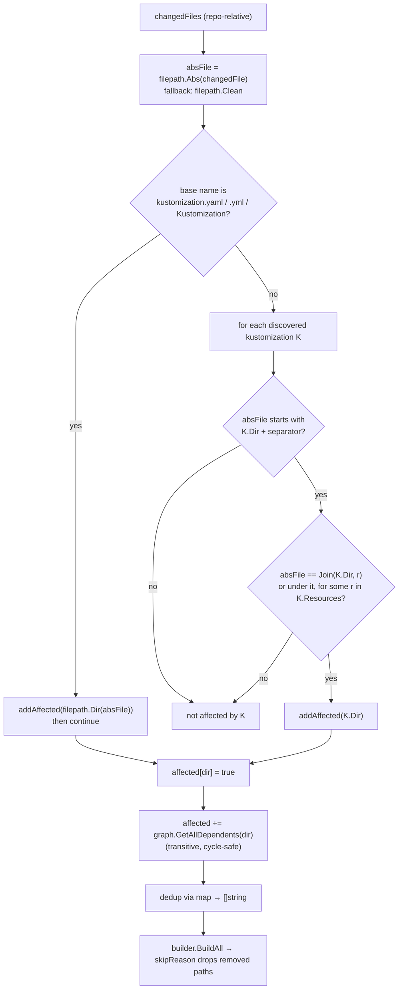

## SPECIFICATION: Impact Analysis (changed files → kustomizations to validate)
**Version:** 1.0
**Status:** Draft
**Date:** 2026-08-12
**Type:** feature (retro-spec of shipped behaviour)
**Slug:** impact-analysis

**Unit under spec:** `internal/analyzer` (`analyzer.go`)
**Input contract:** `internal/git` (`GetChangedFiles`)
**Collaborators:** `internal/graph` (`GetAllDependents`), `internal/discovery` (`KustomizeFile`)
**Downstream:** `internal/builder` (skip guard), `internal/reporter`

> This is a **retro-spec**. It documents behaviour that is already shipped and already
> covered by tests. The code is the source of truth; every behavioural claim below carries a
> `file:line` citation. Nothing here proposes a change. Items the code does *not* do are
> recorded as known limitations (§9) or observations (§10), never as unmet requirements.

---

### 1. Overview

Impact analysis is stage 4 of the `kustomize-build-check` pipeline
(`git diff → discovery → dependency graph → impact analysis → build → report`, CLAUDE.md,
design.md:88-141). Given the list of file paths that changed between `base-ref` and `HEAD`,
the discovered set of kustomization files, and the dependency graph built over them, it
returns the set of kustomize directories that must be handed to `kustomize build`.

Its whole reason to exist is to avoid rebuilding every overlay in the repository on every
pull request, while never *missing* a directory that the change could have broken. It is
therefore governed by the asymmetric correctness bar in CLAUDE.md: **a false pass is worse
than a false fail**, so the analyzer errs towards marking a directory affected and defers
"does this path still exist?" to the build stage (`internal/builder/builder.go:121-143`).
This repo is a `go-cli-tool` (`vega.yaml`) with a single direct dependency
(`gopkg.in/yaml.v3`); the analyzer itself imports stdlib plus two internal packages only
(`analyzer.go:3-10`).

### 2. Goals & Success Metrics

| Goal | Metric (as evidenced today) |
|---|---|
| Never report green on a change that breaks a `kustomize build` | `TestDeletedResourceStillReferencedFails` (`pipeline_test.go:415-434`) asserts `summary.Failed > 0` for a deleted-but-still-referenced resource; the false-pass variant is only reachable by filtering deletions, which the code deliberately does not do (`git.go:31-41`) |
| Never fail a directory the change legitimately removed | Removed paths still reach the builder and are recorded as `Skipped`, not `Failed` (`pipeline_test.go:266-292`, `builder.go:50-65`) |
| Validate the full blast radius of a base change, not just the direct edit | `addAffected` unions the directory with **all transitive** dependents (`analyzer.go:94-106` → `graph.go:135-179`); `TestModifiedDirectoryStillBuilds` asserts both base and dependent overlay build (`pipeline_test.go:329-356`) |
| Do not validate unrelated kustomizations | `TestChangedFileUnderUnrelatedKustomizationIsIgnored` asserts an empty result (`analyzer_test.go:90-107`) |
| Keep the stage side-effect free and cheap | The analyzer performs no filesystem reads; its only syscall is the `os.Getwd` implied by `filepath.Abs` (`analyzer.go:44`) |

### 3. Functional Requirements

All requirements below describe behaviour **as implemented today**.

| ID | Priority | Requirement | Evidence |
|---|---|---|---|
| F-01 | P0 | Expose `GetAffectedKustomizations(changedFiles []string, g graph.Graph, allKustomizations []discovery.KustomizeFile) []string` behind the `ImpactAnalyzer` interface, constructed by `New()`. | `analyzer.go:12-26` |
| F-02 | P0 | Normalize every changed path to an absolute path with `filepath.Abs` **before** any comparison, because git emits repository-root-relative paths while discovery records absolute `Dir` values. | `analyzer.go:41-48`; `discovery.go:86-97`; `git.go:41` |
| F-03 | P0 | If `filepath.Abs` returns an error, fall back to `filepath.Clean(changedFile)` and continue processing rather than aborting the run. | `analyzer.go:45-48` |
| F-04 | P0 | Treat a changed file as a kustomization file when its base name is exactly `kustomization.yaml`, `kustomization.yml`, or `Kustomization`. | `analyzer.go:51`, `analyzer.go:137-141` (identical predicate to `discovery.go:101-105`) |
| F-05 | P0 | A changed kustomization file marks **its own directory** (`filepath.Dir` of the absolute path) affected, and then `continue`s — the reference scan in F-07 is skipped for that path. | `analyzer.go:51-58` |
| F-06 | P0 | The directory of a changed kustomization file is added **unconditionally**, whether or not it appears in `allKustomizations`. This is what lets a deleted or renamed directory reach the build stage instead of vanishing silently. | `analyzer.go:56` → `analyzer.go:84-89`; `analyzer_test.go:72-86` |
| F-07 | P0 | A changed **non**-kustomization file is tested against **every** discovered kustomization; each one that references it is marked affected. There is no early exit, so a single file may mark several kustomizations. | `analyzer.go:61-68` |
| F-08 | P0 | `fileReferencedByKustomization` first requires strict containment: the changed path must start with `kustDir + os.PathSeparator`. The separator is mandatory so that `/repo/base-old/x.yaml` is **not** treated as living under `/repo/base`. | `analyzer.go:111-120`; `analyzer_test.go:49-66` |
| F-09 | P0 | After the containment check, the file matches only if it equals a `resources` entry resolved against `kustDir`, or lives under such an entry (again separator-aware). `bases` and `components` are **not** consulted in this direct-match path. | `analyzer.go:122-133` (loops `kust.Resources` only) |
| F-10 | P0 | Every affected directory is unioned with **all transitive dependents** returned by `graph.GetAllDependents`, not just direct dependents. If a base changes, its overlays are tested; if those overlays are themselves bases, their dependents are tested too. | `analyzer.go:91-106`; `graph.go:133-179` |
| F-11 | P0 | Both the seed directory and every returned dependent are passed through `filepath.Clean` before entering the affected set. | `analyzer.go:85`, `analyzer.go:103` |
| F-12 | P0 | The affected set is a `map[string]bool`, so the returned slice is deduplicated. Its **order is unspecified** (Go map iteration). | `analyzer.go:36`, `analyzer.go:72-76` |
| F-13 | P0 | With no changed files, or no matches, return an empty (non-nil) slice; `cmd/action` then exits 0 with "No kustomizations affected by changes". | `analyzer.go:72`; `main.go:63-76` |
| F-14 | P0 | **Deletions are not filtered out of the input diff.** `git diff --name-only <base> <head>` is issued without `--diff-filter`, so deleted paths reach the analyzer and mark their consumers affected. Dropping them here would turn a genuine breakage into a silent pass. | `git.go:31-41`; rationale test `pipeline_test.go:409-434` |
| F-15 | P1 | Filtering non-existent paths is **not** the analyzer's job. It is done downstream by `builder.skipReason`, which checks directory existence/emptiness and records `Skipped` with a reason. | `builder.go:47-65`, `builder.go:121-143`; `analyzer_test.go:68-86` |
| F-16 | P1 | Renamed paths need no special handling: git's default rename detection reports only the **new** path, so the new location is validated and the old one usually never appears in the diff. | `git.go:39-40`; `pipeline_test.go:294-325` |
| F-17 | P2 | Emit `slog.Debug` at each decision point: input count, per-file processing, kustomization-file hit, reference hit, each addition to the affected set, dependent count, and final count. | `analyzer.go:34`, `39`, `53`, `63`, `77-78`, `89`, `97-99`, `105` |

**Input contract (from `internal/git`)**

| ID | Priority | Requirement | Evidence |
|---|---|---|---|
| F-18 | P0 | `GetChangedFiles` defaults `baseRef` to `HEAD~1` and `headRef` to `HEAD` when empty. | `git.go:24-29` |
| F-19 | P0 | Output is split on newlines, blank lines dropped, each entry trimmed; empty output yields an empty slice, not an error. | `git.go:51-64` |
| F-20 | P0 | A failing `git diff` returns an error wrapping stderr; the caller exits 1 without running analysis. | `git.go:47-49`; `main.go:33-37` |

### 4. Non-Functional Requirements

| ID | Category | Requirement | Evidence |
|---|---|---|---|
| NF-01 | Correctness bias | Where an ambiguity could go either way, the analyzer over-approximates the affected set. Narrowing is only acceptable where it provably cannot hide a breakage. | CLAUDE.md "Correctness bar"; `analyzer.go:56` (unconditional add), `git.go:31-38` |
| NF-02 | Purity / testability | The analyzer touches no filesystem and shells out to nothing; graph and kustomization list are injected. This is why `analyzer_test.go` needs no fixtures on disk. | `analyzer.go:3-10`, `analyzer_test.go:27-45` |
| NF-03 | Dependencies | Analyzer imports stdlib (`log/slog`, `path/filepath`, `strings`) plus `internal/discovery` and `internal/graph`. No third-party imports. Per CLAUDE.md "Reuse before you build", this stays a one-dependency repo. | `analyzer.go:3-10`; `vega.yaml`; CLAUDE.md |
| NF-04 | Performance | Complexity is O(C × K × R) string comparisons, where C = changed files, K = discovered kustomizations, R = resources per kustomization; the nested scan is linear with no memoisation. Acceptable at current repo scale; discovery caching is an explicit v2 idea, not a requirement here. | `analyzer.go:61-68`, `analyzer.go:123-131`; design.md:596-598 |
| NF-05 | Path portability | All path handling uses `path/filepath` and `filepath.Separator`, never a hardcoded `/`. | `analyzer.go:118`, `analyzer.go:128` |
| NF-06 | Cycle safety | The transitive dependent walk is guarded by a `visited` set, so a cyclic graph terminates instead of recursing forever. | `graph.go:138`, `graph.go:157-167` |
| NF-07 | Observability | All diagnostics go through `log/slog` at `Debug`, gated by `LOG_LEVEL`. Nothing is printed to stdout from this package. | `analyzer.go` (all `slog.Debug`); `main.go:126-154` |
| NF-08 | Go conventions | Interface-first with an unexported struct and a `New()` constructor, matching the other pipeline stages. See `docs/specs/lang-go.spec.md`. | `analyzer.go:12-26`; cf. `git.go:11-20`, `graph.go:26-40` |

**Preconditions (not defects — stated because the contract depends on them)**

| ID | Precondition | Evidence |
|---|---|---|
| PRE-01 | The process working directory **is the repository root**. `filepath.Abs` resolves against the process CWD (`analyzer.go:44`) and `git diff --name-only` emits repo-root-relative paths (`git.go:41`), so absolute normalization is only sound when the two share a root. Both the unit tests and the integration harness establish this explicitly with `t.Chdir(root)`. | `analyzer_test.go:29,51,73,92`; `pipeline_test.go:118-119` |
| PRE-02 | `discovery.FindAll` is called with a root under that same working directory so that `KustomizeFile.Dir` is absolute and rooted identically. `cmd/action` passes `INPUT_ROOT-DIR`, defaulting to `.`. | `discovery.go:86-97`; `main.go:28,43` |
| PRE-03 | Symlinked roots must be resolved consistently, or absolute paths derived from the CWD will not equal the discovered `Dir` (e.g. macOS `/var` → `/private/var`). The integration harness calls `filepath.EvalSymlinks` for exactly this reason. | `pipeline_test.go:41-47` |
| PRE-04 | `git` is on `PATH` and the repository is readable; the container image marks all directories safe. | `git.go:41`; `Dockerfile:42` |

### 5. Data Model & Flows

**Inputs**

- `changedFiles []string` — repo-root-relative paths from `git diff --name-only` (`git.go:41`).
- `allKustomizations []discovery.KustomizeFile` — each with `Path` (absolute), `Dir`
  (absolute, `filepath.Dir` of `Path`), and the three parsed list fields `Resources`,
  `Bases`, `Components` (`discovery.go:13-20`, `discovery.go:76-97`). **Only those three
  fields are parsed from the YAML** (`discovery.go:76-80`).
- `g graph.Graph` — reverse lookup `base → [dependents]`, built from directory-valued
  `resources` (entries with a file extension are skipped, `graph.go:100-108`), plus all
  `bases` (`graph.go:111`) and all `components` (`graph.go:114`), each resolved with
  `filepath.Join(file.Dir, dep)` and recorded only when the target is itself a discovered
  kustomization directory (`graph.go:69-84`).

**Output**

- `[]string` — absolute, `filepath.Clean`ed, deduplicated kustomize directories, in
  unspecified order (`analyzer.go:72-80`).

**Decision flow**



**Ownership boundary**

| Concern | Owner |
|---|---|
| Which paths changed, including deletions | `internal/git` (`git.go:31-41`) |
| Which kustomizations exist and what they list | `internal/discovery` (sibling spec) |
| Who depends on whom, transitively | `internal/graph` (sibling spec, `graph.go:133-179`) |
| Which directories must be validated | **this spec** |
| Whether a candidate still exists on disk | `internal/builder` (`builder.go:121-143`) |
| How results are counted and reported | `internal/reporter` |

### 6. API / Interface Contracts

```go
// internal/analyzer/analyzer.go:12-19
type ImpactAnalyzer interface {
    GetAffectedKustomizations(
        changedFiles []string,
        g graph.Graph,
        allKustomizations []discovery.KustomizeFile,
    ) []string
}

func New() ImpactAnalyzer   // analyzer.go:24-26
```

| Aspect | Contract |
|---|---|
| `changedFiles` | Repo-root-relative paths as emitted by git. Absolute paths also work (`filepath.Abs` is idempotent on them). Empty slice → empty result. |
| `g` | Any `graph.Graph`. Only `GetAllDependents` is called (`analyzer.go:94`); `IsBase`, `GetNode`, `GetDependentOverlays` are **not** used by the analyzer. |
| `allKustomizations` | May be empty or `nil`; the kustomization-file branch still produces candidates (`analyzer_test.go:72-86`). |
| Return | Absolute cleaned directories, deduplicated, unspecified order. Never `nil` (`make([]string, 0, ...)`, `analyzer.go:72`). |
| Errors | None. The function has no error return and cannot fail; `filepath.Abs` failure degrades to `filepath.Clean` (`analyzer.go:45-48`). |
| Side effects | None beyond `slog.Debug` output. |

Internal helpers (unexported, same file):

- `addAffected(dir string, g graph.Graph, affected map[string]bool)` — `analyzer.go:84-107`
- `fileReferencedByKustomization(changedFile string, kust discovery.KustomizeFile) bool` —
  `analyzer.go:111-134`; documented as **requiring an absolute `changedFile`**
  (`analyzer.go:109-110`)
- `isKustomizationFile(name string) bool` — `analyzer.go:137-141`

Upstream contract:

```go
// internal/git/git.go:11-13
type Analyzer interface {
    GetChangedFiles(baseRef, headRef string) ([]string, error)
}
```

### 7. Acceptance Criteria

Every criterion below is **already satisfied** by an existing test. The test named is the
evidence, not proposed work.

- [ ] AC-1 — **Relative→absolute normalization.** Given `KustomizeFile{Dir: <root>/base,
      Resources: ["deployment.yaml"]}` and changed file `base/deployment.yaml` (relative,
      exactly as git emits it), the result contains `<root>/base`.
      → `TestChangedResourceFileMarksKustomizationAffected` (`analyzer_test.go:23-45`)
- [ ] AC-2 — **Separator-aware prefix matching.** Given the same kustomization at
      `<root>/base` and changed file `base-old/deployment.yaml`, the result does **not**
      contain `<root>/base`.
      → `TestSiblingDirectoryIsNotMatchedByPrefix` (`analyzer_test.go:47-66`)
- [ ] AC-3 — **A changed kustomization file marks its own directory even when nothing was
      discovered there.** With `allKustomizations` empty and changed file
      `overlays/obsolete/kustomization.yaml`, the result contains
      `<root>/overlays/obsolete`, so the path reaches the build step where the skip is
      recorded.
      → `TestDeletedKustomizationStillReachesBuildStep` (`analyzer_test.go:68-86`)
- [ ] AC-4 — **No over-matching.** A changed file under a directory that no discovered
      kustomization references yields a result of length 0.
      → `TestChangedFileUnderUnrelatedKustomizationIsIgnored` (`analyzer_test.go:88-107`)
- [ ] AC-5 — **Transitive dependents.** Editing `base/deployment.yaml` in a repo where
      `overlays/dev` lists `../../base` produces results for **both** `<root>/base` and
      `<root>/overlays/dev`, and both build successfully with `Skipped == 0`.
      → `TestModifiedDirectoryStillBuilds` (`pipeline_test.go:327-356`)
- [ ] AC-6 — **Deletions must not be filtered (false-pass guard).** Deleting
      `base/deployment.yaml` while `base/kustomization.yaml` still lists it produces
      `summary.Failed > 0`, `<root>/base` is not skipped, and `base/deployment.yaml` itself
      is never a build target.
      → `TestDeletedResourceStillReferencedFails` (`pipeline_test.go:409-434`)
- [ ] AC-7 — **A removed directory is skipped, never failed.** Deleting `overlays/obsolete`
      yields `Failed == 0`, a result for `<root>/overlays/obsolete` with `Skipped == true`
      and a non-empty `SkipReason`, and `Success == 0`.
      → `TestDeletedDirectoryIsSkipped` (`pipeline_test.go:264-292`)
- [ ] AC-8 — **A rename validates the new path and never fails the old one.** Renaming
      `overlays/staging` → `overlays/preprod` yields `Failed == 0`, a successful result for
      `<root>/overlays/preprod`, and the old path either absent or `Skipped`.
      → `TestRenamedDirectoryValidatesNewPath` (`pipeline_test.go:294-325`)
- [ ] AC-9 — **Consolidation into a shared component passes.** Collapsing three identical
      overlay subdirectories into one component yields `Failed == 0`, successful results for
      all three surviving overlays, at least one skipped removed directory, and
      `Success + Failed + Skipped == Total`.
      → `TestConsolidateDuplicatedDirsIntoComponent` (`pipeline_test.go:192-262`)
- [ ] AC-10 — **The skip guard does not over-filter.** A kustomization pointing at a
      missing resource still fails (`Failed > 0`, `Skipped == 0`), and a directory that
      survives but lost its `kustomization.yaml` while a sibling changed also fails rather
      than being skipped.
      → `TestBrokenKustomizationStillFails` (`pipeline_test.go:358-378`) and
      `TestDirectoryPresentButKustomizationRemovedFails` (`pipeline_test.go:380-407`)

### 8. Edge Cases & Error Handling

| Scenario | Behaviour today | Evidence |
|---|---|---|
| `filepath.Abs` fails | Falls back to `filepath.Clean(changedFile)`; the run continues with a relative path that will very likely match nothing. Not an error return. | `analyzer.go:45-48` |
| Changed file is a kustomization file **and** listed as a resource elsewhere | The kustomization branch `continue`s, so the reference scan never runs for that path. Coverage of the referencing overlay comes from the graph edge instead. | `analyzer.go:57` |
| A directory named `Kustomization` or `kustomization.yaml` | Not distinguished — the check is on the base name only, with no `IsDir` test. The analyzer never touches disk. | `analyzer.go:51`, `analyzer.go:137-141` |
| Changed file sits directly in a kustomization directory but is not listed in `resources` | **Not** affected. Containment alone is insufficient; an explicit `resources` entry is required. | `analyzer.go:122-133` |
| `resources` entry escaping the kustomization directory, e.g. `../shared/cm.yaml` | **Not** matched, because the containment guard at `analyzer.go:118` returns `false` before `resources` is consulted. | `analyzer.go:115-120` |
| One changed file referenced by several kustomizations | All of them are marked; the loop has no `break`. | `analyzer.go:61-68` |
| Dependency cycle in the graph | Terminates. `GetAllDependents` tracks `visited` and skips revisits. | `graph.go:138`, `graph.go:157-162` |
| Dependency target not among discovered kustomizations | No reverse-lookup edge is created; logged at debug as "Dependency not found in discovered kustomizations". | `graph.go:80-84` |
| A directory-valued `resources` entry whose name contains a dot (e.g. `s3-sync.v2`) | Skipped by the graph's `filepath.Ext(resource) != ""` heuristic, so no dependency edge is created for it. This is graph behaviour, noted here because it bounds the blast radius the analyzer can compute. | `graph.go:100-108` |
| Empty diff | Empty affected set; `cmd/action` writes an empty summary and exits 0. | `git.go:52-54`; `main.go:63-76` |
| Unparseable kustomization YAML | Discovery logs a warning to stderr and skips the file, so it is simply absent from `allKustomizations`. | `discovery.go:51-57` |
| Deleted path handed to the builder | `skipReason` returns `"removed in this change"` for a non-existent directory and `"removed in this change (empty directory)"` for an empty one; both are excluded from success and failure counts. | `builder.go:121-143` |
| Path exists but is not a directory / unreadable | `skipReason` returns `""` and lets `kustomize` report the problem. | `builder.go:132-134` |

### 9. Out of Scope

Explicitly **not** covered by this spec or by the analyzer as implemented:

1. **Discovery and YAML parsing.** `internal/discovery` gets its own sibling spec. This spec
   only consumes `KustomizeFile` and relies on `Dir` being absolute (`discovery.go:86-97`).
2. **Dependency-graph construction.** `internal/graph` gets its own sibling spec. The
   analyzer calls exactly one method, `GetAllDependents` (`analyzer.go:94`).
3. **Build execution, the existence/skip guard, and reporting.** Owned by
   `internal/builder` (`builder.go:121-143`) and `internal/reporter`. Filtering removed
   paths is deliberately **not** the analyzer's responsibility (`analyzer_test.go:68-71`).
4. **Known limitation — `patches`, `configMapGenerator`, `secretGenerator` are not
   followed.** `discovery.ParseKustomization` parses only `resources`, `bases` and
   `components` (`discovery.go:76-80`), and the analyzer's direct file match consults only
   `Resources` (`analyzer.go:123`). A file pulled in solely through `patches`,
   `configMapGenerator` or `secretGenerator` therefore does not mark its kustomization
   affected. This is a **recorded future feature with its own spec**, tracked in `TODO.md`;
   it is not an unmet requirement of this spec.
5. **Remote bases (git URLs), Helm chart contents, generator plugins.** Only local relative
   paths participate; a remote reference simply produces no graph edge (`graph.go:80-84`).
   design.md lists remote-base support as a v2 idea (design.md:583).
6. **Result ordering, parallelism, and caching.** Order is map-iteration order
   (`analyzer.go:73-76`); parallel builds and discovery caching are v2 ideas
   (design.md:580-581), not current behaviour.
7. **Deciding the exit code.** Owned by `cmd/action` (`main.go:102-115`).
8. **Any change to the behaviour described above.** This is a documentation-only spec.

### 10. Open Questions

1. **`design.md` pseudocode has drifted from the implementation.** design.md:236-250
   describes a branch — *"if `graph.IsBase(dir)` then add dependent overlays, else add only
   this dir"* — but the shipped code always adds the directory **and** all transitive
   dependents, unconditionally, and never calls `IsBase` (`analyzer.go:84-106`). The shipped
   behaviour is the safer one under the "false pass is worse than a false fail" bar. Open:
   should `design.md` be corrected to match, in a separate docs change? *Owner: repo owner.
   Not blocking this spec.*
2. **Brief wording vs. code on `bases` / `components` in the direct file match.** The brief
   states that a changed non-kustomization file marks every kustomization referencing it via
   "resources/bases/components". The code's direct match iterates `kust.Resources` only
   (`analyzer.go:123`). `bases` and `components` participate one level up, as *graph edges*
   (`graph.go:110-114`), so dependents of a base or component still propagate through
   `GetAllDependents`. This spec documents the code. Open: confirm the distinction is
   intended and does not warrant a `TODO.md` entry alongside item 4 of §9. *Owner: repo
   owner.*
3. **`/github/workspace` as the runtime working directory is `[unverified - verify before
   relying]`.** In-repo evidence only shows `WORKDIR /home/kustomize-build-check`
   (`Dockerfile:55`) and `safe.directory '*'` (`Dockerfile:42`); the claim that GitHub
   Actions overrides the working directory to the mounted workspace for `runs: docker`
   actions is a third-party platform fact not verified from a session-fetched source.
   PRE-01 is therefore stated in code terms ("CWD must be the repository root"), which *is*
   verified by `analyzer_test.go` and `pipeline_test.go:118-119`. *Owner: repo owner —
   confirm against current GitHub Actions docs before relying on the `/github/workspace`
   detail anywhere.*

**Assumptions** (mode = autonomous):

- Assumed the unit under spec is the analyzer alone, with git as its input contract and
  graph as a collaborator; discovery and build get sibling specs. Rationale: matches the
  one-package-per-stage architecture in CLAUDE.md and the package layout. [Risk: low]
- Assumed the path-normalization contract is "absolute on both sides", established by
  `filepath.Abs` on the changed file matching the absolute `Dir` from discovery. Verified
  directly in `analyzer.go:44` and `discovery.go:86-97`. [Risk: low]
- Assumed the `patches` / `configMapGenerator` / `secretGenerator` gap is recorded as a
  known limitation pointing at `TODO.md` (§9 item 4), not as an unmet requirement, because
  it is a separate future feature. [Risk: low]
- Assumed the working-directory constraint is documented as a **precondition** (PRE-01), not
  a bug, since `filepath.Abs` resolves against process CWD by design and the tests establish
  the CWD explicitly. The `/github/workspace` half of this assumption is downgraded to
  Open Question 3 rather than asserted. [Risk: medium]
- Assumed acceptance criteria cite the **existing, already-passing** tests as evidence rather
  than proposing new test work. [Risk: low]
- Assumed the empirically verified external facts supplied in the brief (git rename detection
  on by default emitting only the new path, verified with git 2.50.1 Apple Git-155; and
  `--diff-filter=d` producing a false pass on a deleted-but-referenced resource) are usable
  as-is; both are additionally corroborated in-repo by `git.go:39-40` and
  `pipeline_test.go:409-434`. [Risk: low]

### 11. Planner Handoff Notes

**This is a retro-spec. There is no implementation work to plan.** The notes below exist so a
planner picking up an adjacent change knows the terrain.

*Dependencies to resolve first (for any future change in this area)*

- Sibling retro-specs for `internal/discovery` and `internal/graph` should land before any
  change that touches which fields are parsed or how edges are formed — §9 items 1 and 2
  point at them.
- The `patches` / `configMapGenerator` / `secretGenerator` gap (`TODO.md`) needs its own
  spec; it starts in `discovery.ParseKustomization`, not in the analyzer.

*Suggested order if the §10 open questions are actioned*

1. Docs-only: reconcile design.md:236-250 with `analyzer.go:84-106` (Q1). **S**
2. Docs-only: confirm/annotate the `resources`-only direct match (Q2). **S**
3. Docs-only: verify the GitHub Actions working-directory fact against current official docs
   and either promote PRE-01's note or leave it flagged (Q3). **S**

*Risk areas to flag*

- **Any narrowing of the affected set is high risk.** CLAUDE.md is explicit: never narrow the
  set of validated paths without proving the narrowing cannot hide a real breakage.
  `--diff-filter=d` is the canonical trap, and `pipeline_test.go:415` is the guard that
  catches it.
- **The containment guard at `analyzer.go:118` is load-bearing twice over**: it prevents the
  `base-old` / `base` false match (AC-2) and it is also the reason a `../`-escaping resource
  is not matched (§8). Changing one changes the other.
- **`internal/integration` skips when `git` or `kustomize` is missing** (`pipeline_test.go:142-148`).
  CLAUDE.md forbids letting these silently skip in CI. Any change here must confirm the tests
  actually ran.
- **Result order is unspecified.** Do not write assertions on slice order; use
  `slices.Contains`, as the existing tests do (`analyzer_test.go:42`).

*Complexity of the documented behaviour (for future reference)*

| Area | Size |
|---|---|
| Path normalization + kustomization-file branch (F-02..F-06) | S |
| Reference matching, separator-aware (F-07..F-09) | M |
| Transitive dependent union (F-10..F-12) | M |
| Deletion policy end to end, git → analyzer → builder → reporter (F-14..F-16) | L |
