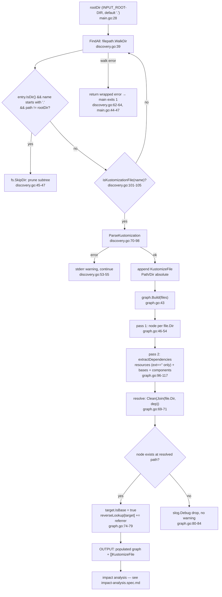
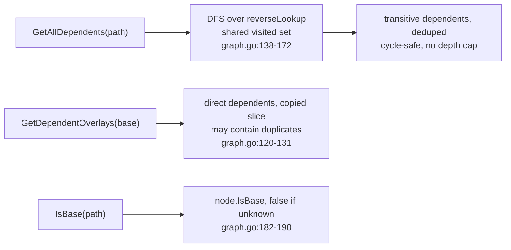

## SPECIFICATION: Kustomization Discovery & Dependency Graph

**Version:** 1.0
**Status:** Draft
**Date:** 2026-08-12
**Type:** feature (retro-spec of shipped behaviour)
**Slug:** kustomization-discovery

**Units under spec:** `internal/discovery` (`discovery.go`), `internal/graph` (`graph.go`)
**Consumers:** `cmd/action/main.go` (pipeline stages 2 and 3), `internal/analyzer` (see
[impact-analysis.spec.md](./impact-analysis.spec.md))
**Direct dependencies:** `gopkg.in/yaml.v3` only (per `go.mod` and the reuse ladder in `CLAUDE.md`)

> **Retro-spec.** This documents behaviour that is already shipped. The code is the source of
> truth and every behavioural claim below carries a `file:line` citation. Nothing here is a
> proposal. Where the current behaviour has a known correctness cost it is recorded as a cost,
> not as a change request. Follow-on work lives in `TODO.md` and in future specs.

---

### 1. Overview

This capability answers one question for the rest of the pipeline: **which kustomize
directories exist in this repository, and which of them consume which others?** It has two
halves that only make sense together, so they are specified together: `internal/discovery`
walks the root directory and parses every kustomization file it finds into a
`KustomizeFile` value (`discovery.go:13-20`), and `internal/graph` turns that slice into a
`DependencyGraph` with a forward edge set per node and a reverse lookup from base to
dependents (`graph.go:19-23`). Neither half is independently invocable: `graph.Build` takes
`[]discovery.KustomizeFile` as its only input (`graph.go:43`), and discovery's output is
consumed by nothing else on its own. The capability's output contract ends at **a populated
graph plus the list of discovered `KustomizeFile` values**; the decision about which
directories are actually built belongs to
[impact-analysis.spec.md](./impact-analysis.spec.md).

This stage sits at position 2-3 of the pipeline described in `CLAUDE.md`
(`git diff → discovery → dependency graph → impact analysis → build → report`) and is wired
in `cmd/action/main.go:41-56`. Its correctness bar is set by `CLAUDE.md`: **a false pass is
worse than a false fail**, and this stage is the pipeline's single largest false-pass surface,
because anything discovery does not find, or any edge the graph does not derive, can never be
validated by any later stage. §8 and §10 name each such gap explicitly.

### 2. Goals & Success Metrics

- **G1 — Find every kustomization root in the tree.** → Metric: for a tree containing
  `kustomization.yaml`, `kustomization.yml` and `Kustomization` files at arbitrary depth,
  `FindAll` returns one `KustomizeFile` per file (`discovery_test.go:75` `TestFindAll` asserts
  3 files across `base/`, `overlays/dev/`, `overlays/prod/`).
- **G2 — Parse the reference fields kustomize uses to compose directories.** → Metric:
  `resources`, `bases` and `components` are each populated from YAML
  (`discovery.go:76-80`; `discovery_test.go:31` `TestParseKustomization` asserts 3 / 1 / 1).
- **G3 — Derive base ← overlay edges so a base change reaches every consumer.** → Metric:
  a base referenced by two overlays reports both via `GetDependentOverlays`
  (`graph_test.go:10` `TestBuildGraph`, `graph_test.go:52` `TestGetDependentOverlays`).
- **G4 — Propagate transitively.** → Metric: for `base ← overlay1 ← overlay2` plus
  `base ← overlay3`, `GetAllDependents("/test/base")` returns all three
  (`graph_test.go:149` `TestGetAllDependents`).
- **G5 — Terminate on malformed input.** → Metric: a reference cycle does not hang or panic
  (`graph_test.go:217` `TestGetAllDependentsNoCycles`); an unparseable file does not abort the
  run (`discovery.go:51-56`).
- **G6 — Stay within the one-dependency budget.** → Metric: `go.mod` lists exactly one
  direct require, `gopkg.in/yaml.v3 v3.0.1`.

### 3. Functional Requirements

Priority scale: P0 = shipped invariant, breaking it is a regression. P1 = shipped behaviour
that is load-bearing but has a documented cost. P2 = incidental, safe to change with a spec.

| ID   | Priority | Requirement | Evidence |
|------|----------|-------------|----------|
| F-01 | P0 | A file counts as a kustomization file if and only if its base name is exactly `kustomization.yaml`, `kustomization.yml`, or `Kustomization`. Matching is exact and case-sensitive; `kustomize.yaml`, `deployment.yaml` and `.kustomization.yaml` do not match. | `discovery.go:100-105`; `discovery_test.go:9` `TestIsKustomizationFile` (5 cases incl. `kustomize.yaml` → false) |
| F-02 | P0 | `FindAll` walks `rootDir` recursively with `filepath.WalkDir` and returns one `KustomizeFile` per matching file. Two matching filenames in the same directory yield two entries. | `discovery.go:36-67`, `:50`; measured: a dir holding all three names yields three entries |
| F-03 | P0 | Any directory whose name begins with `.` is skipped entirely, including its whole subtree, via `fs.SkipDir`. The root itself is exempt (`path != rootDir`), so passing a hidden directory as `rootDir` still works. | `discovery.go:44-47`; measured: `.git/kustomization.yaml` and `.hidden/deep/kustomization.yaml` are not returned |
| F-04 | P0 | The hidden-name test applies to **directories only**. Hidden files are not skipped as such — they are simply excluded by F-01 unless their base name matches. | `discovery.go:45` (`entry.IsDir() &&`) |
| F-05 | P0 | A per-file parse failure is **not** fatal: `FindAll` writes `Warning: failed to parse <path>: <err>` to stderr and continues the walk. The file is excluded from the returned slice and therefore from the graph. | `discovery.go:51-56`; measured: malformed YAML produced the warning and a walk that still returned the remaining files |
| F-06 | P0 | A walk error (e.g. `rootDir` does not exist, or an unreadable directory) aborts `FindAll` and is returned wrapped as `failed to walk directory: %w`. | `discovery.go:39-42`, `:62-64`; measured: missing root → `failed to walk directory: lstat …: no such file or directory` |
| F-07 | P0 | A `FindAll` error is fatal to the process: `main` prints `Error discovering kustomizations` to stderr and exits 1. A per-file parse warning (F-05) does not affect the exit code. | `cmd/action/main.go:43-47` |
| F-08 | P0 | `ParseKustomization` reads the file and unmarshals it into an anonymous struct with exactly three fields: `resources`, `bases`, `components`. | `discovery.go:71-84` |
| F-09 | P0 | Unmarshalling is **non-strict**: any other key in the kustomization (`patches`, `configMapGenerator`, `secretGenerator`, `helmCharts`, `namespace`, `apiVersion`, `kind`, …) is silently ignored, not an error. | `discovery.go:82` (`yaml.Unmarshal`, no `KnownFields`); measured: a file with `helmCharts` + `patches` parsed cleanly |
| F-10 | P0 | `Path` is the **absolute** path to the kustomization file and `Dir` is the absolute path of its containing directory, resolved through `filepath.Abs` against the process CWD. This holds even when `rootDir` is relative (the default is `"."`). | `discovery.go:86-96`; `cmd/action/main.go:28`; `discovery_test.go:70-72` asserts `kf.Dir == tmpDir` |
| F-11 | P1 | A YAML type mismatch on one of the three parsed fields (e.g. `resources` given as a list of maps rather than a list of strings) is a parse error and therefore triggers F-05: the whole file is dropped from the graph. | `discovery.go:76-84`; measured: `resources:\n  - path: a.yaml` → `failed to parse YAML: yaml: unmarshal errors` |
| F-12 | P0 | An empty or content-free kustomization file parses successfully into a `KustomizeFile` with nil `Resources` / `Bases` / `Components`. It becomes a graph node with no outgoing edges. | `discovery.go:82` (empty input is valid YAML); measured: no error, all three slices nil |
| F-13 | P0 | `Build` runs in two passes. Pass 1 creates one node per `file.Dir`, keyed by `Dir`, with `IsBase:false` and an empty dependency slice. Pass 2 computes and assigns dependencies and populates the reverse lookup. | `graph.go:43-93`, `:46-54`, `:56-86` |
| F-14 | P0 | Node identity is the **directory**, not the file. Two `KustomizeFile` values sharing a `Dir` collapse onto one node; the last one processed wins for `Node.Dependencies`. | `graph.go:48`, `:60-61`; measured: with `kustomization.yaml` (has deps) + `kustomization.yml` (none) in one dir, `Node.Dependencies` ended empty while the reverse lookup still recorded the edge |
| F-15 | P0 | `extractDependencies` collects, in order: entries of `resources` that survive the extension heuristic (F-16), then **all** entries of `bases`, then **all** entries of `components`. `bases` and `components` are not filtered. | `graph.go:96-117`, `:111`, `:114`; `graph_test.go:130` `TestExtractDependencies` asserts 3 deps from 3 resources + 1 base + 1 component |
| F-16 | P1 | **Heuristic (not exact).** A `resources` entry is treated as a directory reference if and only if `filepath.Ext(entry) == ""`; anything with an extension is skipped. This is how file references are separated from directory references. Failure modes in §8. | `graph.go:100-108`; `graph_test.go:141-143` states the intent in a comment |
| F-17 | P0 | Each raw dependency string is resolved relative to the referencing directory with `filepath.Join(file.Dir, dep)` then `filepath.Clean`. | `graph.go:69-71` |
| F-18 | P0 | An edge is recorded **only if** the resolved path is already a node, i.e. only if a kustomization file was discovered there. When it is: the target's `IsBase` is set true and the referrer is appended to `reverseLookup[target]`. | `graph.go:73-79`; `graph_test.go:100` `TestIsBase` |
| F-19 | P1 | A dependency that resolves to a path with **no** discovered kustomization is dropped with a `slog.Debug` line (`"Dependency not found in discovered kustomizations"`) and no other signal. It is not an error, not a warning, and not visible at the default `INFO` log level. | `graph.go:80-84`; `cmd/action/main.go:126-154` (level from `LOG_LEVEL`, default `INFO`) |
| F-20 | P0 | `Build` never returns a non-nil error in the shipped implementation; it always returns `nil`. `main` still checks it and would exit 1. | `graph.go:92`; `cmd/action/main.go:53-56` |
| F-21 | P0 | `GetDependentOverlays(basePath)` cleans its argument, and returns a **copy** of the direct dependents so callers cannot mutate graph state; unknown paths return an empty, non-nil slice. | `graph.go:120-131` |
| F-22 | P1 | `reverseLookup` is append-only and **not deduplicated**. If the same directory is referenced twice by the same referrer (e.g. via both `resources` and `bases`), that referrer appears twice in `GetDependentOverlays`. | `graph.go:76`; measured: `[/t/ov /t/ov]` |
| F-23 | P0 | `GetAllDependents(path)` returns the transitive closure of dependents (direct and indirect), computed by DFS over `reverseLookup`. Results are **deduplicated** by a `visited` set shared across the whole traversal, even when `GetDependentOverlays` would return duplicates. | `graph.go:135-179`, `:138`, `:157-163`; `graph_test.go:149` `TestGetAllDependents` (3 dependents through a 2-level chain); measured dedup of the F-22 case |
| F-24 | P0 | `GetAllDependents` is **cycle-safe and terminates**: each candidate is marked visited before recursing, so no node is expanded twice and the traversal is bounded by the node count. It is **not depth-limited**: there is no explicit depth cap and recursion depth is bounded only by the number of distinct nodes. | `graph.go:158-167`; `graph_test.go:217` `TestGetAllDependentsNoCycles` asserts the a→b→c→a case returns ≤3 and neither hangs nor panics |
| F-25 | P1 | The starting path is **not** pre-marked visited, so if it participates in a cycle it appears in its own result set. | `graph.go:138-139`, `:172`; measured: `GetAllDependents("/test/a")` on the a→b→c→a fixture returned `[/test/c /test/b /test/a]` |
| F-26 | P0 | `IsBase(path)` cleans the path and returns the node's `IsBase` flag; an unknown path returns `false` rather than erroring. | `graph.go:182-190`; `graph_test.go:125-127` asserts a nonexistent path is not a base |
| F-27 | P2 | `GetNode(path)` cleans the path and returns the `*Node` or nil. `String()` renders nodes, their dependencies and their `Used by:` list for human inspection. Neither is on the `main` path. | `graph.go:193-196`, `:199-227` |
| F-28 | P2 | Progress is reported on stdout by `main` as `Found %d kustomization files`; per-node detail is emitted through `slog.Debug` in `Build` and is only visible with `LOG_LEVEL=DEBUG`. | `cmd/action/main.go:41-48`; `graph.go:44`, `:53`, `:64`, `:77-79`, `:88-90` |

### 4. Non-Functional Requirements

| ID    | Category      | Requirement |
|-------|---------------|-------------|
| NF-01 | Correctness   | This stage is the pipeline's primary false-pass surface: every file it misses (F-01), every subtree it skips (F-03), every file it drops (F-05, F-11) and every edge it does not derive (F-16, F-19, and the unparsed fields in §9) is invisible to the impact analyser and can never be validated. Any future narrowing of the discovered set or the edge set must prove it cannot hide a real breakage (`CLAUDE.md`, "Correctness bar"). |
| NF-02 | Performance   | Discovery is a single sequential `filepath.WalkDir` pass, O(entries in tree), with one `os.ReadFile` + YAML unmarshal per matching file (`discovery.go:39`, `:71-84`). Graph construction is two linear passes over the discovered files (`graph.go:46-86`). `GetAllDependents` is O(V+E) per call thanks to the visited set (`graph.go:138`). Hidden-directory pruning is what keeps `.git/` out of the walk (F-03). |
| NF-03 | Memory        | The whole graph is held in memory: two maps keyed by absolute directory path (`graph.go:20-22`). There is no caching, no persistence and no incremental mode. |
| NF-04 | Resilience    | Malformed input degrades rather than aborting (F-05). The only fatal condition in this stage is a walk failure (F-06, F-07). |
| NF-05 | Observability | Two channels only: stderr warnings for parse failures (`discovery.go:54`) and `slog` debug lines for graph internals (`graph.go:44-90`, `:141-176`). Dropped dependencies (F-19) are debug-only, so at the default log level a missing base is silent. |
| NF-06 | Determinism   | `filepath.WalkDir` visits entries in lexical order, so the returned `[]KustomizeFile` ordering is deterministic for a given tree; `Node.Dependencies` preserves the `resources → bases → components` order of F-15. Map iteration in `String()` (`graph.go:203`) is not ordered and must not be relied on. |
| NF-07 | Dependencies  | `gopkg.in/yaml.v3` is the only direct dependency of this capability; everything else is stdlib (`io/fs`, `os`, `path/filepath`, `strings`, `log/slog`). Adding a second one requires a spec (`CLAUDE.md`, "Reuse before you build"). |
| NF-08 | Portability   | Paths are handled through `path/filepath` throughout, so separators follow the host OS. The shipped delivery target is the Linux container image, but the binary is released cross-platform. |

### 5. Data Model & Flows

**Entities**

`discovery.KustomizeFile` (`discovery.go:13-20`) — owned by `internal/discovery`, consumed
read-only by `internal/graph` and `internal/analyzer`:

| Field | Type | Meaning |
|-------|------|---------|
| `Path` | `string` | Absolute path to the kustomization file (F-10) |
| `Dir` | `string` | Absolute path of the containing directory; the graph's node key (F-10, F-14) |
| `Resources` | `[]string` | Raw, unresolved `resources` entries as written in the YAML |
| `Bases` | `[]string` | Raw `bases` entries (the field the code comments mark as deprecated, `discovery.go:18`) |
| `Components` | `[]string` | Raw `components` entries |

`graph.Node` (`graph.go:12-17`) — `Path` (= the directory), `IsBase` (set when something
resolves to it, F-18), `Dependencies` (post-heuristic, still **relative** strings, F-15).

`graph.DependencyGraph` (`graph.go:19-23`) — `nodes map[dir]*Node` and
`reverseLookup map[base][]dependent`. Both are keyed by cleaned absolute directory paths.
Note the asymmetry: `Dependencies` holds relative strings as written, while `reverseLookup`
keys and values are absolute (F-17).

**Flow**



**Query surface over the built graph**



### 6. API / Interface Contracts

**`discovery.Discoverer`** (`discovery.go:22-26`), constructed by `discovery.New()`
(`discovery.go:31-33`):

```go
FindAll(rootDir string) ([]KustomizeFile, error)
```
- Input: `rootDir`, absolute or relative; `main` supplies `INPUT_ROOT-DIR` defaulted to `"."`
  (`cmd/action/main.go:28`).
- Output: one entry per discovered and successfully parsed kustomization file, in lexical walk
  order, with absolute `Path`/`Dir`. Nil slice when nothing is found.
- Errors: only `failed to walk directory: %w` (F-06). Per-file parse failures are warnings on
  stderr, not errors (F-05).

```go
ParseKustomization(path string) (*KustomizeFile, error)
```
- Errors: `failed to read file: %w` (`discovery.go:73`), `failed to parse YAML: %w`
  (`discovery.go:83`), `failed to get absolute path: %w` (`discovery.go:88`). On error the
  returned pointer is nil.

**`graph.Graph`** (`graph.go:26-32`), constructed by `graph.New()` (`graph.go:35-40`):

| Method | Input | Output | Error / edge behaviour |
|---|---|---|---|
| `Build(files []discovery.KustomizeFile) error` | discovered files | mutates the receiver | always `nil` today (F-20); calling it twice accumulates into the same maps |
| `GetDependentOverlays(basePath string) []string` | any path | copied slice of direct dependents | empty non-nil slice when unknown; may contain duplicates (F-22) |
| `GetAllDependents(path string) []string` | any path | transitive dependents, deduped | empty non-nil slice when unknown; includes the start path if it is in a cycle (F-25) |
| `IsBase(path string) bool` | any path | flag | `false` for unknown paths (F-26) |
| `GetNode(path string) *Node` | any path | node pointer | `nil` for unknown paths; returns the live node, not a copy |

All five clean their path argument (`graph.go:121`, `:136`, `:183`, `:194`), so callers may
pass unnormalised absolute paths. None of them accept relative paths meaningfully — the keys
are absolute (F-10), so a relative argument only matches if the caller happens to be in the
right CWD. Reconciling repo-relative git paths with these absolute keys is the impact
analyser's job, see [impact-analysis.spec.md](./impact-analysis.spec.md).

**Wiring** (`cmd/action/main.go:41-56`): `discovery.New()` → `FindAll(rootDir)` → fatal on
error → print count → `graph.New()` → `Build(kustomizations)` → fatal on error. Both the graph
and the `kustomizations` slice are then passed onward to the analyser
(`cmd/action/main.go:61`), which is the boundary of this spec.

### 7. Acceptance Criteria

These are characterisation criteria: they must hold against the code as shipped. Each names
the existing test that pins it, or is marked **(uncovered)** where no test exists today —
uncovered criteria are candidates for the planner's test plan, not a licence to change
behaviour.

- [ ] **AC-1:** `isKustomizationFile` returns true for exactly `kustomization.yaml`,
      `kustomization.yml`, `Kustomization` and false for `deployment.yaml` and `kustomize.yaml`.
      — `discovery_test.go:9` `TestIsKustomizationFile`
- [ ] **AC-2:** For a tree with `base/kustomization.yaml`, `overlays/dev/kustomization.yaml`
      and `overlays/prod/kustomization.yml`, `FindAll` returns exactly 3 entries and no error.
      — `discovery_test.go:75` `TestFindAll`
- [ ] **AC-3:** `ParseKustomization` on a file declaring 3 `resources`, 1 `bases` and 1
      `components` returns those exact counts and a `Dir` equal to the containing directory.
      — `discovery_test.go:31` `TestParseKustomization`
- [ ] **AC-4:** `FindAll` on a tree containing `.git/kustomization.yaml` returns zero entries
      from any `.`-prefixed directory. **(uncovered)**
- [ ] **AC-5:** `FindAll` on a tree containing one syntactically invalid kustomization returns
      `err == nil`, a slice containing every *valid* file, and writes one line matching
      `Warning: failed to parse <path>:` to stderr. **(uncovered)**
- [ ] **AC-6:** `FindAll` on a non-existent `rootDir` returns a nil slice and an error whose
      message starts with `failed to walk directory:`. **(uncovered)**
- [ ] **AC-7:** `ParseKustomization` on a kustomization containing `helmCharts` and `patches`
      alongside `resources` succeeds and populates only `Resources`/`Bases`/`Components`.
      **(uncovered)**
- [ ] **AC-8:** `ParseKustomization` on a zero-byte file returns no error and nil
      `Resources`, `Bases` and `Components`. **(uncovered)**
- [ ] **AC-9:** `extractDependencies` on `Resources:["deployment.yaml","../base","service.yaml"]`,
      `Bases:["../../common"]`, `Components:["../../components/monitoring"]` returns exactly 3
      entries, excluding the two `.yaml` entries. — `graph_test.go:130` `TestExtractDependencies`
- [ ] **AC-10:** After `Build` over one base and two overlays referencing it,
      `IsBase(base) == true`, `IsBase(overlay) == false`, and `GetDependentOverlays(base)`
      has length 2 containing both overlays. — `graph_test.go:10` `TestBuildGraph`,
      `graph_test.go:52` `TestGetDependentOverlays`
- [ ] **AC-11:** `IsBase` on a path that is not a node returns `false`.
      — `graph_test.go:125-127` inside `TestIsBase`
- [ ] **AC-12:** For `base ← overlay1 ← overlay2` and `base ← overlay3`,
      `GetAllDependents(base)` has length 3 and contains all three overlays, while
      `GetAllDependents(overlay1)` has length 1 and is exactly `overlay2`.
      — `graph_test.go:149` `TestGetAllDependents`
- [ ] **AC-13:** On a `reverseLookup` cycle a→c→b→a, `GetAllDependents("/test/a")` returns
      within bounded time without panicking and yields at most 3 entries.
      — `graph_test.go:217` `TestGetAllDependentsNoCycles`
- [ ] **AC-14:** When a directory is reached twice via distinct fields
      (`resources` and `bases` naming the same target), `GetDependentOverlays` reports the
      referrer twice while `GetAllDependents` reports it once. **(uncovered)**
- [ ] **AC-15:** A dependency string resolving to a directory with no discovered
      kustomization creates no node, no `reverseLookup` entry and no non-debug output; the
      referrer still exists as a node with that string in `Node.Dependencies`. **(uncovered)**
- [ ] **AC-16:** `GetDependentOverlays` returns a copy: mutating the returned slice does not
      change what a subsequent call returns. **(uncovered)**

### 8. Edge Cases & Error Handling

| Scenario | Shipped behaviour | Cost |
|---|---|---|
| Hidden directory (`.git`, `.github`, `.archive`) contains kustomizations | Entire subtree pruned (`discovery.go:44-47`) | Intentional; keeps `.git` out of the walk. A kustomization deliberately stored under a dotted directory is invisible to the whole pipeline. |
| `rootDir` is itself hidden | Not skipped — the `path != rootDir` guard exempts the root (`discovery.go:45`) | none |
| Malformed YAML in a kustomization | Warned on stderr, file excluded from the graph, run continues, exit code unaffected (`discovery.go:51-56`) | **False-pass source.** Nothing that depends on that directory will ever be built. See the assumption in §10. |
| `resources` given as a list of maps | Treated as a parse failure → same path as above (F-11) | Same false-pass cost, from a shape mismatch rather than a syntax error. |
| Zero-byte / comment-only kustomization | Parses fine, becomes an isolated node (F-12) | none |
| Unknown fields (`patches`, `configMapGenerator`, `secretGenerator`, `helmCharts`, …) | Silently ignored (F-09) | **Known limitation, tracked in `TODO.md`.** A file pulled in only through those fields never marks its kustomization affected. Out of scope here, see §9. |
| `resources` entry whose directory name contains a dot (`overlays/v1.2`, `apps/my.app`) | **Skipped** by the extension heuristic — `filepath.Ext("../bases/v1.2")` is `".2"` and `filepath.Ext("../my.app")` is `".app"` (F-16, `graph.go:101-104`) | **False-pass source.** A real base→overlay edge is silently not derived, so changing that base validates nothing. This is the heuristic's principal failure mode. |
| `resources` entry `"."` (self-reference) | `filepath.Ext(".")` is `"."`, so it is skipped and no self-edge is created | Benign in practice; a side effect of the heuristic rather than a designed guard. |
| Extensionless *file* reference in `resources` | Passes the heuristic and is resolved as a directory (F-16-F-17); it matches no node, so it is dropped at `graph.go:80-84` | Benign — a no-op unless a directory of that name also holds a kustomization. |
| Remote reference in `resources` (git URL / `?ref=` form) | Not special-cased anywhere. Forms carrying a dotted tail (`…?ref=v1.2.3`) are skipped by the heuristic; forms ending in a plain segment survive it, then fail to match any node and are dropped at `graph.go:80-84` | Either way no edge is created. Remote bases are out of scope (§9). |
| `bases` / `components` entry pointing at a file | Not extension-filtered (F-15) — appended verbatim, then dropped at `graph.go:80-84` if it matches no node | Benign. |
| Reference to a real kustomization outside `rootDir` | Never discovered, so no node exists and the edge is dropped (F-19) at debug level only | **False-pass source**, and silent at the default `INFO` level. |
| Two kustomization filenames in one directory | Both are discovered, both collapse onto one node, the last-processed one wins `Node.Dependencies`, but **both** contribute `reverseLookup` edges (F-14) | `Node.Dependencies` can disagree with `reverseLookup`. Only `reverseLookup` drives impact, so edges are not lost. |
| Dependency cycle among kustomizations | `GetAllDependents` terminates and dedupes; the start path appears in its own results (F-24, F-25) | No hang, no panic. Contrast `design.md:370`, which sketched "detect and error out" — that was never implemented, and this spec documents what ships. |
| Very deep dependency chain | Unbounded recursion, bounded only by distinct node count (F-24) | Stack depth grows with chain length; no cap exists. Not a problem at observed repo sizes. |
| `rootDir` missing or unreadable | `FindAll` error → `main` exits 1 (F-06, F-07) | Fails loud, the correct side of the bar. |
| Symlinked directories | `filepath.WalkDir` does not follow symlinks; a symlinked subtree is not descended into | Not exercised by any test. |
| Nothing found | `FindAll` returns a nil slice and no error; `Build` produces an empty graph and `main` prints `Found 0 kustomization files` (`cmd/action/main.go:48`) | Downstream reports zero affected paths. |

### 9. Out of Scope

- **Which directories actually get built.** Owned by
  [impact-analysis.spec.md](./impact-analysis.spec.md) (`internal/analyzer`). This spec ends
  at a populated graph plus the `[]KustomizeFile` slice.
- **Change detection.** `internal/git` supplies the changed-file list
  (`cmd/action/main.go:32-38`).
- **Build execution and reporting.** `internal/builder`, `internal/reporter`.
- **Parsing `patches`, `configMapGenerator`, `secretGenerator`, `helmCharts` or any other
  kustomization field.** Recorded as a known limitation in `TODO.md`; closing it is a separate
  future feature with its own spec, and this spec must not be read as proposing it.
- **Remote / URL bases.** No handling exists; `design.md:583` lists it as a v2 idea.
- **Cycle *detection* or *rejection*.** `GetAllDependents` is cycle-*safe* (F-24); nothing
  reports a cycle as an error, despite the sketch at `design.md:370`.
- **Caching or incremental discovery.** `design.md:596` defers it; nothing is implemented.
- **Making parse failures fatal, or changing the extension heuristic.** Both behaviours are
  documented here with their costs; changing either starts at a new spec, per `CLAUDE.md`.
- Platform bindings (GitOps, secrets, registry, clusters, teams) do not apply to this repo per
  `CLAUDE.md` and `vega.yaml`.

### 10. Open Questions

| # | Question | Owner | Deadline |
|---|---|---|---|
| Q-1 | Should the extension heuristic (F-16) be replaced by an existence check (`is there a kustomization file at the resolved path?`), which would fix the dotted-directory false pass? Behaviour change → needs its own spec. | @michielvha | next behaviour-change spec |
| Q-2 | Should a dropped dependency (F-19) be raised from `slog.Debug` to a stderr warning, given it is a silent false-pass source at the default log level? Behaviour change → needs its own spec. | @michielvha | next behaviour-change spec |
| Q-3 | The claim "kustomize permits directory names containing dots in `resources`" is a statement about the third-party kustomize tool's current behaviour and is **[unverified - verify before relying]** — it was not confirmed from a source fetched in this session. The *code-side* fact (that `filepath.Ext` causes such entries to be skipped) is measured and holds regardless. | @michielvha | before acting on Q-1 |
| Q-4 | Likewise, the deprecation status of the `bases` field is asserted only by the repo's own comment (`discovery.go:18`) and `design.md:169`; upstream status is **[unverified - verify before relying]**. It does not affect any requirement here — `bases` is parsed and followed unconditionally (F-15). | @michielvha | low priority |

**Assumptions** (mode = autonomous):

- **Assumed scope:** discovery and the dependency graph are specified as one capability,
  because `graph.Build` accepts nothing but discovery's output (`graph.go:43`) and neither
  half is independently invocable from `main`. [Risk: low]
- **Assumed the parse-failure policy is a deliberate resilience trade-off**, recorded with its
  false-pass cost stated explicitly rather than proposed as a change. A kustomization whose
  YAML fails to parse is warned about on stderr and then silently excluded from the graph
  (`discovery.go:51-56`), which means nothing that depends on it will ever be validated —
  exactly the false-pass shape `CLAUDE.md` ranks worst. Documented in F-05, NF-01 and §8; not
  proposed for change. [Risk: medium]
- **Assumed the unparsed reference fields are a known limitation, not an omission in this
  spec.** `patches`, `configMapGenerator` and `secretGenerator` are not parsed
  (`discovery.go:76-80`), so files referenced only through them never mark anything affected.
  `TODO.md` already records this and the developer has confirmed closing it is a separate
  future feature with its own spec. Listed in §9 with a `TODO.md` pointer. [Risk: low]
- **Assumed the `filepath.Ext(resource) != ""` test in `extractDependencies` must be presented
  as a heuristic with its failure mode, not as exact classification** (F-16, §8). Its failure
  mode was measured in this session against the shipped code: `../bases/v1.2` → `".2"`,
  `../my.app` → `".app"`, both skipped, both silently costing a real edge. [Risk: medium]
- **Assumed `Build` returning a constant `nil` (F-20) is incidental**, not a contract that
  future code may not use. It is recorded as P0 because `main` already branches on it
  (`cmd/action/main.go:53-56`), but no test asserts it. [Risk: low]
- **Assumed the uncovered ACs (AC-4 through AC-8, AC-14 through AC-16) are characterisation
  gaps, not defects.** Each was verified by hand against the shipped code in this session;
  none has a permanent test. Adding those tests is pure characterisation and changes no
  behaviour. [Risk: low]

### 11. Planner Handoff Notes

**Dependencies to resolve first**
- None inside this capability: it depends only on the filesystem and `gopkg.in/yaml.v3`.
- [impact-analysis.spec.md](./impact-analysis.spec.md) consumes this contract. Any change to
  `KustomizeFile` field semantics, to node keying (F-14) or to path absoluteness (F-10) is a
  breaking change for the analyser and must be planned across both specs.

**Suggested implementation order** (this spec is descriptive; the only work it authorises is
closing characterisation gaps)
1. Add the uncovered ACs as table-driven tests in the existing files. AC-4/AC-5/AC-6 in
   `discovery_test.go` (needs stderr capture for AC-5), AC-7/AC-8 alongside
   `TestParseKustomization`. **S**
2. Add AC-14/AC-15/AC-16 to `graph_test.go` next to `TestBuildGraph`. **S**
3. Pin the F-16 heuristic's failure mode as an explicit, *named* test
   (`TestExtractDependenciesDottedDirectoryIsSkipped`) so that when Q-1 is answered the
   regression is visible rather than a silent count change. **S**

**Risk areas to flag**
- **F-16, the extension heuristic** — highest-value false-pass source in this stage, and the
  one most likely to bite a real repository (dotted version directories). Do not "fix" it
  inside a characterisation task; it is Q-1.
- **F-05 / F-11, drop-on-parse-failure** — second false-pass source. Any plan that touches
  `ParseKustomization` error handling is a behaviour change, not a refactor.
- **F-14, directory-keyed nodes** — the disagreement between `Node.Dependencies` and
  `reverseLookup` when two kustomization filenames share a directory is genuinely surprising.
  It is currently harmless only because impact analysis reads `reverseLookup`, not
  `Dependencies`. Do not start reading `Node.Dependencies` for impact without revisiting this.
- **F-24/F-25, unbounded recursion depth and self-inclusion on cycles** — safe today, but any
  caller that assumes "the start path is never in its own result" is wrong on cyclic input.
- `design.md` is a pre-implementation sketch and disagrees with shipped code in at least three
  places (`design.md:169` omits `Components` from `KustomizeFile`; `design.md:185` claims
  `helmCharts` is parsed — it is not; `design.md:370` claims cycles are detected and error out
  — they are not). Treat this spec, not `design.md`, as the description of shipped behaviour.

**Estimated complexity**
| Item | Size |
|---|---|
| F-01 - F-12 (discovery invariants, characterisation tests) | S |
| F-13 - F-22 (graph construction invariants, characterisation tests) | S |
| F-23 - F-28 (traversal invariants, cycle and dedup tests) | S |
| Q-1 (replace the extension heuristic with an existence check) — future spec, touches edge derivation and every downstream count | M |
| Q-2 (raise dropped-dependency visibility) — future spec, output-surface change | S |
| `TODO.md` item (parse `patches` / generators) — separate future spec, widens the parse struct and the analyser's file-reference matching | M |
