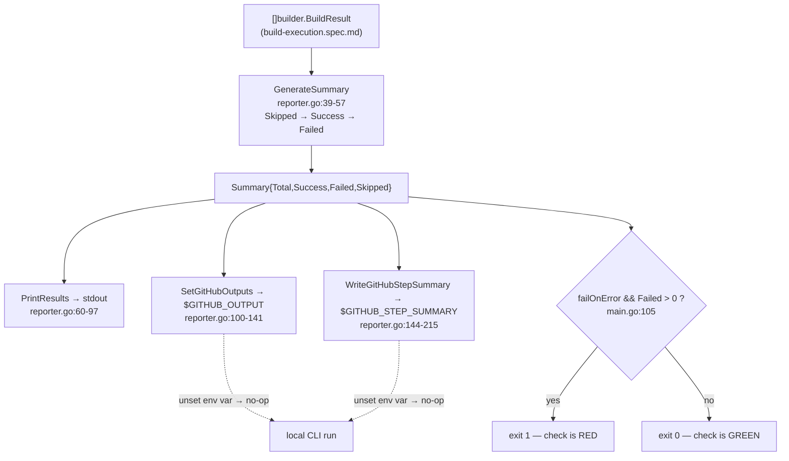

## SPECIFICATION: Result Reporting & Action Outputs (build results → console, outputs, summary, exit code)
**Version:** 1.0
**Status:** Draft
**Date:** 2026-08-12
**Type:** feature (retro-spec of shipped behaviour)
**Slug:** result-reporting

**Unit under spec:** `internal/reporter` (`reporter.go`) plus the exit-code decision in `cmd/action/main.go`
**Input contract:** `[]builder.BuildResult` from `internal/builder` (`BuildAll`)
**Public contract:** `outputs:` in `action.yml` (this repo) and `action.yml` in `michielvha/kustomize-build-check-action`
**Upstream:** [build-execution.spec.md](./build-execution.spec.md) (produces the results), [impact-analysis.spec.md](./impact-analysis.spec.md) (produces the paths)

> This is a **retro-spec**. It documents behaviour that is already shipped and already
> covered by tests. The code is the source of truth; every behavioural claim below carries a
> `file:line` citation. Nothing here proposes a change. Things the code does *not* do are
> recorded as known limitations (§9) or observations (§10), never as unmet requirements.

---

### 1. Overview

Result reporting is stage 6, the last stage, of the `kustomize-build-check` pipeline
(`git diff → discovery → dependency graph → impact analysis → build → report`, CLAUDE.md;
design.md:133-141). It takes the `[]builder.BuildResult` slice produced by the build stage
and turns it into four artefacts:

1. a human-readable **console report** on stdout (`reporter.go:60-97`),
2. three **GitHub Actions outputs** plus a `results` JSON blob appended to `$GITHUB_OUTPUT`
   (`reporter.go:100-141`),
3. a Markdown **job step summary** appended to `$GITHUB_STEP_SUMMARY` (`reporter.go:144-215`),
4. the **process exit code**, which is what makes the check red or green
   (`main.go:104-115`).

This stage is where every earlier stage's judgement becomes a verdict, so the asymmetric
correctness bar in CLAUDE.md lands hardest here. A miscount inverts the tool's answer: a
false pass defeats the tool's only purpose, and a false fail (counting a directory the
change legitimately removed as a build failure) is precisely the defect that produced red
checks on correct pull requests. The counting rule that keeps both honest is a single
three-way classification, applied once in `GenerateSummary` and reused by every other
function on this path (`reporter.go:45-54`).

This repo is a `go-cli-tool` (`vega.yaml`) with a single direct dependency
(`gopkg.in/yaml.v3`, `go.mod:5`). The reporter imports stdlib (`encoding/json`, `fmt`,
`os`, `strings`) plus `internal/builder` only (`reporter.go:3-10`).

```go
type Summary struct {                       // reporter.go:13-21
	Total   int
	Success int                              // builds that ran and exited 0
	Failed  int                              // builds that ran and did not exit 0
	Skipped int                              // paths never handed to kustomize
	Results []builder.BuildResult
}

type Reporter interface {                   // reporter.go:24-29
	GenerateSummary(results []builder.BuildResult) Summary
	PrintResults(results []builder.BuildResult)
	SetGitHubOutputs(results []builder.BuildResult) error
	WriteGitHubStepSummary(results []builder.BuildResult) error
}

func New() Reporter                          // reporter.go:34-36
```

---

### 2. Goals & Success Metrics

- **G-1: The verdict matches reality.** A run whose builds all succeeded exits 0; a run with
  at least one genuine build failure and `fail-on-error: true` exits 1
  (`main.go:105-115`) → Metric: `summary.Failed > 0` is the only build-derived condition that
  can produce a non-zero exit.
- **G-2: A removed directory never turns the check red.** Skipped paths are excluded from
  both the success and the failure count and from the exit-code decision
  (`reporter.go:46-53`, `main.go:102-108`) → Metric: verified this session, a scenario that
  previously reported "6 total, 4 successful, 2 failed" and exited 1 now reports
  "7 total, 4 successful, 0 failed, 3 skipped" and exits 0, with outputs
  `failed-count=0 / success-count=4 / skipped-count=3`.
- **G-3: The counts are internally consistent.** `Total == Success + Failed + Skipped`
  always, because the classification is a `switch` with mutually exclusive arms over one
  loop (`reporter.go:45-54`) → Metric: asserted by
  `TestGenerateSummaryExcludesSkipped` (`reporter_test.go:35-38`).
- **G-4: The published outputs are a stable public interface.** Downstream workflows in other
  repositories read `failed-count`, `success-count`, `skipped-count` and `results`
  (kustomize-build-check-action README.md:74-81, 141-157) → Metric: the same four output
  names are declared in both `action.yml` files (this repo `action.yml:35-46`; wrapper
  `action.yml:30-41`).
- **G-5: A reporting failure never silently changes the verdict.** Output and summary write
  errors are warnings on stderr and do not alter the exit code
  (`main.go:93-100`) → Metric: no `os.Exit` in any reporter error branch.

---

### 3. Functional Requirements

Priority scale: P0 = launch blocker (shipped, load-bearing), P1 = important, P2 = nice-to-have.

#### 3.1 Counting (`GenerateSummary`)

| ID | Priority | Requirement | Notes |
|------|------|-------------|-------|
| F-01 | P0 | `GenerateSummary(results)` returns a `Summary` with `Total = len(results)` and `Results = results` (the same backing slice, not a copy) (`reporter.go:40-43`). | `Results` is exposed but no caller on the `main` path reads it (`main.go:104-105`). |
| F-02 | P0 | Classification is a three-way `switch` evaluated in this order: **`Skipped` first**, then `Success`, else `Failed` (`reporter.go:46-53`). The arms are mutually exclusive, so each result increments exactly one counter. | Order is load-bearing: skipped results carry `Success=false` (`builder.go:58-64`), so an ordering that tested `Success` first would classify every skipped path as a failure. |
| F-03 | P0 | **Invariant: `Total == Success + Failed + Skipped`.** Documented on the struct (`reporter.go:15-16`) and enforced by construction (F-01, F-02). | Asserted by `TestGenerateSummaryExcludesSkipped` (`reporter_test.go:35-38`). |
| F-04 | P0 | `Success` and `Failed` count **only builds that actually ran**. A skipped path contributes to neither (`reporter.go:15-16, 46-53`). | This is the fix for the reported production false-fail. |
| F-05 | P0 | `!result.Success` alone does **not** mean failure. `Skipped` must be checked first, because the builder returns `Success:false, Skipped:true` for a removed path (`builder.go:58-64`, comment `builder.go:17-23`). | Every consumer in this spec honours this; see F-14, F-19. |
| F-06 | P0 | `GenerateSummary(nil)` returns the zero summary (`Total:0, Success:0, Failed:0, Skipped:0, Results:nil`), the loop simply does not execute (`reporter.go:39-56`). | Exercised on the zero-affected-paths path (`main.go:66-72`). |
| F-07 | P0 | `GenerateSummary` is pure: no I/O, no environment reads, no mutation of the input (`reporter.go:39-57`). | It is recomputed independently by `PrintResults` (`reporter.go:93`), `SetGitHubOutputs` (`reporter.go:101`), `WriteGitHubStepSummary` (`reporter.go:156`) and `main` (`main.go:104`) — four calls, one rule. |

#### 3.2 Console report (`PrintResults`)

| ID | Priority | Requirement | Notes |
|------|------|-------------|-------|
| F-08 | P0 | With an empty or nil result slice, print exactly `✓ No kustomizations need testing` and return without a summary line (`reporter.go:61-64`). | Unreachable from `main` today; see O-1 in §10. |
| F-09 | P0 | Otherwise print the header `\nKustomize Build Results:` followed by an 80-character `=` rule (`reporter.go:66-67`), then one block per result **in input order** (`reporter.go:69`), then a closing 80-character rule (`reporter.go:94`). | Input order is the affected-path order from the build stage (`main.go:86`). |
| F-10 | P0 | Per-result line format, same `Skipped`-first ordering as F-02 (`reporter.go:70-90`): <br>• skipped → `⏭️  <path> - Skipped (<SkipReason>)` (`reporter.go:72`) <br>• success → `✅ <path> - Build successful (<duration>s)` (`reporter.go:74`) <br>• failure → `❌ <path> - Build failed (<duration>s)` (`reporter.go:76`) | Duration is formatted `%.2f` from `result.Duration.Seconds()`. Skipped lines carry **no** duration. |
| F-11 | P0 | For a failed result with non-empty `Error`, print the error indented by three spaces, **truncated to the first 5 lines**; on reaching index 5 print `   ...` and stop (`reporter.go:77-88`). | Truncation budget counts blank lines even though blank lines are not printed (`reporter.go:85`); see §8. |
| F-12 | P0 | Close with `\nSummary: %d total, %d successful, %d failed, %d skipped\n` over the recomputed summary (`reporter.go:93-96`). | Verified this session: `7 total, 4 successful, 0 failed, 3 skipped`. |
| F-13 | P0 | `PrintResults` writes to stdout via `fmt.Print*` and returns nothing; it cannot fail and cannot affect the exit code (`reporter.go:60-97`). | Errors from stages 1-3 go to stderr instead (`main.go:35, 45, 54`). |

#### 3.3 GitHub Actions outputs (`SetGitHubOutputs`) — public contract

| ID | Priority | Requirement | Notes |
|------|------|-------------|-------|
| F-14 | P0 | Append exactly four lines to the file named by `$GITHUB_OUTPUT`, in this order (`reporter.go:127-138`): `failed-count=<n>`, `success-count=<n>`, `skipped-count=<n>`, `results=<json>`, each terminated by `\n`. | The three counts come from the shared `GenerateSummary` (`reporter.go:101`), so F-02 through F-05 apply verbatim to the published numbers. |
| F-15 | P0 | If `$GITHUB_OUTPUT` is unset or empty, **no-op and return `nil`** (`reporter.go:104-108`). | Observed in code; this is what makes local CLI runs work without a GitHub environment. |
| F-16 | P0 | The file is opened `O_APPEND|O_CREATE|O_WRONLY` mode `0o644` (`reporter.go:110`). Appending is required: other steps and other calls write to the same file. | Open failure returns `failed to open GITHUB_OUTPUT: %w` (`reporter.go:111-113`). |
| F-17 | P0 | `results` is `json.Marshal(results)` over the raw `[]builder.BuildResult` (`reporter.go:121-124`), **not** over the `Summary`. Marshal failure returns `failed to marshal results: %w`. | Shape is defined by the struct, see §6.2. |
| F-18 | P0 | A write failure on any of the four lines aborts with `failed to write output: %w`; earlier lines already written stay in the file (`reporter.go:134-138`). | Partial output is possible; the caller only warns (F-27). |
| F-19 | P0 | **The declared output set is a public interface** and must be identical in both `action.yml` files: `results`, `failed-count`, `success-count`, `skipped-count` (this repo `action.yml:35-46`; wrapper `action.yml:30-41`). Adding an output is backwards compatible; **removing or renaming one is breaking** for consumer workflows. | Consumers read them by name (kustomize-build-check-action README.md:141-157). A name emitted by the binary but not declared in the wrapper `action.yml` is not visible to consumers, and a name declared but not emitted resolves to empty string. |

#### 3.4 Job step summary (`WriteGitHubStepSummary`)

| ID | Priority | Requirement | Notes |
|------|------|-------------|-------|
| F-20 | P0 | If `$GITHUB_STEP_SUMMARY` is unset or empty, no-op and return `nil` (`reporter.go:145-148`). Otherwise append Markdown to that file, opened `O_APPEND\|O_CREATE\|O_WRONLY` `0o644` (`reporter.go:150`). | Same observed no-op-locally behaviour as F-15. |
| F-21 | P0 | The whole document is built in a single `strings.Builder` and written once (`reporter.go:158, 210-212`); a write failure returns `failed to write summary: %w`. | All-or-nothing, unlike F-18. |
| F-22 | P0 | Always emit the header `## Kustomize Build Check Results` and a four-row metric table: `Total Builds`, `✅ Passed`, `❌ Failed`, `⏭️ Skipped` (`reporter.go:159-166`). | Rendered even when every count is zero. |
| F-23 | P0 | Emit `### ❌ Build Errors` **only if `summary.Failed > 0`** (`reporter.go:168-186`). Membership filter is `!result.Success && !result.Skipped` (`reporter.go:171`). **A skipped result must never be rendered in this section.** | Asserted by `TestStepSummaryDoesNotListSkippedAsError` (`reporter_test.go:85-90`): the skipped path must be absent and the genuinely failed path present. |
| F-24 | P0 | Each error entry is `- **<path>**` followed by a fenced block containing `result.Error`, **truncated to the first 10 lines**; when longer, append `\n... (+<N> more lines)` with `N = len(errorLines)-10` (`reporter.go:172-182`). | Truncation limit differs from the console's 5 (F-11), deliberately: "Limit error output to avoid blowing up the summary" (`reporter.go:174`). |
| F-25 | P0 | Emit `### ⏭️ Skipped` only if `summary.Skipped > 0` (`reporter.go:188-197`), with the fixed sentence `These paths no longer exist in the working tree and were not built.` and one `- <path> (<SkipReason>)` bullet per skipped result. | Asserted present by `TestStepSummaryDoesNotListSkippedAsError` (`reporter_test.go:91-93`). |
| F-26 | P0 | Emit `### ✅ Successful Builds` only if `summary.Success > 0`, wrapped in a collapsed `<details><summary>Click to see passed builds</summary>` block, one `- <path> (<duration>s)` bullet per result with `result.Success == true` (`reporter.go:199-208`). | Skipped results carry `Success=false` (`builder.go:60`), so they cannot leak into this section either. |

#### 3.5 Exit code and orchestration (`cmd/action/main.go`)

| ID | Priority | Requirement | Notes |
|------|------|-------------|-------|
| F-27 | P0 | On the normal path `main` calls, in order: `PrintResults` (`main.go:90`), `SetGitHubOutputs` (`main.go:93`), `WriteGitHubStepSummary` (`main.go:98`). Errors from the latter two are printed to stderr as `Warning: ...` and execution continues (`main.go:93-100`). | A broken `$GITHUB_OUTPUT` cannot turn a green run red or a red run green. |
| F-28 | P0 | **The exit-code rule: `if failOnError && summary.Failed > 0 → print `\n❌ Some builds failed` and `os.Exit(1)`** (`main.go:105-108`). `Skipped` and `Success` never appear in this condition. | The governing comment is at `main.go:102-103`: "Skipped paths are not failures: they are directories the change removed, so there is nothing left to validate." |
| F-29 | P0 | Otherwise exit 0 (`main.go:115`) with a final message that depends only on the skipped count: `\n✅ All builds successful (<n> skipped)` when `summary.Skipped > 0`, else `\n✅ All builds successful` (`main.go:110-114`). | With `fail-on-error: false` this message is printed even when `Failed > 0`; see §8. |
| F-30 | P0 | `failOnError` is `getEnv("INPUT_FAIL-ON-ERROR", "true") == "true"`, an exact string comparison against `"true"` (`main.go:27`). Any other value, including `"TRUE"` or `"1"`, disables failing. | Declared with default `'true'` in both `action.yml` files (this repo `action.yml:25-28`; wrapper `action.yml:20-23`). |
| F-31 | P0 | **Zero-affected-paths early return:** when impact analysis returns no paths, `main` prints `   No kustomizations affected by changes`, still calls `WriteGitHubStepSummary(nil)` **then** `SetGitHubOutputs(nil)` (note the reversed order versus F-27), prints `\n✅ All checks passed` and exits 0 (`main.go:63-76`). | The outputs are still published, so a consumer reading `failed-count` never sees an empty string on a no-op run. `PrintResults` is **not** called here. |
| F-32 | P0 | `results` on the zero-path run is `null`, not `[]`: `json.Marshal` of a nil slice emits `null` and `main` passes a literal `nil` (`main.go:67, 70`; `reporter.go:121`). | Verified by direct `json.Marshal` execution this session. Consumers doing `fromJSON(results)` must tolerate `null`. |
| F-33 | P1 | Exit code 1 is also used for stage failures before reporting: git diff (`main.go:36`), discovery (`main.go:46`), graph build (`main.go:54`). | A consumer cannot distinguish "a build failed" from "the tool failed" by exit code alone; see O-3. |

---

### 4. Non-Functional Requirements

| ID | Category | Requirement |
|-------|-------------|-------------|
| NF-01 | Correctness bias | The classification order (F-02) is the single point where a false fail is prevented and a false pass could be introduced. Any change to `reporter.go:46-53` or `main.go:105` is a verdict-level change and must be re-specified before it is coded (CLAUDE.md, "Specs are the source of truth"). |
| NF-02 | Compatibility | The four output names in §3.3 are a cross-repository public contract (F-19). Both `action.yml` files must be changed together; the wrapper repo pins this repo's image by SHA (`kustomize-build-check-action/action.yml:45`), so an output added here is invisible to consumers until that pin is bumped and the wrapper's `outputs:` block declares it. |
| NF-03 | Robustness | Every environment interaction degrades to a no-op or a warning: unset env vars no-op (F-15, F-20), write errors warn (F-27). The reporter never panics on nil input (F-06). |
| NF-04 | Output size | Console error output is capped at 5 lines per failure (F-11) and step-summary error output at 10 lines per failure (F-24), to keep the job log and the summary page readable. Neither the number of result blocks nor the `results` JSON is capped. |
| NF-05 | Dependencies | Reporting uses stdlib only (`encoding/json`, `fmt`, `os`, `strings`) plus `internal/builder` (`reporter.go:3-10`), consistent with the one-direct-dependency rule in CLAUDE.md. |
| NF-06 | Determinism | Output order follows input order everywhere (`reporter.go:69, 170, 191, 202`); no map iteration, therefore no run-to-run variation in the report or the summary. |
| NF-07 | Observability | Reporting emits no `slog` records; it is pure user-facing output. Build-level detail is logged upstream (`builder.go:73-110`). |

---

### 5. Data Model & Flows

#### 5.1 Input entity

`builder.BuildResult` (`builder.go:15-29`), owned by `internal/builder`, consumed read-only here:

| Field | Type | Meaning as used by the reporter |
|---|---|---|
| `Path` | `string` | Rendered in every section (F-10, F-24, F-25, F-26). |
| `Success` | `bool` | True **only** for a build that ran and exited 0 (`builder.go:17-20`). |
| `Skipped` | `bool` | Path never handed to kustomize because the change removed it (`builder.go:21-24`). Carries `Success=false`. |
| `SkipReason` | `string` | `"removed in this change"` or `"removed in this change (empty directory)"` (`builder.go:127-143`). Rendered in F-10 and F-25. |
| `Output` | `string` | kustomize stdout. **Not rendered anywhere**, but it is serialised into the `results` JSON (F-17). |
| `Error` | `string` | `fmt.Sprintf("%v\n%s", err, stderr)` (`builder.go:103`), so it is intrinsically multi-line. Truncated by F-11 and F-24. |
| `Duration` | `time.Duration` | Rendered as `%.2f` seconds (F-10, F-26); serialised as integer nanoseconds (§6.2). |

#### 5.2 Flow



The three-way classification happens **once per artefact** but always by the same function,
so the console line, the published counts, the summary table and the exit code cannot
disagree with each other (F-07).

#### 5.3 State ownership

The reporter owns no state (`type reporter struct{}`, `reporter.go:31`). It holds no
configuration and reads the environment only at the moment of writing (`reporter.go:104,
145`), so it is safe to construct per call, which is what `main` does on both paths
(`main.go:66, 89`).

---

### 6. API / Interface Contracts

#### 6.1 Go interface (`internal/reporter`)

| Signature | Contract |
|---|---|
| `New() Reporter` (`reporter.go:34-36`) | Returns a stateless reporter. Never fails. |
| `GenerateSummary([]builder.BuildResult) Summary` (`reporter.go:39`) | Pure. Accepts nil. Never fails. |
| `PrintResults([]builder.BuildResult)` (`reporter.go:60`) | Writes stdout. No return value; cannot fail. Accepts nil/empty (F-08). |
| `SetGitHubOutputs([]builder.BuildResult) error` (`reporter.go:100`) | Returns nil when `$GITHUB_OUTPUT` is unset (F-15); otherwise nil on success or a wrapped open/marshal/write error (F-16, F-17, F-18). |
| `WriteGitHubStepSummary([]builder.BuildResult) error` (`reporter.go:144`) | Returns nil when `$GITHUB_STEP_SUMMARY` is unset (F-20); otherwise nil on success or a wrapped open/write error (F-21). |

#### 6.2 `results` JSON wire format (public)

`json.Marshal` is called on `[]builder.BuildResult` and the struct carries **no JSON struct
tags** (`builder.go:15-29`), so **the Go field names are the wire names**. Renaming a field
in `BuildResult` is therefore a breaking change to the published `results` output, even
though nothing in the reporter mentions the field names.

Element shape, verified by executing `json.Marshal` against the struct this session:

```json
[{"Path":"a","Success":false,"Skipped":false,"SkipReason":"","Output":"","Error":"exit status 1\nError: boom","Duration":1500000000}]
```

- All seven fields are always present; there are no `omitempty` tags, so empty strings and
  `false` are emitted explicitly.
- `Duration` is an integer count of **nanoseconds** (`time.Duration` is an `int64`), not
  seconds and not the `"1.5s"` string form. The `%.2f` seconds rendering exists only in the
  console and summary text (F-10, F-26).
- `Error` and `Output` are JSON-escaped, so an embedded newline is emitted as the two
  characters `\n`, never as a raw newline (verified this session by marshalling an `Error`
  containing a newline; the result contained no raw newline byte). This is what keeps the
  bare `results=<json>` line (F-14) a single physical line. See OQ-1 in §10, the property is
  supplied by `encoding/json`, not by a guard in the reporter.
- The zero-affected-paths run emits `null`, not `[]` (F-32).

#### 6.3 GitHub Actions file protocol (observed in code)

`$GITHUB_OUTPUT` and `$GITHUB_STEP_SUMMARY` name files that the runner reads after the step;
the tool consumes them by **appending** `key=value` lines (`reporter.go:127-138`) and
Markdown (`reporter.go:210`) respectively. When either variable is unset the corresponding
function returns immediately (`reporter.go:104-108, 145-148`), which is the observed
mechanism that lets the same binary run locally as a plain CLI.

#### 6.4 Declared action outputs (both repos)

| Output | Declared description | Source |
|---|---|---|
| `results` | `JSON output of all build results` | `action.yml:36-37`; wrapper `action.yml:31-32` |
| `failed-count` | `Number of failed builds` | `action.yml:39-40`; wrapper `action.yml:34-35` |
| `success-count` | `Number of successful builds` | `action.yml:42-43`; wrapper `action.yml:37-38` |
| `skipped-count` | `Number of paths skipped because they no longer exist (deleted or renamed by the change)` | `action.yml:45-46`; wrapper `action.yml:40-41` |

---

### 7. Acceptance Criteria

- [ ] **AC-1:** `GenerateSummary` over a slice of 2 successes, 1 failure and 1 skipped returns
      `Success=2, Failed=1, Skipped=1`, and `Success+Failed+Skipped == Total`.
      Evidence: `TestGenerateSummaryExcludesSkipped` (`reporter_test.go:23-39`) against
      `sampleResults()` (`reporter_test.go:12-19`).
- [ ] **AC-2:** With `GITHUB_OUTPUT` pointed at a temp file, `SetGitHubOutputs` over the same
      sample writes lines containing exactly `failed-count=1`, `success-count=2` and
      `skipped-count=1`. Evidence: `TestSetGitHubOutputsExcludesSkipped`
      (`reporter_test.go:42-61`).
- [ ] **AC-3:** In the generated step summary, the region between `### ❌ Build Errors` and the
      next `### ` heading contains `/repo/overlays/broken` and does **not** contain
      `/repo/overlays/removed`. Evidence: `TestStepSummaryDoesNotListSkippedAsError`
      (`reporter_test.go:65-90`).
- [ ] **AC-4:** The same generated summary contains a `### ⏭️ Skipped` heading when at least
      one result is skipped. Evidence: `TestStepSummaryDoesNotListSkippedAsError`
      (`reporter_test.go:91-93`).
- [ ] **AC-5:** With `fail-on-error` at its default and a result set whose only non-successes
      are skipped, the process exits **0** and prints `✅ All builds successful (<n> skipped)`.
      Evidence: `main.go:105-114`; verified end-to-end this session against a reproduction of
      the reported production failure (`failed-count=0`, `success-count=4`,
      `skipped-count=3`, exit 0).
- [ ] **AC-6:** With `fail-on-error` at its default and at least one result where
      `Success==false && Skipped==false`, the process exits **1** and prints
      `❌ Some builds failed`. Evidence: `main.go:105-108`.
- [ ] **AC-7:** The console summary line for the reproduction reads exactly
      `Summary: 7 total, 4 successful, 0 failed, 3 skipped`. Evidence: format string
      `reporter.go:95-96`; verified this session (pre-fix the same scenario read
      "6 total, 4 successful, 2 failed").
- [ ] **AC-8:** With both `GITHUB_OUTPUT` and `GITHUB_STEP_SUMMARY` unset, both writer
      functions return `nil` and create no files. Evidence: `reporter.go:104-108, 145-148`.
- [ ] **AC-9:** A console error block for a failure whose `Error` has more than 5 lines prints
      at most 5 error lines followed by a line containing `...`. Evidence:
      `reporter.go:79-88`. *(No unit test asserts this today; see §10 OQ-2.)*
- [ ] **AC-10:** A step-summary error block for a failure whose `Error` has more than 10 lines
      contains the first 10 lines and the literal suffix `... (+N more lines)` with
      `N = total-10`. Evidence: `reporter.go:175-181`. *(No unit test asserts this today; see
      §10 OQ-2.)*
- [ ] **AC-11:** `action.yml` in this repo and `action.yml` in
      `michielvha/kustomize-build-check-action` declare the identical set
      `{results, failed-count, success-count, skipped-count}`. Evidence: `action.yml:35-46`
      and `/Users/michielvh/code/personal/kustomize-build-check-action/action.yml:30-41`.
- [ ] **AC-12:** A run where impact analysis returns zero paths still appends all four output
      lines to `$GITHUB_OUTPUT` (all counts `0`, `results=null`) and exits 0. Evidence:
      `main.go:63-76`; `json.Marshal(nil)` → `null`, verified this session.

---

### 8. Edge Cases & Error Handling

| Scenario | Observed behaviour | Citation |
|---|---|---|
| Zero affected paths | Step summary and outputs are still written (in that order), `PrintResults` is skipped, message `✅ All checks passed`, exit 0. | `main.go:63-76` |
| Nil result slice reaches the reporter | `Total=0`, all counts 0, step summary renders header + all-zero table with no sections, `results=null`. | `reporter.go:39-56, 168, 188, 199`; F-32 |
| Every result skipped | `Failed=0` → exit 0 with `✅ All builds successful (<n> skipped)`; step summary has no Build Errors section and no Successful Builds section. | `main.go:105-114`; `reporter.go:168, 199` |
| `fail-on-error: false` with genuine failures | Exit 0 **and** the success message `✅ All builds successful` is printed despite `Failed > 0`; the failures remain visible in the console blocks, the counts and the summary section. | `main.go:105, 110-114` |
| `INPUT_FAIL-ON-ERROR` set to `TRUE` / `1` / `yes` | Comparison is exact against `"true"`, so any of these **disables** failing. | `main.go:27` |
| Failed result with empty `Error` | The `❌ <path> - Build failed` line is printed with no error block; the step summary still emits the bullet with an empty fenced block. | `reporter.go:77`, `reporter.go:172-182` |
| `Error` contains blank lines | Blank lines are not printed but still consume the 5-line console budget, so fewer than 5 lines may be visible before `...`. The step-summary path joins the first 10 lines verbatim, blank lines included. | `reporter.go:80-88` vs `reporter.go:175-181` |
| `Error` contains a triple-backtick fence | Written verbatim into the summary's fenced block; there is no escaping, so the Markdown block can terminate early. | `reporter.go:173-182` |
| `Error` contains a newline (always true for real failures) | JSON-escaped to `\n` inside `results`, so the `key=value` line stays single-line. | §6.2; `builder.go:103` |
| `$GITHUB_OUTPUT` unwritable / open fails | `SetGitHubOutputs` returns a wrapped error; `main` prints `Warning: failed to set GitHub outputs: ...` to stderr and continues to the exit-code decision unchanged. | `reporter.go:110-113`; `main.go:93-95` |
| Write fails mid-way through the four output lines | Earlier lines remain in `$GITHUB_OUTPUT`; the run continues. A consumer may observe some counts set and `results` missing. | `reporter.go:134-138` |
| `$GITHUB_STEP_SUMMARY` write fails | Whole document is lost (single write), warning on stderr, exit code unaffected. | `reporter.go:210-212`; `main.go:98-100` |
| Closing `$GITHUB_OUTPUT` fails | The deferred close assigns to a local `err` on a function with an **unnamed** result, so the close error cannot reach the caller and is dropped. | `reporter.go:114-118`; O-2 in §10 |
| Very large result set | No cap on the number of rendered blocks or on `results` JSON size; only per-error truncation applies. | NF-04 |

---

### 9. Out of Scope

This spec covers only the transformation of `[]builder.BuildResult` into console output,
GitHub outputs, the step summary and the exit code. Explicitly **not** covered:

- **How results are produced**, including the skip decision itself and the `SkipReason`
  strings — that is `internal/builder`, see [build-execution.spec.md](./build-execution.spec.md)
  (`builder.go:49-143`).
- **Which paths get built** — see [impact-analysis.spec.md](./impact-analysis.spec.md).
- **Change detection, discovery and graph construction** (`main.go:30-56`), and their error
  exits (F-33).
- **Input parsing beyond `fail-on-error`** — `base-ref`, `enable-helm`, `root-dir`
  (`main.go:25-28`) belong to the stages that consume them.
- **Logging configuration** (`setupLogging`, `main.go:126-154`). The reporter emits no logs
  (NF-07).
- **Release and image pinning.** The wrapper's SHA pin (`kustomize-build-check-action/action.yml:45`)
  is release-flow territory (CLAUDE.md, "Release flow"), touched here only as the reason
  NF-02 is a two-repo change.
- **Any proposed improvement.** Truncation limits, the `results` shape, the unnamed-return
  close error and the missing truncation tests are documented as they are, not as work items.
- Per this repo's constitution there are no GitOps, secret, registry, cluster or team
  concerns to specify (CLAUDE.md; `vega.yaml`).

---

### 10. Open Questions

**Observations (facts about the shipped code, recorded, not proposed for change):**

- **O-1:** `PrintResults`'s empty-input branch (`reporter.go:61-64`, `✓ No kustomizations need
  testing`) is **unreachable from `main`**, because the zero-affected-paths branch returns
  before `PrintResults` is called (`main.go:63-76`). It is reachable only via direct API use.
- **O-2:** In `SetGitHubOutputs` the deferred close writes to a local `err` on a function with
  an unnamed result (`reporter.go:114-118`), so a close error is silently dropped.
  `WriteGitHubStepSummary` ignores its close error outright (`reporter.go:154`).
- **O-3:** Exit code 1 is shared between "a build failed" (`main.go:107`) and upstream stage
  errors (`main.go:36, 46, 54`), so the exit code alone does not distinguish them. Consumers
  that need the distinction read `failed-count`.
- **O-4:** `Summary.Results` (`reporter.go:20`) is populated but never read on the `main`
  path; the JSON output marshals the raw input slice instead (`reporter.go:121`).
- **O-5:** `design.md:278-293` still shows the pre-skip `Reporter` interface (no
  `WriteGitHubStepSummary`) and a `Summary` without `Skipped`. The code, not `design.md`, is
  authoritative; this spec supersedes that sketch for the reporter.
- **O-6:** The outputs contract is documented for users in the **wrapper** repo's README only
  (`kustomize-build-check-action/README.md:74-92`). This repo's README mentions skipping in
  the overview (`README.md:20`) but carries no outputs table.

**Remaining questions (no owner assigned; this is a personal OSS repo, the maintainer owns
all of them):**

- **OQ-1 (was flagged as a multi-line-output risk):** the `results` value is written as a bare
  `key=value` line without heredoc delimiters (`reporter.go:131-135`), while GitHub Actions
  requires a delimiter for values containing newlines. **Checked this session:**
  `encoding/json` escapes control characters, so the marshalled `[]BuildResult` contains no
  raw newline even though `Error` is built as `"%v\n%s"` (`builder.go:103`). The current code
  is therefore safe, but the safety is a property of `encoding/json`, not an explicit guard in
  the reporter, and nothing asserts it. Open question: should that property be pinned by a
  test? Recorded as a fact, not a defect.
- **OQ-2:** Both truncation limits (5 console lines, F-11; 10 summary lines, F-24) are
  exercised by no test — `sampleResults()` uses a 2-line error (`reporter_test.go:16`).
  AC-9 and AC-10 are therefore specified from code reading, not from an existing test.
- **OQ-3:** No test covers the exit-code decision in `main.go:105-115` at the process level;
  AC-5 and AC-6 rest on code reading plus the manual end-to-end verification recorded in §2.
- **OQ-4:** No automated check enforces that the two `action.yml` output blocks stay in sync
  (AC-11); today it is a manual two-repo edit.

**Assumptions** (mode = autonomous):

- Assumed the `results` JSON contract is specified as "whatever `json.Marshal` produces for
  `[]builder.BuildResult`", with the field names enumerated from the struct, because
  `BuildResult` carries no JSON tags (`builder.go:15-29`) so Go field names are the wire
  names. **Verified this session** by executing `json.Marshal` against the struct; §6.2 quotes
  the actual output. [Risk: low, downgraded from medium after verification]
- Assumed the maintainer's stated compatibility rule holds: adding an output is backwards
  compatible, removing or renaming one is breaking (F-19, NF-02). Carried from the brief's
  resolved-unknowns list. [Risk: low]
- Assumed the multi-line-output concern belongs in Open Questions rather than in requirements,
  since the escaping check came out clean (OQ-1). [Risk: low, downgraded from high after
  verification]
- Assumed `docs/specs/build-execution.spec.md` will exist at the linked path; it is being
  authored concurrently and did not exist on disk when this spec was written. [Risk: low]

---

### 11. Planner Handoff Notes

**Dependencies to resolve first**

- This spec is descriptive. Nothing here needs implementing; it is the baseline that future
  changes to `internal/reporter` and the exit-code block must be diffed against.
- It depends on [build-execution.spec.md](./build-execution.spec.md) for the meaning of
  `Skipped`/`SkipReason` and on [impact-analysis.spec.md](./impact-analysis.spec.md) for how
  a removed path reaches the builder at all. Read those first; do not re-derive the skip rule
  here.

**Suggested order if this spec is ever used to drive work**

1. Pin the invariants that are already true but untested: the JSON escaping property (OQ-1)
   and the two truncation limits (OQ-2). Cheapest, highest confidence-per-line.
2. Process-level coverage of the exit-code decision (OQ-3), which is the one place where a
   regression flips a verdict.
3. Cross-repo `action.yml` output-set drift check (OQ-4).

**Risk areas to flag on any future change**

| Area | Why it is dangerous |
|---|---|
| `reporter.go:46-53` (the three-way switch) | Reordering the arms so `Success` is tested before `Skipped` re-creates the exact production false-fail this behaviour was fixed for (§2 G-2). |
| `main.go:105` (`failOnError && summary.Failed > 0`) | Widening this to `!Success` or to `Total-Success` re-creates the same false fail. Narrowing it (for example gating on a new input) risks a false pass, which CLAUDE.md rates worse. |
| `reporter.go:171` (`!result.Success && !result.Skipped`) | The only filter standing between a skipped path and the Build Errors section (AC-3). |
| Output names in either `action.yml` | Cross-repository breakage with no compile-time signal; consumer workflows fail silently with empty strings (NF-02). |
| `builder.BuildResult` field names | Renames silently change the `results` wire format because there are no JSON tags (§6.2). |
| `builder.BuildResult` new fields | Automatically appear in `results` (no `omitempty`, no tags), so additive struct changes are additive contract changes. |

**Estimated complexity (documentation only, per group)**

| Group | Complexity |
|---|---|
| §3.1 counting (F-01…F-07) | S — one function, fully tested |
| §3.2 console (F-08…F-13) | S |
| §3.3 outputs (F-14…F-19) | M — public contract spanning two repositories |
| §3.4 step summary (F-20…F-26) | M — four conditional sections and two truncation rules |
| §3.5 exit code (F-27…F-33) | M — small code, verdict-level consequences |
