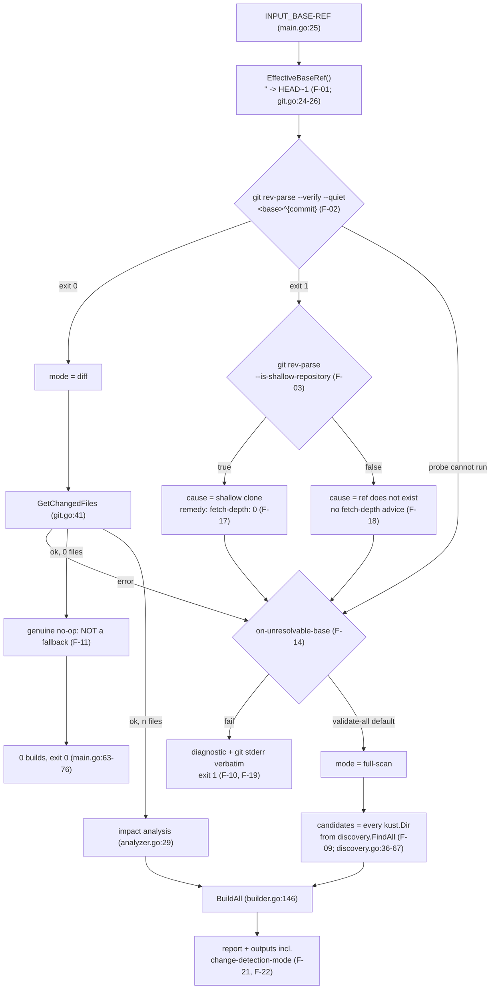

## SPECIFICATION: Shallow-Clone Support (unresolvable base ref)
**Version:** 1.0
**Status:** Draft
**Date:** 2026-08-12
**Type:** feature
**Slug:** shallow-clone-support

**Units under spec:** `internal/git` (preflight), `cmd/action/main.go` (orchestration),
`internal/reporter` (visibility), `action.yml` in **both** repos (public contract)
**Supersedes:** [change-detection.spec.md](./change-detection.spec.md) §8 E-06 and §9 L-02 —
those record the shallow-clone hard failure as *observed behaviour*; this spec replaces it with
*required* behaviour. Everything else in that spec, in particular the unfiltered diff (F-05,
§10 R-01), is unchanged and must stay unchanged.
**Downstream:** [impact-analysis.spec.md](./impact-analysis.spec.md),
[build-execution.spec.md](./build-execution.spec.md),
[result-reporting.spec.md](./result-reporting.spec.md) (this spec amends its output contract)

> Every claim about current behaviour carries a `file:line` citation. Every claim about git's
> behaviour was verified empirically **in this session** (git 2.50.1, Apple Git-155) against a
> scratch repository, not asserted from memory. Claims about GitHub Actions runner behaviour that
> were not verified from a session-fetched source are marked `[unverified]` and repeated in §10.

---

### 1. Overview

`kustomize-build-check` is a `go-cli-tool` (`vega.yaml`) shipped as a container action. Stage 1 of
its pipeline diffs a base ref against `HEAD` to decide what to validate
(`git.go:41`; CLAUDE.md, design.md:88-141). That diff assumes the base commit is *present in the
local object store*. In a shallow checkout it is not, and the tool currently dies:

```
fatal: bad object 01039aa1eaced33142f5635e55a34535ad410f11
```

verified this session in a `git clone --depth 1` working copy — `git diff --name-only <base> HEAD`
exits **128**; the identical command in a full clone of the same repository exits 0 and prints the
changed paths. So the failure is purely about object reachability, not about the refs being wrong.
`git.go:47-49` wraps that into `git diff failed: … Stderr: …`, and `main.go:34-37` turns it into
`os.Exit(1)`. The workflow goes red with a raw git error and no remedy.

Two facts make this worse than it looks:

1. **The default path fails too.** With `base-ref` unset, `main.go:25` passes `""` and
   `git.go:24-26` substitutes `HEAD~1`. In a depth-1 clone `HEAD~1` does not exist either —
   verified this session: `fatal: ambiguous argument 'HEAD~1': unknown revision or path not in the
   working tree`, exit 128. Shallow checkouts break *both* the explicit-base and the default case.
2. **Changing the implementation would not help.** A pure-Go probe (go-git) fails the same
   scenario with `reference not found` (`TODO.md:26-28`). This is git semantics, not a quirk of
   shelling out.

This spec decides what the action does instead. The decision is forced by the correctness bar in
CLAUDE.md: **a false pass is worse than a false fail.** When the changed-file set cannot be
computed, the tool must never conclude "nothing changed, all good". Validating *everything* is the
safe degradation, because the full set of discovered kustomizations is a strict superset of any
diff-derived set. But a false fail is not free either — hard-failing with a raw git error when a
safe degradation exists is exactly the behaviour that trains people to ignore a check.

**Decision (D-1):** the action **detects** the unresolvable base, **explains** it in an actionable
message naming `fetch-depth: 0`, **degrades to validating every discovered kustomization**, and
**publishes which mode it ran in** as an action output and in the step summary. Hard-failing
becomes opt-in (`on-unresolvable-base: fail`), not the default. Fetching the missing history from
inside the container (Option 2 in the brief) is **not** decided here: it needs network access and
a credential inside a container action that has no `token` input today. It is escalated to §10
OQ-1 for the repo owner.

### 2. Goals & Success Metrics

| Goal | Metric |
|---|---|
| A shallow checkout never produces a green check that hid a broken build | On a depth-1 clone whose change breaks an overlay, the run exits 1 with that overlay in `failed-count` — not exit 0 with `success-count=0` |
| A shallow checkout never dies with a raw git error the user cannot act on | stderr and the step summary both name the cause and the remedy (`fetch-depth: 0`); `fatal: bad object` never appears without that context |
| The degradation is auditable, not silent | New action output `change-detection-mode` reads `full-scan`, and a row appears in `$GITHUB_STEP_SUMMARY`, on every degraded run |
| The fast path is untouched | With a resolvable base, argv, output, ordering and exit codes are byte-identical to today (change-detection.spec.md F-05..F-11) |
| No new dependency, no network, no credential | `go.mod` still has exactly one direct dependency (`gopkg.in/yaml.v3`); the added probes are `git` subprocesses; no outbound connection is made |
| Consumers who cannot afford a full scan keep control | `on-unresolvable-base: fail` restores today's fail-fast, with a better message |

### 3. Functional Requirements

Priority scale: P0 = launch blocker, P1 = important, P2 = nice-to-have.

#### 3.1 Preflight: classify the base ref before diffing

| ID | Priority | Requirement | Notes |
|---|---|---|---|
| F-01 | P0 | The `""` → `HEAD~1` default (`git.go:24-26`, change-detection.spec.md F-02) must have **exactly one** implementation, reachable by both the preflight and the diff. Extract it (e.g. `git.EffectiveBaseRef(baseRef) string`) rather than duplicating the literal. | Drift between the ref that is probed and the ref that is diffed would make the whole feature lie. |
| F-02 | P0 | Probe resolvability with `git rev-parse --verify --quiet "<effective-base>^{commit}"`. Exit 0 ⇒ **resolved**; exit 1 ⇒ **unresolvable**. | Verified this session: exit 1 and no output for both an unreachable sha in a depth-1 clone and a nonexistent ref name; exit 0 printing the sha once the object is present. `--quiet` suppresses stderr, so this probe adds no noise. |
| F-03 | P0 | Only when F-02 says unresolvable, probe `git rev-parse --is-shallow-repository`. Output `true` ⇒ cause is **shallow clone**; `false` ⇒ cause is **bad ref**. | Verified this session: `true` in a `--depth 1` clone, `false` in a full clone and after `git fetch --deepen`. Needed because `rev-parse --verify` alone cannot tell "unreachable because truncated" from "typo" — both exit 1. |
| F-04 | P0 | Classify into exactly one of: `resolved`, `unresolvable-shallow`, `unresolvable-not-shallow`, `probe-failed`. `probe-failed` covers the case where the probes themselves cannot run (no `git` on PATH, not a git repository, `exec` error). | `probe-failed` is treated identically to `unresolvable-*` for control flow (F-07), only the message differs. |
| F-05 | P1 | The probes are read-only. They must not write to `.git`, fetch, or mutate the working tree. | Required by NF-08 (non-root UID 1001 against a workspace owned by another UID, `Dockerfile:36-42`). |
| F-06 | P2 | If `HEAD` itself is unresolvable (unborn branch / empty repository), classify `probe-failed`. | Not reachable from a normal `actions/checkout`; specified so the code has no undefined branch. |

#### 3.2 Behaviour per classification

| ID | Priority | Requirement | Notes |
|---|---|---|---|
| F-07 | P0 | `resolved` ⇒ call `GetChangedFiles` exactly as today and run the pipeline unchanged. Mode is `diff`. **No behavioural change whatsoever on this path.** | change-detection.spec.md F-05..F-11 remain the contract, including the unfiltered diff (its §10 R-01). |
| F-08 | P0 | Any non-`resolved` classification, **and** any error returned by `GetChangedFiles` even after a successful preflight, engages the fallback selected by `on-unresolvable-base` (§3.3). | Belt and braces: the preflight cannot anticipate every git failure, and the constitution's rule is about the *outcome* ("the changed set could not be determined"), not about one specific cause. |
| F-09 | P0 | **`validate-all` (default):** the candidate set becomes every kustomization directory returned by `discovery.FindAll(rootDir)` — i.e. `kust.Dir` for each `discovery.KustomizeFile` (`discovery.go:36-67`, `discovery.go:91-97`), de-duplicated, with no impact analysis applied. Mode is `full-scan`. | `Dir` is already absolute (`discovery.go:86-93`), which is the same shape the analyzer emits today (`analyzer.go:85-88`), so nothing downstream changes. Impact analysis is skipped, not fed a synthetic file list. |
| F-10 | P0 | **`fail`:** exit 1 **before** discovery, with the message required by F-14/F-15. This restores today's fail-fast with an actionable diagnostic instead of a raw git error. | The only way to get today's exit-1 behaviour after this change. |
| F-11 | P0 | A **successful** diff that returns zero changed files (`git.go:51-54`, change-detection.spec.md F-09) is a genuine "nothing changed" and must **not** engage the fallback. | This is the single most important guard against the feature over-triggering and turning every no-op PR into a full repository scan. |
| F-12 | P0 | The tool must never treat an unresolvable base as an empty changed-file set. No code path may reach `GetAffectedKustomizations` with `[]` derived from a git failure. | The explicit statement of the constitution's "a false pass is worse than a false fail". This is the requirement the whole spec exists to enforce. |
| F-13 | P1 | In `full-scan` mode the dependency graph may still be built (`main.go:51-56`); it is simply unused for selection. Building it must not be able to fail the run in a way the `diff` path would not. | Keeps the pipeline shape identical and avoids a second orchestration branch. |

#### 3.3 New input

| ID | Priority | Requirement | Notes |
|---|---|---|---|
| F-14 | P0 | Add input `on-unresolvable-base`, read from `INPUT_ON-UNRESOLVABLE-BASE` in the style of `main.go:118-123`. Allowed values: `validate-all` (**default**) and `fail`. | Kebab-case matches the existing four inputs (`action.yml:9-33`). An enum rather than a boolean so that `deepen` can be added later without a second input (see §10 OQ-1). |
| F-15 | P0 | An unset, empty or **unrecognised** value resolves to `validate-all`, with a warning naming the offending value. It must not resolve to `fail`. | A typo must fall on the safe side. Note this deliberately differs from the exact-string style of `main.go:26-27`, where any non-`"true"` value silently disables the behaviour; here the safe value is the fallback, so silence cannot cause a false pass. |
| F-16 | P1 | Declare the input in **both** `action.yml` files: this repo (`action.yml:9-33`) and `kustomize-build-check-action/action.yml:9-28`. | Cross-repo public contract. Per result-reporting.spec.md NF-02 the wrapper change only takes effect once its image pin (`kustomize-build-check-action/action.yml:45`) is bumped to a SHA containing this feature. |

#### 3.4 Diagnostics (always emitted, in every mode)

| ID | Priority | Requirement | Notes |
|---|---|---|---|
| F-17 | P0 | For `unresolvable-shallow`, the message must contain, in this order: (a) the effective base ref that failed, (b) the statement that the repository is a shallow clone so that commit is not present locally, (c) the remedy as copy-pasteable YAML, (d) which mode was taken and what that means. | Example remedy block: `- uses: actions/checkout@v5` / `  with:` / `    fetch-depth: 0`. Mirrors `kustomize-build-check-action/examples.d/basic.yml:17-20`. |
| F-18 | P0 | For `unresolvable-not-shallow`, the message must say the ref does not exist in this repository (typo, deleted branch, or a `base-ref` expression that evaluated to an unexpected value), and must **not** recommend `fetch-depth: 0`. | Recommending the wrong remedy is worse than no remedy. The two cases are distinguishable only because of F-03. |
| F-19 | P0 | git's own stderr is still surfaced verbatim, appended to (never replaced by) the diagnostic. | Preserves change-detection.spec.md NF-05. The user keeps the raw `fatal: …` for support, and gains the interpretation. |
| F-20 | P1 | The diagnostic is also emitted as a GitHub Actions warning annotation so it appears on the job/PR UI, not only in the log. Intended form: a `::warning::` workflow command written to stdout. **[unverified — the exact workflow-command syntax and its current behaviour were not confirmed from a session-fetched source; verify against GitHub's docs before implementing.]** | If unverifiable at implementation time, drop the annotation and keep F-17/F-18/F-21/F-22; the annotation is an enhancement, the output and summary are the contract. |

#### 3.5 Visibility in outputs and report

| ID | Priority | Requirement | Notes |
|---|---|---|---|
| F-21 | P0 | Add action output `change-detection-mode` with values `diff` or `full-scan`, written to `$GITHUB_OUTPUT` alongside the existing three counters and `results` (`reporter.go:127-132`). It must be written on **every** run, including the zero-affected-paths early return (`main.go:63-76`, result-reporting.spec.md F-31), so a consumer never reads an empty string. | Declared in both `action.yml` files (this repo `action.yml:35-46`; wrapper `action.yml:30-41`). Amends result-reporting.spec.md §3.3 / F-19. |
| F-22 | P0 | The step summary gains a row (or a short block) stating the mode and, when `full-scan`, the reason. It must be written whenever the summary is written (`reporter.go:144-215`), including the zero-result path. | Without this, a degraded run looks identical to a normal one on the PR page — which is exactly the invisible-degradation failure mode this spec is meant to avoid. |
| F-23 | P1 | The console output emitted under `📝 Detecting changed files...` (`main.go:31-38`) states the mode. In `full-scan` mode, replace `Found N changed files` with a line naming the count of kustomizations that will be validated and why. | `Found 0 changed files` on a degraded run would be actively misleading. |
| F-24 | P1 | Carrying the mode into the reporter requires widening `SetGitHubOutputs` / `WriteGitHubStepSummary` (`reporter.go:24-29`) — e.g. a `reporter.RunInfo{Mode, BaseRef, Reason}` parameter. The shape is the planner's call; the requirement is that the mode reaches both sinks. | Touches all four call sites in `main.go` (`:67, :70, :93, :98`). |

#### 3.6 Documentation corrections (in scope, because they are the reason users hit this)

| ID | Priority | Requirement | Notes |
|---|---|---|---|
| F-25 | P1 | Correct the `base-ref` descriptions. This repo says `'(default: github.event.pull_request.base.sha or main)'` (`action.yml:11`); the wrapper says `'(default: auto-detect from PR or HEAD~1)'` (`kustomize-build-check-action/action.yml:11`). **Neither is implemented.** The binary implements only `"" → HEAD~1` (`main.go:25`, `git.go:24-26`). Both descriptions must state the real default. | This discrepancy bears directly on the feature: a user who believes the action auto-detects the PR base will not pass one, will silently get `HEAD~1`, and on a shallow checkout will get a `fatal: ambiguous argument 'HEAD~1'` they cannot connect to anything. The `HEAD~1` default is *also* wrong for multi-commit PRs (it inspects only the last commit) — see §10 OQ-2. |
| F-26 | P1 | Document the fetch-depth requirement in prose. Today `fetch-depth: 0` appears **only** in the wrapper's examples — `examples.d/basic.yml:20` (with the comment `# Required for git diff`), `custom-base-ref.yml:19`, `continue-on-error.yml:18`, `with-kubeconform.yml:21`, `monorepo.yml:19,48`. Neither README mentions it: the tool README's local-run section (`README.md:58-71`) and the wrapper README's Inputs table (`kustomize-build-check-action/README.md:65-72`) are silent. | So the brief's premise "nothing in the action tells them that" is *almost* right and is corrected here: the examples do, the documentation does not. A user who does not copy an example verbatim gets no signal. |
| F-27 | P2 | The wrapper README gains a short section describing `full-scan` mode next to the existing "Skipped paths" section (`kustomize-build-check-action/README.md:83-93`), which is the established pattern for explaining a non-obvious verdict. | |

#### 3.7 Constraints on the implementation

| ID | Priority | Requirement | Notes |
|---|---|---|---|
| F-28 | P0 | No new Go module dependency. The probes are `os/exec` calls to the `git` binary already installed in the image (`Dockerfile:16`), in the same style as `git.go:41-49`. | CLAUDE.md "Reuse before you build"; the repo has exactly one direct dependency and go-git was already evaluated and rejected (`TODO.md:20-25`), and would not fix this anyway (`TODO.md:26-28`). |
| F-29 | P0 | No outbound network access and no credential handling in this feature. | The whole point of choosing Option 3 over Option 2; see §10 OQ-1. |
| F-30 | P1 | The fallback decision must live in a unit that can be tested without running `main()`. Today the integration harness re-implements the pipeline stage by stage (`pipeline_test.go:113-140`) and never calls `main`, so orchestration logic written inline in `main.go` would ship untested. | Extract the orchestration (or extend the harness). See §11. |

### 4. Non-Functional Requirements

| ID | Category | Requirement |
|---|---|---|
| NF-01 | Correctness | The fallback set must be a **strict superset** of any set the diff could have produced, so degrading cannot hide a breakage the diff would have caught — including the deleted-but-still-referenced case that `git.go:31-37` and `TestDeletedResourceStillReferencedFails` (`pipeline_test.go:409-434`) exist to protect. Building every discovered kustomization satisfies this by construction: impact analysis only ever selects from the discovered set (`analyzer.go:61-68`, `analyzer.go:84-107`). |
| NF-02 | Correctness | The one thing full-scan cannot cover is a path that no longer exists on disk, because discovery walks the working tree (`discovery.go:39-61`). That is not a regression: such paths are classified `Skipped` today anyway (`builder.go:127-143`, build-execution.spec.md F-05/F-06) and never validated. |
| NF-03 | Performance | `full-scan` builds every kustomization sequentially (`builder.go:146-155`, build-execution.spec.md F-02) with a per-build 2-minute timeout (`builder.go:44`, F-17), so worst-case wall clock is *n* × 2 minutes for *n* kustomizations. On a large GitOps monorepo this can turn a seconds-long check into a multi-minute one. That cost is accepted as the default because the alternative — failing or passing without knowing — is worse; `on-unresolvable-base: fail` is the escape hatch, and F-23's console line makes the cost self-explanatory when it happens. No parallelism or timeout tuning is introduced here (§9). |
| NF-04 | Performance | The preflight adds at most two short-lived `git rev-parse` invocations per run, and the second only on the failure path. Negligible against one `git diff` plus *n* `kustomize build` processes. |
| NF-05 | Observability | The outcome must be readable from the action outputs and the step summary, not only from stderr (F-21, F-22). A degraded run that looks identical to a normal one is the failure mode this spec is designed to prevent. |
| NF-06 | Compatibility | `change-detection-mode` and `on-unresolvable-base` are cross-repository public contract. Both `action.yml` files change together, and the wrapper's are inert until its image pin (`kustomize-build-check-action/action.yml:45`) is bumped (result-reporting.spec.md NF-02). Consumers pinned to an older SHA see no change. |
| NF-07 | Compatibility | Adding an output is additive; the four existing outputs (`results`, `failed-count`, `success-count`, `skipped-count`) keep their names, meanings and emission order (`reporter.go:127-132`). Exit-code semantics are unchanged: exit 1 iff `failOnError && Failed > 0` (`main.go:105-108`), plus the new opt-in `fail` path (F-10). |
| NF-08 | Portability | The container runs as non-root UID 1001 against a workspace owned by another UID, with `git config --system --add safe.directory '*'` applied at build time (`Dockerfile:36-42`). The added probes are read-only (F-05) and therefore work under the same conditions the existing `git diff` already does. |
| NF-09 | Dependencies | One direct Go dependency (`gopkg.in/yaml.v3`) before and after (CLAUDE.md; `go.mod`). |
| NF-10 | Testability | Every branch of §3.2 must be reachable from a test that constructs a real shallow clone; no branch may be verifiable only by manual inspection in CI. |

### 5. Data Model & Flows

#### 5.1 New concepts

| Concept | Values | Source |
|---|---|---|
| Base classification | `resolved` / `unresolvable-shallow` / `unresolvable-not-shallow` / `probe-failed` | F-04 |
| Fallback policy | `validate-all` (default) / `fail` | `INPUT_ON-UNRESOLVABLE-BASE`, F-14 |
| Change-detection mode | `diff` / `full-scan` | Derived; published as `change-detection-mode`, F-21 |

#### 5.2 Flow



#### 5.3 Verified git behaviour this feature rests on

All rows verified this session, git 2.50.1 (Apple Git-155), against a 5-commit scratch repo cloned
with `--depth 1` from a `file://` remote.

| Probe / command | Full clone | Depth-1 clone |
|---|---|---|
| `git diff --name-only <base-sha> HEAD` | exit 0, prints changed paths | exit 128, `fatal: bad object <sha>` |
| `git diff --name-only HEAD~1 HEAD` | exit 0 | exit 128, `fatal: ambiguous argument 'HEAD~1': unknown revision or path not in the working tree` |
| `git diff --name-only nosuchref HEAD` | exit 128, `fatal: ambiguous argument 'nosuchref'` | same |
| `git rev-parse --verify --quiet '<base-sha>^{commit}'` | exit 0, prints sha | exit 1, no output |
| `git rev-parse --verify --quiet 'nosuchref^{commit}'` | exit 1, no output | exit 1, no output |
| `git rev-parse --is-shallow-repository` | `false` | `true` |
| `git cat-file -e '<base-sha>^{commit}'` | exit 0 | exit 128 with stderr noise — **rejected as the probe**, see §10 R-02 |
| `git merge-base <base-sha> HEAD` | exit 0 | exit 128, `fatal: Not a valid commit name` |

Also verified (relevant to §10 OQ-1 only, **not** implemented here): from a depth-1 clone,
`git fetch --no-tags --depth=1 origin <base-sha>` succeeded and made the subsequent
`git diff --name-only <base-sha> HEAD` exit 0 while the repository remained shallow; and
`git fetch --deepen=5 origin` succeeded and flipped `--is-shallow-repository` to `false`. Both
were against a **local `file://` remote**, which does not exercise a real server's
`uploadpack.allow*SHA1InWant` policy — whether GitHub's server accepts a request for an
unadvertised sha is `[unverified]`.

### 6. API / Interface Contracts

#### 6.1 Go (internal)

```go
// internal/git — additive. GetChangedFiles keeps its exact current contract
// (change-detection.spec.md §6) and is not modified.

// EffectiveBaseRef applies the "" -> HEAD~1 default (F-01), so the preflight and
// the diff can never disagree about which ref was used.
func EffectiveBaseRef(baseRef string) string

type BaseState string

const (
    BaseResolved             BaseState = "resolved"
    BaseUnresolvableShallow  BaseState = "unresolvable-shallow"
    BaseUnresolvableBadRef   BaseState = "unresolvable-not-shallow"
    BaseProbeFailed          BaseState = "probe-failed"
)

type BaseStatus struct {
    Ref    string    // the effective ref that was probed
    State  BaseState
    Detail string    // git's own stderr / exec error, verbatim (F-19)
}

type Analyzer interface {
    GetChangedFiles(baseRef, headRef string) ([]string, error) // unchanged
    ResolveBase(baseRef string) BaseStatus                     // new
}
```

`ResolveBase` returns no `error`: every failure is a `BaseState`, because a failure to probe is a
classification, not an exception (F-04). Exact names are the planner's call; the split — one
pure default helper, one classifier, the diff untouched — is not.

#### 6.2 Action inputs (both `action.yml` files)

| Input | Required | Default | Values | Meaning |
|---|---|---|---|---|
| `on-unresolvable-base` | no | `validate-all` | `validate-all`, `fail` | What to do when the base ref cannot be resolved locally. `validate-all` builds every discovered kustomization; `fail` exits 1 with the diagnostic. Unrecognised ⇒ `validate-all` + warning (F-15). |

Existing inputs unchanged: `base-ref`, `enable-helm`, `fail-on-error`, `root-dir`
(`action.yml:9-33`) — only the `base-ref` **description** is corrected (F-25). `kustomize-version`
exists in this repo's `action.yml:20-23` but not in the wrapper's; untouched here.

#### 6.3 Action outputs (both `action.yml` files)

| Output | Values | Meaning |
|---|---|---|
| `change-detection-mode` | `diff` \| `full-scan` | `diff` = the changed-file set was computed from git and impact analysis selected the candidates. `full-scan` = the changed-file set could not be computed, so every discovered kustomization was validated. Always non-empty (F-21). |

Existing outputs unchanged in name and meaning: `results`, `failed-count`, `success-count`,
`skipped-count` (`action.yml:35-46`; `reporter.go:127-132`).

#### 6.4 Exit codes

| Situation | Exit | Change |
|---|---|---|
| Base resolved, builds pass (or `fail-on-error: false`) | 0 | none |
| Base resolved, builds fail, `fail-on-error: true` | 1 | none (`main.go:105-108`) |
| Base unresolvable, `on-unresolvable-base: validate-all`, full scan passes | 0 | **was 1** |
| Base unresolvable, `on-unresolvable-base: validate-all`, full scan fails | 1 | still 1, but now for the right reason and naming the failing path |
| Base unresolvable, `on-unresolvable-base: fail` | 1 | same code, actionable message instead of a raw git error (F-10, F-17/F-18) |

### 7. Acceptance Criteria

- [ ] **AC-1 (no false pass — the central one):** In a depth-1 clone of a repo whose change breaks
      an overlay, with a base sha that is not present locally and default inputs, the run exits 1,
      `failed-count ≥ 1`, and the broken overlay appears in `results` with `Success=false`,
      `Skipped=false`. It must **not** exit 0, and must **not** report 0 builds.
- [ ] **AC-2 (no false fail):** Same shallow setup but with a change that breaks nothing: the run
      exits 0, `success-count` equals the number of discovered kustomizations, and `failed-count`
      is 0. The string `fatal: bad object` does not appear without an accompanying diagnostic.
- [ ] **AC-3 (mode is published):** Both runs above emit `change-detection-mode=full-scan` to
      `$GITHUB_OUTPUT`, and a `full-scan` marker is present in `$GITHUB_STEP_SUMMARY`.
- [ ] **AC-4 (actionable message, shallow):** stderr contains the effective base ref, the words
      identifying a shallow clone, and the literal string `fetch-depth: 0`.
- [ ] **AC-5 (correct message, not shallow):** In a **full** clone with `base-ref: nosuchref`, the
      diagnostic says the ref does not exist and does **not** contain `fetch-depth: 0`. Exercises
      the F-03 branch that distinguishes the two causes.
- [ ] **AC-6 (git stderr preserved):** In both AC-4 and AC-5 the output still contains git's own
      `fatal: …` text verbatim (change-detection.spec.md NF-05, F-19).
- [ ] **AC-7 (opt-in fail):** Same shallow setup with `on-unresolvable-base: fail` exits 1,
      performs **zero** `kustomize build` invocations (`results` is empty/`null`), and emits the
      AC-4 diagnostic.
- [ ] **AC-8 (invalid value is safe):** `on-unresolvable-base: FAIL` (wrong case) or `banana`
      behaves exactly as `validate-all` and logs a warning naming the value — it must not behave
      as `fail` (F-15).
- [ ] **AC-9 (fast path byte-identical):** In a full clone with a resolvable base, the argv passed
      to `exec.Command` is exactly `["git","diff","--name-only",<base>,"HEAD"]` (no extra flags),
      the returned path list is unchanged, `change-detection-mode=diff`, and every existing test in
      `internal/integration/pipeline_test.go` passes unmodified.
- [ ] **AC-10 (empty diff is not a fallback):** In a full clone where base and head resolve to the
      same tree, the run reports 0 changed files, 0 builds, exit 0, and
      `change-detection-mode=diff` — **not** `full-scan` (F-11).
- [ ] **AC-11 (shallow default ref):** In a depth-1 clone with `base-ref` unset, the effective ref
      probed is `HEAD~1`, classification is `unresolvable-shallow`, and AC-2's outcome holds.
      Guards the case the brief did not name and that is verified to fail today with
      `fatal: ambiguous argument 'HEAD~1'`.
- [ ] **AC-12 (superset property):** For a fixture where a change deletes a resource still listed
      in a surviving `kustomization.yaml`, the set of paths built in `full-scan` mode is a superset
      of the set built in `diff` mode on the same commit pair, and the same overlay fails in both
      (NF-01; cf. `TestDeletedResourceStillReferencedFails`, `pipeline_test.go:409-434`).
- [ ] **AC-13 (preflight is read-only):** After a `full-scan` run, `git rev-parse
      --is-shallow-repository` still reports `true` and `git status --porcelain` reports no change
      to the working tree — the action fetched nothing and mutated nothing (F-05, F-29).
- [ ] **AC-14 (contract declared):** `on-unresolvable-base` and `change-detection-mode` are present
      in this repo's `action.yml` **and** in `kustomize-build-check-action/action.yml`, and the
      `base-ref` description in both matches the implemented default (F-25).
- [ ] **AC-15 (dependency budget):** `go.mod` lists exactly one direct dependency after the change
      (F-28).

### 8. Edge Cases & Error Handling

| ID | Scenario | Required behaviour |
|---|---|---|
| E-01 | Depth-1 clone, explicit PR base sha | `unresolvable-shallow` ⇒ `full-scan` + F-17 diagnostic. Supersedes change-detection.spec.md §8 E-06. |
| E-02 | Depth-1 clone, `base-ref` unset (⇒ `HEAD~1`) | Identical to E-01. Verified today's failure is `fatal: ambiguous argument 'HEAD~1'`, a *different* git message from E-01's `bad object`; the F-02 probe makes both classify the same way, so the diagnostic does not depend on parsing git's prose. |
| E-03 | Full clone, typo / deleted branch in `base-ref` | `unresolvable-not-shallow` ⇒ `full-scan` + F-18 diagnostic (no `fetch-depth` advice). Degrading rather than failing is deliberate: it still cannot produce a false pass, and the wrong-remedy risk is handled by the distinct message. |
| E-04 | Partial-depth clone (`--depth 5`) where the base *is* within the fetched window | `resolved` ⇒ ordinary `diff` mode. Shallowness alone must never trigger the fallback — only an unresolvable base does (F-02 runs first, F-03 second). |
| E-05 | Base resolvable at preflight but `git diff` fails anyway (corrupt object, races, unforeseen) | F-08: the fallback engages on the `GetChangedFiles` error too. Classification reported as `probe-failed`-equivalent with git's stderr attached. |
| E-06 | Successful diff, zero changed files | Genuine no-op. Mode `diff`, 0 builds, exit 0 (F-11, AC-10). Unchanged from today (`main.go:63-76`). |
| E-07 | `full-scan` and `discovery.FindAll` returns zero kustomizations | 0 builds, exit 0, with a **warning** that a full scan found nothing to validate — usually a wrong `root-dir`. Matches today's zero-candidate behaviour (`main.go:63-76`); the warning exists because in `full-scan` mode "nothing discovered" is a much stronger smell than in `diff` mode. See §10 OQ-3. |
| E-08 | `git` binary absent, or the workspace is not a git repository | `probe-failed` ⇒ `full-scan`. Not reachable in the shipped image (`Dockerfile:16`), but it makes the tool usable as a plain local linter over a directory tree with no git history at all. |
| E-09 | `on-unresolvable-base: fail` combined with `fail-on-error: false` | `fail` wins for the unresolvable-base condition: exit 1. The two inputs govern different things — `fail-on-error` is about *build* results (`main.go:105`), `on-unresolvable-base` is about the inability to determine what to build. Document this explicitly (F-27). |
| E-10 | `full-scan` on a repository with hundreds of kustomizations | Runs them all, sequentially, 2-minute cap each (NF-03). The console line (F-23) states the count up front so the duration is explained rather than mysterious. Consumers who cannot accept this choose `on-unresolvable-base: fail`. |
| E-11 | Non-ASCII paths in the diff | Unchanged and still broken (change-detection.spec.md §9 L-04, C-quoted paths). Out of scope here — but note `full-scan` mode happens to be immune to it, since it never reads path strings from git. |
| E-12 | Fork PR where the checkout is shallow **and** the token is restricted | Behaves as E-01: `full-scan`, no network, no credential needed. This is a positive consequence of choosing Option 3 and is the main argument for not making Option 2 the default (§10 OQ-1). |

### 9. Out of Scope

1. **Fetching missing history from inside the container** (`git fetch --deepen` / `git fetch origin
   <sha>`). Escalated, not decided — §10 OQ-1. No `token` input is added by this spec.
2. **Auto-detecting the PR base ref** from `GITHUB_BASE_REF` / the event payload. F-25 only
   corrects the *descriptions*; implementing the advertised auto-detection is a change to
   change-detection.spec.md's defaults — §10 OQ-2.
3. **Switching `git diff A B` to three-dot `A...B`** (change-detection.spec.md §10 O-02) and any
   other change to range semantics.
4. **Narrowing the diff** in any way. change-detection.spec.md §10 R-01 stands: `--diff-filter=d`
   produces a false pass and is disqualified.
5. **Parallelising builds or tuning the 2-minute per-build timeout** (build-execution.spec.md F-02,
   F-17), even though `full-scan` is the strongest argument yet for both. Separate spec.
6. **Caching or incremental full-scan** (e.g. only building kustomizations under `root-dir`
   subtrees touched by the shallow window). Any such narrowing must clear the NF-01 superset bar
   first.
7. **Fixing C-quoted non-ASCII paths** (change-detection.spec.md §9 L-04).
8. **Container hardening / the move off Alpine** (`TODO.md:8-28`), which shares the "git in the
   image" surface but is a separate decision.
9. **Impact-analysis reference coverage** — owned by
   [complete-impact-matching.spec.md](./complete-impact-matching.spec.md). Note the interaction:
   the more reference surfaces impact analysis learns, the closer `diff` mode gets to `full-scan`,
   and the smaller the cost of this fallback.

### 10. Open Questions

**OQ-1 — RESOLVED: NO. The action will not fetch missing history, and no credential is
introduced.** *Decided by the repo owner. Recorded as a rejected alternative; nothing is blocked.*

The question put back was "why are we doing this?", and on examination the honest answer is that
we should not. **Deepening buys speed, not correctness.** The `validate-all` fallback (F-08)
already guarantees the thing that matters — no false pass — because the discovered set is a strict
superset of any diff-derived set. Deepening would only avoid the cost of that fallback in a
situation that is itself a misconfiguration, and one the user fixes with a single line
(`fetch-depth: 0`) that this spec makes the tool say out loud (F-18).

Against that thin benefit it would cost:

- a **new public input** carrying a secret into a container action, for every consumer;
- **outbound network egress** from a container that today makes none at runtime, changing its
  security posture for self-hosted and egress-restricted runners;
- and it would **degrade back to the fallback exactly on fork PRs**, where a check matters most.

So it adds credential handling and contract surface to optimise the one case where it is least
likely to work. Rejected. F-14 keeps `on-unresolvable-base` as an **enum** rather than a boolean,
so a `deepen` value remains addable later without a second input if this is ever revisited.

The analysis below is retained as the record of what would have had to be decided.

<details><summary>What would have needed answering, retained for the record</summary>

- **Which credential.** There is **no `token` input** in either `action.yml` today (this repo
  `action.yml:9-33`; wrapper `action.yml:9-28`). Adding one is a public-contract change and makes
  every consumer's workflow pass a secret to a container action.
- **Whether a new input is needed at all.** `actions/checkout` may already persist a credential in
  the workspace's `.git/config` (an `http.<url>.extraheader` entry), in which case a `git fetch`
  from inside the container might authenticate with no new input — or might not, since the action
  runs as UID 1001 (`Dockerfile:36-42`) and the config is written by the runner user.
  **[unverified — not confirmed from a session-fetched source. Verify against the current
  `actions/checkout` docs/source before relying on it.]**
- **Whether the default `GITHUB_TOKEN` suffices for a private repo**, and what `permissions:` the
  consumer's job would need (`contents: read` presumably). **[unverified]**
- **Fork PRs.** On `pull_request` from a fork the token is read-only and, on some configurations,
  the base repo's objects may not be fetchable at all. A design that depends on fetching would
  degrade *back* to this spec's fallback precisely in the case where a check matters most, so
  Option 2 can never remove the need for Option 3 — it can only add a fast path in front of it.
  **[unverified — GitHub's current fork-token behaviour was not confirmed from a source this
  session.]**
- **Whether the server accepts a request for an unadvertised sha.** Verified this session only
  against a local `file://` remote, which does not exercise `uploadpack.allowReachableSHA1InWant`.
  **[unverified for GitHub's servers.]**
- **Network egress.** The action currently makes no outbound connection at runtime; adding one
  changes its security posture, including for self-hosted or egress-restricted runners.

If this is ever revisited, it lands as a third value of the existing enum
(`on-unresolvable-base: deepen`) that tries to fetch and, on any failure, falls through to
`validate-all` — which is why F-14 specifies an enum rather than a boolean.

</details>

**OQ-2 — should the binary implement the auto-detected PR base it already advertises?** *Owner:
repo owner.* Both `action.yml` files promise auto-detection (`action.yml:11`; wrapper
`action.yml:11`) that the binary does not implement (`main.go:25`, `git.go:24-26`). F-25 fixes the
wording. The deeper question is whether the binary should read `GITHUB_BASE_REF` / the event
payload itself, which would also fix the `HEAD~1`-only-sees-the-last-commit gap that
`examples.d/basic.yml:27` works around in YAML. Note the interaction: implementing it would make
the shallow failure *more* common, since the PR base sha is exactly the ref a depth-1 checkout
lacks — so it should land after this spec, not before.

**OQ-3 — should `full-scan` with zero discovered kustomizations be a failure?** *Owner: repo
owner.* E-07 specifies warn-and-exit-0, matching today's behaviour. The argument for failing is
that a full scan that finds nothing is nearly always a misconfigured `root-dir`; the argument
against is that a repository legitimately containing no kustomizations must not go red. Left as
specified (exit 0) until there is evidence of the misconfiguration actually happening.

**OQ-4 — should `change-detection-mode` be joined by `base-ref-resolved`?** *Owner: repo owner.*
One output is specified (F-21) on the principle of the smallest contract that answers the
question. If consumers need to branch on *why* the fallback engaged (shallow vs. bad ref), a second
output or a richer enum value (`full-scan-shallow` / `full-scan-bad-ref`) would be needed. Deferred
until asked for.

**OQ-5 — is `::warning::` still the correct annotation mechanism?** *Owner: implementer at plan
time.* F-20 is marked `[unverified]`; confirm against GitHub's current workflow-command
documentation, and drop the annotation rather than guess if it cannot be confirmed.

**Rejected alternatives** (recorded so they are not re-litigated):

| ID | Alternative | Why rejected |
|---|---|---|
| R-01 | **Treat an unresolvable base as "no changes" and exit 0.** | The worst possible outcome under CLAUDE.md's bar: a silent, universal false pass that would make the check useless exactly when a repo's CI is misconfigured. Explicitly forbidden by F-12. |
| R-02 | Use `git cat-file -e <sha>^{commit}` as the resolvability probe. | Verified this session: it exits 128 and writes `fatal: Not a valid object name …` to stderr even in the "expected" case, so the probe itself produces noise that would have to be suppressed. `git rev-parse --verify --quiet` exits 1 silently and handles ref *names* as well as shas, which `cat-file` does not. |
| R-03 | Fall back to a narrower set the shallow clone *can* produce, e.g. `git show --name-only HEAD` (the tip commit only). | A false pass. A PR with several commits would have all but the last one's changes ignored. Any narrowing must clear the NF-01 superset bar; this one cannot. |
| R-04 | Replace the `git` subprocess with go-git so the diff "just works". | Verified in the brief and recorded at `TODO.md:26-28`: go-git fails the same scenario with `reference not found`. It does not solve the problem, and it would take the repo from 1 direct dependency to many (`TODO.md:20-25`), against CLAUDE.md "Reuse before you build". |
| R-05 | Document `fetch-depth: 0` and keep hard-failing (brief Option 1 alone). | Cheapest, and it is *included* here as the diagnostic (F-17/F-18) and as the opt-in `fail` mode (F-10). Rejected as the **default** because the failure is recoverable without network or credentials: hard-failing a recoverable case is the "trains people to ignore the check" cost CLAUDE.md names, and documentation cannot reach a consumer who has already copied a workflow from somewhere else. |
| R-06 | Make `validate-all` opt-**in** (default stays fail). | Same objection as R-05: the default is what almost everyone gets. The safe degradation must be the default, and the fast-fail the deliberate choice. |

**Assumptions** (mode = autonomous; the developer audits these at the merge gate):

- **A-01 — `validate-all` is the default, `fail` the opt-out. CONFIRMED by the repo owner.**
  Derived from CLAUDE.md's asymmetry plus the observation that full-scan is a strict superset
  (NF-01) and needs no network. The cost is wall-clock on large repos (NF-03), which is visible
  and bounded, versus a hard failure, which is not recoverable by the tool.

  The "exit 1 → 0" framing overstates the risk, and the reasoning is worth stating plainly because
  the owner was rightly unsure. Today this scenario is **not a considered failure**: it is the tool
  crashing on a raw `fatal: bad object` before validating anything at all. Nobody can be depending
  on that as a signal, because it carries no information about the manifests — it fires identically
  whether the repo is perfect or completely broken. After this change the exit code reflects
  something real: every discovered kustomization was built, and the run is green only if they all
  passed. A repo that is genuinely broken still exits 1, and now for the right reason.

  So this is not "a failing case now passes". It is "a crashing case now does the correct, more
  thorough thing". The guards that keep it honest are F-17/F-18 (say why, in the report and the
  step summary, not only on stderr), the `change-detection-mode=full-scan` output (F-21/F-22) so
  it is machine-visible, and `on-unresolvable-base: fail` for anyone who wants the old hard stop.
  [Risk: low, once the diagnostic is loud. The real residual cost is wall-clock, not correctness.]
- **A-02 — `unresolvable-not-shallow` (a typo'd or deleted ref) also degrades rather than fails.**
  Uniform handling of "the changed set is unknown", with a distinct message (F-18) so the wrong
  remedy is never suggested. The alternative — fail on bad ref, degrade on shallow — is defensible
  and is a one-line change if the owner prefers it. [Risk: medium]
- **A-03 — the fallback engages on *any* failure to compute the changed set, not only on an
  unresolvable base** (F-08). Follows the constitution's wording, which is about the outcome, not
  the cause. [Risk: low]
- **A-04 — one new input, an enum, named `on-unresolvable-base`.** Enum over boolean so that
  OQ-1's `deepen` can be added without a second input. Naming follows the existing kebab-case
  inputs (`action.yml:9-33`). [Risk: low]
- **A-05 — an unrecognised input value resolves to `validate-all` with a warning** (F-15), rather
  than following the existing exact-`"true"` comparison style (`main.go:26-27`) or failing. A typo
  must land on the safe side. [Risk: low]
- **A-06 — one new output, `change-detection-mode`, with values `diff` / `full-scan`** (F-21).
  Smallest contract that makes the degradation auditable; richer variants deferred to OQ-4.
  [Risk: low]
- **A-07 — `git rev-parse --verify --quiet '<ref>^{commit}'` plus
  `git rev-parse --is-shallow-repository` are the probes.** Both verified this session in both
  clone shapes (§5.3); `cat-file` rejected as R-02. [Risk: low]
- **A-08 — the `""` → `HEAD~1` default is extracted rather than duplicated** (F-01). Without this,
  a future change to the default would silently desynchronise the probe from the diff. [Risk: low]
- **A-09 — F-25/F-26 (doc corrections) are in scope.** They are the proximate reason consumers hit
  this at all, and F-26 corrects the brief's premise: `fetch-depth: 0` *is* present in all five
  wrapper examples (`examples.d/basic.yml:20` even comments it as required), but in **neither**
  README. [Risk: low]
- **A-10 — no GitHub Actions runner behaviour is asserted.** The claim that `actions/checkout`
  defaults to `fetch-depth: 1` is treated as the *motivation* for the feature, not as a premise it
  depends on: every requirement here is stated in terms of "the base ref does not resolve locally",
  which is verified git behaviour regardless of how the checkout got that way. [Risk: low]

### 11. Planner Handoff Notes

**Dependencies to resolve first**

1. **OQ-1 does not block.** This spec is deliberately implementable with zero network and zero
   credentials. Do not let the token discussion gate it.
2. **`internal/git` has no unit test file** (change-detection.spec.md §9 L-01) — `git.go` is the
   only file in the package. This feature adds branching logic to that package, so
   `internal/git/git_test.go` is part of the work, not a follow-up.
3. **The integration harness never calls `main`** (`pipeline_test.go:113-140` re-implements the
   stages). Fallback logic written inline in `main.go` would ship untested. Extract the
   orchestration into a testable unit (F-30) *or* extend the harness — decide before coding, not
   after.
4. **The harness cannot currently build a shallow fixture.** `newRepo` does `git init` in a temp
   dir (`pipeline_test.go:36-53`); a shallow case needs an origin plus
   `git clone --depth 1 file://<origin>`. Add a `newShallowRepo` helper alongside it. Note
   `filepath.EvalSymlinks` on the temp dir (`pipeline_test.go:43`) matters on macOS and must be
   preserved for the clone target too.
5. **Cross-repo sequencing:** this repo's `action.yml` → image build/release → bump
   `kustomize-build-check-action/action.yml:45` to the new SHA → wrapper `action.yml` inputs and
   outputs → wrapper README. The wrapper declarations are inert before the pin is bumped
   (result-reporting.spec.md NF-02).

**Suggested implementation order**

1. `EffectiveBaseRef` + `ResolveBase` in `internal/git`, with unit tests over real scratch repos
   (full clone, depth-1 clone, bad ref, non-repo). Pure addition, nothing else changes yet.
2. Orchestration: read `on-unresolvable-base`, branch to `full-scan`, keep the `diff` path
   literally untouched. Prove AC-9 and AC-10 before anything else.
3. Diagnostics (F-17..F-19), then the annotation (F-20) only if OQ-5 resolves.
4. Reporter plumbing for the mode (F-21..F-24) and both `action.yml` files.
5. Integration tests: shallow-broken (AC-1), shallow-clean (AC-2), shallow-default-ref (AC-11),
   bad-ref-full-clone (AC-5), `fail` mode (AC-7), superset property (AC-12).
6. Docs: F-25, F-26, F-27.

**Risk areas, in descending order**

- **Over-triggering.** If any successful-but-empty diff routes into `full-scan`, every no-op PR on
  every consumer becomes a full repository build. F-11 and AC-10 exist solely to catch this; write
  that test early.
- **Changing an exit code from 1 to 0** (A-01) for a scenario that fails today. This is the one
  genuinely behaviour-breaking element. `on-unresolvable-base: fail` is the mitigation, and the
  release must be a **minor** version bump with the change called out (conventional commits drive
  GitVersion, CLAUDE.md "Release flow").
- **Diagnosing the wrong cause.** Recommending `fetch-depth: 0` for a typo'd branch name sends the
  user down a dead end. F-03 is the only thing separating the two; AC-5 is its test.
- **Drift between the probed ref and the diffed ref.** F-01 is the guard; a duplicated `HEAD~1`
  literal is an automatic review rejection.
- **Silent degradation.** If F-21/F-22 are dropped for expedience, the feature becomes a
  slow-and-mysterious run with no audit trail. They are P0 for that reason.
- **Touching `git.go:41`.** The unfiltered `git diff --name-only` and the deletion rationale at
  `git.go:31-37` must survive this change untouched (change-detection.spec.md §10 R-01).

**Estimated complexity**

| Item | Size |
|---|---|
| `EffectiveBaseRef` + `ResolveBase` + unit tests (F-01..F-06) | M |
| Orchestration branch and `full-scan` candidate set (F-07..F-13) | S |
| New input, parsing, safe-default handling (F-14..F-16) | S |
| Diagnostics, incl. the two distinct messages (F-17..F-20) | S |
| Mode through the reporter, outputs, step summary, both `action.yml` files (F-21..F-24) | M |
| Shallow-clone integration fixture + the six new tests (AC-1..AC-13) | L |
| Doc corrections in both repos (F-25..F-27) | S |
| Option 2 (`deepen`), **if** OQ-1 is ever answered yes | L, with a security review |
